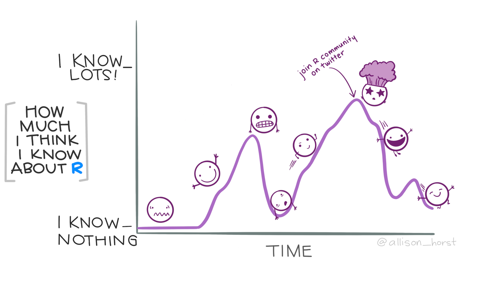

```{r setup, include=FALSE}
library(learnr)
knitr::opts_chunk$set(echo = FALSE)
```


## Welcome to this course

Welcome to this course on crime mapping! This course uses interactive tutorials like this one to help you learn about using maps and spatial analysis techniques to understand crime. Watch this video to learn more about the course.


## Why put crimes on maps?

This course is about how we can use maps and other spatial analysis tools to help understand, prevent and respond to crime. Watch this video to understand why spatial analysis is a useful tool for understanding crime.


```{r why-maps-quiz}
quiz(
  caption = "",
  question("Which *one* of these statements is true?",
    answer("Crime is usually not geographically concentrated at micro places"),
    answer("Crime is very geographically concentrated – we can expect half of crime to be concentrated in about 5% of micro places", correct = TRUE),
    answer("Crime is slightly geographically concentrated – we can expect half of crime to be concentrated in about one quarter of micro places"),
    answer("Crime is extremely geographically concentrated – we can expect half of crime to be concentrated in about 1% of micro places"),
    correct = "That's correct – based on previous studies, we can expect half of crime to be concentrated in about 5% of micro places",
    incorrect = "That's not correct – try re-watching the video and then try the question again.",
    allow_retry = TRUE,
    random_answer_order = TRUE
  )
)
```


#### Further reading

Weisburd, D. (2015). [The law of crime concentration and the criminology of place](https://doi.org/10.1111/1745-9125.12070). *Criminology*, 53(2), 133-157.

Johnson, S. (2010). [A brief history of the analysis of crime concentration](https://doi.org/10.1017/S0956792510000082). *European Journal of Applied Mathematics*, 21(4-5), 349.

Farrell, G. (2015). [Crime concentration theory](https://doi.org/10.1057/cpcs.2015.17). *Crime Prevention and Community Safety*, 17(4), 233-248.


## Why is crime concentrated in space?

Why is crime concentrated in space? Watch this video to find out more about how our environment influences opportunities for crime and how that causes clusters of different crimes.


```{r why-concentrated-quiz}
quiz(
  caption = "",
  question(
    "What are the three 'almost always' elements of an opportunity for a crime to occur that are outlined in the routine activities apporach?",
    answer("offender, target, place", correct = TRUE),
    answer("means, motive, opportunity", message = "It looks like you've watched lots of police dramas, but maybe not the video here! Try watching the video again and think about the elements of the routine activities approach."),
    answer("offender, victim, place", message = "While many crimes have a victim, the routine activities apporach focuses on the interaction between the offender and the *target*. Sometimes (e.g. in an assault) the target will be the victim, but in others (e.g. a burglary) the target that the offender is interested in might be separte from the victim."),
    answer("offender, target, opportunity", message = "The three 'almost always' elements make up an opportunity for crime, but opportunity is not one of the three elements."),
    correct = random_praise(),
    allow_retry = TRUE,
    random_answer_order = TRUE
  )
)
```


#### Further reading

Santos, R. B. (2015). [Routine Activity Theory: A Cornerstone of Police Crime Analyst Work](https://ebookcentral.proquest.com/lib/ucl/reader.action?docID=1952969&ppg=130). In _The Criminal Act: _

Cohen, L. E., and Felson, M. (1979). [Social Change and Crime Rate Trends: A Routine Activity Approach](https://doi.org/10.2307/2094589). *American Sociological Review*, 44(4), 588–608.


## Finding your way around RStudio

We will use RStudio for almost all of this course. Watch this video to find your way around the different panels in the RStudio window.


#### Further reading

The [RStudio IDE Cheat Sheet](https://github.com/rstudio/cheatsheets/blob/master/rstudio-ide.pdf) highlights some of the features available in RStudio and gives a list of available keyboard shortcuts.

[Writing Code in RStudio](https://rstudio.com/resources/webinars/programming-part-1-writing-code-in-rstudio/) is a webinar that talks you through RStudio in more detail.


## Next steps

Now that you know why crime mapping is useful for understanding crime, why crime is typically concentrated in space and how to find your way around RStudio, in the next tutorial we will produce our first crime map in R.

If you're not feeling too confident at this point in the course, don't worry – learning something new is always a bit of a rollercoaster and there is lots of help available in subsequent tutorials.

```{r datawrangling-image, fig.align="center", out.width="80%"}

```

<p style="margin: 2em 0; padding: 0.5em 1em; font-size: 75%; color: #666666; background-color: #EEEEEE;">
[Stats Illustrations by Allison Horst](https://github.com/allisonhorst/stats-illustrations) licensed under the [Creative Commons Attribution licence](https://github.com/allisonhorst/stats-illustrations/blob/master/license).
</p>


