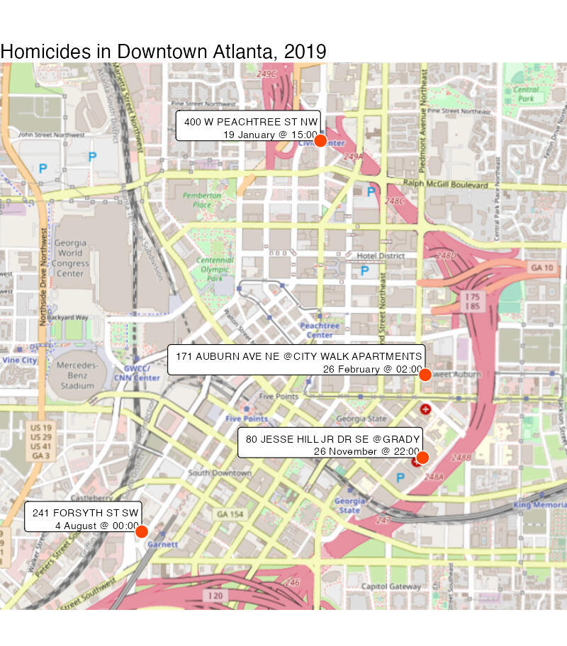

```{r setup, include=FALSE}
library(learnr)
library(tidyverse)

# {ggspatial} uses {rosm} to download OSM map tiles and {rosm} needs {raster} to
# render them, but {rosm} only Suggests {raster} rather than Importing it. If
# {raster} is not installed on a user's machine, {learnr} will not install it
# when loading the tutorial because {learnr} only installs Imported packages.
# By loading {raster} explicitly (even though we don't need it directly), we 
# force {learnr} to install it if it is not present.
library(raster)

knitr::opts_chunk$set(echo = FALSE)

# Copy files
if (!dir.exists("css")) dir.create("css")
purrr::walk(
  dir("../css/"), 
  ~ file.copy(stringr::str_glue("../css/{.}"), stringr::str_glue("css/{.}"), overwrite = TRUE)
)
```


## Introduction

In this tutorial we will use R to produce a simple crime map. To do this we will
skip over lots of the detail of how R works and what choices we should make in
creating maps. We will return to all these details in future sessions, so 
for-now please don't worry about understanding every single line of code. 
Everything will become clear as we work through the tutorials in this course.

```{r make-final-map, include=FALSE, eval=FALSE}
# THIS CODE DOES NOT RUN BY DEFAULT, SINCE LEARNR SOMETIMES RUNS THE CODE EVEN
# WHEN THE FILE ALREADY EXISTS, AND THE FILE WILL ALWAYS EXIST WHEN THE TUTORIAL
# IS DEPLOYED. THE CODE IS JUST HERE FOR FUTURE REFERENCE IF NEEDED. 
# 
# IF YOU NEED TO RE-CREATE THE FILE, RUN THE CODE MANUALLY.

if (!file.exists(here::here("inst/tutorials/02_your_first_crime_map/images/atlanta_downtown_homicides.jpg"))) {
  
  # These packages are loaded inside this if statement because loading them at
  # the start of the script means that no package startup messages are produced
  # by exercise1
  library(ggspatial)
  library(sf)

  downtown_homicides <- read_csv("https://github.com/mpjashby/crimemapping/raw/main/inst/extdata/downtown_homicides.csv") |> 
    st_as_sf(coords = c("longitude", "latitude"), crs = "EPSG:4326") |> 
    st_transform("EPSG:26967")

  downtown_homicides_map <- ggplot(downtown_homicides) + 
    annotation_map_tile(type = "osm", zoom = 15) + 
    geom_sf_label(
      aes(label = label), 
      lineheight = 1, 
      size = 2.5, 
      hjust = 1, 
      vjust = 0
    ) + 
    geom_sf(colour = "white", fill = "orangered1", size = 4, shape = 21) + 
    scale_x_continuous(expand = expansion(mult = 0.5)) + 
    scale_y_continuous(expand = expansion(mult = 0.2)) + 
    labs(
      title = "Homicides in Downtown Atlanta, 2019",
      caption = "Background map by OpenStreetMap"
    ) +
    theme_void()
  
  # Save the map
  ggsave(
    here::here("inst/tutorials/02_your_first_crime_map/images/atlanta_downtown_homicides.jpg"), 
    downtown_homicides_map,
    width = 800 / 150, 
    dpi = 150
  )
  
}
```

The map we're going to create shows the locations of four homicides in downtown
Atlanta in 2019:

```{r show-final-map, fig.align="center", out.width="80%"}

```

To start off with, watch this video that walks through the code needed to make
this map. Don't worry if there are things in the video that you don't understand 
-- the rest of this tutorial will explain each line of code in turn.


### Running code in this tutorial

In the video above you saw code being run in RStudio, but to save switching 
between this tutorial and the RStudio console, the rest of this tutorial 
includes short chunks of R code that you can run directly in this window. We 
will use these chunks of code to walk through the code we need to produce a map. 
To run the code in each chunk, just click the `Run Code` button in the top-right 
corner of each chunk. If you want to re-run a chunk of code, you can click the 
`Start Over` button in the top-left corner of each chunk.

When you click `Run Code`, the output of the chunk will appear below it (there
may be a delay of a few seconds for more-complicated chunks).

To try out using a code chunk, click `Run Code` below – you should see the
message 'Hello, world!' printed below the box.

```{r exercise0, exercise=TRUE}
message("Hello, world!")
```

`message()` is a *function* – a piece of R code that does something. The thing
that the `messages()` function does is simple: it prints a message on the 
screen.

Now click `Continue` below to start this tutorial.


## Loading crime data


### Loading packages

Before we can work with our data, we first load packages of functions for use in
the analysis. To load these packages, click `Run Code`. This will produce
various messages, all of which you can safely ignore for now.


```{r exercise1, exercise=TRUE, exercise.lines=5}
# Load the R packages we need to analyse this data
library(ggspatial)
library(sf)
library(tidyverse)
```

<div class="box extra-detail">

<h5 id="loading-box1-title" class="box-title">What do these messages mean?</h5>

<div id="loading-box1" class="box-content">
For now you don't need to worry about these messages, but if you really want to
know what they mean …

<!-- Some R packages make use of external services. For example, the `ggmap` package -->
<!-- can make use of mapping services provided by Google. Google requires anyone -->
<!-- using their service to comply with their terms of service, so the `ggmap` -->
<!-- package prints a message when you load it to remind you of this. -->

Some R packages make use of other apps and utilities on your computer. For
example, the `sf` package makes use of a piece of software call GDAL that is 
used for managing spatial data. So that you know which version of GDAL is being
used, `sf` prints a message telling you.

The `tidyverse` package itself loads several packages that are commonly used 
together for analysing data. When you load `tidyverse`, it will print a message
telling you which packages it has loaded, along with the version number for each
package. It also prints a message saying if any functions from the `tidyverse`
packages have replaced ("masked") any functions from packages that were 
previously loaded.

In general, R packages use start-up messages to remind you of information that 
is not likely to be critical to your work, but which it might be useful to know
at some point in the future.
</div>

</div>

<script>
$("#loading-box1-title").click(function () { $("#section-loading-box1").toggle("slow") })
</script>


### Loading data

The first task in creating any crime map is to obtain the crime and other data
necessary. In many cases preparing the data for analysis and mapping will be a 
substantial task, but in this case we are going to use some pre-prepared crime
data together with a pre-drawn street map (which we will ask R to download
automatically when it draws the final map).

The data we will use will be records of homicides in the Downtown neighbourhood
of Atlanta, Georgia, in 2019. We can load the homicide data using the
`read_csv()` function. Click the `Run Code` button to load the data.

```{r exercise2-setup, include=FALSE}
# Load the R packages we need to analyse this data
suppressPackageStartupMessages(library("tidyverse"))
```

```{r exercise2, exercise=TRUE}
# Download the data directly from a URL and store it as an object
homicides <- read_csv("https://github.com/mpjashby/crimemapping/raw/main/inst/extdata/downtown_homicides.csv")
```

The `read_csv()` function loads data from a file and prints a message showing 
the name of each column in the data and the type of data (number, text etc.) in 
each column. Again, you can ignore this message for now.

We have stored the results of the `read_csv()` function in an R *object* called
`homicides`. An object in R is anything that stores any type of data. There are
many types of objects, but for this tutorial we don't need to explore these in
any more detail. All you need to remember for now is that objects store data and 
functions do things.


### Viewing the data

To check the data has been loaded correctly, we can view the loaded data using
the `head()` function. By default, `head()` prints the first six rows of the 
data stored in an object. Click `Run Code` to view the data.


```{r exercise3-setup, message=FALSE, warning=FALSE, include=FALSE}
# Load the R packages we need to analyse this data
suppressPackageStartupMessages(library("tidyverse"))

# Download the data directly from a URL and store it as an object
homicides <- read_csv(
  "https://github.com/mpjashby/crimemapping/raw/main/inst/extdata/downtown_homicides.csv",
  col_types = cols(
    report_number = col_double(),
    label = col_character(),
    longitude = col_double(),
    latitude = col_double()
  )
)
```

```{r exercise3, exercise=TRUE}
# Display the data
head(homicides)
```


The data contain four columns: a unique identifier for a homicide, a label 
describing when and where that homicide occurred, and the longitude and latitude 
of the homicide location. Depending on the width of your screen, you may need to 
click on the '▸' symbol to view all the columns in the data. We can use this 
data to plot the homicides on a map.

<div class="box notewell">

**In the code `head(homicides)`, there are no quote marks around the word
`homicides`.**

Almost all programming languages will interpret words differently depending on
whether they have quotes around them or not. In this case, if you type the code
`head(homicides)` then R will print the first few rows of the data stored in the
`homicides` object. 

On the other hand, if you type the code `head("homicides")` or
`head('homicides')`, R will interpret this as an instruction to print the first
few elements of the literal text 'homicides'. Since the text 'homicides' 
contains only one element (more about that later), `head("homicides")` will just 
print the word 'homicides'.

</div>


## Processing the data

Before we can plot the data on a map, we have to complete some pre-processing 
steps. Having to process data before being able to analyse or visualise it is 
common in all types of data analysis, but spatial analysis often involves
additional processing that takes account of the special features of spatial
data.


### Converting the data into a spatial format

Two data-processing tasks are needed to produce this map. The first is to 
convert the data into a *simple features* or SF object, which is a special type 
of R object that can be used by functions that process spatial data. We will 
cover the details of the `st_as_sf()` function that converts our data into into 
an SF object later on. Click `Run Code` to convert the data into SF format.


```{r exercise4-setup, message=FALSE, warning=FALSE, include=FALSE}
# Load the R packages we need to analyse this data
suppressPackageStartupMessages(library("sf"))
suppressPackageStartupMessages(library("tidyverse"))

# Download the data directly from a URL and store it as an object
homicides <- read_csv(
  "https://github.com/mpjashby/crimemapping/raw/main/inst/extdata/downtown_homicides.csv",
  col_types = cols(
    report_number = col_double(),
    label = col_character(),
    longitude = col_double(),
    latitude = col_double()
  )
)
```


```{r exercise4, exercise=TRUE}
# Convert the data to a simple features object, which we can use in functions 
# that work on spatial data
homicides_sf <- st_as_sf(
  homicides, 
  coords = c("longitude", "latitude"), 
  crs = "EPSG:4326"
)
```

When you clicked `Run Code` above, it looked like nothing happened. This is
because the results of the code are stored in the `homicides_sf` object. Do you 
remember what R code to use to view the first few rows of this object? Type that 
code into the box below and click `Run Code` to view the data.

<div class="box notewell">

**If you cannot remember how to view the contents of an object, you can click on
the `Solution` button to get help.**

As you go through these tutorials, try to avoid using the `Solution` button 
unless you have tried to input the correct code yourself. You will learn much
more if you try to work out the answer by referring back to an earlier page in
the tutorial or to your own notes.

Don't worry about getting the answer wrong – nothing bad will happen if you run
the wrong code in this tutorial and you can have as many attempts as you like to
get the answer right.

</div>


```{r exercise5-setup, message=FALSE, warning=FALSE, include=FALSE}
# Load the R packages we need to analyse this data
suppressPackageStartupMessages(library("sf"))
suppressPackageStartupMessages(library("tidyverse"))

# Download the data directly from a URL and store it as an object
homicides <- read_csv(
  "https://github.com/mpjashby/crimemapping/raw/main/inst/extdata/downtown_homicides.csv",
  col_types = cols(
    report_number = col_double(),
    label = col_character(),
    longitude = col_double(),
    latitude = col_double()
  )
)

# Convert the data to a simple features object, which we can use in functions 
# that work on spatial data
homicides_sf <- st_as_sf(
  homicides, 
  coords = c("longitude", "latitude"), 
  crs = "EPSG:4326"
)
```

```{r exercise5, exercise=TRUE}

```

```{r exercise5-solution}
# To view an object in R, use the `head()` function. To view the contents of the
# homicides object, copy the next line into the box below and click Run Code.
head(homicides_sf)
```

The data looks identical to before running the function `st_as_sf()`, except 
that the two columns called `longitude` and `latitude` have disappeared and 
there is now an extra column called `geometry`. The `geometry` column is 
important because lots of functions in R can recognise that the `geometry` 
column represents a location on the surface of the earth that can be used to 
analyse and map data in space.


### Changing the data projection

The `geometry` column in the `homicides_sf` object represents locations on the 
surface of the earth using _co-ordinates_ (pairs of numbers). In this case, the
co-ordinates are expressed as longitudes and latitudes, but there are lots of
other types of co-ordinates (known as _co-ordinate reference systems_). 

We'll learn more about co-ordinate reference systems in a future tutorial, but 
for now it's enough to know that each different system has advantages and 
disadvantages. To make the homicide locations easier to add to a map, we are
going to first _transform_ the co-ordinates from longitudes and latitudes to a
co-ordinate reference system that is specifically designed for mapping data for
the US state of Georgia.

To do this, we will use the `st_transform()` function, together with a code
representing the co-ordinate reference system we want to use (you don't need to
understand this code at this stage).


```{r exercise6, exercise=TRUE, exercise.setup = "exercise5-setup"}
homicides_sf_trans <- st_transform(homicides_sf, "EPSG:26967")

head(homicides_sf_trans)
```

Again, the data looks almost identical, except that the values in the `geometry`
column have changed (you don't need to understand yet the details of how these
numbers are different). Now that we've completed the data processing, we can
go on to produce the map itself.


## Draw the map

We are now ready to produce our map of homicides in downtown Atlanta. So that
people viewing the map will understand where the homicides occurred, we will
plot the homicides on top of a base layer showing streets, parks and other 
geographic features obtained from an online web mapping service. Click 
`Run Code` to create the map.


```{r exercise7-setup, message=FALSE, warning=FALSE, include=FALSE}
# Load the R packages we need to analyse this data
suppressPackageStartupMessages(library("ggspatial"))
suppressPackageStartupMessages(library("sf"))
suppressPackageStartupMessages(library("tidyverse"))

# Download the data directly from a URL and store it as an object
homicides_sf_trans <- read_csv(
  "https://github.com/mpjashby/crimemapping/raw/main/inst/extdata/downtown_homicides.csv",
  col_types = cols(
    report_number = col_double(),
    label = col_character(),
    longitude = col_double(),
    latitude = col_double()
  )
) |> 
  st_as_sf(
    coords = c("longitude", "latitude"), 
    crs = "EPSG:4326", 
    remove = FALSE
  ) |> 
  st_transform("EPSG:26967")
```

```{r exercise7, exercise=TRUE, exercise.lines=15, message=FALSE, fig.width=7, fig.asp=1}
ggplot(homicides_sf_trans) + 
  annotation_map_tile(type = "osm", zoom = 15) + 
  geom_sf_label(
    aes(label = label), 
    lineheight = 1, 
    size = 2.5, 
    hjust = 1, 
    vjust = 0
  ) + 
  geom_sf(colour = "white", fill = "orangered1", size = 4, shape = 21) + 
  scale_x_continuous(expand = expansion(mult = 0.5)) + 
  scale_y_continuous(expand = expansion(mult = 0.2)) + 
  labs(
    title = "Homicides in Downtown Atlanta, 2019",
    caption = "Background map by OpenStreetMap"
  ) +
  theme_void()
```

You can change the appearance of the map by changing various parts of the code
above and clicking `Run Code` again. For example, you can change the colour of
the points that mark the homicides by changing the code `fill = "orangered1"` to
`fill = "mediumblue"`, or change the base map to a different style by changing
the code `type = "osm"` to `type = "cartolight"`. Each time you change part of 
the code, click `Run Code` to see what changes on the map.

Once you have finished experimenting with changing the appearance of the map,
click `Next Topic` below.


## Putting the code together

Now we have walked through the different parts of the code, we can create a map
from scratch in a single block of code. In this example, we will map homicides
from in Glenrose Heights neighbourhood of Atlanta, and a different style of base
map. Since the area covered by the map is derived from the data itself, the
extent of the map will update automatically. Click `Run Code`.


```{r exercise8, exercise=TRUE, exercise.lines=35, message=FALSE, fig.width=7, fig.asp=1}
# Load the R packages we need to analyse this data
library(ggspatial)
library(sf)
library(tidyverse)

# Download the data directly from a URL and store it as an object
homicides <- read_csv("https://github.com/mpjashby/crimemapping/raw/main/inst/extdata/glenrose_heights_homicides.csv")

# Convert the data to a simple features object, which we can use in functions 
# that work on spatial data
homicides_sf <- st_as_sf(
  homicides, 
  coords = c("longitude", "latitude"), 
  crs = "EPSG:4326"
)

# Transform the data to a co-ordinate reference system for the state of Georgia
homicides_sf_trans <- st_transform(homicides_sf, "EPSG:26967")

# Plot the map
ggplot(homicides_sf_trans) + 
  annotation_map_tile(type = "osm", zoom = 15) + 
  geom_sf_label(
    aes(label = label), 
    lineheight = 1, 
    size = 2.5, 
    hjust = 1, 
    vjust = 0
  ) + 
  geom_sf(colour = "white", fill = "mediumblue", size = 4, shape = 21) + 
  scale_x_continuous(expand = expansion(mult = 1.5)) + 
  scale_y_continuous(expand = expansion(mult = 0.2)) + 
  labs(
    title = "Homicides in Glenrose Heights, 2019",
    caption = "Background map by OpenStreetMap"
  ) +
  theme_void()
```


## In summary

<div class="box welldone">

**Well done – you have finished your first mapping tutorial.** You may not have
understood every line of code in this tutorial, but we will cover them all in
more detail over the rest of this course. By the end of the tutorials, you will
be able to write code like this to create many different types of crime map.

</div>

In this tutorial you have learned how to load data into R, prepare it for use in
making a map and then used it to make your first crime map of this course. 

The map we have produced in this tutorial is effective for showing the locations 
of just a few crimes, but is too limited to show more complicated patterns or 
larger datasets. In the following tutorials, we will learn how to produce more 
sophisticated maps and spatial analysis. We will also learn how each of the 
functions that we have used in this tutorial work.
