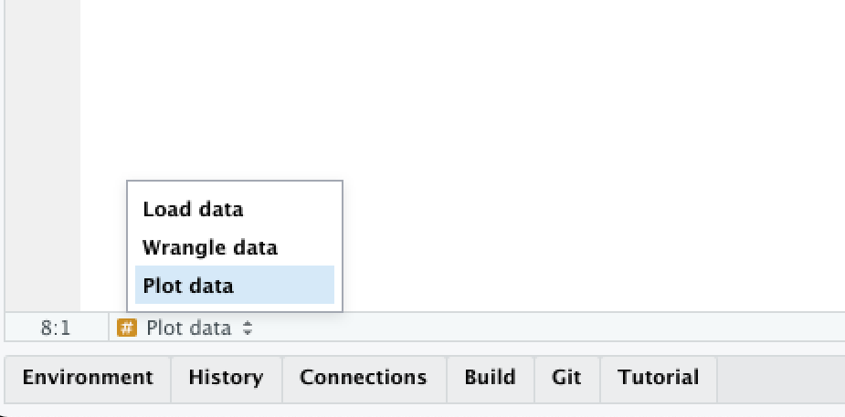
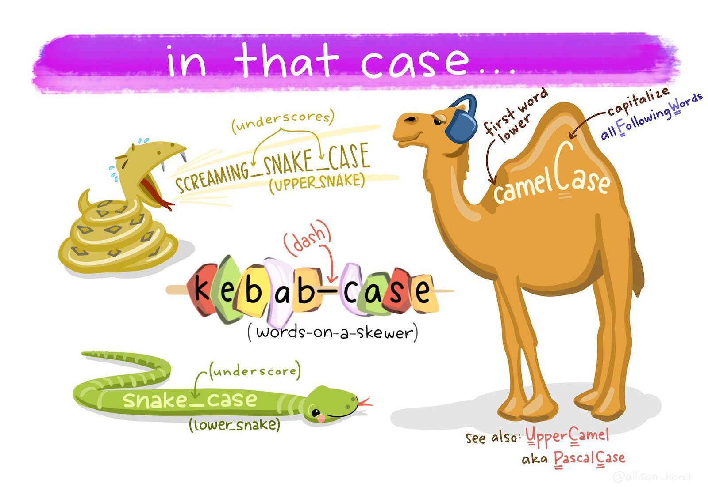
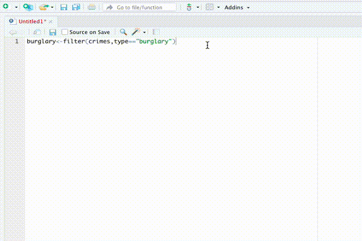

```{r setup, include=FALSE}
library(learnr)
library(tidyverse)
knitr::opts_chunk$set(echo = FALSE)

# Copy files
if (!dir.exists("css")) dir.create("css")
walk(
  dir("../css/"), 
  ~ file.copy(str_glue("../css/{.}"), str_glue("css/{.}"), overwrite = TRUE)
)
```


## Introduction

Now that you're beginning to write code in R, it's time to introduce a few
conventions for how to write code so that it's easier to read. This is 
important because "[good coding style is like correct punctuation: you can manage without it, butitsuremakesthingseasiertoread](https://style.tidyverse.org/)".

Writing readable code is particularly important because it is much easier to 
find mistakes in well-written code, and your code will inevitably contain 
mistakes (everyone's code contains mistakes!).

Writing code has been compared to performing in a band:

> [I liken the situation to a group of musicians trying to form a band. Each one comes in believing that their way of doing things is best (their “method” or “process”). The band will struggle so long as everyone is trying to do their own thing. It’s impossible to create good music unless everyone in the band agrees on the tempo, the style and who should take lead during a song. Anyone who has ever heard a high school band perform knows this to be true. Unless everyone is on the same page, you aren’t going to accomplish much.](https://www.smashingmagazine.com/2012/10/why-coding-style-matters/)

You might be relaxing at this point, thinking "that isn't a problem for me,
because I'm the only person who is going to be working on my code". If so, think
again. It's been said that in data science that there are always at least two 
people working on a project: the _you_ who is working on the code now, and 
the _past you_ who has worked on the same code previously. The problem is that 
*[past you does 
not answer emails](https://datasciencecampus.ons.gov.uk/taking-reproducible-analytical-pipelines-on-a-virtual-tour-first-stop-the-caribbean/)*. So you can save _future you_ a lot of hassle later by writing readable code.

This tutorial introduces some basic guidelines on formatting your code. This is
a condensed version of the [The tidyverse style guide](https://style.tidyverse.org/),
which provides lots more detail. All the code you see in the tutorials in this
course was written following this style guide.

<p class="full-width-image"></p>

<p class="credits">
[On Perl](http://www.threepanelsoul.com/comic/on-perl) from [Three Panel Soul](http://www.threepanelsoul.com/). Some content on this page contains public sector information licensed under the Open Government Licence v3.
</p>


## Organising your code

Up until now we have only written code in the code boxes within these 
interactive tutorials, but when you move on to make maps using your own R code
you will typically write that code in the RStudio source panel. Your code will
usually be in one or more files with the `.R` file extension. Whether you keep
all your code for a specific project in one file or split it into multiple files
is up to you. Generally you should do whatever makes it easier to understand how
your code is structured.


### Leaving notes for future you

Within each `.R` file, you can make your code easier to understand in several
ways. First, add a comment (one or more lines beginning with `#` _followed by a
space_) at the top of the file to explain what the code in that file does. This 
will make it easier for you to know that you've found the right file if you are 
looking for it in a few weeks when you've forgotten (which you will) what file 
contains what code.

```r
# This code produces a density map of bike thefts in Vancouver in 2020
```

Comments should usually start with a capital letter and follow normal English
rules of punctuation, spacing, etc.


### Letting your code breathe

Unless your code is very simple, it will probably consist of several separate
tasks that are completed one after another. For example your code might download
some data, wrangle it and then plot it on a map. In that case, it can be useful 
to split your code up into blocks by leaving a blank line between the code
needed for each task. For example, if we take the code:

```r
library(lubridate)
library(tidyverse)
crimes <- read_csv("crime_data.csv")
crimes <- janitor::clean_names(crimes)
burglaries <- filter(crimes, type == "burglary")
burglaries <- mutate(burglaries, month = month(date_time))
ggplot() + 
  geom_point(aes(x = lon, y = lat, colour = month)) +
  theme_void()
```

it becomes easier to read if we split the code up into four tasks: loading the
necessary packages, reading the data, wrangling the data and plotting the data.

```r
library(lubridate)
library(tidyverse)

crimes <- read_csv("crime_data.csv")

crimes <- janitor::clean_names(crimes)
burglaries <- filter(crimes, type == "burglary")
burglaries <- mutate(burglaries, month = month(date_time))

ggplot() + 
  geom_point(aes(x = lon, y = lat, colour = month)) +
  theme_void()
```

Since data wrangling involves several steps and each function uses the result of
the previous step, we could use the pipe operator `|>` to make that code a bit 
cleaner:

```r
library(lubridate)
library(tidyverse)

crimes <- read_csv("crime_data.csv")

burglaries <- crimes |> 
  janitor::clean_names() |> 
  filter(type == "burglary") |> 
  mutate(month = month(date_time))

ggplot() + 
  geom_point(aes(x = lon, y = lat, colour = month)) +
  theme_void()
```


### Header comments

If your code includes very long tasks (e.g. where the code takes up more than a
full screen on your computer), you might want to use header comments to divide
your code into sections. You can do this by writing a comment that is followed
by four of more hyphens (`----`):

```r
# Load data ----

… some code …


# Wrangle data ----

… some code …


# Plot data ----

… some code …
```

RStudio will recognise lines that end in four or more hyphens as being headings,
and will create a table of contents for your code. You can use this to move 
between headings by clicking on the Jump To menu at the bottom of the Source
panel in RStudio:

```{r jump-to-menu, fig.align="center"}

```

In general, writing code that is readable is more important than writing the
shortest code possible, so don't be afraid to let your code breathe by using
space to separate your code into meaningful chunks.

```{r comments-quiz}
quiz(
  caption = "",
  
  question(
    "How do you write a comment in R?",
    answer("A `#` symbol followed by a space. Comments should start with a capital leter. e.g. `# Load data`", correct = TRUE),
    answer(
      "A `#` symbol, followed by no spaces. Comments should start with a capital letter. e.g. `#Load data`",
      message = "Not quite right: comments should start with a capital letter but should also have a space after the initial `#` symbol."
    ),
    answer(
      "A `#` symbol followed by a space. Comments should be in lower case unless the comment is long enough to contain more than one sentence. e.g. `# load data`",
      message = "Not quite right: comments should start with a space after the initial `#` symbol, but the comment text should start with a capital letter."
    ),
    answer(
      "A `#` symbol, followed by no spaces. Comments should be in lower case unless the comment is long enough to contain more than one sentence. e.g. `#load data`",
      message = "Not quite right: comments should start with a space after the initial `#` symbol and the comment text should start with a capital letter."
    ),
    correct = random_praise(),
    allow_retry = TRUE,
    random_answer_order = TRUE
  )
  
)
```


## Naming objects

R objects can have any name you like, as long as the name starts with a letter
and contains only letters, numbers, dots (`.`) and underscores (`_`). That said,
you will find coding easier if you follow a few conventions.

  * Use only lower-case letters in the names of objects, which avoids you having
    to remember whether a particular letter was upper- or lower-case.
  * Use *snake case* (`object_name`, with words separated by underscores) for 
    object names rather than camel case (`objectName`) or kebab case 
    (`object-name`).
  * Don't use dots in object names.
  * Don't give objects the same names as R functions, because re-using function
    names makes reading your code more difficult.

```{r snake-case, fig.align="center", out.width="80%"}

```

Just as `crime_data_atlanta_2020.csv` is a more-useful file name than
`data_file_23.csv`, you will find it easier to read your code if you give your
objects meaningful names. So when you load data into R (e.g. with `read_csv()`)
don't just call it `data` (not least because there is a function named `data()`)
but instead give it a name like `atlanta_crimes` if it contains (for example) 
crime data from Atlanta.

```{r naming-quiz}
quiz(
  caption = "",
  
  question(
    "Which of these would be a good name for an object containing data on homicides in Abu Dhabi?",
    answer("`abu_dhabi_homicides`", correct = TRUE),
    answer(
      "`homicide_data`",
      message = "Not quite right: this name is in the right case, but could better describe the data it contains."
    ),
    answer(
      "`Abu_Dhabi_homicides`",
      message = "Not quite right: it's best to only use lower-case characters in variables, so you don't need to remember whether you've used upper- or lower-case characters."
    ),
    answer(
      "`abu-dhabi-homicides`",
      message = "This will cause an error because the `-` indicates R should subtract one value from another."
    ),
    correct = random_praise(),
    allow_retry = TRUE,
    random_answer_order = TRUE
  )
  
)
```


<p class="credits">
[Stats Illustrations by Allison Horst](https://github.com/allisonhorst/stats-illustrations) licensed under the [Creative Commons Attribution licence](https://github.com/allisonhorst/stats-illustrations/blob/master/license).
</p>


## Spacing

Spacing out code makes it much easier to read, but (just as in any language)
code is easiest to read if spaces are used where people expect them to be by
convention. 

Mostly in R, we use spaces where we would expect them in English: after commas 
but not before, outside parentheses but not inside, etc.

```r
# Good
read_csv("crime_data.csv", skip = 4)

# Bad
read_csv("crime_data.csv",skip = 4)
read_csv("crime_data.csv" ,skip = 4)
read_csv("crime_data.csv" , skip = 4)
```

Don't put spaces inside parentheses, or between the names of functions and the
parentheses:

```r
# Good
mean(x, na.rm = TRUE)

# Bad
mean (x, na.rm = TRUE)
mean( x, na.rm = TRUE )
```

*Do* put spaces around most operators (`==`, `+`, `-`, `<-`, etc.), including
either side of `=` when specifying the values of function arguments:

```r
# Good
height <- (feet * 12) + inches
mean(x, na.rm = TRUE)

# Bad
height<-feet*12+inches
mean(x, na.rm=TRUE)
```

Although there are some operators that shouldn't have spaces around them: `$`, 
`@`, `[`, `[[`, `^`, `:` and `?`.

```{r spacing-quiz}
question(
  "Which of these lines of code has the optimal spacing?",
  answer('`burglary <- filter(crimes, type == "burglary")`', correct = TRUE),
  answer('`burglary<-filter(crimes,type=="burglary")`'),
  answer('`burglary <- filter(crimes, type=="burglary")`'),
  answer('`burglary <- filter ( crimes , type == "burglary" )`'),
  correct = random_praise(),
  incorrect = random_encouragement(),
  allow_retry = TRUE,
  random_answer_order = FALSE
)
```


## Functions

We've now got used to calling functions to do things in R, like calling 
`read_csv()` to load data from a CSV file or `filter()` to choose certain rows
from a dataset. We know that we can change the behaviour of functions by using
arguments. For example, we can wrap a a string of text into shorter lines using
the `str_wrap()` function from the `stringr` package. `str_wrap()` needs two
arguments: the text to be wrapped into multiple lines and the maximum length of
a line of text before the next word is wrapped onto a new line. These arguments
are called `string` and `width`, so we can call the function as:

```r
str_wrap(string = "some text to be wrapped", width = 10)
```

The `string` argument provides the *data* that the `str_wrap()` function will 
work on, while the `width` argument provides the details of how that work should
be done. Since the data argument to a function is typically required (the 
function makes no sense without it) and is often the first argument, you can
omit the name of data arguments to functions. For all other arguments, it is
best to give the argument name. So to use `str_wrap()`, you can write:

```r
str_wrap("some text to be wrapped", width = 10)
```

In general, you should keep lines of code to a maximum of 80 characters long,
since they can easily fit on most screens and are easy to read.
When calling a function, put all of the parameters on a single line if they will 
fit into 80 characters or less:

```r
do_something_simple("something", with = "only", short, "arguments")
```

But if the function call is longer than 80 characters, use one line each for the 
function name, each argument, and the closing `)`, with the arguments indented
by two spaces. This makes the code much easier to read.

```r
# Good
do_something_very_complicated(
  something = "that",
  requires = many,
  arguments = "some of which may be long"
)

# Bad
do_something_very_complicated("that", requires, many, arguments,
                              "some of which may be long"
                              )
```


::: {.box .notewell}

One mistake that people often make when splitting a function across multiple
lines is to leave the closing parenthesis `)` at the end of the last line of the
function, like this:

```r
# Bad
do_something_very_complicated(
  something = "that",
  requires = many,
  arguments = "some of which may be long")
```

The problem with this is that it makes it harder to see where a particular
function ends. Instead, put the closing parenthesis on a line on its own, 
indented with the same number of spaces as the first line of the function:

```r
# Good
do_something_very_complicated(
  something = "that",
  requires = many,
  arguments = "some of which may be long"
)
```

This makes it much easier to see where a function call starts and ends.

:::


When combining multiple functions using the pipe operator (`|>`), put each 
function on a single line, with all but the first line indented by two spaces:

```r
a_function() |> 
  another_function() |> 
  and_a_third_function()
```

Once you learn about other types of R code you will need to know how best to 
style it, but we will learn about those when we need to.

```{r functions-quiz}
quiz(
  caption = "",
  
  question(
    "If a function is written across several lines of code because it will not fit on one line, where should the closing parenthesis `)` at the end of the function be placed?",
    answer("On a separate line, indented as much as the function name.", correct = TRUE),
    answer(
      "On a separate line, indented as much as the arguments on the lines above it.",
      message = "Not quite right: the closing parenthesis should be a separate line, but indented as much as the function name so that you can easily see where the function begins and ends."
    ),
    answer("At the end of the final function argument, on the same line."),
    answer(
      "It doesn't matter where the closing parenthesis is placed as long as there is one.",
      message = "While your code will wherever you place the closing parenthesis, the coding style guide introduced in this chapter is designed to make your code easier to read. This is important because if your code is easier to read that will make it easier to find and fix any mistakes in it."
    ),
    correct = random_praise(),
    allow_retry = TRUE,
    random_answer_order = TRUE
  )
  
)
```


## Styling your code automatically

You can get help on styling your R code using the [`styler`](https://styler.r-lib.org/) 
package, which can automatically format your code for you. After you install
the `styler` package with the code `install.packages("styler")`, you can style
your code by:

  1. selecting the code you want to style,
  2. opening the `Addins` menu at the top of the Source panel in RStudio,
  3. clicking 'Style selection' in the 'Styler' section of the list of addins.
  
```{r styler-gif, fig.align="center"}

```

RStudio will also try to help style your code as you type, for example by
automatically indenting lines.


## In summary

::: {.box .welldone}

You now know how to write your R code so that it is easy to read, which makes it
much easier to understand. Understanding code when you read it is important 
because it allows you to work out what the code is trying to achieve and because
it makes it much easier to find and fix problems when your code is not behaving
as you want it to.

:::


::: {.box .reading}

Writing readable, understandable code is important. To find out more about this,
read some of these articles:

  * [Why coding style matters](https://www.smashingmagazine.com/2012/10/why-coding-style-matters/) by Nicholas Zakas.
  * [The tidyverse style guide](https://style.tidyverse.org/) by Hadley Wickham, which is the basis for the rules outlined in this tutorial.

:::


<p class="credits">
[The tidyverse style guide](https://style.tidyverse.org/) licensed under the [Creative Commons Attribution-ShareAlike licence](https://github.com/tidyverse/style/blob/master/LICENSE.md).
</p>
