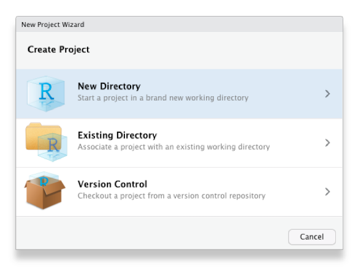
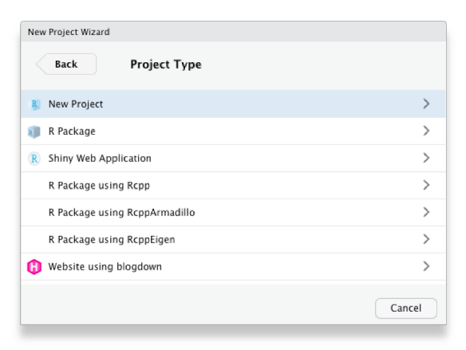
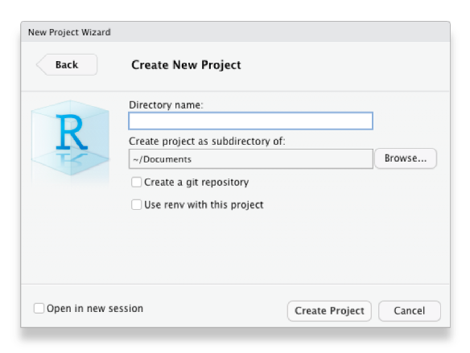

```{r setup, include=FALSE}
library(learnr)
library(tidyverse)
knitr::opts_chunk$set(echo = FALSE)
```


## Introduction

Imagine you've been working on some analysis intermittently for a few weeks.
Unless you're very lucky, you're likely to experience one or more of these
common problems:

  * As you work, you create various different files (for example containing the
    data you are using, code you have written and charts you have made) until it
    becomes difficult to keep track of what is in each file and how different
    files relate to each other.
  * It becomes difficult to remember exactly what data and which code produced
    which chart, so that if someone has a question about how you came to a
    particular conclusion it is difficult to be sure. Likewise, if you discover
    a mistake in your code then it is hard to know what outputs it affected.
  * If you need to take a break from your work (perhaps to work on something
    else) and come back to it later, it becomes irritating to have to close all
    the code and other files you are working on and then open them again later.

All of this can make data analysis much harder, especially if you're trying to 
find a particular file or check if a result is correct just before a deadline.

```{r datawrangling-image, fig.align="center", out.width="80%"}
knitr::include_graphics("images/data_cowboy.png")
```

Fortunately, we can solve these problems using a combination of the RStudio 
Projects feature and a plan for organising our files. Fortunately, once you've 
formed the habit of working in this way, it becomes second nature and you'll 
find your work is both easier and produces more-reliable results.

<p style="margin: 2em 0; padding: 0.5em 1em; font-size: 75%; color: #666666; background-color: #EEEEEE;">
[Stats Illustrations by Allison Horst](https://github.com/allisonhorst/stats-illustrations) licensed under the [Creative Commons Attribution licence](https://github.com/allisonhorst/stats-illustrations/blob/master/license).
</p>


## RStudio Projects

Projects in RStudio are a way of keeping your analysis organised. When you work
inside an project, RStudio will do various things in the background that make it
easier to stay organised. For example, RStudio will save the project's _state_: 
if you have to close the project and re-open it later, all the files that you 
had open before will re-open, too.

I strongly recommend that you use projects for everything you do in RStudio. To
create a new project from within RStudio, click `File` then `New Project …` and
choose to create the project in a new directory on your computer:

```{r project-image1, fig.align="center", out.width="80%"}

```

Choose to create a new (empty) project, rather than use any of the templates for
specific types of projects:

```{r project-image2, fig.align="center", out.width="80%"}

```

Choose what the new project <abbr title="directories on your computer are also sometimes called folders">
directory</abbr> should be called, and where on your computer it should be 
created (you might want to create a 'Crime Mapping' directory to hold all the 
projects you will create during this course), then click `Create Project`:

```{r project-image3, fig.align="center", out.width="80%"}

```


## Organising a project

Now you've created an empty project, you can create some directories within it
to organise your files. There are lots of suggestions online for how to organise
your files within a project -- see this [summary of project-organisation methods 
if you would like to understand the different options available](https://discuss.ropensci.org/t/resources-on-project-directory-organization/340/1) --
but the most important thing is that you have separate places to store:

  * the original/raw data that you have obtained (e.g. by downloading it from a
    website or extracting it from a police database),
  * the results of any data wrangling that you do,
  * files containing the code that you use to wrangle the data and conduct your
    analysis, and finally,
  * the outputs from your analysis, including tables, charts and reports.

Putting each of these four types of files in a separate directory makes it much
easier to keep track of them. We can create the necessary directories directly
in R using the `dir.create()` function.

```{r project-exercise1, exercise=TRUE}
dir.create("source-data")
dir.create("analysis-data")
dir.create("code")
dir.create("outputs")
```

Because we are running these commands from inside an RStudio project, these
directories will automatically be created as subdirectories of the project
directory we have already created -- this saves a lot of moving between
directories, and is another reason to use RStudio projects.

<a href="https://purrr.tidyverse.org/" title="purrr package website"></a>

Typing out the `dir.create()` function four times is somewhat tedious, and 
certainly would be if we needed to create (say) 10 directories rather than 
four. One way to make this code shorter is to use the `walk()` function from the
[`purrr` package](https://purrr.tidyverse.org/), which is part of the tidyverse
suite of packages. `walk()` allows us to run any function several times, each 
time using a different input one at a time. The general format of calls to the 
`walk()` function is:

```r
walk(vector_of_inputs, function_name_to_apply_to_those_inputs)
```

So if we wanted to create the same four directories using `walk()`, we could:

```{r project-exercise2, exercise=TRUE}
library(tidyverse)

walk(c("source-data", "analysis-data", "code", "outputs"), dir.create)
```

Note that the function name `dir.create` is not followed by a pair of 
parentheses when it is used inside `walk()`.

`walk()` is a very powerful function and this is only a very simple example of
what it can do, but we will return to it when we need it again.


## Naming files

The final step in organising your work so that you can analyse data and stay 
sane is to give every file you create a name that will help you find it later
on. To do this, stick to three principles:

  1. make your file names easily readable by _computers_,
  2. make your file names easily readable by _humans_, and
  3. use file names that will by-default by _sorted_ in a meaningful way.

Computers can increasingly read file names that contain any characters you can
think of, but many different characters make referencing your file names in your 
code more difficult than need be. To keep your code simple, stick to files names 
that contain only _lowercase_ letters (so you don't have to remember if each 
letter is uppercase or lowercase), numbers, hyphens (`-`) and underscores (`_`) 
-- that's it. If your language uses letters with accents, its best to not use 
those accents in file names. So, instead of having files with names like this:

```
John's raw data.csv
figure 4.jpg
DüsseldorfCrimeData.xlsx
```

use the names:

```
john_raw_data.csv
figure_4.jpg
dusseldorf_crime_data.xlsx
```

<a href="https://xkcd.com/1459/"></a>

To make your files easily readable by humans, make sure the file name describes
what the file contains or does. So giving a file the name 
`crime_data_atlanta_2020.csv` is much more useful than calling the same file
`data_file_23.csv`. If you've been using computers for a while (or you've been
taught by someone who has), you may have been trained to use very short file 
names because old computers could only handle very short names. Fortunately,
modern computers can handle much longer file names, so it's generally safe to
use a few extra characters to describe what your file is or does. File names are
also easier to read if words are separated by a hyphen or underscore: 
`police_recorded_robbery_data_2020` is much easier to read than 
`policerecordedrobberydata2020`. 

If your files have a meaningful order, it's useful to reflect this in the file
name. Imagine you have three code files: one for data wrangling, one for
carrying out spatial analysis tasks on that wrangled data and a third one for 
creating charts to show the results of the analysis. You cannot run the analysis
code until the data wrangling is complete, so the files have a meaningful order.

When you look at these files in the Windows File Explorer, Mac Finder or RStudio
Files tab, they are likely to appear out of order. For example, they might be:

```
analyse_data.R
create_charts.R
wrangle_data.R
```

If you add a number to the start of the file name to show which order to use the
files in, things become clearer:

```
01_wrangle_data.R
02_analyse_data.R
03_create_charts.R
```

Note that the numbers are padded with a zero so that they will still be sorted 
in the correct order if you end up with more than 10 files in my workflow (I've
only used one zero for padding because I don't expect to have more than 100
files).


## In summary

In this section we've learned how to stay organised while mapping crime. 
Following the rules outlined here might seem troublesome or unnecessary now, but
they'll make things much easier when you're up against a deadline.

If you'd like more information about these topics, you might be interested in:

  * [Chapter 8: Workflow projects](https://r4ds.had.co.nz/workflow-projects.html) 
    in [R for Data Science](https://r4ds.had.co.nz/) introduces RStudio projects 
    and gives more detail about the benefits of using them.
  * [Naming Things](http://www2.stat.duke.edu/~rcs46/lectures_2015/01-markdown-git/slides/naming-slides/naming-slides.pdf) 
    by Jenny Bryan talks through good practice for naming files in more detail.
  * [Projects in RStudio](https://rstudio.com/resources/webinars/managing-part-1-projects-in-rstudio/) 
    is a 40-minute webinar given by Garrett Grolemund that explains how to make
    the best of RStudio Projects.

<p style="margin: 2em 0; padding: 0.5em 1em; font-size: 75%; color: #666666; background-color: #EEEEEE;">
['File Organization: Naming' by Data Carpentry](https://datacarpentry.org/rr-organization1/01-file-naming/index.html) licensed under the [Creative Commons Attribution licence](https://github.com/allisonhorst/stats-illustrations/blob/master/license) and the [XKCD.com comic 'Documents'](https://xkcd.com/1459/) licensed under the [Creative Commons Attribution-NonCommercial license](https://xkcd.com/license.html).</p>


