```{r setup, include=FALSE}
library(ggspatial)
library(learnr)
library(patchwork)
library(sf)
library(sfhotspot)
library(tidyverse)
knitr::opts_chunk$set(echo = FALSE)

# Copy files
if (!dir.exists("css")) dir.create("css")
walk(
  dir("../css/"), 
  ~ file.copy(str_glue("../css/{.}"), str_glue("css/{.}"), overwrite = TRUE)
)

# read data
thefts <- janitor::clean_names(read_csv("https://mpjashby.github.io/crimemappingdata/vancouver_thefts.csv.gz"))
thefts_sf <- st_as_sf(thefts, coords = c("x", "y"), crs = 32610, remove = FALSE)
bike_thefts <- filter(thefts_sf, type == "Theft of Bicycle")
bike_theft_density <- hotspot_kde(bike_thefts, quiet = TRUE)
bike_theft_density_bw_half <- hotspot_kde(
  bike_thefts, 
  bandwidth_adjust = 0.5,
  quiet = TRUE
)
nbhds <- st_read("https://mpjashby.github.io/crimemappingdata/vancouver_neighbourhoods.geojson")
vancouver_boundary <- nbhds |> 
  st_transform("EPSG:32610") |> 
  st_union() |> 
  st_buffer(dist = 10)
```


## Introduction

We've already produced a simple map of crime in a neighbourhood, but we skipped
over a lot of the details of how to do it. In this tutorial we will make another
crime map, this time focusing more on each step in the process.

In this tutorial we will make a map of bicycle thefts in Vancouver in 2020. At
the end of this tutorial, the final map will look something like this. We will
then improve it further in a future tutorial on what makes a good map.

```{r make-final-map, eval=FALSE, out.width="100%"}
# THIS CODE DOES NOT RUN BY DEFAULT, SINCE LEARNR SOMETIMES RUNS THE CODE EVEN
# WHEN THE FILE ALREADY EXISTS, AND THE FILE WILL ALWAYS EXIST WHEN THE TUTORIAL
# IS DEPLOYED. THE CODE IS JUST HERE FOR FUTURE REFERENCE IF NEEDED. 
# 
# IF YOU NEED TO RE-CREATE THE FILE, RUN THE CODE MANUALLY.

bike_theft_density_bw_half_clipped <- bike_thefts |> 
  hotspot_kde(bandwidth_adjust = 0.5, quiet = TRUE) |> 
  st_transform("EPSG:4326") |> 
  st_intersection(nbhds)

vancouver_bike_thefts_map <- ggplot() +
  annotation_map_tile(type = "cartolight", zoom = 13, progress = FALSE) +
  geom_sf(
    aes(fill = kde), 
    data = bike_theft_density_bw_half_clipped, 
    alpha = 0.67, 
    colour = NA
  ) +
  geom_sf(data = nbhds, colour = "seagreen3", fill = NA) +
  geom_sf_label(
    aes(label = str_wrap(name, 10)), 
    data = nbhds, 
    alpha = 0.5,
    colour = "seagreen", 
    lineheight = 1, 
    size = 2.5,
    label.size = NA
  ) +
  scale_fill_distiller(direction = 1) +
  theme_void() +
  theme(
    legend.position = "none",
    panel.border = element_rect(colour = "black", fill = NA, linewidth = 0.5)
  )

# Save the map
ggsave(
  here::here("inst/tutorials/05_your_second_crime_map/images/vancouver_bike_thefts.jpg"), 
  vancouver_bike_thefts_map,
  width = 800 / 150, 
  dpi = 150
)
```

```{r show-final-map, fig.align="center", out.width="80%"}
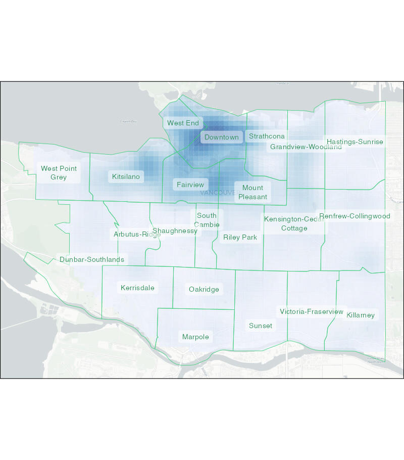
```


Before we get into the detail of how to make this map, watch this video that
goes over the main points of the code we will use:


## Handling spatial data

Maps are visual representations of spatial data. Spatial data is special because
each row in the data is associated with some geographic feature such as a 
building, a street or the boundary of a neighbourhood. This adds some quirks 
that we have to understand to work with spatial data successfully.

Maps are made up of multiple layers of spatial data that are styled to represent
features of interest and then stacked on top of one another to make the finished
map. Watch this video to learn more about spatial layers and the different types 
of data that we can use in maps.


Points, lines and polygons in spatial data are known as *geometric objects* or
simply *geometries*. Spatial data is data that has a geometric object (e.g. a 
pair of co-ordinates representing a crime location) associated with each row.


### Representing places on the earth

With any spatial data, we need a way of describing where on the earth a 
particular point (such as the location of a crime or the corner of a building)
is located. Watch this video to find out about the different co-ordinate 
systems we can use to do this.


## Spatial data in R

<p class="full-width-image">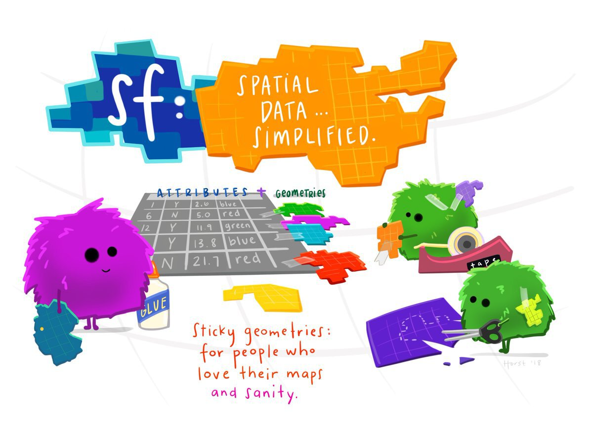</p>

There are several packages that handle raster map data from different sources – 
one of them is the [`ggspatial` package](https://paleolimbot.github.io/ggspatial/) that we 
have already used to load the base map of Atlanta for the homicide map we made 
in one of the earlier tutorials.

<a href="https://r-spatial.github.io/sf/" title="sf website"></a>

Vector data can be handled in R using functions from the 
[`sf` package](https://r-spatial.github.io/sf/). SF stands for 'simple 
features', which is a standard for storing spatial data. SF objects are data
frames that have a special column to hold the geometry (point, line or 
polygon) associated with each row in the data. SF objects also understand what
co-ordinate system the geometry are described in. This means SF objects can be
transformed between co-ordinate systems and combined together in layers on a 
map.

There a lots of functions in the `sf` package for handling spatial data. Almost
all of these functions begin with the letters `st_` (e.g. `st_read()`), which
makes it easy to identify that those functions are designed to be used on SF
objects.


### Reading spatial data

The special features of spatial data -- needing to store geometries, details of
the projection used etc. -- mean that spatial data is often stored in special
file formats. There are lots of spatial-data formats, but fortunately almost all
of them can be read by the `st_read()` function. This means we do not need to 
learn a different function for each spatial-data format.

While datasets with line or polygon geometries must almost always be stored in
specific spatial-data formats, point data can also be stored in common data
formats such as Excel and <abbr title="comma-separated values">CSV</abbr> files. 
The [data for this tutorial](https://geodash.vpd.ca/opendata/) is provided by 
the Vancouver Police Department in a CSV file (gzipped to reduce the file size). 
The file is located at:

```r
https://mpjashby.github.io/crimemappingdata/vancouver_thefts.csv.gz
```

::: {.tutorial}

Thinking back to the tutorial on data wrangling, what R code is needed to load
this data into a tibble called `thefts`? Type the R code into the box below and 
click `Run Code` to see the result. If you need help, click the `Solution`
button, but try to remember the code (or look up your notes from the 
data-wrangling tutorial) before revealing the solution -- you'll learn a lot
more that way. Remember to load any necessary packages using the `library()`
function!

```{r read-exercise1, exercise=TRUE}

```

```{r read-exercise1-solution}
# Since the data are stored in a regular CSV file, we can use the `read_csv()`
# function from the readr package to read the file, and the assignment operator
# `<-` to store the data in the object `thefts`. `read_csv()` can read directly
# from a URL, so there is no need to download the data first.
library(tidyverse)

thefts <- read_csv("https://mpjashby.github.io/crimemappingdata/vancouver_thefts.csv.gz")
```

Now that you have stored the data in the `thefts` object, what code is needed
to view the first few rows of data? Type the code into the box and click 
`Run Code` to check the result.

```{r read-exercise2, exercise=TRUE}

```

```{r read-exercise2-solution}
head(thefts)
```

:::


The data consists of `r scales::comma(nrow(thefts))` rows, each representing one
theft. Before we can map this data, we will need to do some minor data wrangling
to get it into the format we want.


### Reading data files from your computer

So far we have created datasets by loading data directly from URLs, such as the
URL for the Vancouver thefts data we loaded in the previous section. But we can
also load datasets that are already stored on our own computers. To do this, we
need to know the _file path_ that specifies where a particular file is stored.

You might have encountered file paths before, but you may not. A typical file
path looks like this on a Mac or Linux computer:

```
/Users/john_smith/Documents/Crime Mapping/vancouver_thefts.csv
```

or like this on Windows:

```
C:\Users\john_smith\Documents\Crime Mapping\vancouver_thefts.csv
```

The important thing to note here is that computers store files such as
`vancouver_thefts.R` in folders (also called directories), which are themselves
often stored inside larger folders, etc. A file path tells a computer where
to find a particular file. The file paths above can be read as telling the 
computer to open the `Users` directory, then the `matt_ashby` directory, then 
the `Documents` directory, then the `Crime Mapping` directory, and finally the
file `vancouver_thefts.csv`.

You can find the file path of a particular file by typing `file.choose()` in the
R console. This will open a new window that allows you to search or browse for a
particular file. When you choose the file, R will print the file path in the
console.

The two file paths shown above are called _absolute_ file paths, because they
show the full location of a particular file on the computer. But there are two
problems with absolute paths: they can be very long so they clutter up your 
code, and (more importantly) they are only correct for a specific computer. If
you write an R script that includes either of the file paths above, then you
give that file for me to run, the code will immediately produce an error because
there is no directory `/Users/john_smith` on my computer.

We can deal with that problem in a few ways. The first is to use a _relative 
path_. This specifies the location of a file not on the computer as a whole, but
relative to the directory we are currently working in. This _working directory_
will depend on how your version of RStudio is configured, but you can find out
the working directory by typing `getwd()` in the R console. This will print the
absolute path of the working directory for whatever you are currently working on
in RStudio. 

Imagine our working directory is `/Users/john_smith/Documents/Crime Mapping/`.
If we wanted to open the file `/Users/john_smith/Documents/Crime Mapping/vancouver_thefts.csv`,
we could use the absolute file path:

```r
read_csv("/Users/john_smith/Documents/Crime Mapping/vancouver_thefts.csv")
```

However, since the file is stored in our current working directory, we could 
also open the file like this:


```r
read_csv("vancouver_thefts.csv")
```

This works because when we provide a relative path (e.g. one that does not begin
with `\` on Mac or `C:\` on Windows), R treats the path as being relative to the
current working directory. Since the file `vancouver_thefts.csv` is in the
working directory, we don't need to specify anything other than the file name.

If we wanted to read from a file that was in a directory _within_ the working 
directory – e.g. `/Users/john_smith/Documents/Crime Mapping/original_data/canada/vancouver_crime.gpkg` –
then we just need to specify where the file is relative to the working 
directory:

```r
read_sf("original_data/canada/vancouver_crime.gpkg")
```


::: {.box .notewell}

File paths in your code can make it harder to make sure your code is _portable_,
i.e. that it can be used by other people. This is because the file structure on 
someone else's computer is likely to be different from the file structure on 
your computer.

You might think code portability doesn't matter, because you are not planning to
share your code with anyone. But it's quite possible that you will want to:

  * Re-use code yourself on a different computer, e.g. if you replace your 
    current computer with a new one.
  * Send the code to someone else to get help with a problem.
  * Send the code to someone else who has asked for help from you.

To help keep your code portable:

  * Where possible, include in your code any code needed to download the
    necessary data from the internet. This is what we most-often do in this
    course.
  * If the data is not available online, you will need to distribute the data
    along with your code. In that case, tell anyone you send you code to that 
    they should keep the code file and data files in the same directory, then 
    you can just refer to each data file by its name (e.g. 
    `read_csv("vancouver_thefts.csv")`).
  * Avoid using absolute file paths in your code, since these will almost 
    certainly produce an error if anyone tries to run your code on another
    computer.

:::


### Cleaning column names

<p class="full-width-image">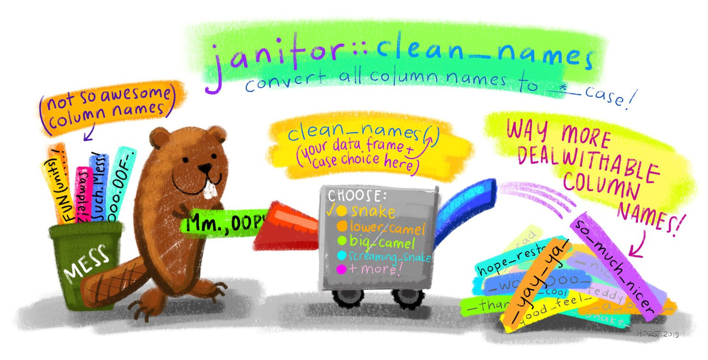</p>

In a previous tutorial I recommended choosing `snake_case` object names, e.g.
calling a data object `atlanta_robberies_2020` rather than 
`atlantarobberies2020`, `AtlantaRobberies2020` or `ATLANTAROBBERIES2020`. This 
makes your code easier to read and means you don't have to remember whether you 
named a variable using upper- or lower-case letters, since you know that you 
only use lower case. 

The same recommendation applies to variable names in datasets, for the same 
reasons. Doing this makes it much easier to refer to objects and columns in your 
code, without having to worry about whether a particular letter was upper- or 
lower-case, or whether it had an accent etc. 

<a href="http://sfirke.github.io/janitor/" title="janitor package website"></a>

At the moment, the column names in the `thefts` dataset are upper-case letters. 
Rather than having to remember this, we can easily convert them to snake case 
using the `clean_names()` function from the [`janitor` package](http://sfirke.github.io/janitor/).
To use a function from a package, we usually first load the package using the
`library()` function. In this case, we probably won't want to use any other
functions from the `janitor` package, so instead of loading the whole package we
will use this one function directly. To do this, we write the function name with
the package name added to the front, separated by two colons `::`.

```{r read-exercise3, exercise=TRUE, exercise.setup="read-exercise1-solution"}
thefts <- janitor::clean_names(thefts)

head(thefts)
```

You can see that the data has stayed the same but all the column names are now
in snake case. `clean_names()` would also have replaced any spaces with 
underscores, tried to separate words in the variable names and cleaned up 
several other potential problems. For this reason it is common to call 
`janitor::clean_names()` straight away after loading a dataset so that you can 
be confident that the column names will be in the format you expect.

If we wanted to use the `clean_names()` function again, we would have to include
the package name and `::` each time, so if our code was going to make repeated
use of the function then it would probably be easier to load the package using
the `library()` function as we have done in previous tutorials.


### Converting our data to an SF object

At present, the data in the `thefts` object is just a regular tibble. We could
not use it to make a map because R does not know which columns represent the
geometry, or what co-ordinate system the locations are recorded in. We can deal
with this by converting the data to an SF object using the `st_as_sf()` function
from the `sf` package.

The data provided by the Vancouver Police use the UTM zone 10N co-ordinate
system. <abbr title="Universal Transverse Mercator">UTM</abbr> is a system for
assigning co-ordinates to any location on earth relative to a local origin point
for the UTM zone covering that part of the planet. It is therefore similar to
the British National Grid that we have already learned about, but for any part
of the globe. The 'N' at the end of the zone name refers to the northern
hemisphere.

::: {.box .notewell}

In almost all cases, co-ordinate reference systems only work for the part of the
world that they were designed for. So we should not use the UTM zone 10N 
co-ordinate system to map data outside the area for which it was designed 
(broadly speaking, the west coast of North America from Los Angeles to 
Vancouver, and the part of Canada directly north of Vancouver extending as far 
as the north pole). If we were to use the UTM zone 10N co-ordinate system for
data from another part of the world, we would be very likely to get error 
messages or strange results.

:::


```{r make-utm-map, eval=FALSE}
vancouver <- st_point(c(-123.1207, 49.2827), dim = "XY") |> 
  st_sfc(crs = 4326) |> 
  st_as_sf() |> 
  mutate(name = "Vancouver")

land <- suppressMessages(rnaturalearth::ne_download(
  scale = 50, type = "land", category = "physical", returnclass = "sf"
)) |> 
  filter(scalerank == 0)

utm_zones <- st_read("https://opendata.arcgis.com/datasets/b294795270aa4fb3bd25286bf09edc51_0.geojson") |> 
  janitor::clean_names() |> 
  mutate(
    hemisphere = ifelse(row %in% LETTERS[1:13], "southern", "northern")
  ) |> 
  select(zone, hemisphere, geometry) |> 
  group_by(zone, hemisphere) |> 
  summarise()

bbox <- utm_zones |> 
  filter(zone %in% 8:12, hemisphere == "northern") |> 
  st_buffer(1) |> 
  st_bbox()

utm_centroids <- utm_zones |> 
  st_centroid() |> 
  mutate(
    zone_label = str_glue("zone {zone}{str_to_upper(str_sub(hemisphere, 1, 1))}")
  ) |> 
  st_crop(bbox)

utm_vancouver <- ggplot() +
  geom_sf(data = st_crop(land, bbox), colour = NA) +
  geom_sf(
    data = st_crop(st_cast(utm_zones, "LINESTRING"), bbox), 
    colour = "grey50", 
    fill = NA, 
    linetype = "24"
  ) +
  geom_sf(
    data = st_crop(filter(utm_zones, zone == 10, hemisphere == "northern"), bbox),
    colour = "black", 
    fill = NA
  ) +
  geom_sf(data = vancouver) +
  geom_sf_text(aes(label = zone_label), data = utm_centroids) +
  geom_sf_label(
    aes(label = name), 
    data = vancouver, 
    fill = "grey90", 
    hjust = 0, 
    nudge_x = 0.3, 
    label.size = 0
  ) +
  scale_x_continuous(expand = c(0, 0)) +
  scale_y_continuous(limits = c(41, 51), expand = c(0, 0)) +
  labs(
    title = "Vancouver in UTM zone 10N", 
    x = NULL, 
    y = NULL,
    caption = "Made with Natural Earth. Free vector and raster map data @ naturalearthdata.com"
  ) +
  theme_minimal() +
  theme(plot.caption = element_text(colour = "grey50"))

ggsave(
  "images/utm_vancouver.jpg", 
  utm_vancouver, 
  width = 800 / 150, 
  height = 500 / 150, 
  dpi = 150
)
```

```{r utm-map, fig.align="center", out.width="80%"}
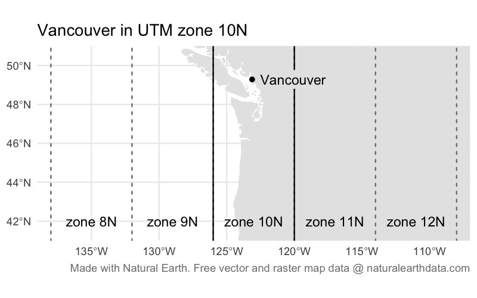
```

We can convert the `thefts` tibble to an SF object using the `st_as_sf()`
function (remember, all functions in the `sf` package start with `st_`, which
can sometimes make the function names a little confusing). We specify which
columns in the data represent the geometry (in this case, the `x` and `y`
columns), and what co-ordinate system the data uses. 

Co-ordinate systems can be specified in lots of ways (some very complicated),
but the easiest is to specify the <abbr title="European Petroleum Survey
Group">EPSG</abbr> code for the relevant system. An EPSG code is a unique
reference number for a particular co-ordinate system that R can look up in a
database to get the information needed to display the data on a map. The EPSG
code for the UTM zone 10N is `EPSG:32610`.

```{r convert-exercise1, exercise=TRUE}
library(sf)

thefts_sf <- st_as_sf(thefts, coords = c("x", "y"), crs = "EPSG:32610")

head(thefts_sf)
```

If you look at the contents of the `thefts_sf` object, you'll see that there is
a new column called `geometry` (you may need to use the ▸ button to see it). 
This column contains the co-ordinates of each bike theft in a format that R 
recognises represent locations on the surface of the earth, which means they can
be used to make maps.


::: {.box .notewell}

It is important to remember that we should only use `st_as_sf()` to convert a
*non-spatial* dataset (such as a tibble) into a spatial dataset (an SF object). 
If we use `st_as_sf()` on an object that is already an SF object, this can have
unexpected results and lead to errors in your code.

The easy way to think about this is that if you have loaded a dataset with
`read_sf()` or `st_read()` then you have already created an SF object, so you 
don't need `st_as_sf()`. If you have loaded a dataset with any other function
that reads data (such as `read_csv()` or `read_excel()`) then you will need to
use `st_as_sf()` if you want to plot the data on a map. Most importantly, do not
use `st_as_sf()` if you loaded a dataset with `read_sf()` or `st_read()`.

:::


<!--
<div class="box extra-detail">

<h5 id="convert-box1-title" class="box-title">Why did we use the `remove = FALSE` argument?</h5>

<div id="convert-box1" class="box-content">

We need to specify `remove = FALSE` because by-default the `st_as_sf()` function
removes the data columns containing map co-ordinates once it has converted them
into a geometric object stored in the geometry column. This is useful for making
very-large datasets smaller (by removing redundant columns), but in this case we
will need the `x` and `y` columns later, so we want to keep them in the dataset.

</div>

</div>

<script>
$("#convert-box1-title").click(function () { $("#section-convert-box1").toggle("slow") })
</script>
-->


### Finding bike thefts in our data


::: {.tutorial}

If you look through the contents of the `thefts_sf` object, you will see that 
not all of the rows relate to bicycle thefts. The `type` column shows that the
dataset also includes thefts from vehicles, for example. To choose only those 
rows containing bicycle thefts, which function from the `dplyr` package
would we used? If you need help, you can think back to the data-wrangling 
tutorial or have a look at the [Data transformation with dplyr cheat sheet](https://github.com/rstudio/cheatsheets/raw/master/data-transformation.pdf).

```{r filter-quiz}
question(
  "Which function from the `dplyr` package should we use to remove all the rows from our dataset except those for bicycle thefts?",
  answer("`filter()`", correct = TRUE),
  answer("`select()`", message = "Nearly right. The `select()` function allows us to choose particular *columns* from our dataset -- in this case, we want to choose particular *rows*."),
  answer("`mutate()`", message = "Not quite. The `mutate()` function allows us to change the values in existing columns in our dataset, or add new columns."),
  answer("`summarise()`", message = "Not quite. The `summarsise()` function allows us to create summaries of the values of columns, either for the whole dataset or groups of rows."),
  correct = random_praise(),
  incorrect = random_encouragement(),
  allow_retry = TRUE,
  random_answer_order = TRUE
)
```

Type the code needed to choose only the rows of data that relate to bicycle
thefts and store it in a new object called `bike_thefts`. If you get stuck, you 
can click the `Hint` buttons to get help, but try to find the answer on your own 
first!

```{r filter-exercise1, exercise = TRUE}

```

```{r filter-exercise1-hint-1}
# Use the `filter()` function to choose particular rows in a dataset. The syntax 
# for `filter()` is `filter(dataset, column_name == "value")`
```

```{r filter-exercise1-hint-2}
# In the code `filter(dataset, column_name == "value")`, replace `dataset` with
# the name of the SF object you have already created from the `thefts` tibble,
# `column_name` with the name of the column containing the offence type and
# `value` with the offence type for bicycle theft.
```

```{r filter-exercise1-hint-3}
# The correct code to store only bicycle thefts in a new object is:
bike_thefts <- filter(thefts_sf, type == "Theft of Bicycle")
```

Our data is now ready for us to make our crime map!

:::


::: {.book}

If you look through the contents of the `thefts_sf` object, you will see that not all of the rows relate to bicycle thefts. The `type` column shows that the dataset also includes thefts from vehicles, for example. To choose only those rows containing bicycle thefts, we can use the `filter()` function from the `dplyr` package.

```r
bike_thefts <- filter(thefts_sf, type == "Theft of Bicycle")
```

:::


So far in this tutorial we have used several functions -- `read_csv()`, 
`clean_names()`, `st_as_sf()` and `filter()` to produce an SF object 
representing the locations of bike thefts. Since we have done this step by step,
we have created a different object to store the result produced by each 
function. But since we only need the final dataset, our code would be a lot
easier to read if we used the pipe operator (`|>`) to run all these functions in
one go:

```r
bike_thefts <- read_csv("https://mpjashby.github.io/crimemappingdata/vancouver_thefts.csv.gz") |>
  janitor::clean_names() |> 
  st_as_sf(coords = c("x", "y"), crs = "EPSG:32610") |> 
  filter(type == "Theft of Bicycle")
```


=======
>>>>>>> c847f851a9ff3a85ea7ecd4bb7dfbf98c73bd619
<p class="credits">
[Stats Illustrations by Allison Horst](https://github.com/allisonhorst/stats-illustrations) licensed under the [Creative Commons Attribution licence](https://github.com/allisonhorst/stats-illustrations/blob/master/license).
</p>


## Producing maps in R

Now that we have our data, we can use it to create a map of bicycle theft in
Vancouver. Before we start, let's take another look at our dataset so that we
know which columns contain which data. 


::: {.tutorial}

Type the code needed to view the first few rows of the `bike_thefts` dataset.

```{r map-exercise1, exercise=TRUE}

```

```{r map-exercise1-solution}
head(bike_thefts)
```

:::


::: {.book}

```{r}
head(bike_thefts)
```

:::


### Introduction to ggplot2

<p class="full-width-image">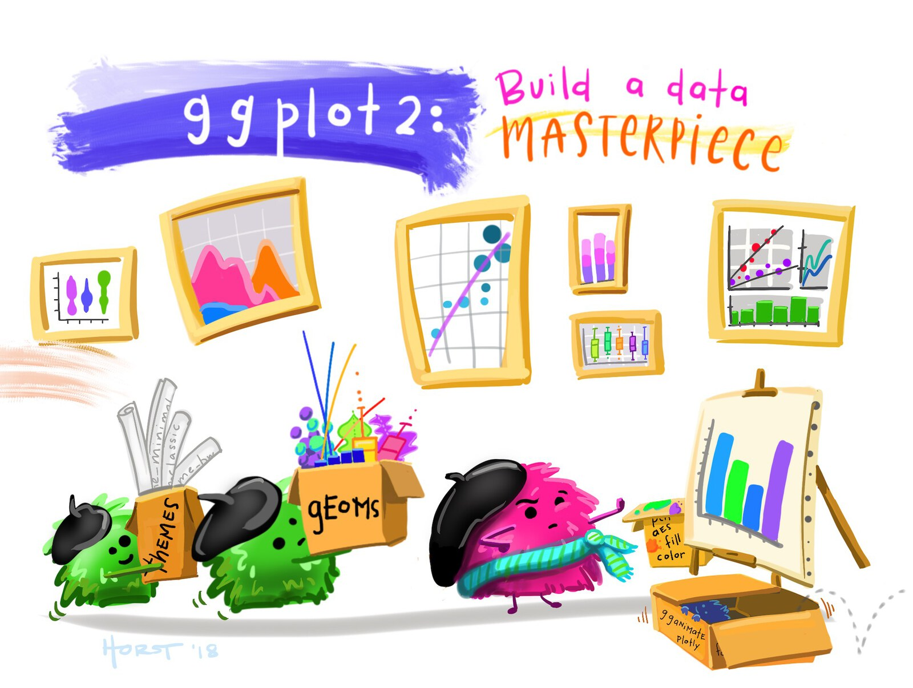</p>

A map is a specialised type of chart, so we can make maps using the [`ggplot2`
package](https://ggplot2.tidyverse.org/) that is widely used to create other 
types of chart in R. `ggplot2` charts are made up of layers, so they're 
well suited to making maps.

<a href="https://ggplot2.tidyverse.org/" title="ggplot2 website"></a>

The most-basic map that we can make simply plots the locations of crimes with no
context. This almost never makes a *good* crime map, but we can use this type of
map as the foundation around which we can build a better map.

`ggplot2` plots work by building up a chart using different functions, each of
which adds or modifies some part of the chart. Building a plot starts with 
calling the `ggplot()` function, with each subsequent function being added to 
the plot definition using the `+` operator. Note that while the package is 
called `ggplot2`, the function in that package used to create plots is called
`ggplot()`, *not* `ggplot2()`.

The most-important of the `ggplot2` functions are those beginning with `geom_`, 
which add graphical elements to the chart. If you want to add a layer to your 
chart showing a scatter plot, you use the `geom_point()` function, while if you 
want to make a line chart you use `geom_line()`.

```{r example-charts, fig.align="center", out.width="80%"}
ex_point <- tibble(x = rnorm(50, 10, 1), y = rnorm(50, 10, 1)) |> 
  ggplot(aes(x = x, y = y)) +
  geom_point() +
  labs(title = "A scatter plot using geom_point()") +
  theme_minimal()

ex_line <- tibble(x = 1:10, y = rpois(10, 5)) |> 
  ggplot(aes(x = x, y = y)) +
  geom_line() +
  scale_y_continuous(limits = c(0, NA)) +
  labs(title = "A line chart using geom_line()") +
  theme_minimal()

wrap_plots(ex_point, ex_line, ncol = 2)
```

There are lots of `geom_` functions available for representing data on charts in
different ways. For maps, the SF package includes the `geom_sf()` function that
is designed to add spatial data (in the form of an SF object such as our 
`bike_thefts` data) to a chart, making it into a map. So to simply plot the
points in our bicycle-theft data, we can use the code:

```{r map-exercise2, exercise=TRUE}
library(ggplot2)

ggplot() +
  geom_sf(data = bike_thefts)
```


::: {.box .notewell}

`geom_sf()` only works on SF objects, which is why we needed to convert the
original tibble of data to an SF object using `st_as_sf()`. If you try to use
`geom_sf()` on a dataset that is not stored as an SF object, R will produce an
error.

:::


By convention, each function that we add to `ggplot()` to change the appearance
of our map goes on a new line (this makes the code easier to read) and all but
the first line is indented by two spaces. RStudio does this indenting 
automatically if the previous line ends with a `+` symbol, since RStudio then
understands that there is more code to come on the next line.

This map shows the bike-theft data, but it is obviously not a very useful map.
Fortunately, we can use the features of the `ggplot2` package to build on this
basic map.


::: {.box .notewell}

Unless we want to produce a map of only a very small number of crimes (like the
Atlanta downtown homicides map we produced in a previous tutorial), it is 
unlikely that a point map will be very useful. 

In fact, **if you find yourself making map with each crime represented by a 
separate point, you should probably stop and ask yourself if that is really the 
best way to achieve your goal** -- it will almost always be better to map the
data in another way.

:::


### Controlling aesthetics

We can change the appearance of the points by specifying various arguments to
the `geom_sf()` function. These arguments are called *aesthetics*, because they
control the aesthetic appearance of the geometric objects (points, lines etc.)
that are produced by a `geom_` function. There are lots of aesthetics, but some 
of the most common are:

  * `colour` controls the colour of points and lines (for polygons, it controls
    the colour of the border around the polygon edge) – you can also use the
    spelling `color` for this argument and get an identical result,
  * `fill` controls the colour used to fill polygons or points that use a shape
    capable of having different colours in the centre and around the edge 
    (`fill` has no meaning for lines),
  * `shape` controls the shape (circle, triangle, square etc.) of points (it
    has no meaning for lines or polygons),
  * `size` controls the size of points and text,
  * `linewidth` controls the width of lines, including the borders around the 
    edges of polygons, and
  * `alpha` controls the transparency of a layer (`alpha = 1` equals fully
    opaque, `alpha = 0` means fully transparent).

`colour` and `fill` can be specified using [any one of 657 R colour names](http://bc.bojanorama.pl/wp-content/uploads/2013/04/rcolorsheet.pdf)
or using a [hexidecimal ('hex') colour code](https://htmlcolorcodes.com/#color-codes).
Values of `size` don't relate to any unit of size (e.g. millimetres or points),
so it's easiest to set the size of points and text by trial and error.

There are 25 built-in shapes for points in R (shape 16 is the default):

```{r ggplot-shapes, fig.align="center", out.width="80%"}
ggplot(data.frame(shape = 0:24), aes(0, 0, shape = shape)) +
  geom_point(aes(colour = "darkblue", fill = "lightblue", shape = shape), size = 5) +
  scale_colour_identity(aesthetics = c("colour", "fill")) +
  scale_shape_identity() +
  labs(
    title = "Available shapes in R", 
    subtitle = str_wrap("Shapes 0 to 20 use the colour aesthetic. Shapes 21 to 24 have separate values of the colour and fill aesthetics", 90)
  ) +
  facet_wrap(vars(shape)) +
  theme_void()
```


::: {.tutorial}

Change the code below so that the points on our map are red squares instead of
black circles (`red` is one of the 657 R colour names) and click `Run Code` to
see the result. Use the hints if you need help, but try to work it out on your
own first.


```{r map-exercise3, exercise=TRUE}
ggplot() +
  geom_sf(data = bike_thefts)
```

```{r map-exercise3-hint-1}
# Use the `shape` aesthetic to change the points to squares and the `colour`
# aesthetic to change the point colour to red
```

```{r map-exercise3-hint-2}
# Add the arguments `shape = 15` and `colour = "red"` to the `geom_sf()`
# function, remembering that arguments are separated by commas
```

```{r map-exercise3-hint-3}
ggplot() +
  geom_sf(data = bike_thefts, shape = 15, colour = "red")
```

:::


::: {.book}

For example, we could change the points on our map to be red squares rather than
the default black circles:

```r
ggplot() +
  geom_sf(data = bike_thefts, shape = 15, colour = "red")
```

:::


As we have said, this basic map is not very useful. We can see that there seems 
to be a cluster of bike thefts towards the top (north) of the map, but it is 
difficult to see how important this cluster is because so many of the points
overlap. Overlapping points are a particular problem in maps, because if there
are multiple crimes at the same location then the points representing those 
crimes will be exactly on top of one another and it will be impossible to 
see whether there is one crime at a particular location or 100.


::: {.tutorial}

One way to deal with this problem is to make the points semi-transparent so that
overlapping points appear darker. This often works better if we also make the 
points slightly smaller at the same time. Use the `alpha` and `size` aesthetics 
to make the points smaller (relative to the default for points of `size = 1`) 
and semi-transparent. Keep changing the values of the two aesthetics until you 
are happy that the map makes it as easy as possible to see the distribution of 
bike thefts in Vancouver.

```{r map-exercise4, exercise=TRUE}
ggplot() +
  geom_sf(data = bike_thefts)
```

```{r map-exercise4-solution}
# Which values you've chosen will depend on your personal aesthetic preferences,
# but these values produce a map that makes it easier to see the distribution of
# points
ggplot() +
  geom_sf(data = bike_thefts, size = 0.75, alpha = 0.1)
```

:::


::: {.book}

One way to deal with this problem is to make the points semi-transparent so that
overlapping points appear darker. This often works better if we also make the 
points slightly smaller at the same time. We can use the `alpha` and `size` 
aesthetics to make the points smaller (relative to the default for points of 
`size = 1`) and semi-transparent.

```r
ggplot() +
  geom_sf(data = bike_thefts, size = 0.75, alpha = 0.1)
```

:::


Making the points semi-transparent goes some way to making it easier to see 
where bike theft is most common in Vancouver, but the pattern is not clear and
it is not possible to tell which darker points represent a handful of crimes
at the same location and which represent hundreds of crimes at the same 
location. To make our map useful, we need to use a different technique.


## Mapping crime density

A better way to show where crime is concentrated on a map is to work out the
*density* of crime in each area and then map that density. By *density* in this
context, we mean the relative concentration of points in each part of the area 
we are studying, i.e. how many points (representing bike thefts) are there in 
each part of the map relative to all the other areas of the map. 

To estimate the density of points in different areas of the map, R uses a 
technique called *kernel density estimation* (KDE). To do this, R must:

  1. divide the map into a grid of cells, each the same size,
  2. count the number of points in each cell,
  3. for each cell, count the number of points in nearby cells, but give less
     weight to (i.e. systematically undercount) those cells that are further 
     away,
  4. for each cell, total up the count of points in that cell and the (weighted)
     count of points in nearby cells – this is the estimate of the density of
     points in that cell.

This procedure has the effect of producing a smooth surface representing crime
density. 

You might recognise this procedure as another example of simplifying a 
complicated spatial dataset by converting it from individual points to a raster
that summarises those points as values associated with a grid of cells. In this
case, the value associated with each grid cell represents the relative density 
of points in that cell.


```{r kde-explanation, eval=FALSE}
random_points <- tibble(x = rnorm(50, sd = 50), y = rnorm(50, sd = 50)) |> 
  filter(between(x, -40 * 3, 40 * 3), between(y, -40 * 3, 40 * 3)) |> 
  # Choose any projected CRS
  st_as_sf(coords = c("x", "y"), crs = "EPSG:27700")

# Create the grid separately, so we can be sure what limits it will have
random_points_grid <- tibble(
  x = c(-40 * 3, 40 * 3, 40 * 3, -40 * 3), 
  y = c(-40 * 3, 40 * 3, -40 * 3, 40 * 3)
) |> 
  st_as_sf(coords = c("x", "y"), crs = "EPSG:27700") |> 
  hotspot_grid(cell_size = 40)

random_points_kde <- random_points |> 
  hotspot_kde(grid = random_points_grid, quiet = TRUE) |> 
  mutate(
    label_n = if_else(n > 0, n, NA_real_),
    label_kde = scales::number(kde, accuracy = 0.1)
  )

random_points_kde[, c("coord_x", "coord_y")] <- random_points_kde |> 
  st_centroid() |> 
  st_coordinates()

kde_explanation <- list()

kde_explanation[["1"]] <- ggplot(random_points_kde) +
  geom_sf(data = random_points, colour = "grey50") +
  geom_sf(fill = NA) +
  labs(
    title = str_wrap(
      "1. Create a grid of cells covering the area covered by the points", 
      width = 36
    )
  ) +
  theme_void() +
  theme(
    plot.title = element_text(lineheight = 0.9, size = 10)
  )

kde_explanation[["2"]] <- ggplot(random_points_kde) +
  geom_sf(data = random_points, colour = "grey75") +
  geom_sf(fill = NA) +
  geom_sf_label(
    aes(label = label_n), 
    na.rm = TRUE, 
    fill = NA, 
    label.size = NA,
    size = 2.25
  ) +
  labs(
    title = str_wrap(
      "2. Count the number of points in each cell", 
      width = 36
    )
  ) +
  theme_void() +
  theme(
    plot.title = element_text(lineheight = 0.9, size = 10)
  )

kde_aw <- arrow(length = unit(1.5, "mm"), type = "closed")

kde_explanation[["3"]] <- ggplot() +
  geom_sf(data = random_points_kde, fill = NA) +
  geom_sf(
    data = filter(
      random_points_kde, 
      between(coord_x, -20, 20), 
      between(coord_y, -20, 20)
    ), 
    colour = "darkred",
    fill = NA,
    linewidth = 1
  ) +
  geom_sf_label(
    aes(label = n), 
    data = filter(
      random_points_kde, 
      between(coord_x, -40, 40), 
      between(coord_y, -40, 40)
    ), 
    na.rm = TRUE, 
    fill = NA, 
    label.size = NA,
    size = 2.25
  ) +
  geom_circle(
    aes(x0 = x, y0 = y, r = r), 
    data = tibble(x = 0, y = 0, r = 40 * 1.5), 
    colour = "darkred", 
    fill = NA, 
    linetype = "23", 
    size = 1.5
  ) +
  # Right
  annotate("segment", x = 12, y = 0, xend = 32, yend = 0, arrow = kde_aw, colour = "grey40") +
  # Lower right
  annotate("segment", x = 10, y = -10, xend = 30, yend = -30, arrow = kde_aw, colour = "grey40") +
  # Bottom
  annotate("segment", x = 0, y = -12, xend = 0, yend = -32, arrow = kde_aw, colour = "grey40") +
  # Lower left
  annotate("segment", x = -10, y = -10, xend = -30, yend = -30, arrow = kde_aw, colour = "grey40") +
  # Left
  annotate("segment", x = -12, y = 0, xend = -32, yend = 0, arrow = kde_aw, colour = "grey40") +
  # Upper left
  annotate("segment", x = -10, y = 10, xend = -30, yend = 30, arrow = kde_aw, colour = "grey40") +
  # Top
  annotate("segment", x = 0, y = 12, xend = 0, yend = 32, arrow = kde_aw, colour = "grey40") +
  # Upper right
  annotate("segment", x = 10, y = 10, xend = 30, yend = 30, arrow = kde_aw, colour = "grey40") +
  labs(
    title = str_wrap(
      "3. Identify the counts in the cells surrounding each cell", 
      width = 36
    )
  ) +
  theme_void() +
  theme(
    plot.title = element_text(lineheight = 0.9, size = 10)
  )

kde_explanation[["4"]] <- ggplot(random_points_kde) +
  geom_sf(fill = NA) +
  geom_sf_label(
    aes(label = label_kde), 
    na.rm = TRUE, 
    fill = NA, 
    label.size = NA,
    size = 2.25
  ) +
  labs(
    title = str_wrap(
      "4. Use those counts to estimate the underlying density", 
      width = 36
    )
  ) +
  theme_void() +
  theme(
    plot.title = element_text(lineheight = 0.9, size = 10)
  )

kde_explanation_plot <- wrap_plots(kde_explanation, ncol = 2)

ggsave(
  "inst/tutorials/05_your_second_crime_map/images/kde_explanation.jpg", 
  kde_explanation_plot, 
  width = 800 / 150, 
  height = 800 / 150, 
  dpi = 150
)
```

```{r kde-explanation-map, fig.align="center", out.width="80%"}
knitr::include_graphics("images/kde_explanation.jpg")
```

We don't need to worry at this point about the details of how the counts are 
used to estimate the density of crimes -- we will return to this in a later
tutorial.

<a href="https://github.com/mpjashby/sfhotspot/" title="sfhotspot website"></a>

There are several ways we can make density maps in R. In this course we will use 
the [`sfhotspot` package](http://pkgs.lesscrime.info/sfhotspot/) because it 
makes reasonable default decisions about how or density maps should look, while 
still giving us control over their appearance if we want it. `sfhotspot` also 
has other useful functions that we will use in future tutorials.

To create a density map using `sfhotspot`, we first use the `hotspot_kde()` 
function to convert a dataset of offence locations to an estimate of the density 
of offences for each cell in a grid. `hotspot_kde()` automatically chooses how 
big the cells in the grid should be (but we can set this ourselves if we want 
to).

```{r map-exercise5, exercise=TRUE, message=FALSE}
library(sfhotspot)

bike_theft_density <- hotspot_kde(bike_thefts, quiet = TRUE)

head(bike_theft_density)
```

The `bike_theft_density` object created by `hotspot_kde()` contains three
columns: `n` contains the count of bike thefts in each cell, `kde` contains the
estimate of the density of thefts in each cell, and `geometry` contains the
outline of each grid cell.

Since `hotspot_kde()` produces an SF object, we can add it to a map using the
`geom_sf()` function. We can also use the `fill` aesthetic to specify that the
fill colour of each grid cell should be determined based on the values of the
`kde` column in the `bike_theft_density` object.

```{r map-exercise6, exercise=TRUE}
ggplot() +
  geom_sf(aes(fill = kde), data = bike_theft_density, colour = NA)
```

We have already seen that we can set aesthetics such as colour and shape 
manually, but the `aes()` function allows us to specify that the values of 
different aesthetics should be controlled by columns in the data. The `aes()`
function takes as its arguments pairs of values (combined with an `=` symbol) 
where the first value is an aesthetic and the second value is the name of a 
column in the data. For example, to use the colour of points on a map to
represent different types of crime that were stored in a column in the data
called `type`, we could use `aes(colour = type)`.


::: {.box .notewell}

When should you specify the values of aesthetics inside `aes()` and when should
you do it outside `aes()`?

  * If you want an aesthetic to have a constant value for all the points, lines 
    or other shapes in a layer, control the aesthetic _outside_ `aes()`. For 
    example, you could use `geom_sf(bike_thefts, colour = "mediumblue")` to make
    all the shapes in that layer blue.
  * If you want to vary the appearance of shapes according to values in the 
    data, you should control the aesthetic _inside_ `aes()`. For example, you
    could use `geom_sf(aes(colour = month), bike_thefts)` to vary the colour of
    shapes in a layer according to values of the `month` column in the data.

If you specify a constant value for an aesthetic (e.g. `colour = "mediumblue"`)
this will over-ride any mapping for that aesthetic provided by the `aes()`
function (e.g. `aes(colour = month)`). If you have used `aes()` to specify that 
an aesthetic should be controlled based on a column in the data but find that
the aesthetic is not changing based on the data, check you have not also
specified a constant value for that aesthetic.

**`aes()` must be the _first_ argument in the `geom_*()` function.**

:::


In this map, instead of seeing each crime as a separate point, we see the 
density of crime as the filled colour of cells in a grid. By comparing this 
density map to the point map we produced before, we can see that the density map 
makes the areas with the highest frequency of thefts easier to identify.

You can also see that our map now has a legend, showing that higher densities of
bike thefts are shown on the map in dark blue and lower densities are shown in 
light blue. The exact values shown in the legend are not particularly 
meaningful, so we can ignore these for now (we will come back to this in a 
future tutorial).


### Fine-tuning density maps

We can control the appearance of KDE maps in several ways. For example, we can 
vary the number of cells in the grid and the definition of what cells the
kernel density estimation process should consider to be 'nearby' for the 
purposes of calculating weighted counts. Cells are considered to be 'nearby' to
a particular cell if they are closer to that cell than a distance known as the
KDE *bandwidth*.

By default, `hotspot_kde()` chooses the cell size and the bandwidth 
automatically. The maps below show how changing these defaults changes the 
appearance of our map (with the legend and axes removed to make the small maps 
clearer).

```{r make-kde-bandwidth-map, eval=FALSE}
bw_plot <- tibble(
  cell_size = rep(c(0.5, 1, 2), 5), 
  bw = rep(c(4, 2, 1, 0.5, 0.25), each = 3)
) |> 
  pmap(function(cell_size, bw) {
    bike_thefts |> 
      hotspot_kde(
        cell_size = sfhotspot:::set_cell_size(bike_thefts) * 4 * cell_size, 
        bandwidth_adjust = bw, 
        quiet = TRUE
      ) |> 
      ggplot() +
      geom_sf(aes(fill = kde), colour = NA) +
      labs(
        subtitle = str_glue("{cell_size}x default cell size\n{bw}x default bandwidth")
      ) +
      theme_void() +
      theme(
        legend.position = "none",
        plot.subtitle = element_text(size = 10)
      )
  }) |> 
  wrap_plots(ncol = 3)

ggsave(
  "inst/tutorials/05_your_second_crime_map/images/bandwidth.jpg", 
  bw_plot, 
  width = 800 / 150, 
  height = 1200 / 150, 
  dpi = 150
)
```

```{r kde-bandwidth-map, fig.align="center", out.width="100%"}
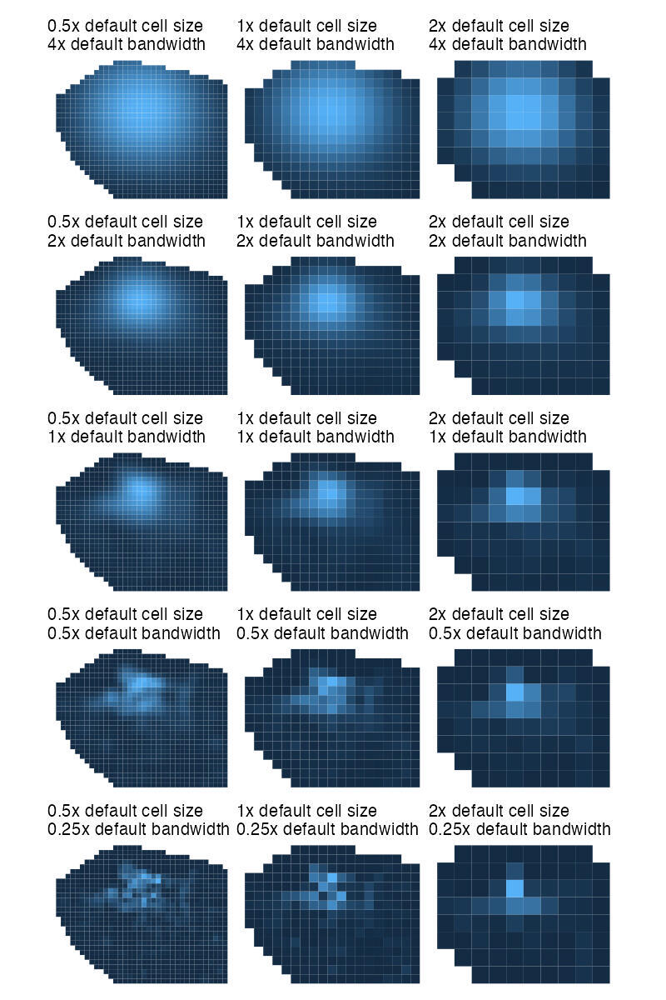
```

By looking at the maps on the right-hand side, you can see that reducing the
number of grid cells leads to a map that looks blocky and lacks information.
Looking at maps higher up, you can see that increasing the bandwidth relative 
to the default makes the density surface smoother. The smoother the surface, the 
less detail we can see about where crime is most concentrated, until on the top 
row we can see almost no information at all. On the other hand, if we reduce the 
bandwidth too much (the bottom row of maps) then almost no 'nearby' cells are 
included in the count and so it becomes more difficult to identify patterns.

In most cases, you will not need to change the cell size used in calculating the 
density of points on a map, but if you do then you can do this using the 
`cell_size` argument to `hotspot_kde()`.

Although you can set the bandwidth manually using the `bandwidth` argument to 
`hotspot_kde()`, you will almost never want to do this. Instead, you can vary 
the bandwidth relative to the automatically chosen default bandwidth by
using the `bandwidth_adjust` argument. For example, if you wanted to see more 
detail in your map by using a smaller bandwidth, you could use 
`bandwidth_adjust = 0.75` or `bandwidth_adjust = 3/4` to set the bandwidth to be
three-quarters of the default bandwidth.


::: {.tutorial}


Change the code below so that the bandwidth is half of the default
bandwidth.

```{r map-exercise7, exercise=TRUE, exercise.lines=5}
hotspot_kde(bike_thefts, quiet = TRUE) |> 
  ggplot() +
  geom_sf(aes(fill = kde), colour = NA)
```

```{r map-exercise7-solution}
# You can set either `bandwidth_adjust = 1/2` or `bandwidth_adjust = 0.5` to 
# get the same result
hotspot_kde(bike_thefts, quiet = TRUE, bandwidth_adjust = 2/3) |> 
  ggplot() +
  geom_sf(aes(fill = kde), colour = NA)
```

Comparing this map to the first density map we produced, we can see that the
slightly smaller bandwidth means we can see slightly more detail in the patterns
of bike thefts.

:::


::: {.box .notewell}

I recommend using a slightly smaller bandwidth than the default, so that your
maps show a bit more detail. Try setting `bandwidth_adjust = 0.5` whenever you
produce a density layer using `hotspot_kde()`, but remember to look at the map 
to see if you are happy with the result.

:::


The final way we can control the appearance of our density layer is to change
the colour scheme used to represent density. To do this, we can use another type
of `ggplot2` function: scales. There are lots of scales available, but the
`scale_fill_distiller()` function produces several different colour scales that 
are specifically designed to be effective on maps. 

All the available colour schemes are on the [Color Brewer website](https://colorbrewer2.org/#type=sequential&scheme=BuGn&n=3).
Colour schemes can be divided into three types:

  * *sequential* colour schemes are useful for showing values from low to high,
  * *diverging* colour schemes are useful for showing values relative to a 
    meaningful central point, and
  * *qualitative* colour schemes are useful for showing separate categories that
    can appear in any order and still be meaningful.

In crime mapping we're usually interested in showing how crime varies from low 
to high, so we need to use a _sequential_ colour palette. There are 
`r nrow(filter(RColorBrewer::brewer.pal.info, category == "seq"))` sequential 
colour schemes (or palettes) available in `scales_fill_distiller()`, each with a 
name:

```{r kde-colours, out.width="100%"}
RColorBrewer::brewer.pal.info |> 
  rownames_to_column(var = "name") |> 
  filter(colorblind, category == "seq") |> 
  pmap(function (...) {
    current <- tibble(...)
    ggplot() +
      geom_raster(aes(x = 1:9, y = 1, fill = as.factor(1:9))) +
      scale_fill_brewer(palette = current$name) +
      labs(subtitle = current$name) +
      theme_void() +
      theme(
        legend.position = "none", 
        plot.subtitle = element_text(size = 8)
      )
  }) |> 
  wrap_plots()
```


::: {.box .notewell}

It is important to **only use the right type of colour scale in the right
circumstances**, since using the wrong type of scale could end up misleading
people reading your map. For example, a diverging colour scale gives the strong
impression that the central point in the scale is meaningful. 

In some circumstances this might be useful, for example if you wanted to show
areas in which crime had increased in shades of one colour and areas in which
crime had decreased in shades of another colour. In that case, a diverging scale
would be appropriate because the central point represents something meaningful:
no change in crime. If the central point is not meaningful, use a sequential
colour scheme instead.

If you want to represent a categorical variable, you should use a categorical
colour scale unless the categories have a natural order. For example, if you
wanted to show ethnic groups on a map you would use a categorical colour scale
since there is no one order of ethnic groups that is any more meaningful than
any other. If you wanted to represent days of the week with colour, then you
might want to use a sequential colour scheme since the days of the week have a
meaningful order.

:::


By default, `scale_fill_distiller()` sets the _lowest_ values to have the 
darkest colour. This often does not work well, but we can change this by 
setting the argument `direction = 1`. I recommend doing this in all cases.

```{r direction-map, fig.align='center', out.width="80%"}
direction_map_neg <- ggplot() +
  geom_sf(aes(fill = kde), data = bike_theft_density_bw_half, colour = NA) +
  scale_fill_distiller(direction = -1) +
  labs(title = "direction = -1 (the default)") +
  theme_void() +
  theme(legend.position = "bottom")

direction_map_pos <- ggplot() +
  geom_sf(aes(fill = kde), data = bike_theft_density_bw_half, colour = NA) +
  scale_fill_distiller(direction = 1) +
  labs(title = "direction = 1") +
  theme_void() +
  theme(legend.position = "bottom")

direction_map_neg + direction_map_pos
```

You can think of all the functions that we can add to `ggplot()` as being like a
stack of pancakes, with each new function being placed on the top of the stack.
To change the colour of our map, we just add `scale_fill_distiller()` to the 
existing stack. 

```{r map-exercise8, exercise=TRUE}
ggplot() +
  geom_sf(aes(fill = kde), data = bike_theft_density, colour = NA) +
  scale_fill_distiller(palette = "Oranges", direction = 1)
```


::: {.tutorial}

Try changing the code in this box to use one of the other Color Brewer palettes
above. Which palette do you like best?


### Check your understanding

Answer the following questions to check your understanding of what we've learned
in this section of this tutorial. If you get a question wrong, you can keep 
trying until you get the right answer.

```{r map-quiz}
quiz(
  caption = "",
  
  question(
    "What R package do we use to make density maps using the `hotspot_kde()` function?",
    answer("`sfhotspot`", correct = TRUE),
    answer(
      "`ggplot2`",
      message = "`hotspot_kde()` produces SF objects that can be plotted using `ggplot()`, but the `hotspot_kde()` function itself does not come from the `ggplot2` package."
    ),
    answer(
      "`sf`",
      message = "The `sf` package contains lots of functions for manipulating spatial data, but not for making maps."
    ),
    answer(
      "`dplyr`",
      message = "The `dplyr` package contains functions for data wrangling, which we learned about in a previous tutorial."
    ),
    correct = random_praise(),
    allow_retry = TRUE,
    random_answer_order = TRUE
  ),
  
  question(
    "What is the `bandwidth_adjust` argument of the function `hotspot_kde()` used for?",
    answer(
      "Adjusting the bandwidth of the density layer, relative to the default bandwidth.",
      correct = TRUE
    ),
    answer(
      "Adjusting the cell size of the density layer, relative to the default cell size.",
      message = "We use the `cell_size` argument of `hotspot_kde()` to change the default cell size."
    ),
    answer(
      "Adjusting the colour scheme used to represent density on the map.",
      message = "We use the `scale_fill_distiller()` function to adjust the colour scheme used to represent density on the map."
    ),
    correct = random_praise(),
    allow_retry = TRUE,
    random_answer_order = TRUE
  ),
  
  question(
    "In what circumstances is it appropriate to use a diverging colour scale, e.g. one that goes from blue to white to red?",
    answer("To represent variation in a variable above and below a meaningful mid-point.", correct = TRUE),
    answer(
      "To represent variation in a variable from low to high.",
      message = "In this case, you should use a sequential scale unless there is a mid-point in the scale that is meaningful."
    ),
    answer(
      "To represent variation in a variable from high to low.",
      message = "In this case, you should use a sequential scale unless there is a mid-point in the scale that is meaningful."
    ),
    answer(
      "To represent categories in a categorical variable.",
      message = "In this case, you should use a categorical colour scheme if the categories have no natural order and a sequential colour scheme if the categories do have a natural order."
    ),
    correct = random_praise(),
    allow_retry = TRUE,
    random_answer_order = TRUE
  )
  
)
```

You now have the skills to make a density map of bike theft in Vancouver. Using
your notes and the code in this section, complete the code needed to 
generate a map with: 

  1. kernel density calculated using the default number of grid cells and *half* 
     the default band width, and
  2. the density shown using the Color Brewer 'Purples' colour scheme.

Remember the data are stored in an object called `bike_thefts`.

```{r basemap-exercise1, exercise=TRUE, exercise.lines=5}

```

```{r basemap-exercise1-solution}
bike_theft_density_bw_half <- hotspot_kde(
  bike_thefts, 
  quiet = TRUE,
  bandwidth_adjust = 0.5
)

ggplot() +
  geom_sf(aes(fill = kde), data = bike_theft_density_bw_half, colour = NA) +
  scale_fill_distiller(palette = "Purples", direction = 1)
```

:::


## Clipping map layers

There is one limitation of the KDE layer on our map that we need to deal with.
The area covered by the KDE layer is determined by the area covered by the point
data that we provided to `hotspot_kde()`. More specifically, `hotspot_kde()` 
will calculate density values for every cell in the _convex hull_ around the 
point data, i.e. for the smallest polygon that contains all the points in the 
data.

This can be a problem in some circumstances, because we do not necessarily have
crime data for all the areas within the convex hull of the data, even though KDE
values will be calculated for those areas. This could be misleading, since it
will look like such areas have low crime density, when in fact we do not know
what the density of crime in such areas is.

Fortunately, we can easily deal with this problem by _clipping_ the KDE layer to
the boundary of the area for which we have crime data. This means we will only
show densities for cells for which we actually have data.

```{r make-clipping-explanation-map, eval=FALSE}
library(ggtext)

bike_thefts_sample <- bike_thefts |> 
  st_intersection(vancouver_boundary) |> 
  sample_frac(0.2)
bike_theft_hull <- bike_thefts_sample |> 
  st_intersection(vancouver_boundary) |> 
  st_union() |> 
  st_convex_hull()
bike_theft_sample_kde <- hotspot_kde(
  bike_thefts_sample, 
  bandwidth_adjust = 0.5, 
  quiet = TRUE
)


# First map ----

hull_map_1 <- ggplot() +
  geom_sf(data = bike_theft_hull, colour = NA, fill = NA) +
  geom_sf(data = vancouver_boundary, colour = NA, fill = NA) +
  geom_sf(data = bike_thefts_sample, colour = "grey50", size = 0.1) +
  geom_sf(data = vancouver_boundary, colour = "seagreen", fill = NA, linewidth = 0.75) +
  theme_void()

ggsave(
  "inst/tutorials/05_your_second_crime_map/images/hull_clipping_1.jpg", 
  hull_map_1, 
  width = 400 / 150, 
  height = 300 / 150, 
  dpi = 150
)


# Second map ----

hull_map_2 <- ggplot() +
  geom_sf(data = bike_theft_hull, colour = NA, fill = NA) +
  geom_sf(data = vancouver_boundary, colour = NA, fill = NA) +
  geom_sf(data = bike_thefts_sample, colour = "grey50", size = 0.1) +
  geom_sf(data = bike_theft_hull, colour = "seagreen", fill = NA, linetype = "33", linewidth = 0.75) +
  theme_void()

ggsave(
  "inst/tutorials/05_your_second_crime_map/images/hull_clipping_2.jpg", 
  hull_map_2, 
  width = 400 / 150, 
  height = 300 / 150, 
  dpi = 150
)


# Third map ----

hull_map_3 <- ggplot() +
  geom_sf(data = bike_theft_hull, colour = NA, fill = NA) +
  geom_sf(data = vancouver_boundary, colour = NA, fill = NA) +
  geom_sf(data = st_difference(bike_theft_hull, vancouver_boundary), colour = NA, fill = "seagreen3") +
  geom_sf(data = bike_thefts_sample, colour = "grey50", size = 0.1) +
  geom_sf(data = vancouver_boundary, colour = "seagreen", fill = NA, linewidth = 0.75) +
  geom_sf(data = bike_theft_hull, colour = "seagreen", fill = NA, linetype = "33", linewidth = 0.75) +
  theme_void()

ggsave(
  "inst/tutorials/05_your_second_crime_map/images/hull_clipping_3.jpg", 
  hull_map_3, 
  width = 400 / 150, 
  height = 300 / 150, 
  dpi = 150
)


# Fourth map ----

hull_map_4 <- ggplot() +
  geom_sf(data = bike_theft_hull, colour = NA, fill = NA) +
  geom_sf(data = vancouver_boundary, colour = NA, fill = NA) +
  geom_sf(
    aes(fill = kde),
    data = st_intersection(bike_theft_sample_kde, vancouver_boundary),
    colour = NA
  ) +
  geom_sf(data = vancouver_boundary, colour = "seagreen", fill = NA, linewidth = 0.75) +
  geom_sf(data = bike_theft_hull, colour = "seagreen", fill = NA, linetype = "33", linewidth = 0.75) +
  scale_fill_distiller(palette = "Greens", direction = 1) +
  theme_void() +
  theme(
    legend.position = "none"
  )

ggsave(
  "inst/tutorials/05_your_second_crime_map/images/hull_clipping_4.jpg", 
  hull_map_4, 
  width = 400 / 150, 
  height = 300 / 150, 
  dpi = 150
)
```

:::: {style="display: grid; grid-template-columns: 1fr 1fr; grid-column-gap: 2em;"}


::: {}

A. We only have data on bike thefts from the City of Vancouver, so all the bike 
thefts in the data necessarily occurred within the city. We do not know what the
density of crime outside the city is.

{width=100%}

:::


::: {}

B. The KDE function only knows the theft locations, not the area in which thefts 
could have occurred. So the convex hull created by the KDE layer will not 
necessarily match the area of the data.

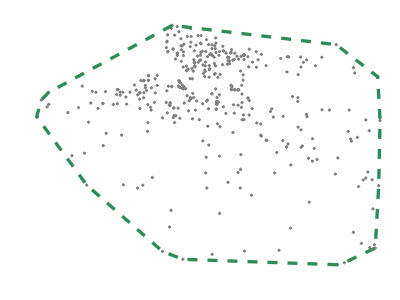{width=100%}

:::


::::


:::: {style="display: grid; grid-template-columns: 1fr 1fr; grid-column-gap: 2em;"}


::: {}

C. In this case, that means some areas (shaded) will be included in the KDE 
layer even though they happened outside the area covered by the data, which 
could be misleading.

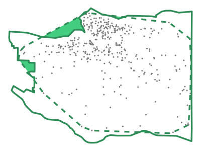{width=100%}

:::


::: {}

D. To avoid suggesting we know the density of crimes in areas for which we do 
not have data, we should clip the KDE layer to the boundary of the area for 
which we have data.

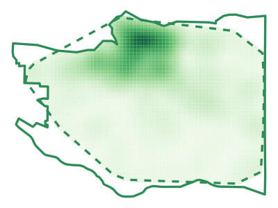{width=100%}
:::


::::

We can clip the KDE layer produced by `hotspot_kde()` to the boundary of the
City of Vancouver using the `st_intersection()` function from the `sf` package.
`st_intersection()` removes any rows from the dataset provided as the first
argument that do not fall within the area covered by the dataset provided as the
second argument. If we have the boundary of the City of Vancouver stored in an
object called `vancouver_boundary` and the a KDE layer showing the density of 
bike thefts stored in the `bike_theft_density` object, we can use 
`st_intersection()` to remove any cells in `bike_theft_density` that are 
outside `vancouver_boundary`.

```{r clip-exercise1, exercise=TRUE}
# Before clipping the KDE layer, we can use the `nrow()` function to check how
# many cells there are in the KDE grid (each grid cell is one row in the data)
nrow(bike_theft_density)

# Clip the density layer
bike_theft_density_clip <- st_intersection(
  bike_theft_density, 
  vancouver_boundary
)

# Now we can check the number of rows in the clipped layer, which will be
# lower than in the original KDE layer
nrow(bike_theft_density_clip)
```

`st_intersection()` produces a warning message:

```
Warning: attribute variables are assumed to be spatially constant throughout all
geometries
```

As long as you are simply using `st_intersection()` to remove parts of the data
outside a boundary, you can ignore this message.

In most cases, we can use the pipe operator to clip a KDE layer just after we
produce it with `hotspot_kde()`:

```r
bike_theft_density_clip <- bike_thefts |> 
  hotspot_kde(bandwidth_adjust = 0.5, quiet = TRUE) |> 
  st_intersection(vancouver_boundary)
```

::: {.box .notewell}

The `st_intersection()` function requires that both spatial layers have the
same co-ordinate system. If the two layers use different co-ordinate systems,
you will need to transform one of the layers using `st_transform()` so that it
uses the same co-ordinate system as the other layer.

If you do not know which co-ordinate systems the layers use, you can use the
`st_crs()` function to extract the co-ordinate system from one layer and pass
that value as the second argument to `st_transform()`. For example:

```r
st_transform(bike_theft_density, crs = st_crs(vancouver_boundary))
```

:::


## Adding a base map

The density map we have made is much more effective than a point map at allowing 
us to identify where the highest number of bike thefts in Vancouver occur. 
However, it's still quite difficult to know *where* those places are, because we 
cannot easily work out where in the city these places are. We can make this much 
easier by adding a *base map* underneath the density layer.

We can add a base map using `annotation_map_tile()` function from the 
[`ggspatial` package](https://paleolimbot.github.io/ggspatial/). We can add
`annotation_map_tile()` to a `ggplot()` stack in the same way that we would
add `geom_*()` functions.

```{r basemap-exercise2, exercise=TRUE, exercise.lines=19}
ggplot() +
  # We add the base map to the `ggplot()` stack *before* the density layer 
  # because we want the base map to appear below the density layer
  annotation_map_tile(zoomin = 0, progress = FALSE) +
  # When adding a base map, it is useful to make any filled layers (such as the
  # density layer) semi-transparent so that readers can see the base map
  geom_sf(
    aes(fill = kde), 
    data = bike_theft_density_bw_half, 
    alpha = 0.67, 
    colour = NA
  ) +
  scale_fill_distiller(palette = "Purples", direction = 1) +
  theme_void() +
  # Suppress the map legend -- we will learn more about these next lines of code
  # in a future tutorial
  theme_void() + 
  theme(legend.position = "none")
```

The base maps returned by `annotation_map_tile()` are available at many 
different [zoom levels](https://wiki.openstreetmap.org/wiki/Zoom_levels), from 
level 1 that is useful for mapping the whole world in one map, to level 20 that 
can be used to map a single building. By default, `annotation_map_tile()`
downloads tiles with slightly less detail than we might want, but we can fix
this by using the argument `zoomin = 0`. We could also set a specific zoom level
using the `zoom` argument.

For example, these maps show the same area around the UCL Jill Dando Institute
with base maps at different zoom levels.

```{r make-zoom-map, eval=FALSE}
jdi <- c(-0.12979747256628416, 51.52501948280652) |> 
  st_point() |> 
  st_sfc(crs = "EPSG:4326") |> 
  st_transform("EPSG:27700") |> 
  st_buffer(2000)

zoom_map <- map(8:16, function(zoom_level) {
  ggplot() + 
    annotation_map_tile(zoom = zoom_level, progress = FALSE) +
    geom_sf(data = jdi, colour = NA, fill = NA) +
    labs(subtitle = str_glue("zoom level {zoom_level}")) +
    theme_void() +
    theme(
      panel.border = element_rect(colour = "black", fill = NA, size = 1),
      plot.margin = unit(c(6, 6, 6, 6), "pt"),
      plot.subtitle = element_text(size = 10)
    )
}) |> 
  wrap_plots(ncol = 3)

ggsave(
  "inst/tutorials/05_your_second_crime_map/images/zoom.jpg", 
  zoom_map, 
  width = 800 / 150, 
  height = 800 / 150, 
  dpi = 150
)
```

```{r zoom-map, fig.align="center", out.width="100%"}
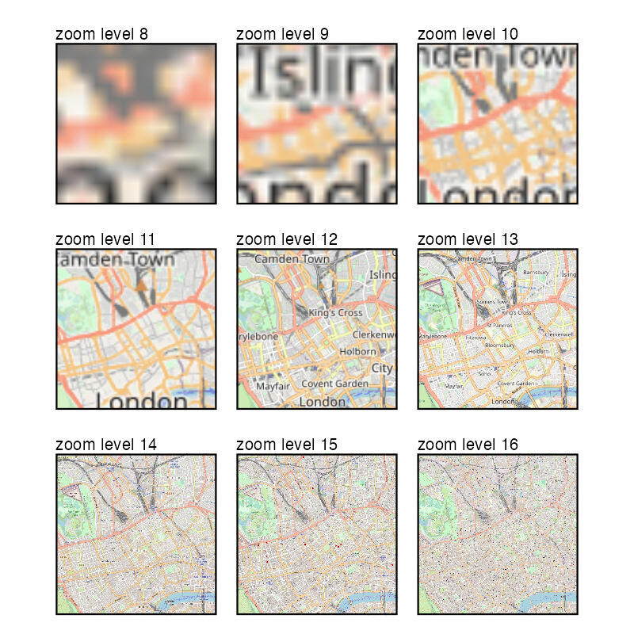
```

Choosing the right zoom level is a matter of balancing the level of detail in 
the map and the clarity of the image. In the maps above, zoom levels less than 
12 tend to have pixelated images because they do not contain enough detail, 
while zoom levels greater than 12 contain too much detail and so the information 
is hard to read. But if this map covered a smaller or larger area, a different 
zoom level might be better. In general, setting `zoomin = 0` and _not_ setting 
any value for the `zoom` argument -- so that `annotation_map_tile()` chooses the 
zoom level automatically -- will produce an acceptable map.

`annotation_map_tile()` also gives us access to several different types of base 
map. The default style (seen in the maps above) is called 'osm' because it is
the default style used by Open Street Map, the organisation that provides the
map data. We can specify which style of base map we want using the `type`
argument to `annotation_map_tile()`.

```{r make-basemaps-map, eval=FALSE}
basemaps_map <- c(
  "osm", "opencycle", "hotstyle",  "stamenbw", "stamenwatercolor", 
  "osmtransport", "thunderforestlandscape", "thunderforestoutdoors", 
  "cartodark", "cartolight"
) |> 
  map(function (x) {
    ggplot() +
      annotation_map_tile(type = x, zoom = 12, progress = FALSE) +
      geom_sf(data = jdi, colour = NA, fill = NA) +
      labs(subtitle = if_else(x == "osm", "osm (default)", x)) +
      theme_void() +
      theme(
        panel.border = element_rect(colour = "black", fill = NA, size = 1),
        plot.margin = unit(c(6, 6, 6, 6), "pt"),
        plot.subtitle = element_text(size = 10)
      )
  }) |> 
  wrap_plots(ncol = 3)

ggsave(
  "inst/tutorials/05_your_second_crime_map/images/basemaps.jpg", 
  basemaps_map, 
  width = 800 / 150, 
  height = 1200 / 150, 
  dpi = 150
)
```

```{r basemaps-map, fig.align="center", out.width="100%"}
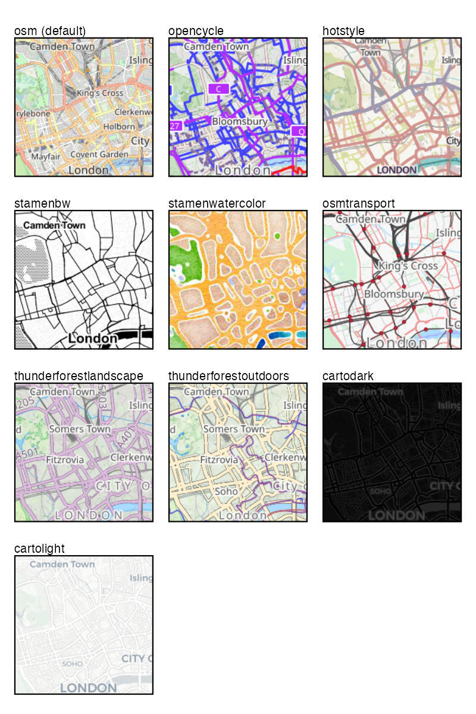
```

You may want to experiment with different base map styles by using the `type`
argument to `annotation_map_tile()` in the map above, e.g. using 
`annotation_map_tile(type = "cartolight", zoomin = 0, progress = FALSE)`.

One final note about the `annotation_map_tile()` function: you might have 
noticed that when we have used it above we have always set the argument 
`progress = FALSE`. This stops the function from printing a progress bar while
it is downloading the map tiles. The progress bar can sometimes be useful, but
when you include the output from an R function in a report (as you will learn to
do in a future tutorial), the output from the progress bar is likely to 
interfere with the formatting of the report. To prevent that, we use the
`progress = FALSE` argument.


## Adding more layers


Adding a base map underneath our density layer makes it much easier to 
understand where the highest densities of bike theft in Vancouver are. But our
map could make it easier still to see where clusters of thefts occur. We could,
for example, add the names of different neighbourhoods in the city, and show
the city limits so that we can tell which areas have no crime because crimes in
those areas are not included in our data.

In an earlier section I suggested we can think of ggplot charts, including maps,
as being like stacks of pancakes -- each function we use to amend the appearance
of our chart is added to the top of the stack. So to add another layer to our 
map, we just add another `geom_` function to our plot.

The City of Vancouver provides boundary data for city neighbourhoods on its 
website in [GeoJSON format](https://en.wikipedia.org/wiki/GeoJSON). This is a 
spatial data format, so it can be read by `st_read()`. We can then add the layer
to our map using `geom_sf()` in the same way as for the point layer in our first
map.

```{r layers-exercise1, exercise=TRUE}
# This is a version of the data saved from the City of Vancouver website, so 
# that this tutorial continues to work if the original data is ever removed
nbhds <- st_read("https://mpjashby.github.io/crimemappingdata/vancouver_neighbourhoods.geojson")
```


<a href="https://stringr.tidyverse.org/" title="stringr website"></a>

At the same time, we can also add labels to the plot at the centre of each 
neighbourhood using the `geom_sf_label()` function. We use the `aes()` function 
to specify which column in the `nbhds` dataset we want to use for the label 
text. Normally, we would use the code `aes(label = name)` to do this, but in 
this case we want to wrap the labels so that they don't overlap adjacent 
neighbourhoods, To do this we can use the `str_wrap()` from the 
[`stringr` package](https://stringr.tidyverse.org) (part of the tidyverse), so 
that our code instead becomes:

```r
aes(label = str_wrap(name, width = 10))
```

The `geom_sf_label()` function in the map below uses quite a lot of arguments to 
control the appearance of the labels:

  * `alpha = 0.5` to make the label background semi-transparent so that we can
    see the density layer underneath it,
  * `colour = "seagreen3"` to slightly reduce the prominence of the label text 
    to avoid distracting attention from the density layer,
  * `lineheight = 1` to reduce the gap between lines in each label,
  * `size = 2.5` to slightly reduce the size of the label text,
  * `label.size = NA` to remove the default border around the label background.

Putting all this together, we get our final map:

```{r layers-exercise2, exercise=TRUE, exercise.lines=52, message=FALSE, warning=FALSE, out.width="100%"}
# Load packages
library(ggspatial)
library(sf)
library(sfhotspot)
library(tidyverse)

# Load data
bike_thefts <- read_csv("https://mpjashby.github.io/crimemappingdata/vancouver_thefts.csv.gz") |> 
  janitor::clean_names() |> 
  st_as_sf(coords = c("x", "y"), crs = "EPSG:32610") |> 
  filter(type == "Theft of Bicycle")
nbhds <- st_read("https://mpjashby.github.io/crimemappingdata/vancouver_neighbourhoods.geojson")

# Create KDE layer
bike_theft_density_clip <- bike_thefts |> 
  # Calculate density
  hotspot_kde(bandwidth_adjust = 0.5, quiet = TRUE) |> 
  # Transform the density data to use the same CRS as the neighbourhoods layer
  st_transform("EPSG:4326") |> 
  # Clip the density layer to the area for which we have data
  st_intersection(nbhds)

# Plot map
ggplot() +
  # Add base map
  annotation_map_tile(type = "cartolight", zoomin = 0, progress = FALSE) +
  # Add density layer
  geom_sf(
    aes(fill = kde), 
    data = bike_theft_density_clip, 
    alpha = 0.75, 
    colour = NA
  ) +
  # Add neighbourhood boundaries (note `fill = NA` stops the neighbourhood
  # shapes being filled with a colour, which would obscure the density layer
  # underneath)
  geom_sf(data = nbhds, colour = "seagreen3", fill = NA) +
  # Add neighbourhood names
  geom_sf_label(
    aes(label = str_wrap(name, 10)), 
    data = nbhds, 
    alpha = 0.5,
    colour = "seagreen", 
    lineheight = 1, 
    size = 2.5,
    label.size = NA
  ) +
  # Set the colour scale
  scale_fill_distiller(direction = 1) +
  # Remove the axes, legend and other elements from the map that we don't need
  theme_void()
```

Now we can see that bike theft in Vancouver is heavily concentrated in a handful
of neighbourhoods, particularly the Downtown and West End neighbourhoods. This
map is much more useful than the first map that we produced in this tutorial
showing only the point location of each crime, since in this latest map we can
see not only the greatest concentrations of bike thefts but how they relate to
the different areas of the city. 


## In summary


::: {.box .welldone}

In this tutorial we have learned to produce a density map of crime. This type
of map can be very useful in identifying where practitioners should focus 
efforts to respond to crime. For example, a map like this might help local 
police to decide where to send officers to carry out extra patrols, while a
crime-prevention charity might decide to run events in particular areas to
educate people on how best to protect their bikes.

:::


In the next tutorial, we will learn how to improve this map further.


::: {.box .tips}

#### Tips for producing effective density maps

* Density layers on maps (e.g. a layer added using `geom_sf()` to display the
  result produced by `hotspot_kde()`) should be made semi-transparent so that
  readers can see the base map underneath. If a density layer is not 
  semi-transparent then it is likely to be very difficult for readers to see
  exactly where areas of high density are in the real world. Try setting
  the argument `alpha = 0.7` in the call to the `geom_sf()` function, then 
  change that value until you are happy with the visibility of both the density
  layer and the base map underneath.
* Density layers should almost always only show a single type of crime -- avoid
  calculating a single KDE layer based on data that includes more than one type
  of crime. There are two problems with combining data for multiple crime types 
  to produce a single density layer. First, different crimes often concentrate
  in different places, so a combined map might end up showing concentrations
  inaccurately. Second, since the KDE process is based on the number of points,
  a density layer produced by combining data for multiple crimes will inevitably
  be more influenced by whichever crime type is more numerous. Since more minor
  crimes tend to be more common, this could mean that your density map points
  people towards areas with lots of minor crimes and away from places where 
  more-serious crimes happen.
* Avoid mapping 'intangible' crimes. These are crimes that are only ever 
  recorded by police when officers happen to identify a crime while on patrol,
  rather than the crime usually being reported by the victim or a third-party.
  You should avoid mapping these types of crime because they generally reflect
  geographic concentrations of police patrol more than geographic concentrations 
  of the crimes themselves. The most common intangible offences are drugs 
  possession and weapons possession, which are detected incidentally by officers
  on patrol much more than they are reported to the police by the public.

:::


::: {.box .reading}

You can find out more about some of the things we have covered in this tutorial
using these resources:

  * Understand more about the history of trying to develop accurate map 
    projections in this short video: [Why all world maps are wrong](https://youtu.be/kIID5FDi2JQ).
  * Find out more about making all sorts of charts (not just maps) with the 
    `ggplot2` package in the [Data Visualisation chapter of *R for Data Science*](https://r4ds.hadley.nz/data-visualize.html)
    by Hadley Wickham and Garrett Grolemund.
  * Learn more about making maps using simple features in [Chapter 1 of *Spatial Data Science*](https://r-spatial.org/book/01-hello.html)
    by Edzer Pebesma and Roger Bivand.

:::

