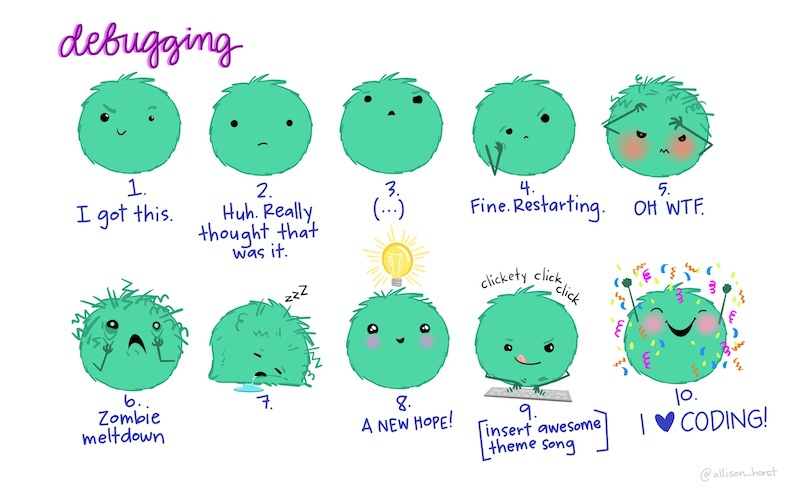
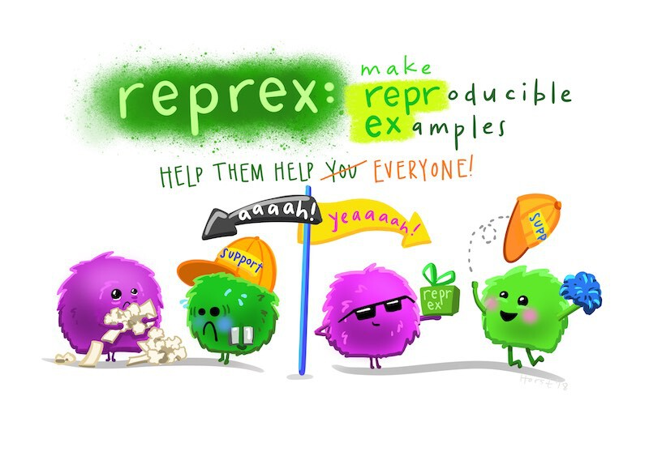

```{r setup, include=FALSE}
library(learnr)
knitr::opts_chunk$set(echo = FALSE)

# Load packages
library(tidyverse)

# Copy files
if (!dir.exists("css")) dir.create("css")
walk(
  dir("../css/"), 
  ~ file.copy(str_glue("../css/{.}"), str_glue("css/{.}"), overwrite = TRUE)
)

# Load data
frauds <- read_csv("https://mpjashby.github.io/crimemappingdata/kansas_city_frauds.csv.gz")
```


## Introduction

In this tutorial we will learn how to deal with bugs in the R code that we 
write. It's inevitable that you will make mistakes in the R code that you write. 
Everyone types the wrong command every now and again, just as everyone sometimes 
clicks the wrong button in other pieces of software. Learning how to identify 
and fix bugs is part of the process of learning to code.

Some errors are easy to identify and easy to fix. Imagine you are working on 
this dataset of frauds in Kansas City:

```{r}
frauds |> 
  knitr::kable()
```

If you try to run this code:

```{r intro-exercise1, exercise=TRUE}
select(frauds, offense_category)
```


::: {.tutorial}

You will get an error message saying something like: 

```
Error: Can't subset columns that don't exist. x Column `offense_category` doesn't exist
```

:::


::: {.book}

It causes an error.

:::


In this case it is fairly easy to identify that one of the columns you have 
tried to select does not exist. Maybe you mis-remembered the name of the column.
To find out what the correct column name is, you can either print the first few 
rows of the object (by typing the code `head(frauds)` into the R console) or use 
the `names()` function to print a list of column names present in the data:

```{r intro-exercise2, exercise=TRUE}
names(frauds)
```


::: {.tutorial}

Change the following code to correct the mistaken column name:

```{r intro-exercise3, exercise=TRUE}
select(frauds, offense_category)
```

```{r intro-exercise3-solution}
select(frauds, offense_type)
```

:::


Other errors will be harder to identify and fix. In this tutorial we will go
through the process of debugging -- identifying, understanding and fixing errors 
in your code. Sometimes fixing issues with your code can feel like a bit of a
roller coaster, but (like most things) it becomes much easier with practice, and
if you approach errors in a systematic way.

<p class="full-width-image"></p>


## Errors, warnings and messages

When something is not quite right, or just when there is an issue in your code
that you should be aware of, R has three ways of communicating with you:
messages, warnings and errors. 


#### Messages

*Messages* are usually for information only and typically don't require
you to take any action. For example, the function `get_crime_data()` from the
`crimedata` package issues a message to tell you what data it is downloading. It
does this because downloading data sometimes takes a few seconds and without a 
message you might wonder if the code was working.

By default, messages are displayed in RStudio in 
<span style="color: rgb(197, 6, 11); background-color: #FFFFFF; font-family: monospace; font-weight: normal;">dark red text</span>,
although this might vary if you have changed any settings in the Appearance
tab of the RStudio Options dialogue. You can generate a message for yourself
using the `message()` function. This is useful if you are writing code and you
want to remind yourself of something, or record a particular value. For example,
if your code is likely to take a long time to run, you might want to record the
time your code started running by generating a message on the first line of your
code:

```{r intro-exercise4, exercise=TRUE}
message(stringr::str_glue("Code started: {Sys.time()}"))
```

When R prints a message about your code, any code underneath the code that
generated the message will still run:

```{r intro-exercise5, exercise=TRUE}
2 * 2

message("This is a message. It might be important so make sure you understand it.")

2 / 2
```


#### Warnings

*Warnings* are generated when there is a potential problem with your code, but
the problem was not serious enough to stop your code running entirely. For 
example, `ggplot2` functions like `geom_point()` will send a warning if some of
the rows in your data contain missing values (e.g. if some crimes have missing
co-ordinates).

Warnings are important and you should take time to read and understand them, but 
it is possible that having done so it will be safe to not take any action. 
*Whether* it is safe to take no action will often depend on exactly what you are 
trying to do, which is why it is important that you understand each warning that 
you see. For example, if you already know that some rows in your data contain
missing values and are happy to plot the remaining values, it will be safe to
ignore the warning produced by `geom_point()`. But if your dataset should not
have any missing values in it, you will need to investigate why `geom_point()`
is warning you about missing values and whether those values have been 
accidentally introduced by some part of your code.


::: {.box .notewell}

**It is not safe to ignore warnings** unless you are sure why they occurred and
certain that you don't need to take any action.

One particularly dangerous scenario is where your code produces warnings but 
still produces what looks like a reasonable result. In these circumstances it
can be tempting to ignore the warnings and assume that everything is fine, since
the code still produced roughly what you were expecting. However, it's possible
that the plausible answer is nevertheless wrong because of whatever problem is
generating the warning in R. Do not assume that warnings are safe to ignore just
because they don't stop your code running.

:::


Warnings are displayed in the same font as messages, but with the text 
`Warning:` at the start. You can generate your own warning messages using the 
`warning()` function:

```{r intro-exercise6, exercise=TRUE}
warning("Something might be wrong. Check to make sure.")
```

As with messages, warnings will not stop your code running. This means that if
the warning signalled a genuine problem with your code, the results of the lines
underneath the warning might not be reliable. That is why it is important to
understand warnings when you see them.


#### Errors

*Errors* are generated when there is something wrong with your code or the 
results it produces that means the code cannot continue running any further. An
error might occur, for example, because the function `read_csv()` could not
open the requested file (maybe because the file does not exist). In this case, 
it would make no sense for the rest of the code to run because it probably 
depends on the data that `read_csv()` was supposed to load but could not.

It would make sense to be able to generate your own errors using the `error()`
function, but this is one of those times when the function to do something in R
has a different name from that you might be expecting. In fact, you can generate
an error using the `stop()` function:

```{r intro-exercise7, exercise=TRUE}
stop("Something is defintely wrong. Don't go any further until you've fixed it.")
```

There are two types of errors in R: _syntax_ errors and _logical_ errors. 
Syntax errors happen when R cannot read your code because of a mistake in how it
has been typed out. For example, if you forget to put a comma between the 
arguments of a function, you will get this error:

```{r intro-exercise8, exercise=TRUE}
message("A" "B")
```

When you run R code, R reads all the code and checks if it can be interpreted as
valid R code. If not, R will produce a syntax error. Because all of your code is
checked for syntax errors before any code is actually run, a syntax error
anywhere in your code will stop all of your code running. Syntax errors are 
typically fairly easy to fix, because they are usually caused by typos.

The second type of error that can happen is a logical error. This happens when R 
is able to interpret what you have written, but something is wrong with what you 
have asked it to do. These are called logical errors because there is usually 
some problem with the logic of what you are asking R to do. Like syntax errors, 
logical errors can be caused by typos, but logical errors can also have many 
other causes.

There is a saying in programming that a computer will do exactly what you tell 
it to do, which may not be the same thing as what you _wanted_ it do. Logical 
errors happen when you have told R to do something that it cannot do. For 
example, you might be asking R to multiply together a numeric value and a 
character value (e.g. `3 * "A"`), which is illogical.

Since every step in your code depends on the steps that went before it, it is
only possible to identify a logical error during the process of running the
code. This means that a lot of your code might run successfully before an error
occurs.

Logical errors are typically harder to fix than syntax errors are, because 
fixing a logical error involves understanding (a) what you have asked R to do
and (b) the current state of everything in your code at the moment when the
error occurs. Fortunately, there are lots of ways to identify and fix logical
errors.

Now we know what errors, warning and messages are, we need to find out how to
deal with them when they happen.


::: {.tutorial}

### Check your understanding

```{r intro-quiz}
quiz(
  caption = "",
  
  question(
    "Which of the following terms is used in R to describe the way of communicating something for information only",
    answer("A message", correct = TRUE),
    answer(
      "A warning",
      message = "Not quite right: warnings in R communicate information that you need to investigate so you can decide what action to take."
    ),
    answer(
      "An error",
      message = "Not quite right: errors in R communicate problems that prevent your code from running."
    ),
    answer("A condition"),
    correct = random_praise(),
    allow_retry = TRUE,
    random_answer_order = TRUE
  )
  
)
```

:::


## Finding problems

If an error or warning has a simple cause, such as the example of the incorrect 
column name in the previous section, you can just fix the problem and re-run the
code. For problems that are more difficult to handle, you will need to follow a
step-by-step process to find and fix them. Think of this as like being a 
mechanic fixing a car -- first you work out what the problem is, then you fix 
it.

If you code only has one line, it will probably be obvious where any problem
lies. But most of your code does several things to achieve a particular goal,
such as making a map. The first task in dealing with a problem is therefore to
work out exactly which function or other piece of code has caused it. For 
example, take this data-wrangling code to reduce the size of a dataset and sort
it in date order:

```{r finding-exercise1, exercise=TRUE}
library(tidyverse)

frauds |> 
  select(offense_type, date, longitude, latitude) |> 
  filter(offence_type == "impersonation") |> 
  arrange(date)
```

This code produces a fairly complicated error message. As is often the case, the
most useful part of the error message is the last part: 

```
Input `..1` is `offence_type == "impersonation"`
```

This suggests the error is on line 3 of the code, since that is the only line
containing the code `offence_type == "impersonation"`. To check this, we can
*comment out* that line by placing a `#` symbol at the start of the line. Do
this and re-run the code above -- it should now run without a problem.

Now we know the problem is on the line `filter(offence_type == "impersonation")`,
we can look at that line in more detail. Can you spot the problem with that 
line?

The error message in this case has been caused by a typo -- the code
`offence_type == "impersonation"` uses the British spelling of the word 
'offence' but in the dataset the variable is spelled using the American English
'offense' (you can see the US spelling in the line of code above the line that
is causing the error). 


::: {.tutorial}

If you correct the spelling in the code above, it should 
now run without a problem. 

::::


Sometimes it will not be as clear as this where to start in looking for the
problem. In particular, some errors can be _caused_ by a problem on one line of
code, but only actually have a negative _effect_ on a subsequent line of code. 
For example, if you run this code:

```{r finding-exercise2, exercise=TRUE}
frauds |> 
  select(offense_code, longitude, latitude) |> 
  filter(offense_code == "26E") |> 
  arrange(date)
```

The error message produced suggests the problem is with the `arrange()` 
function, but everything is correct with that function since `arrange()` is a
correct function name and we already know that `date` is a column in the tibble 
named `frauds`. So the problem must lie elsewhere. In cases like this, it can be 
helpful to comment out all the lines of code except the first one and then 
uncomment one line at a time until you find the one that causes the problem. 


::: {.tutorial}

With the following code, uncomment one line at a time starting on line 2, re-run 
the code and then uncomment another line. After you run the code each time, look 
at the output produced until an error occurs or you find that the output is not 
what you expected.

```{r finding-exercise3, exercise=TRUE, exercise.lines=5}
frauds |> 
#  select(offense_code, longitude, latitude) |> 
#  filter(offense_code == "26E") |> 
#  arrange(date)
```

:::


<div class="box extra-detail">

<h5 id="finding-box1-title" class="box-title">Did you get an error beginning
`<text>:5:0: unexpected end of input 3`?</h5>

<div id="finding-box1" class="box-content">

When commenting out lines of code in a code pipeline, it is important to 
remember to remove the pipe operator ` |> ` from the end of the last line
of your code. Otherwise you will get an error that begins 
`<text>:5:0: unexpected end of input 3` because R is expecting the final `|>` to
have some code after it. Remember that R will ignore the lines that are 
commented out, so make sure every line in your pipeline ends with a ` |> ` 
*except* the last line that is not commented out.

</div>

</div>

<script>
$("#finding-box1-title").click(function () { $("#section-finding-box1").toggle("slow") })
</script>


If you uncommented all but the last line and run the code, you would see that 
the line `select(offense_code, longitude, latitude)` removes the column `date`
from the dataset, so it's not possible to use `date` as an argument to the 
`arrange()` function later on.

Uncommenting one line at a time until you find an error or output that is not 
what you expected is a useful way to isolate problems, but it will not always
work. In particular, it will not work if the problem is caused by some code that
should have been included but is missing from your code entirely. For example, 
if you try to run the function `st_transform()` on a tibble without first 
changing it into an SF object:

```{r finding-exercise4, exercise=TRUE}
library(sf)

frauds |> 
  select(offense_code, longitude, latitude) |> 
  filter(offense_code == "26A") |> 
  st_transform("EPSG:3603")
```

In these cases it is particularly useful to check every argument that you have
used in a function to track down the error. We will look at this later in this
tutorial.


### Errors caused by data problems

Many logical errors will be caused by problems with the code you have written,
such as when you try to use a function (e.g. `st_intersection()`) that only
works on an SF object but specify that it should use an object of another type.
But sometimes logical errors are caused not by your code, but by a mis-match
between the structure that your data actually has and the structure you think
your data has. We have already seen an example of this in this tutorial, in the
code that tried to refer to a column called `offense_category` in a dataset that
did not have a column with that name.

Errors caused by a mismatch between the data you think you have and the data
you actually have can be particularly frustrating, because there is no way to
identify them from just looking at your code. For this reason, it is often 
important when trying to identify problems in your code to _look_ at the data 
that is used as the input for your code, _and_ the data that is produced by each 
step in your code. We used this technique to find the error in our code above
that was caused by `filter()` removing all the rows from a dataset because we 
had told `filter()` to only keep rows containing a value that was not present in
the dataset. There were no obvious problems with the code we had written, so the
only way to find the cause of this problem was to view the dataset returned by
the `filter()` function.

Finding data problems is one of the reasons why we have used the `head()` 
function so often in these tutorials to look at the data at each step in writing 
a block of code. `head()` only shows us the first few rows of a dataset, which
will not always be enough to identify a problem if the problem is caused by
values that are only present in a few rows in the data. For small datasets, we
can use the `View()` function (note the capital letter) to open the entire
dataset in a new tab in RStudio. 

For bigger datasets, this will not work. In that case, we can use the 
`sample_n()` or `sample_frac()` functions from the `dplyr` package to return a
random sample of rows from the data. This can be useful to let us look at a 
representative sample of a large dataset. `sample_n()` returns a specific 
number of rows, e.g. `sample_n(frauds, 10)` returns 10 rows at random from the
`frauds` dataset. `sample_frac()` returns a specific proportion of the
dataset, e.g. `sample_frac(frauds, 0.1)` returns a sample of 10% of rows from
the data.


## Understanding problems

So far, we have tried two ways to deal with errors:

  1. reading a simple error message that makes the problem obvious,
  2. commenting out all the code and then uncommenting one line a time until 
     the error appears.

Sometimes you will encounter an error that is still not simple to solve. In this
case, it is still important to identify the line of code causing the problem,
either by working it out from the text of the error message or commenting out
lines of code in turn.

Once you know what line is causing the problem, you should focus on 
understanding exactly what that line of code does. In particular:

  1. What data do any functions on that line expect to work on?
  2. What are the values of any arguments to the functions on that line?
  3. What value do the functions on that line produce?
  
You can get a lot of help in understanding each function by referring to its
manual page. You can access the manual page for a function by:

  * typing a question mark followed by the function name without parentheses 
    (e.g. `?mutate`) into the R console,
  * typing the function name without parentheses into the search box in the
    Help panel in RStudio, or
  * clicking on the function name anywhere in your R code to place the cursor
    on the function name, then pressing `F1` on your keyboard.

Any of these options opens up a manual page for that function in the Help panel
in RStudio. For example, this is the manual page for the `str_wrap()` function 
from the `stringr` package. You can load it by typing `?str_wrap` in the R 
console.


<div class="box extra-detail">

<h5 id="understanding-box1-title" class="box-title">Did you get an error 
beginning `No documentation for ‘str_wrap’`?</h5>

<div id="understanding-box1" class="box-content">

When you use the `?` operator to look up the manual page for a function, R 
searches through all the functions in the packages you have loaded. If there is
no function of the name you have given in the loaded packages, R will produce an
error. 

To access the manual page of a function in a package that is not loaded, you can
specify the package in which R should look for the function using the package
name and the `::` operator (this is the same way that we have already learned to
call functions from packages that haven't been loaded). For example, you can use
the code `?stringr::str_wrap` to access the manual page for the `str_wrap()` 
function from the `stringr` package even if the `stringr` package is not loaded.

</div>

</div>

<script>
$("#understanding-box1-title").click(function () { $("#section-understanding-box1").toggle("slow") })
</script>


<p class="full-width-image"></p>


All manual pages have the same format.

  * **Description** gives a short description of what the function does. If 
    multiple related functions are described in a single manual page, this 
    section will explain the differences between them. For example, the manual
    page for the `mutate()` function from the `dplyr` package explains the
    difference between the `mutate()` function and the closely related 
    `transmute()` function.
  * **Usage** shows a single example of how the function works. If there are any
    optional arguments to the function, this section will show what the default
    values of those optional arguments are. For example, the manual page for
    the `str_wrap()` function from the `stringr` package show that the default
    value of the `width` argument is `width = 80`.
  * **Arguments** gives a list of arguments and the values they can take. It is
    particularly important to note the type of value expected. So the 
    `st_transform()` function from the `sf` package expects an SF object as its
    first argument -- if you provide another sort of object (such as a tibble),
    this will cause an error.
  * **Value** explains the type of value that the function will return, and 
    whether this value might be of a different type depending on the values of
    particular arguments. For example, the `mean()` function in base R returns
    the arithmetic mean of a vector of numbers. However, if any of the numbers 
    is `NA` then mean will return `NA` *unless* the argument `na.rm = TRUE` is
    used. In that case, `mean()` will ignore the missing values and return the
    mean of the values that are present.
  * **Examples** gives more examples of how the function can be used.

Checking the manual page for a function can often help you understand why a
particular piece of code is not working. If you have set any optional arguments
for a function that is producing an error, it may help to reset those arguments
to their default values (as shown in the Usage section of the manual page) one
by one to understand what effect this has on your code.

By reading the error message, isolating the error by commenting out and then
reading the manual page, you will be able to fix almost all the errors you will
come across in writing R code. Occasionally, however, you will find an error 
that you just can't understand. In that case, you will need to get some help 
from others.


## How to fix some common errors

There are some mistakes that it is common for people to make when writing code.
As you get more experience in writing R code and dealing with error messages,
you are likely to start to recognise some simple errors (especially those caused
by typos) and know how to fix them quickly. One useful way to quickly find help
on common errors is to check if the error (and the corresponding solution)
appears on this [list of common R errors and how to fix them](http://books.lesscrime.info/learncrimemapping/appendices/common_errors.html).


::: {.tutorial}

### Check your understanding

```{r common-errors-quiz}
quiz(
  caption = "",
  
  question(
    'What might cause the error message `could not find function "blah"`?',
    answer(
      "You have not loaded the package that contains the `blah()` function", 
      correct = TRUE
    ),
    answer(
      "You have mis-typed the name of the `blah()` function",
      correct = TRUE
    ),
    answer(
      "You have mis-typed the name of the `blah` object",
      message = "Not quite. This error message relates to a function called `blah`, not an object."
    ),
    answer(
      "You have tried to use a generic function with a type of object the function does not know how to use"
    ),
    correct = random_praise(),
    allow_retry = TRUE,
    random_answer_order = TRUE
  )
  
)
```

:::


## Getting external help

If you cannot fix an error using any of the techniques we have already covered,
it is probably time to get some help from others. Fortunately, one of the big
benefits of using R is that there is a friendly, welcoming community of R coders
online who are willing to help fix problems. Almost everyone in this community
will remember when they were knew to using R and so will be gentle with people
who are asking their first question.


### Reproducible examples


One of the things that makes it much more likely that you will find help with
your problem in the R community is if you phrase your plea for help in a way
that makes it easier to help you. We can do this by providing a *reproducible
example* or *reprex* of our problem (also sometimes called a *minimum working
example*).

Producing a reprex makes it much easier for someone to understand your issue.
This not only makes it easier for someone to help you, but also shows that you
know it will make it easier for them and that you value their time.

> [Imagine that you’ve made a cake](https://www.jessemaegan.com/post/so-you-ve-been-asked-to-make-a-reprex/), 
> and for some reason it’s turned out absolutely awful – we’re talking 
> completely inedible. Asking a question without a reprex is like asking, “Why 
> didn’t my cake turn out right?” – there are hundreds of possible answers to 
> that question, and it’s going to take a long time to narrow in on the exact 
> cause for your inedible cake creation. 
> 
> Asking a question with a reprex is like asking, “My cake didn’t turn out, and 
> here’s the recipe I used and the steps that I followed. Where did I go wrong?” 
> Using this method is going to significantly increase the likelihood of you 
> getting a helpful response, faster!

To make a reprex, we have to do two things:

  1. Remove everything from our code that does not contribute to causing the
     error. We do this by removing each line from our code and only keeping
     those lines that are necessary to produce the error -- this is why a
     reproducible example is sometimes called a *minimum* working example.
  2. Make sure that someone trying to help us can reproduce the issue on their
     own computer even if they don't have access to the particular dataset we
     are using. We do this by replacing our own dataset with a publicly 
     available one, preferably one of the datasets that are built into R for
     exactly this purpose.

Watch this video to see the process of making a reprex in RStudio:


### Reproducible code

Our first step is to remove every line from our code that isn't necessary to
produce the error. For example, run the following code to see what error it
produces.

```{r reprex-exercise1-setup}
#| echo: false

# This code wrangles the data and stores it in the temporary directory created
# by learnr to run the following exercise, which allows us to mimic loading the
# data from a local file (which is important in the narrative, since it makes
# the example non-reproducible)
# Source: https://github.com/rstudio/learnr/issues/99#issuecomment-500462786
Seatbelts |> 
  as_tibble() |> 
  mutate(
    year = 1969 + floor(row_number() / 12.0001),
    month = rep(1:12, 16),
    month_beginning = as.Date(str_glue("{year}-{month}-01"))
  ) |> 
  select(month_beginning, everything(), -year, -month) |> 
  write_csv("road_deaths_data.csv")
```

```{r reprex-exercise1, exercise=TRUE, exercise.lines=39}
# Load packages
library(dplyr)
library(ggplot2)
library(readr)

# Load a dataset from your computer and wrangle it
road_deaths <- read_csv("road_deaths_data.csv") |> 
  janitor::clean_names() |> 
  rename(ksi_drivers = drivers, ksi_pass_front = front, ksi_pass_rear = rear) |> 
  select(-petrol_price, -van_killed) |> 
  mutate(
    law = as.logical(law),
    ksi_driver_rate = ksi_drivers / (kms / 1000)
  )

# Make a time-series chart of two continuous variables, coloured by a 
# categorical variable, then add a trend line
road_deaths + 
  ggplot(aes(x = month_beginning, y = ksi_driver_rate)) + 
  geom_point(aes(colour = law)) + 
  geom_smooth() +
  scale_x_date(date_breaks = "2 years", date_labels = "%Y") +
  scale_y_continuous(labels = scales::comma_format(), limits = c(0, NA)) +
  scale_colour_brewer(type = "qual") +
  labs(
    x = NULL, 
    y = "drivers killed or seriously injured per 1,000km travelled", 
    colour = "after seat belts made mandatory"
  ) +
  theme_minimal() +
  theme(
    axis.line.x = element_line(colour = "grey90"),
    axis.ticks = element_line(colour = "grey90"),
    panel.grid.major.x = element_blank(),
    panel.grid.minor.x = element_blank(),
    legend.position = "bottom"
  )
```

As you can see, this code produces an error message that is not easy to 
decipher, so we might need help to deal with it. As the first stage to making a
reprex, remove all the lines of the code above that it is possible to remove
while still producing the same error. If the error disappears and the chart is
produced successfully, you have probably found the line that contains the error.
If you remove a line and the code starts to produce a different error, you have
removed a line that is needed to produce the original error and should put that
line back into the code.

It is actually possible to remove a lot of the original code and still produce 
the same error. You can remove:

  1. All the lines of code that fine-tune the appearance of the chart 
     (lines 22--37 above). 
  2. The line creating the trend line (line 21).
  3. The code that wrangles our data in ways that don't affect the error 
     (lines 8--14).
  4. The line that loads the `dplyr` package (line 2), since we are no-longer 
     using the data wrangling functions from that package.

We cannot remove the code that loads necessary packages (lines 3 and 4), loads 
the data (line 7) or produces the basic unformatted chart (lines 18--20), 
because if we remove any of those then the error message either changes or 
disappears.

This leaves us with the following code, which produces the same error message
but is much easier for someone to check for errors because it is much shorter.
Because we have removed the data-wrangling code, we have had to change the name
of the argument on line 19 of the code above from `y = ksi_driver_rate` to
`y = drivers`, since the column `ksi_driver_rate` is no longer in the data.


::: {.box .notewell}

If we forgot to change `y = ksi_driver_rate` to `y = drivers` then the code 
would still produce an error, _but it would be a different error_. The purpose 
of producing a reprex is to find the minimum code that still produces _the same
error_ we are interested in. If you remove a line of code and the error message 
you see changes, put that line of code back.

:::


If this shortened code were to run successfully then the resulting chart would 
look quite different to the original chart we wanted, but that does not matter 
because what we are interested in is showing code that produces a specific 
error. If you run this code, you will see it produces the same error as the code 
above.

```{r reprex-exercise2, exercise=TRUE, exercise.lines=13, exercise.setup="reprex-exercise1-setup"}
# Load packages
library(ggplot2)
library(readr)

# Load a dataset from your computer and wrangle it
road_deaths <- read_csv("road_deaths_data.csv")

# Make a time-series chart of two continuous variables, coloured by a 
# categorical variable, then add a trend line
road_deaths +
  ggplot(aes(x = month_beginning, y = drivers)) + 
  geom_point(aes(colour = law))
```


### Reproducible data

Our shortened code would make a great reproducible example except for one thing:
the data file `road_deaths_data.csv` only exists on our computer. This means the
example is not actually *reproducible*, since anyone trying to run this code on
their computer to identify the error would find that they instead got a 
different error saying that the file `road_deaths_data.csv` was not found.

You could deal with this by uploading your dataset to a website and then having
the `read_csv()` function read it from that URL. But you might not want to share
your data (perhaps it is sensitive in some way), or your dataset might be too
large to post online. For this reason, many R packages come with toy datasets
that can be used in learning or in testing for errors. You can see a list of all
the toy datasets available in the packages you have loaded by typing `data()` in
the R console. This will produce a file that gives the name and description of
each available dataset.

To use one of these toy datasets, you just use the the name of the dataset as
you would use any other R object (like the `road_deaths` object we created 
above). One commonly used toy dataset is the `mpg` dataset from the `ggplot2`
package, which contains fuel economy data for 38 models of car. 

The data in this dataset are on a completely different topic to the data we were 
trying to use, but this does not matter as long as the data contains variables 
of the same type (numeric, character, etc.) as the original data. We can see 
what variables are in the `mpg` dataset using the `head()` function as usual.

```{r reprex-example3, exercise=TRUE, exercise.setup="reprex-exercise1-setup"}
library(ggplot2)

head(mpg)
```

From this, we can see that there is a `year` variable that we can use as a 
substitute for the `month_beginning` variable in our original code, a variable 
called `hwy` that is numeric and so can be substituted for the `drivers` 
variable in our code, and a categorical variable called `trans` that
we can substitute for the `law` variable in our data. This means we can use this
data instead of our own data, knowing that anyone on any computer with the
`ggplot2` package installed can run the code and should get the same result.


::: {.tutorial}

Change the code below so that it uses the `mpg` dataset rather than loads data
from the `road_deaths_data.csv` file. You will need to change the variable names
in the stack of `ggplot()` functions.

```{r reprex-exercise4, exercise=TRUE, exercise.lines=13, exercise.setup="reprex-exercise1-setup"}
# Load packages
library(ggplot2)
library(readr)

# Load a dataset from your computer and wrangle it
road_deaths <- read_csv("road_deaths_data.csv")

# Make a time-series chart of two continuous variables, coloured by a 
# categorical variable
road_deaths +
  ggplot(aes(x = month_beginning, y = drivers)) + 
  geom_point(aes(colour = law))
```

:::


::: {.book}

We can change our existing reprex code to use the `mpg` dataset rather than load
data from the `road_deaths_data.csv` file by changing the variable names in 
the `ggplot()` stack.

:::


```{r reprex-exercise4-solution}
# Load packages
library(ggplot2)

# Make a time-series chart of two continuous variables, coloured by a 
# categorical variable
mpg +
  ggplot(aes(x = year, y = hwy)) + 
  geom_point(aes(colour = trans))
```

We have now managed to reduce our original 37 lines of code down to 8 lines, as
well as making the example reproducible by using a widely available toy dataset.
The shorter code still produces the same error while being much easier to read,
so we are much more likely to get help quickly than if we had just sent someone
our original code.

Most of the time, the act of producing a reprex will be enough for us to find 
and fix the error without any external help. Can you see the problem with our
code that is making this error happen? If not, we will reveal it at the end of
this tutorial.


### Checking your reprex is reproducible

Now that you have the minimum code needed to reproduce the error, it's almost
time to share it with people who can help you. But before you do that, it's 
worth checking that the code is truly reproducible. To do this we will use the
`reprex` package, which is part of the `tidyverse` suite of packages you already
have installed.

<p class="full-width-image"></p>

<a href="https://reprex.tidyverse.org/" title="reprex website"></a>

To use the `reprex` package, first put your code in a separate R document in the
Source panel in RStudio. Open a new R script in RStudio now and paste the code
from the last exercise into it. Once you've done that, select all the code in
that document. Now click the `Addins` button in RStudio and scroll down until 
you can choose `Reprex selection`.

After a few seconds, some code should appear in the RStudio Viewer panel showing
your code and the error message that it produces. This code has also been copied
to your computer clipboard so that you can paste it into an email or web form
when you are asking for help.

If the error message that you see along with the code in the Viewer panel is not
the error message you were expecting, your example is not yet reproducible. For 
example if you tried to run the `Reprex selection` command on the original code
that we started this section with, we would get an error message
`'road_deaths_data.csv' does not exist in current working directory`.

Once your reprex produces _the same error_ as the code you originally had the
issue with, you're ready to share it to get help.


## Sources of help

If you are being taught R by a formal instructor, or you have friends or 
colleagues who can help, they will probably be the first people that you go to
for help. 

If this doesn't work, or if you are the most proficient R user that you know, 
you might need another place to turn to. Fortunately, R has a large community of
volunteers who will help you. Before you ask people online for help, it's 
important to check that someone hasn't already asked the same question and had 
it answered. Duplicate questions increase the workload of the volunteers who 
answer questions and slow everything down, so if your question has frequently 
been answered already it's possible your question will just be ignored.

To find out if there is an answer to your question, the easiest thing to do is
to search the error message online. Google, or another search engine of your
choice, is definitely your friend. If you search online for the error message
that was produced by our reprex code, you will see that there are over 100 pages
discussing this error message and how to fix it.


#### Stack Overflow

Let's imagine, though, that there were no relevant hits when we searched for the
error message, or that none of the results was useful. In that case, we need to
pose a new question to the R community. The place to find the largest slice of 
that community is probably the website 
[Stack Overflow](https://stackoverflow.com/). This is a website for people who 
are writing code in any programming language imaginable to get help. It is part 
of the larger [Stack Exchange Network](https://stackexchange.com/) of 
question-and-answer websites covering everything from 
[travel](https://travel.stackexchange.com/) to 
[veganism](https://vegetarianism.stackexchange.com/).

To ask a new question on Stack Overflow, go to 
[stackoverflow.com/questions/ask](https://stackoverflow.com/questions/ask) and
create an account or log in. You will now be asked to complete a short form with
your question. Questions are more likely to get an answer faster if you:

  * Give the question a specific title. Over 20 million questions have been 
    asked on Stack Overflow since it launched, so a generic title like 'Help',
    'R error' or even 'ggplot error' will not help other people find your 
    question. 
    [Look at some recent questions about R on Stack Overflow](https://stackoverflow.com/questions/tagged/r) 
    to get some ideas on what title to give for your question.
  * In the body of your question, *briefly* (2--3 lines should do it) explain
    what you were trying to do, then paste the reprex output that the 
    `Reprex selection` addin copied to your clipboard into the question body
    box underneath your brief explanation. You will see that Stack Overflow
    recognises the format of your code and shows you a preview of it underneath
    the question box.
  * Finally, add the tag `r` to the Tags box so that people know your question 
    is about coding in R. This is crucial -- if you do not tag your question as
    being about R, it is very unlikely that volunteers who know about R will be
    able to find your question.

Submit your question and wait for an answer. As soon as someone answers your
question, or comments on it to ask for more detail, you will get an email alert.
Many questions are typically answered within a few hours. Hopefully this will
help you get to the final stage of the emotional roller coaster of debugging:

<p class="full-width-image"></p>


## Coding with AI

One topic that we haven't covered yet is using artificial intelligence (AI) to 
help us produce R code. The type of AI that can be used to help produce code is
called a _large language model_ (LLM), sometimes known as a _generative AI_
model. The best known of these among the public is probably 
[ChatGPT](https://chat.openai.com/), but there are lots of similar services 
available (and new ones being released all the time).


#### Coding with AI: an example

Generative AI services can help you to write code, especially code that does 
very common tasks like loading data. For example, say that I want to load the
Vancouver thefts dataset that we used in a previous tutorial and convert the
column names in the data to `snake_case`. As a reminder, the code we previously 
used to do that looked like this:

```r
library(tidyverse)

vancouver_thefts <- read_csv("https://mpjashby.github.io/crimemappingdata/vancouver_thefts.csv.gz") |> 
  janitor::clean_names()
```

I can ask ChatGPT (version 3.5) to write code for me that will do this task. If
I ask ChatGPT "Show me the R code needed to load the CSV dataset at https://mpjashby.github.io/crimemappingdata/vancouver_thefts.csv.gz and make the 
column names into snake case", it will produce some R code that looks roughly 
like this:

```r
# Install and load the required packages if not already installed
# install.packages("readr")
# install.packages("snakecase")
library(readr)
library(snakecase)

# URL of the CSV file
url <- "https://mpjashby.github.io/crimemappingdata/vancouver_thefts.csv.gz"

# Read the CSV file and convert column names to snake case
data <- read_csv(url, col_names = TRUE) %>%
  snakecase::to_snake_case()

# Display the first few rows of the dataset
head(data)
```

ChatGPT also produces a short explanation of what the code does:

> This code uses the `read_csv()` function from the `readr` package to read the CSV file from the specified URL. The `col_names = TRUE` argument ensures that column names are read from the first row of the CSV file. The `snakecase::to_snake_case()` part applies the transformation to snake case for all column names.

> Make sure to install the `readr` and `snakecase` packages before running this code if you haven't done so already. You can uncomment the `install.packages("readr")` and `install.packages("snakecase")` lines for installation.

Unfortunately, if you try to run the code above you will find it produces two errors:

  * `could not find function "%>%"`. The code generated by ChatGPT uses the `%>%` operator, which is an older version of the `|>` pipe operator we use in this course. But the `%>%` operator is part of the `magrittr` package, so to use it the code needs to load the `magrittr` package first.
  * `argument is not a character vector`. The code produced by ChatGPT passes the tibble loaded by `read_csv()` to the `to_snake_case()` function from the `snakecase` package. But `to_snake_case()` expects a vector of character values (e.g. `c("aCharacterValue", "ANOTHERCHR")`), not a tibble. This is in contrast to `janitor::clean_names()`, which performs the same function and _does_ accept a tibble as input.
  
There are also a few of more-minor issues that won't produce errors, but might make your code harder to work with:

  * The code creates an object called `url`. Storing the URL in a separate object is unnecessary (since we only need the URL once) and creates a risk that we could end up loading the wrong dataset if we later accidentally over-wrote the value of the `url` object with a different URL.
  * The code creates an object with the generic name `data`, which might make it harder to remember later on what data is stored in that object. This is especially likely to be an issue if we come back to the code after a break, or if we need to use multiple datasets as part of our analysis.
  * The code loads the `snakecase` package, but then also refers to the package using the `::` notation when using the function `to_snake_case()`. This is not a big deal, but makes the code slightly longer and therefore marginally harder to read.

<div class="box extra-detail">

<h5 id="ai-box1-title" class="box-title">Why did I get a different result when I put the same prompt into ChatGPT?</h5>

<div id="ai-box1" class="box-content">

If you put the text "Show me the R code needed to load the CSV dataset at https://mpjashby.github.io/crimemappingdata/vancouver_thefts.csv.gz and make the 
column names into snake case" into ChatGPT 3.5, it is possible that you will get
a slightly different response to the one shown above. This is because large
language models are _stochastic_ or _non-deterministic_ models, which means that
there is some element of chance involved in exactly what response the model will
produce for a particular input. In fact, if you provide exactly the same input
to ChatGPT multiple times, it is likely you will get a slightly different answer
each time.

</div>

</div>

<script>
$("#ai-box1-title").click(function () { $("#section-ai-box1").toggle("slow") })
</script>


#### Why did ChatGPT produce code that doesn't work?

Why do these problems happen? To understand that, we need to know just a little bit about how large language models such as ChatGPT work. LLMs work by looking for patterns in very large datasets (e.g. all the pages on the world wide web) and then using those patterns to predict what the most likely answer is to questions or requests that include particular words and phrases. To give a very simple example, an LLM might be able to identify that if the first few words in a sentence are 'Today was Sunday, which meant that tomorrow …' then it is likely (but – crucially – not certain!) that the next words would be 'is Monday'. 

Because they are trained on very large samples of data, LLMs can produce answers that are sophisticated enough that they almost look like magic. But behind the scenes, what models like ChatGPT are doing is predicting what the most likely combination of words a response will contain, based on the input that it is given. It is important to remember that models such as ChatGPT do not know the _correct_ answer to a question, since they do not actually understand the question in the way that humans do. This means that ChatGPT cannot give you any indication of how confident it is about the answer it has given: it will be equally confident in its answer whether it is right or wrong.


<p class="full-width-image"></p>


#### Should I use AI to help me code?

So given these issues, does that mean that we shouldn't use LLMs to help us write code? Not necessarily. Lots of programmers find LLMs useful for helping them write code. However, LLMs like ChatGPT are useful for _supporting_ humans to write effective code, not for replacing humans writing code. Even if you asked an LLM to write every part of your code for you, it is likely you would need to make some changes to the code it produced to make it work. 

That means that to use an LLM effectively to help you write code, you need to understand the code that the LLM produces. That's why this course teaches you to understand how to write code to produce crime maps in R, rather than just how to use an LLM to write the code for you.

Whether to use an LLM to help you write code is up to you. Some people find it saves them time and helps them get started on how to produce a particular bit of code, while others find that they spend just as much time fixing the code produced by an LLM as it would take them to write the code themselves. You might want to experiment with getting help from an LLM so you can see what works for you.


#### Using AI to help map crime

There are two further important points to make about using LLMs in the context of crime mapping. First, it is vital that you do not upload any sensitive data to an LLM that is hosted online, since it is likely that the company that runs the LLM will have reserved the right to use any data you submit to improve the model in future. You must make sure that sensitive data such as victim details are not posted online or shared unlawfully.

The second important point is that the analysis that we use crime mapping for is usually done to answer important questions such as where crime-prevention initiatives should be focused or where a serial offender might live. It is vital that the answers we produce to these questions are accurate. Part of making sure the results of our analysis are accurate is to make sure that we understand exactly how our code produces a particular result. If you use an LLM to support your coding, it is vital that you still understand what the code does.


## In summary


#### A workflow for handling errors in R

::: {.box .notewell}

**When you run some code in R and it produces an error, follow the steps learned 
in this tutorial to identify and fix the problem.**

  1. Read the error message and fix any obvious problems.
  2. Make sure your code follows the style guide introduced in the previous
     tutorials, which will make it easier to see where there might be problems,
     especially those caused by typos. In particular, make sure that each
     function is on a separate line so you can comment them out individually.
  3. Comment out all the lines of your code. Uncomment each line in turn 
     (starting with the first line), re-running the code each time until you see 
     the error you're trying to understand. Now you know which line is likely to 
     be causing the problem.
  4. If the error message is one of the [common errors](www/common_errors.pdf) 
     explained in this tutorial, follow the steps outlined in the previous
     section to fix it.
  5. If that does not fix the problem, read the manual page for the function
     that you think is causing the problem. Check that the values you have 
     passed to each argument are what the function needs in order to work.
  6. If that does not fix the problem, create a reproducible example by removing
     all the parts of your code not needed to create the error. Often, the act
     of creating a reproducible example will help you fix the problem, but if
     not then you can use it to get help from others.

You will be able to fix almost all the errors in your code by following the
early steps in this list. Only quite rarely will you need to post a reprex 
online to get help.

:::


#### What caused the error in our reproducible example?

The error in our reproducible example was very simple, but quite difficult to
spot. On line 7 of the code below, we try to add the `ggplot()` function to the
`mpg` object using the `+` operator when what we wanted to do was pass the `mpg`
object to the `ggplot()` function using the `|>` operator. R does not know how
to add a dataset to a function in this way so it produced an error message.

If you replaced `+` with `|>` on line 6 of the code below, the code would now
run normally. Since we have removed almost all of our original code to make a 
reproducible example, the resulting plot looks nothing like what we wanted. This
does not matter -- when we are producing a reprex we only care about reliably
producing *the same* error. Now that we have fixed the error, we could go back
and fix the original code to produce the chart we wanted.

```r
# load packages
library(ggplot2)

# make a time-series chart of two continuous variables, coloured by a 
# categorical variable
mpg + # <---- THE `+` OPERATOR HERE SHOULD BE A `|>` OPERATOR INSTEAD
  ggplot(aes(x = year, y = hwy)) + 
  geom_point(aes(colour = trans))
```

The mistake in this code is a very easy one to make, because what `+` does
inside a `ggplot()` stack is so similar to what `|>` does in passing the result
of one function to the next function in an data-wrangling pipeline. Remember 
that we only use `+` to combine functions inside a `ggplot()` stack, and use
`|>` to combine functions everywhere else.

::: {.box .welldone}

In  this tutorial we have learned how to handle messages, warnings and errors in
R. We have learned to take time to understand error messages, to isolate errors
so that we can better understand them, to use manual pages for functions to
check that every argument is correct, and how to write reproducible examples so
that we can get help online. This will help you become a more independent coder.

:::

::: {.box .reading}

For more information on writing reproducible examples, see:

  * Watch the webinar [Creating reproducible examples with reprex](https://reprex.tidyverse.org/articles/articles/learn-reprex.html) by
    Jenny Bryan.
  * Read the [Reprex do’s and don’ts](https://reprex.tidyverse.org/articles/reprex-dos-and-donts.html) 
    on the `reprex` package website.
  * Learn more about how to use  [Six tips for better coding with ChatGPT](https://doi.org/10.1038/d41586-023-01833-0)

:::


<p class="credits"><a href="https://twitter.com/allison_horst">Artwork by @allison_horst</a></p>
