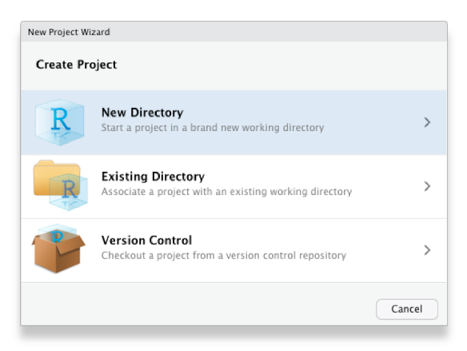
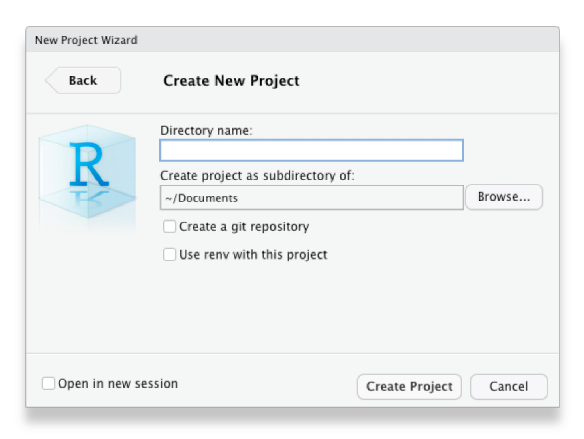

```{r setup, include=FALSE}
library(learnr)
library(tidyverse)
knitr::opts_chunk$set(echo = FALSE)

# Copy files
if (!dir.exists("css")) dir.create("css")
walk(
  dir("../css/"), 
  ~ file.copy(str_glue("../css/{.}"), str_glue("css/{.}"), overwrite = TRUE)
)
```


## Introduction

Imagine you've been working on some analysis intermittently for a few weeks.
Unless you're very lucky, you're likely to experience one or more of these
common problems:

  * As you work, you create various different files (for example containing the
    data you are using, code you have written and charts you have made) until it
    becomes difficult to keep track of what is in each file and how different
    files relate to each other.
  * It becomes difficult to remember exactly what data and which code produced
    which chart, so that if someone has a question about how you came to a
    particular conclusion it is difficult to be sure. Likewise, if you discover
    a mistake in your code then it is hard to know what outputs it affected.
  * If you need to take a break from your work (perhaps to work on something
    else) and come back to it later, it becomes irritating to have to close all
    the code and other files you are working on and then open them again later.

All of this can make data analysis much harder, especially if you're trying to 
find a particular file or check if a result is correct just before a deadline.

<p class="full-width-image"></p>

Fortunately, we can solve these problems using a combination of the RStudio 
Projects feature and a plan for organising our files. Once you've formed the 
habit of working in this way, it becomes second nature and you'll find your work 
is both easier and produces more-reliable results.


## RStudio Projects

Projects in RStudio are a way of keeping your analysis organised. When you work
inside an project, RStudio will do various things in the background that make it
easier to stay organised. For example, RStudio will save the project's _state_: 
if you have to close the project and re-open it later, all the files that you 
had open before will re-open, too.

::: {.box .notewell}

**I strongly recommend that you use projects for everything you do in RStudio.**
There are no real costs to using projects and the benefits can be substantial,
so try to get used to using them for all your analysis. Have one RStudio project
for each project that you work on, for example you might have one project for
each research report that you write or piece of analysis you do on a particular
topic.

:::


To create a new project from within RStudio, click `File` then `New Project …` 
and choose to create the project in a new directory on your computer:

<p class="full-width-image"></p>

Choose to create a new (empty) project, rather than use any of the templates for
specific types of projects:

<p class="full-width-image"></p>

Choose what the new project <abbr title="directories on your computer are also sometimes called folders">
directory</abbr> should be called, and where on your computer it should be 
created (you might want to create a 'Crime Mapping' directory to hold all the 
projects you will create during this course), then click `Create Project`:

<p class="full-width-image"></p>

That's it -- you have created an RStudio project that you can organise your work 
in.


## Organising a project

Now you've created an empty project, you can create some directories within it
to organise your files. There are lots of suggestions online for how to organise
your files within a project -- see this [summary of project-organisation methods 
if you would like to understand the different options available](https://discuss.ropensci.org/t/resources-on-project-directory-organization/340/1) --
but the most important thing is that you have separate places to store:

  * the original/raw data that you have obtained (e.g. by downloading it from a
    website or extracting it from a police database),
  * the results of any data wrangling that you do,
  * files containing the code that you use to wrangle the data and conduct your
    analysis, and finally,
  * the outputs from your analysis, including tables, charts and reports.

Putting each of these four types of files in a separate directory within the 
project directory makes it much easier to keep track of them. We can create the 
necessary directories directly in R using the `dir.create()` function.

```{r project-exercise1, exercise=TRUE}
# `dir.create()` does not produce any output unless there is a problem
dir.create("source_data")
dir.create("analysis_data")
dir.create("code")
dir.create("outputs")
```


::: {.box .notewell}

Because we are running these commands from inside an RStudio project, these
directories will automatically be created as subdirectories of the project
directory we have already created -- this saves a lot of moving between
directories, and is another reason to use RStudio projects. 

Once you are working within an RStudio project, RStudio knows to treat any 
reference to a file or folder as being relative to the folder that contains the
RStudio project. So, for example, if your project for analysis of thefts in
Vancouver is stored in a folder called 
`/Documents/crime_mapping/vancouver_thefts/` and you run the R code 
`read_csv("source_data/vancouver_thefts.csv")`, RStudio knows that you mean to
open the file stored at 
`/Documents/crime_mapping/vancouver_thefts/source_data/vancouver_thefts.csv`.
This can save you lots of time working out how to reference a particular file
location in R.

:::


<div class="box extra-detail">

<h5 id="project-box1-title" class="box-title">What about setting a working directory?</h5>

<div id="project-box1" class="box-content">

If you have learned some R before this course -- especially if it was some time
ago or taught by someone who themselves learned R a long time ago -- you might
have learned to start each analysis by setting a *working directory* using the
`setwd()` function or the `Session > Set Working Directory` menu option in 
RStudio. Not only do you not need to do this when you keep your analysis in an 
RStudio project, **you should not set a working directory in R** because it can
have several unpleasant side effects.

The biggest problem with manually setting a working directory in your R code is
that if you share your code with someone else then it is likely the `setwd()`
function will produce an error because that person's computer will have a
different directory structure to your computer. So if the first line of your R
script is `setwd("/Users/uctzaaa/Documents/crime_mapping_vancouver_thefts/")`
because that is the location of the working directory on your computer, this 
will produce an error on another computer that does not have a `/Users/uctzaaa`
directory (i.e. it will cause an error on almost every computer in the world).
This makes it much harder to get help on your code, for example if you are using
a reproducible example (reprex) to show someone else a problem with your code.

Setting a working directory using the `Session > Set Working Directory` menu
buttons in RStudio has the additional problem that it's not possible to work out
from reading your R code that you have set the working directory that way. So if
someone else (or you, in a few weeks when you've forgotten) tried to run your
code and it produced an error, there would be nothing in the code to tell them
that they needed to change the working directory.

For more detail on why you should not set a working directory manually, read
this [blog post on project-oriented workflow](https://www.tidyverse.org/blog/2017/12/workflow-vs-script/).

</div>

</div>

<script>
$("#project-box1-title").click(function () { $("#section-project-box1").toggle("slow") })
</script>


<a href="https://purrr.tidyverse.org/" title="purrr package website"></a>

Typing out the `dir.create()` function four times is somewhat tedious, and 
certainly would be if we needed to create (say) 10 directories rather than 
four. One way to make this code shorter is to use the `walk()` function from the
[`purrr` package](https://purrr.tidyverse.org/), which is part of the tidyverse
suite of packages. `walk()` allows us to run any function several times, each 
time using a different input, one at a time. The function is called `walk()`
because it 'walks' through all the items in a vector of inputs, applying the
same function to each of them in turn.

The general format of calls to the `walk()` function is:

```r
walk(vector_of_inputs, function_name_to_apply_to_those_inputs)
```

So if we wanted to create the same four directories using `walk()`, we could:

```{r project-exercise2, exercise=TRUE}
purrr::walk(c("source_data", "analysis_data", "code", "outputs"), dir.create)
```

Note that the function name `dir.create` is not followed by a pair of 
parentheses when it is used inside `walk()`.

`walk()` is a very powerful function and this is only a very simple example of
what it can do, but we will return to it when we need it again.


<div class="box extra-detail">

<h5 id="project-box2-title" class="box-title">Why didn't we use a loop 
instead of `walk()`?</h5>

<div id="project-box2" class="box-content">

If you have learned any other programming languages, you might remember that the
usual way to apply the same function to a series of values is to use a 'loop',
which (depending on the language) might be called a 'for loop' or a 'foreach 
loop'. While you can create 'for' loops in R that would do the same thing as the
`walk()` function, it is generally better not to use 'for' loops in R. This is
both because [loops are often slower](https://stackoverflow.com/a/30241011/8222654) 
-- which can be particularly important when analysing large spatial datasets --
and because functions like `walk()` can easily be used inside pipelines 
constructed with the `|>` operator.

**If you're ever tempted to use a 'for' loop in R, stop and think about how to
achieve the same result using a function like `walk()`.**

</div>

</div>

<script>
$("#project-box2-title").click(function () { $("#section-project-box2").toggle("slow") })
</script>


## Naming files

The final step in organising your work so that you can analyse data and stay 
sane is to give every file you create a name that will help you find it later
on. To do this, stick to three principles:

  1. make your file names easily readable by _computers_,
  2. make your file names easily readable by _humans_, and
  3. use file names that will by-default by _sorted_ in a meaningful way.

Computers can increasingly read file names that contain any characters you can
think of, but many different characters make referencing your file names in your 
code more difficult than need be. To keep your code simple, stick to files names 
that contain only _lower-case_ letters (so you don't have to remember if each 
letter is upper-case or lower-case), numbers, hyphens (`-`) and underscores 
(`_`) -- that's it. If your language uses letters with accents, its best to not 
use those accents in file names. So, instead of having files with names like 
this:

```
John's raw data.csv
figure 4.jpg
DüsseldorfCrimeData.xlsx
```

use the names:

```
john_raw_data.csv
figure_4.jpg
dusseldorf_crime_data.xlsx
```

<a href="https://xkcd.com/1459/"></a>

To make your files easily readable by humans, make sure the file name describes
what the file contains or does. So giving a file the name 
`crime_data_atlanta_2020.csv` is much more useful than calling the same file
`data_file_23.csv`. If you've been using computers for a while (or you've been
taught by someone who has), you may have been trained to use very short file 
names because old computers could only handle very short names. Fortunately,
modern computers can handle much longer file names, so it's generally safe to
use a few extra characters to describe what your file is or does. File names are
also easier to read if words are separated by a hyphen or underscore: 
`police_recorded_robbery_data_2020` is much easier to read than 
`policerecordedrobberydata2020`. 

If your files have a meaningful order, it's useful to reflect this in the file
name. Imagine you have three code files: one for data wrangling, one for
carrying out spatial analysis tasks on that wrangled data and a third one for 
creating charts to show the results of the analysis. You cannot run the analysis
code until the data wrangling is complete, so the files have a meaningful order.

When you look at these files in the Windows File Explorer, Mac Finder or RStudio
Files tab, they are likely to appear out of order. For example, they might be:

```
analyse_data.R
create_charts.R
wrangle_data.R
```

If you add a number to the start of the file name to show which order to use the
files in, things become clearer:

```
01_wrangle_data.R
02_analyse_data.R
03_create_charts.R
```

Note that the numbers are padded with a zero so that they will still be sorted 
in the correct order if you end up with more than 10 files in my workflow (I've
only used one zero for padding because I don't expect to have more than 100
files).

<p class="credits">
['File Organization: Naming' by Data Carpentry](https://datacarpentry.org/rr-organization1/01-file-naming/index.html) licensed under the [Creative Commons Attribution licence](https://creativecommons.org/licenses/by/4.0/). [XKCD.com comic 'Documents'](https://xkcd.com/1459/) licensed under the [Creative Commons Attribution-NonCommercial license](https://xkcd.com/license.html).
</p>


## In summary


::: {.box .notewell}

**In this tutorial we've learned how to stay organised while mapping crime.**
Following the rules outlined here might seem troublesome or unnecessary now, but
they'll make things much easier when you're up against a deadline. The best
thing to do is get into good habits when you start coding, so you can make use
of them as you develop your coding skills further.

:::


#### Check your understanding

```{r summary-quiz}
question(
  "Which of these file names is most likely to make it easier for you to re-run your analysis in future if you need to?",
  answer("`01_wrangle_data.R`, `02_analyse_data.R`, `03_map_data.R`", correct = TRUE),
  answer("`wrangle_data.R`, `analyse_data.R`, `map_data.R`", message = "These file names aren't bad because they are easily readable by both computers and humans, but they are likely to appear in the wrong order in any listing of files. Since these files appear to have a logical order, it would be better to add numbers (with zeros to pad them if necessary) so that they are listed in the order they should be run in."),
  answer("`1. Wrangle data.R`, `2. Analyse data.R`, `3. Map data.R`", message = "Having characters such as spaces and periods in your file names can create problems when you try to refer to those files in your code. It is better to only use lower-case letters, numbers, hyphens and underscores in your file names."),
  answer("`file1.R`, `file2.R`, `file3.R`", message = "Using generic file names like this makes it impossible to know what a file does before you open it, so it becomes quite difficult if you need to find a file that does a particular thing. Better file names would make it clear what the code in the file does."),
  correct = random_praise(),
  incorrect = random_encouragement(),
  allow_retry = TRUE,
  random_answer_order = TRUE
)
```


If you'd like more information about these topics, you might be interested in:

  * [Chapter 8: Workflow projects](https://r4ds.had.co.nz/workflow-projects.html) 
    in [R for Data Science](https://r4ds.had.co.nz/) introduces RStudio projects 
    and gives more detail about the benefits of using them.
  * [Naming Things](http://www2.stat.duke.edu/~rcs46/lectures_2015/01-markdown-git/slides/naming-slides/naming-slides.pdf) 
    by Jenny Bryan talks through good practice for naming files in more detail.
  * [Projects in RStudio](https://rstudio.com/resources/webinars/managing-part-1-projects-in-rstudio/) 
    is a 40-minute webinar given by Garrett Grolemund that explains how to make
    the best of RStudio Projects.

<p class="credits"><a href="https://twitter.com/allison_horst">Artwork by @allison_horst</a></p>
