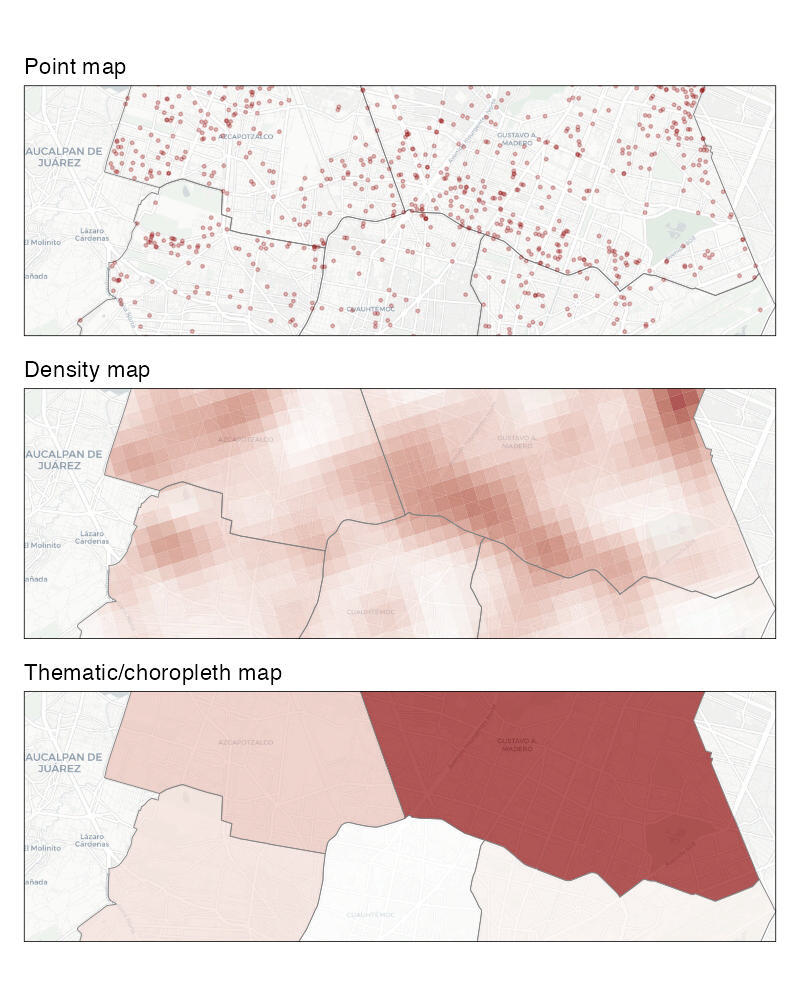
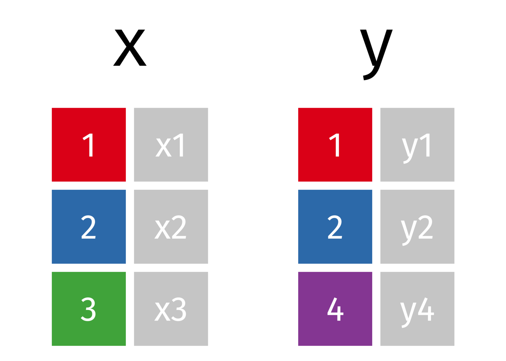
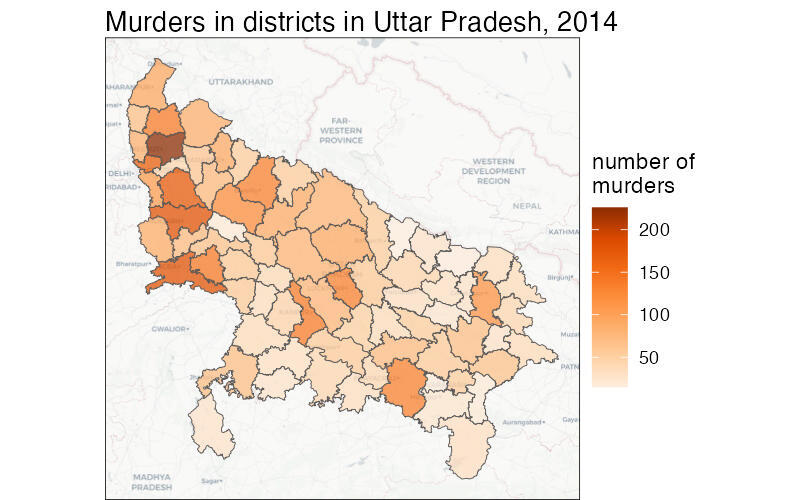

```{r setup, include=FALSE}
library(learnr)
knitr::opts_chunk$set(echo = FALSE)

# Load packages
library(crsuggest)
library(ggspatial)
library(leaflet)
library(sf)
library(tidyverse)

# Copy files
if (!dir.exists("css")) dir.create("css")
walk(
  dir("../css/"), 
  ~ file.copy(str_glue("../css/{.}"), str_glue("css/{.}"), overwrite = TRUE)
)

# Load data --------------------------------------------------------------------

# Mexico City data ----
cdmx_car_jacking <- read_sf("https://mpjashby.github.io/crimemappingdata/cdmx_car_jacking.gpkg")
cdmx_alcaldias <- read_sf("https://mpjashby.github.io/crimemappingdata/cdmx_alcaldias.gpkg")
car_jackings_in_alcaldias <- st_join(cdmx_car_jacking, cdmx_alcaldias)
#   st_transform(cdmx_car_jacking, "EPSG:31975"),
#   st_transform(cdmx_alcaldias, "EPSG:31975")
# )
car_jacking_counts <- car_jackings_in_alcaldias |> 
  st_drop_geometry() |> 
  count(nomgeo, name = "offences")
borough_counts <- cdmx_alcaldias |> 
  left_join(car_jacking_counts, by = "nomgeo") |> 
  replace_na(list(offences = 0))

# Uttar Pradesh data ----
murders <- read_csv("https://mpjashby.github.io/crimemappingdata/uttar_pradesh_murders.csv")
districts <- read_sf("https://mpjashby.github.io/crimemappingdata/uttar_pradesh_districts.gpkg")
district_pop <- read_csv("https://mpjashby.github.io/crimemappingdata/uttar_pradesh_population.csv")
district_murders <- left_join(
  districts, 
  murders, 
  by = c("district_name" = "district")
)
district_murders_pop <- district_murders |> 
  left_join(district_pop, by = c("district_name" = "district")) |> 
  mutate(murder_rate = murder / (population / 100000))
colours_red <- colorNumeric(palette = "Reds", domain = NULL)
```


## Introduction

In previous tutorials we have produced maps based on the locations of individual
crimes, sometimes known as _point data_ because we know the point in space at 
which each crime occurred. But sometimes we will want to instead map counts of 
crimes for different _areas_. There are different reasons why we might want to 
do this:

  * We might want to compare the number of crimes in different areas, such as
    police districts. We might want to do this to decide which district to 
    allocate extra funds to.
  * We might want to estimate the relative risk of a crime occurring in 
    different places by calculating crime rates using counts of crimes and 
    population data for local areas.
  * We might only have access to counts of crimes for different areas, rather
    than the location of each crime, perhaps in order to protect the privacy of
    crime victims.
    
In all these cases we need to make maps of crimes for different areas, rather 
than showing the locations of individual crimes or the density of crimes 
generated from datasets of individual crime locations. 

Maps that show data for areas are called *thematic maps* or *choropleth maps*. 

```{r make-map-types, eval=FALSE}
cdmx_north_boroughs <- cdmx_alcaldias |> 
  filter(nomgeo %in% c("Gustavo A. Madero", "Azcapotzalco", "Miguel Hidalgo", "Venustiano Carranza", "Cuauhtémoc")) |> 
  st_transform("EPSG:31975")
cdmx_north_buffer <- cdmx_north_boroughs |> 
  st_union() |> 
  st_centroid() |> 
  st_buffer(4000)
cdmx_north_car_jacking <- cdmx_car_jacking |> 
  st_transform("EPSG:31975") |> 
  st_intersection(cdmx_north_boroughs)
cdmx_north_car_jacking_kde <- cdmx_north_car_jacking |> 
  sfhotspot::hotspot_kde(
    grid = sfhotspot::hotspot_grid(cdmx_north_boroughs, cell_size = 500), 
    bandwidth_adjust = 0.25
  ) |> 
  st_intersection(cdmx_north_boroughs)
cdmx_north_car_jacking_count <- cdmx_north_car_jacking |> 
  st_drop_geometry() |> 
  count(nomgeo) |> 
  right_join(cdmx_north_boroughs, by = "nomgeo") |> 
  st_as_sf()

cdmx_north_maps <- list()

cdmx_north_maps$point <- ggplot() +
  annotation_map_tile(type = "cartolight", zoomin = 0, progress = "none") +
  annotation_spatial(data = cdmx_north_boroughs, colour = "grey50", fill = NA) +
  annotation_spatial(
    data = cdmx_north_car_jacking, 
    alpha = 0.25, 
    colour = "darkred", 
    size = 0.5
  ) +
  # geom_sf_label(
  #   aes(label = str_wrap(nomgeo, 10)), 
  #   data = cdmx_north_boroughs, 
  #   alpha = 0.67,
  #   colour = "grey25",
  #   fill = "white",
  #   fontface = "bold",
  #   label.size = NA,
  #   lineheight = 1,
  #   size = 2
  # ) +
  geom_sf(data = cdmx_north_buffer, colour = NA, fill = NA) +
  fixed_plot_aspect(ratio = 3/1) +
  labs(subtitle = "Point map") +
  # coord_sf(crs = "EPSG:4326") +
  theme_void() +
  theme(
    panel.border = element_rect(fill = NA),
    plot.margin = margin(6, 6, 6, 6),
    plot.subtitle = element_text(margin = margin(b = 3))
  )

cdmx_north_maps$density <- ggplot() +
  annotation_map_tile(type = "cartolight", zoomin = 0, progress = "none") +
  annotation_spatial(cdmx_north_car_jacking_kde, aes(fill = kde), colour = NA, alpha = 0.65) +
  annotation_spatial(data = cdmx_north_boroughs, colour = "grey50", fill = NA) +
  # geom_sf_text(
  #   aes(label = str_wrap(nomgeo, 10)), 
  #   data = cdmx_north_boroughs, 
  #   colour = "grey25",
  #   fontface = "bold",
  #   lineheight = 1,
  #   size = 2
  # ) +
  geom_sf(data = cdmx_north_buffer, colour = NA, fill = NA) +
  fixed_plot_aspect(ratio = 3/1) +
  scale_fill_gradient(low = "white", high = "darkred") +
  labs(subtitle = "Density map") +
  # coord_sf(crs = "EPSG:4326") +
  theme_void() +
  theme(
    panel.border = element_rect(fill = NA),
    plot.margin = margin(6, 6, 6, 6),
    plot.subtitle = element_text(margin = margin(b = 3)),
    legend.position = "none"
  )

cdmx_north_maps$count <- ggplot() +
  annotation_map_tile(type = "cartolight", zoomin = 0, progress = "none") +
  annotation_spatial(cdmx_north_car_jacking_count, aes(fill = n), alpha = 0.65, colour = "grey50") +
  # geom_sf_text(
  #   aes(colour = n >= quantile(n, 0.9), label = str_wrap(nomgeo, 10)), 
  #   fontface = "bold",
  #   lineheight = 1,
  #   size = 2
  # ) +
  geom_sf(data = cdmx_north_buffer, colour = NA, fill = NA) +
  scale_colour_manual(values = c(`TRUE` = "grey75", `FALSE` = "grey25")) +
  scale_fill_gradient(low = "white", high = "darkred") +
  fixed_plot_aspect(ratio = 3/1) +
  labs(subtitle = "Thematic/choropleth map") +
  # coord_sf(crs = "EPSG:4326") +
  theme_void() +
  theme(
    panel.border = element_rect(fill = NA),
    plot.margin = margin(6, 6, 6, 6),
    plot.subtitle = element_text(margin = margin(b = 3)),
    legend.position = "none"
  )

cdmx_north_map <- patchwork::wrap_plots(cdmx_north_maps, ncol = 1)

ggsave(
  here::here("inst/tutorials/09_mapping_areas/images/cdmx_north_map.jpg"), 
  cdmx_north_map,
  width = 800 / 150,
  height = 1000 / 150,
  dpi = 150
)
```

<p class="full-width-image"></p>


::: {.box .notewell}

**Do not aggregate point-level crime data to counts of crimes for areas unless 
you have a good reason to do so**.

Choropleth maps have several shortcomings that we will look at in this tutorial. 
If you have data on the locations of individual crimes then you should typically 
present those either as individual points (if there are only a few crimes) or 
using a kernel density map. If you have point-level crime data, you should only 
use a choropleth map if you need to compare administrative areas or because you 
want to calculate crime risk and you only have population data for areas.

:::


## Counting crimes

Sometimes we will want to know how many crimes have occurred in different formal
areas within a city. For example, we might want to know how many crimes of a
particular type had occurred in each neighbourhood in a city as part of a review
of the performance of different police teams, or to decide which neighbourhoods
should be given more crime-prevention funding.

To calculate counts of crimes for areas, we need 

  1. a dataset representing the crime locations and 
  2. a dataset representing the boundaries of the areas that we want to
calculate counts for. 

In this tutorial, we will count how many car-jacking offences occurred in each
alcaldía (borough) of Mexico City in 2019. The result of this will be an SF
object containing the outlines of each borough boundary and the count of 
car-jacking offences in each borough:

```{r car-jacking_table, fig.align='center'}
borough_counts |> 
  head() |> 
  knitr::kable()
```

To get started, watch this video walk-through of the code we need to write to
produce this dataset:


### Load the data

First, we load the car-jacking data from the URL 
`https://mpjashby.github.io/crimemappingdata/cdmx_car_jacking.gpkg` -- write the 
R code needed to load this file into an R object called `cdmx_car_jacking`.
Remember to load any packages that you need first.

```{r count-exercise1, exercise=TRUE, exercise.lines=6}

```

```{r count-exercise1-solution}
library(sf)
library(tidyverse)

cdmx_car_jacking <- read_sf("https://mpjashby.github.io/crimemappingdata/cdmx_car_jacking.gpkg") 

head(cdmx_car_jacking)
```

We also need to load the borough boundaries as an SF object from the URL 
`https://mpjashby.github.io/crimemappingdata/cdmx_alcaldias.gpkg` and store it 
in an object called `cdmx_alcaldias`. Write the R code needed to do this. Use 
the notes you have from previous tutorials to help you if you need them, or go 
back to the tutorial called 'Giving a map context' to refresh your memory.

```{r count-exercise2, exercise=TRUE}

```

```{r count-exercise2-solution}
cdmx_alcaldias <- read_sf("https://mpjashby.github.io/crimemappingdata/cdmx_alcaldias.gpkg")
```


### Count crimes in each borough

Now that we have loaded our data, we can count the number of offences in each
borough and produce an R object that contains the boundaries of the boroughs
together with the number of offences in each one. To do this, we will:

  1. Identify which borough each crime is in using the `st_join()` function 
     from the `sf` package.
  2. Count the number of crimes in each borough using the `count()` function 
     from the `dplyr` package.
  3. Join the counts of crimes to the borough boundaries using the 
     `left_join()` function from the `dplyr` package.

For this to work, the object containing the polygons _must_ include a column 
that can act as a unique identifier for each row (i.e. a column where no value 
appears more than once). In the `cdmx_alcaldias` object, there are two columns
where all the values are unique: `municip` and `namgeo`. If there wasn't a 
column of unique values, we could create one using `mutate()` together with the
`row_number()` function (both from the `dplyr` package):

```r
cdmx_alcaldias <- mutate(cdmx_alcaldias, unique_id = row_number())
```

Since we already have a column of unique values, we can move straight to using
the `st_join()` function. `st_join()` comes from the `sf` package and needs two 
SF objects, one containing points and one containing polygons representing 
areas. `st_join()` takes all the columns from the polygons object and adds those
values to the points based on which points are inside each polygon. When we
use `st_join()` to join the `cdmx_car_jacking` object (containing points) and 
the `cdmx_alcaldias` object (containing polygons), `st_join()` takes 
`cdmx_car_jacking`, works out which polygon each point falls inside, then adds
columns to the data associated with each point based on that polygon.


```{r count-exercise3, exercise=TRUE}
car_jackings_in_alcaldias <- st_join(cdmx_car_jacking, cdmx_alcaldias)

head(car_jackings_in_alcaldias)
```


As well as producing a joined dataset as expected, this code has produced a
message noting that `st_join()` assumes that co-ordinates are planar even though
they are specified as latitudes and longitudes. This message is there to remind
us that `st_join()` uses certain assumptions about the shape of the earth that
might make identifying which borough each offence occurred in incorrect in some 
circumstances. This is largely a problem for maps covering very-large areas or 
places near the North or South poles. To be on the safe side, we can first
transform both the spatial layers into a local co-ordinate system that is
appropriate for Mexico City. 

To identify a suitable co-ordinate system for this data, we can use the 
`suggest_crs()` function from the `crsuggest` package. `suggest_crs()` takes an
SF object that has co-ordinates specified using longitudes and latitudes, and
suggests local co-ordinate systems that are suitable for that part of the world.

```{r count-exercise3a, exercise=TRUE}
crsuggest::suggest_crs(cdmx_car_jacking)
```

We can see that `sugggest_crs()` has suggested 
`r nrow(crsuggest::suggest_crs(cdmx_car_jacking))` co-ordinate systems that are
suitable for the part of the world covered by the `cdmx_car_jacking` dataset.
If you look at the `crs_units` column, you will see that some of those 
co-ordinate systems use metres (`m`) and some use feet and inches (`us-ft`). It
is probably easiest to use co-ordinate systems specified in metres. In this 
case, the first row has a co-ordinate system that uses metres, so we will use
that system. You can see that the `crs_code` 
(`r pluck(crsuggest::suggest_crs(cdmx_car_jacking), "crs_code", 1)`) column 
gives us an EPSG code we can use together with `st_transform()` (i.e. in the 
form "EPSG:`r pluck(crsuggest::suggest_crs(cdmx_car_jacking), "crs_code", 1)`").

Write code that uses the `st_transform()` function to transform both layers, 
`st_join()` to join them and `head()` to display the first few rows of the 
result. The result of `st_join()` should be stored in an object called
`car_jackings_in_alcaldias`.

```{r count-exercise4, exercise=TRUE}

```

```{r count-exercise4-solution}
cdmx_car_jacking <- st_transform(cdmx_car_jacking, "EPSG:31975")
cdmx_alcaldias <- st_transform(cdmx_alcaldias, "EPSG:31975")

car_jackings_in_alcaldias <- st_join(cdmx_car_jacking, cdmx_alcaldias)

head(car_jackings_in_alcaldias)
```

We can see that this time, no messages are produced because the inputs to 
`st_join()` do not use longitude and latitude co-ordinates.

If you look at the `car_jackings_in_alcaldias` object, you will see that there 
are columns called `municip` and `nomgeo` that show which row in the 
`cdmx_alcaldias` object covers the location of each offence from the 
`cdmx_car_jacking` object. We can use either of these columns to count the 
number of car jackings in each borough using the `count()` function from
the `dplyr` package. Running `count()` on SF objects can sometimes be slow, so
before we do this we will convert `car_jackings_in_alcaldias` to a tibble using 
the `st_drop_geometry()` function.

```{r count-exercise5, exercise=TRUE, exercise.setup="count-exercise3"}
car_jacking_counts <- car_jackings_in_alcaldias |> 
  st_drop_geometry() |> 
  # Call the column that holds the murder counts `offences`
  count(nomgeo, name = "offences")

head(car_jacking_counts)
```

The object `car_jacking_counts` has two columns: one showing the name of each
borough and one showing the number of car jackings occurring there. Note that 
this object contains only those boroughs in which at least one car jacking 
occurred, since we used `count()` to count car jackings, not boroughs.

To create a dataset containing the boundary of each borough and the
relevant offence count, we will join `car_jacking_counts` object to the original
`cdmx_alcaldias` object using the `left_join()` function.

`left_join()` is one of a family of joining functions in the `dplyr` package 
that join two objects together based on the values of particular columns. If we
had two datasets, `x` and `y`:

<p class="full-width-image"></p>

we could use `left_join(x, y)` to merge them into one combined dataset. This
function has _left_ in the name because it joins the two datasets by adding 
matching rows from the right-hand dataset (`y`) to each row in the left-hand 
dataset (`x`). This means the combined dataset will include _all_ the rows from
`x`, but only the rows from `y` that match rows in `x`. Rows in `y` that do not
match any rows in `x` will be discarded.

<p class="full-width-image"></p>

In our case, we want to join the `cdmx_alcaldias` and `car_jacking_counts`
objects so that the combined dataset includes exactly one row for each borough
in `cdmx_alcaldias`, even if no car jackings occurred in that borough (which 
will mean that borough is not present in the `car_jacking_counts` dataset). 
Since we want to keep all the rows from `cdmx_alcaldias`, we use that object as
the first argument to `left_join()`, i.e. 
`left_join(cdmx_alcaldias, car_jacking_counts)`. If there are any rows in the 
right-hand object `car_jacking_counts` that do not match any rows in the 
left-hand object `cdmx_alcaldias`, those rows will be discarded from the result. 

By default, `left_join()` will match the rows in the `cdmx_alcaldias` and 
`car_jacking_counts` objects using all the column names that are present in both
datasets. This can sometimes have unexpected results, so it is safer to specify
which columns we want to match to be based on using the `by` argument to 
`left_join()`, in this case to specify `by = "nomgeo"` since that is the name of
the column that represents the borough names in both `cdmx_alcaldias` and 
`car_jacking_counts`.

<a href="https://tidyr.tidyverse.org/" title="tidyr website"></a>

Since any boroughs with no car jackings will not be present in the 
`car_jacking_counts` dataset, those boroughs will have missing values (i.e. 
`NA`) in place of offence counts in the result produced by `left_join()`. For
that reason, when you use `left_join()` it's a good idea to clean up the 
resulting object using the `replace_na()` function from the `tidyr` package 
(another part of the tidyverse). 

`replace_na()` needs one argument, which must be a list created with the 
`list()` function. The `list()` function should have one argument for each 
column in the data for which we want to replace missing values with the values
that we specify. In this case, we want to replace any missing values in the
`offences` column (which contains the counts of car jackings) with the number
zero, since any missing values produced by `left_join()` are the result of those
boroughs not having any car jackings and so not being included in the 
`car_jacking_counts` dataset.

Tying all this together, we can create a new SF object called `borough_counts` 
that contains both the outlines and the count of car jackings in each borough.

```{r count-exercise7, exercise=TRUE, exercise.setup="count-exercise5"}
borough_counts <- cdmx_alcaldias |> 
  left_join(car_jacking_counts, by = "nomgeo") |> 
  # Replace missing (NA) values in the `offences` column with the value 0
  replace_na(list(offences = 0))

head(borough_counts)
```

We now have an SF object containing the boundary of each borough in Mexico City
and the number of car jackings that occurred there. We could use this object
to make a choropleth map of car jackings, but before we do this we need to 
understand some of the limitations of this sort of map.

We can now put together all the code needed to take the locations of car 
jackings in Mexico City and produce counts of offences at borough level. When we
run all this code together, we can make better use of the pipe operator to 
create fewer unnecessary intermediate objects as we go.

```{r count-exercise8, exercise=TRUE, exercise.lines=26}
library(sf)
library(tidyverse)

# Load the data and transform to an appropriate co-ordinate system
cdmx_car_jacking <- read_sf("https://mpjashby.github.io/crimemappingdata/cdmx_car_jacking.gpkg")
cdmx_alcaldias <- read_sf("https://mpjashby.github.io/crimemappingdata/cdmx_alcaldias.gpkg")

# Calculate counts of car jackings
car_jacking_counts <- cdmx_car_jacking |> 
  # Join the borough names to the offence locations
  st_join(cdmx_alcaldias) |> 
  # Convert the SF object to a tibble so that `count()` runs faster
  st_drop_geometry()  |>  
  # Call the column that holds the murder counts `offences`
  count(nomgeo, name = "offences")

# Join offence counts back to borough boundaries
borough_counts <- cdmx_alcaldias |> 
  left_join(car_jacking_counts, by = "nomgeo") |> 
  # Replace missing (NA) values in the `offences` column with the value 0
  replace_na(list(offences = 0))

head(borough_counts)
```

::: {.box .notewell}

Sometimes the difference between `left_join()` and `st_join()` can be confusing.
Remember:

  * `st_join()` is used to join datasets based on matching spatial locations.
  * `left_join()` is used to join datasets based on matching values in one or
    more columns in the data.

:::

<p class="credits">
[Tidy Animated Verbs](https://github.com/gadenbuie/tidyexplain) licensed under the [Creative Commons Zero licence](https://creativecommons.org/publicdomain/zero/1.0/).
</p>


## Mapping areas

Maps showing counts of crimes, or a wide range of other data, for different 
_areas_ are extremely common in all types of spatial analysis. Watch this video
to find out introduce yourself to some of the issues you should be aware of when 
mapping areas.


Because so much of the data that we might use in crime mapping is only available
for specific areas, we often have no choice as to what types of area we use to
produce our maps. But whether we choose the areas or not, we have to be mindful
that data for areas can only tell us about the area as a whole, not individual
people or places within that area. Assuming information about areas applies to 
individual people or places within them is known as the *ecological fallacy*, a
type of logical error that can be dangerous when we try to draw conclusions from
choropleth maps. Watch this video to find out more about the ecological fallacy.


::: {.box .notewell}

The ecological fallacy is not a problem that we can solve -- it is inherent to 
choropleth maps. For this reason, whenever we plan to show some spatial data 
using a choropleth map, it is worth stopping and thinking about whether another 
type of map (such as a density map) might show the data more effectively and 
without the problems that choropleth maps have. 

Nevertheless, in some circumstances a choropleth map will be the best choice 
either because we only have data for pre-defined areas or because we are 
specifically interested in comparing areas (e.g. in working out if there is more
crime in one neighbourhood or police district than another).

:::


## Making a choropleth map

In this section we will make a choropleth map of murders in different districts
within the state of Uttar Pradesh in northern India in 2014. Uttar Pradesh is 
the largest state in India, with more than 200 million residents.

```{r make-uttar-pradesh-map, eval=FALSE}
district_murders_map <- ggplot(district_murders_pop) +
  annotation_map_tile(type = "cartolight", zoomin = 0, progress = "none") +
  geom_sf(aes(fill = murder), data = district_murders, alpha = 0.75) +
  scale_fill_distiller(palette = "Oranges", direction = 1) +
  labs(
    title = "Murders in districts in Uttar Pradesh, 2014",
    fill = "number of\nmurders"
  ) +
  theme_void() +
  theme(panel.border = element_rect(colour = "black", fill = NA))

ggsave(
  here::here("inst/tutorials/09_mapping_areas/images/uttar_pradesh_murders.jpg"), 
  district_murders_map,
  width = 800 / 150, 
  height = 500 / 150,
  dpi = 150
)
```

<p class="full-width-image"></p>


### Loading and joining datasets

First, we load the counts of murders in each district and the district 
boundaries as separate objects.

```{r choro-exercise1, exercise=TRUE}
library(sf)
library(tidyverse)

murders <- read_csv("https://mpjashby.github.io/crimemappingdata/uttar_pradesh_murders.csv")
districts <- read_sf("https://mpjashby.github.io/crimemappingdata/uttar_pradesh_districts.gpkg")

message("First few rows of the `murders` object …")
head(murders, n = 3)

message("First few rows of the `districts` object …")
head(districts, n = 3)
```

Note that we have used the `message()` function here to make it easier to 
decipher the output of this code, since we are printing both the `murders` and
`districts` objects. We have also used the `n = 3` argument to the `head()` 
function to print just the first three rows of each dataset.

We will need to join these two objects using `left_join()` to create a
choropleth map. From the output above we can see that the `murders` object 
contains the count of murders in each district and the name of the district in 
the `district` column. The `districts` object also contains the name of each 
district, but in a column called `district_name`. To join the two datasets based 
on this column, we will have to specify that we want to use those differently 
named columns using the `left_join()` argument 
`by = c("district_name" = "district")`. As in the Mexico City example earlier in
this tutorial, we will use `left_join()` and specify the `districts` object as 
the first argument in order to keep all the districts in the resulting object, 
whether there were any murders in the district or not.

```{r choro-exercise2, exercise=TRUE}
district_murders <- left_join(
  districts, 
  murders, 
  # We can join two datasets based on columns with different names by specifying
  # `by = c("column_name_in_lefthand_data" = "column_name_in_righthand_data")`
  by = c("district_name" = "district")
)

head(district_murders)
```

Looking at the `district_murders` object, we can see that each row now contains
the name of a district and the number of murders that occurred there. There are
no districts in which there were zero murders, so we do not need to replace any
`NA` values with zeros using `replace_na()` as in the previous example.


<!--

<div class="box extra-detail">

<h5 id="choro-box1-title" class="box-title">Why does `district_murders` have two columns named `state.x` and `state.y`?</h5>

<div id="choro-box1" class="box-content">

You may have noticed that the `district_murders` object has two columns named
`state.x` and `state.y`. This is because _both_ the datasets we have joined 
together contained a column called `state`, but those columns were not used to
join the two datasets together. We can avoid these duplicate columns by:

  * using `select()` *before* using `left_join()` to remove the `state` column
    from one dataset or the other, e.g. `select(murders, -state)`,
  * using `select()` *after* using `left_join()` to remove one of the duplicate
    columns and to rename the other, e.g. 
    `select(district_murders, state = state.x, -state.y)`, or
  * adding `state` as a joining variable in `left_join()`, e.g.
    `left_join(districts, murders, by = c("state" = "state", "district_name" = "district"))`.

All three of these options produce the same result.

</div>

</div>

<script>
$("#choro-box1-title").click(function () { $("#section-choro-box1").toggle("slow") })
</script>

-->


### Making a choropleth map

The `district_murders` object we have produced is an SF object, which means we
can use `geom_sf()` to plot the districts.

```{r choro-exercise3, exercise=TRUE, out.width="90%", fig.asp=1}
library(ggspatial)

ggplot(district_murders) +
  annotation_map_tile(type = "cartolight", zoomin = 0, progress = "none") +
  geom_sf() +
  theme_void() +
  theme(panel.border = element_rect(colour = "black", fill = NA))
```

There are at least two problems with this map: 

  1. we cannot tell how many murders there were in each district, and
  2. we cannot see the base map under the polygons representing the districts.

We can solve these two problems by changing the aesthetics for the 
`geom_sf()` layer in our code. Specifically, we can make the district polygons
semi-transparent by setting the `alpha` argument to `geom_sf()` to a value of 
less than one, while also using `aes(fill = murder)` to specify that the fill
colour of the polygons should depend on the number of murders in each district.
At the same time we will use `scale_fill_distiller()` to use a colour scheme that
is accessible to the widest range of users.

```{r choro-exercise4, exercise=TRUE, exercise.lines=14, message=FALSE, out.width="90%", fig.asp=1}
ggplot(district_murders) +
  annotation_map_tile(type = "cartolight", zoomin = 0, progress = "none") +
  # Add the districts layer with colour controlled by the number of murders
  geom_sf(aes(fill = murder), alpha = 0.75) +
  # Use a better colour scheme
  scale_fill_distiller(palette = "Oranges", direction = 1) +
  # Add some labels
  labs(
    title = "Murders in districts in Uttar Pradesh, 2014",
    fill = "number of\nmurders"
  ) +
  theme_void() +
  theme(panel.border = element_rect(colour = "black", fill = NA))
```


## Making an interactive map

So far in this course, all the maps we have made using `ggplot()` have been 
static images. These are useful for lots of different circumstances, and are 
usually the only choice if we want to produce a written report as a Word 
document or PDF. But in some circumstances it may be useful to produce a map 
that you can interact with by zooming in or panning around different areas. This
can be useful when readers might want to look at areas of the map in more detail
than is possible without zooming in.

In the example of murders in Uttar Pradesh, we might want to use an interactive
map to zoom in to see which cities are included in each district on the map.
To see how this works, explore this map of murder rates in Uttar Pradesh.

```{r interactive-map, out.width="100%", fig.asp=1}
colours_red <- colorNumeric(palette = "Reds", domain = NULL)

district_labels <- district_murders_pop |> 
  mutate(
    label = str_glue(
      "<b>{district_name}</b><br>{scales::number(murder_rate, accuracy = 0.1)}",
      " murders per 100k residents"
    )
  ) |> 
  pull("label") |> 
  map(htmltools::HTML)

leaflet(district_murders_pop) |> 
  addProviderTiles("CartoDB.Voyager") |> 
  addPolygons(
    fillColor = ~ colours_red(murder_rate), 
    fillOpacity = 0.75, 
    label = district_labels,
    weight = 2, 
    color = "black"
  ) |> 
  addLegend(
    pal = colours_red, 
    values = ~ murder_rate, 
    title = htmltools::HTML("murders per<br>100k residents,<br>2014")
  ) |> 
  addMiniMap(toggleDisplay = TRUE)
```


To make an interactive choropleth map we can use functions from the `leaflet` 
package. The functions in the `leaflet` package work in a similar way to 
`ggplot()`, but with a few differences.

Watch this video that walks through the code needed to produce an interactive 
map to get started.


To make maps with `leaflet`, we use functions to create a stack in a similar way
to the `ggplot()` stacks we have already created. Note that while the concept of
a stack is similar, we cannot use functions from the `ggplot2` package in a 
`leaflet` stack, or vice versa. Also, we construct `leaflet` stacks using the
pipe operator `|>` rather than the plus operator `+` that we use in `ggplot2`.

We can create a very basic `leaflet` map using the `leaflet()` function to 
create the stack, the `addProviderTiles()` function to add a base map and the
`addPolygons()` function to add the district outlines.

```{r leaflet-exercise1, exercise=TRUE, out.width="100%", fig.asp=1}
library(leaflet)

leaflet(district_murders) |> 
  addProviderTiles("CartoDB.Voyager") |> 
  addPolygons()
```

In this map we use the CartoDB.Voyager style of base map, but `leaflet` can use
a large number of different base maps that you can [view in this online gallery](https://leaflet-extras.github.io/leaflet-providers/preview/).

This map isn't very useful because it doesn't show how many murders there were
in each district. To do that, we need to specify that each district should be
coloured according to the values in the `murder` column of the 
`district_murders` object. With a `ggplot()` map, we would do this with a
function such as `scale_fill_distiller()`, but with a `leaflet` map the code we
need is slightly more complicated and has two separate stages.

The first stage is to create a custom function that converts the values in the
`murder` column of the `district_murders` objects into colours. To do this, we
use the `colorNumeric()` function from the `leaflet` package. Yes, this means
that we are using a function to create a function, which we will then later use
to set an argument of another function -- programming languages are very 
powerful, but that sometimes means they are complicated.

The `colorNumeric()` function (note the spelling of "color") allows us to
specify the colour scheme we want using the `palette` argument. We also have to
set the `domain` argument to be `NULL`. The `palette` argument to the 
`colorNumeric()`function accepts the same values as the palette argument to the
`scale_fill_distiller()` function from `ggplot`:

```{r colour-palettes, out.width="100%"}
RColorBrewer::brewer.pal.info |> 
  rownames_to_column(var = "name") |> 
  filter(colorblind, category == "seq") |> 
  pmap(function (...) {
    current <- tibble(...)
    ggplot() +
      geom_raster(aes(x = 1:9, y = 1, fill = as.factor(1:9))) +
      scale_fill_brewer(palette = current$name) +
      labs(subtitle = current$name) +
      theme_void() +
      theme(
        legend.position = "none", 
        plot.subtitle = element_text(size = 8)
      )
  }) |> 
  patchwork::wrap_plots()
```

To create the custom colour palette function, we use the `<-` operator to assign
it to a name, just as we would with an object. We can give this custom function 
any name we like, but in the code below we'll call it `colours_red`.

Once we have created a custom colour palette function using `colorNumeric()`, we 
can use that function to create the appropriate values for the `fillColor` 
argument of the `addPolygons()` function in our existing `leaflet` stack. Since 
we want the map colours to be controlled by the `murder` column in the 
`district_murders` object, we specify `murder` as the only argument to the
`colours_red()` palette function we have created.

One slight quirk of `leaflet` is that in order for `colours_red()` to have
access to the columns in the `district_murders` object, we need to add a tilde
(`~`) operator before the function name, so that the `fillColor` argument is
`fillColor = ~ colours_red(murder)` rather than 
`fillColor = ~ colours_red(murder)`. If you forget add do the `~`, you will see 
an error saying:

```r
Error in colours_red(murder) : object 'murder' not found
```

```{r leaflet-exercise2, exercise=TRUE, message=FALSE, out.width="100%", fig.asp=1}
# Create a custom colour palette function
colours_red <- colorNumeric(palette = "Reds", domain = NULL)

leaflet(district_murders) |> 
  addProviderTiles("CartoDB.Voyager") |> 
  addPolygons(
    fillColor = ~ colours_red(murder),
    fillOpacity = 0.75,
    weight = 2,
    color = "black"
  )
```

There are three improvements we can make to this interactive map. The first is 
to add a legend, using the `addLegend()` function. This function needs three
arguments:

  * `pal` specifies which custom palette function controls the legend colours.
    This should be the same function as used in the `fillColor` argument of the
    `addPolygons()` function.
  * `values` specifies which column in the data the legend will show. Once
    again, the column name should be preceded by a `~` operator.
  * `title` specifies the legend title.

```{r leaflet-exercise3, exercise=TRUE, message=FALSE, out.width="100%", fig.asp=1}
leaflet(district_murders) |> 
  addProviderTiles("CartoDB.Voyager") |> 
  addPolygons(
    fillColor = ~ colours_red(murder),
    fillOpacity = 0.75,
    weight = 2,
    color = "black"
  ) |> 
  addLegend(pal = colours_red, values = ~ murder, title = "number of murders")
```

Next, we can add an inset map in the corner of the main map. This is useful for
interactive maps because if we zoom in to show only a small area, we will be 
able to use the inset map to stay aware of the wider context.

We can do this by adding the `addMiniMap()` function to the `leaflet` stack.
We will add the argument `toggleDisplay = TRUE` to add the ability to minimise
the inset map if necessary.

```{r leaflet-exercise4, exercise=TRUE, message=FALSE, out.width="100%", fig.asp=1}
leaflet(district_murders) |> 
  addProviderTiles("CartoDB.Voyager") |> 
  addPolygons(
    fillColor = ~ colours_red(murder),
    fillOpacity = 0.75,
    weight = 2,
    color = "black"
  ) |> 
  addLegend(
    pal = colours_red, 
    values = ~ murder, 
    title = "number of murders"
  ) |> 
  addMiniMap(toggleDisplay = TRUE)
```

Finally, we can add labels to the districts, which will appear when we move the
pointer on a screen over a particular district. We do this by adding the 
`label` argument to the existing `addPolygons()` function. As with the previous
sections, we can specify that the labels should be based on the `district_name` 
column in the `district_murders` data using the `~` operator, by setting 
`label = ~ district_name`.

```{r leaflet-exercise5, exercise=TRUE, message=FALSE, out.width="100%", fig.asp=1}
leaflet(district_murders) |> 
  addProviderTiles("CartoDB.Voyager") |> 
  addPolygons(
    fillColor = ~ colours_red(murder),
    fillOpacity = 0.75,
    label = ~ district_name,
    weight = 2,
    color = "black"
  ) |> 
  addLegend(
    pal = colours_red, 
    values = ~ murder, 
    title = "number of murders"
  ) |> 
  addMiniMap(toggleDisplay = TRUE)
```

This map allows you to move around as well as zooming in and out. This is very
useful for maps where people may need to see both overall patterns for a large
area and details for a smaller area within it. Obviously, interactive maps only
work on screens, not for printed maps.


## Calculating crime rates

One use of choropleth maps is to combine crime counts with other data. One 
reason to do this is to calculate a crime rate, i.e. an expression of the 
frequency of crime that in some way controls for the population that is exposed
to crime. We often use choropleth maps for this because we only have population
counts for areas, rather than knowing where each individual person lives.

Before we learn about different types of crime rate, lets create a *targeting
table* for murder in districts in Uttar Pradesh: a table that shows the 
districts with the highest number of murders.

```{r rates-exercise1, exercise=TRUE}
district_murders |> 
  # Remove the `geometry` column to make the table clearer
  st_drop_geometry() |> 
  # Also remove the `state` column, since it is the same for every row
  select(-state) |> 
  # Arrange the table so the districts with the most murders are first
  arrange(desc(murder))
```

```{r}
district_murders_ranked <- district_murders |> 
  st_set_geometry(NULL) |> 
  arrange(desc(murder)) |>  
  pluck("district_name")
```

From this, we can see that the highest number of murders in 2014 occurred in the
`r nth(district_murders_ranked, 1)`, `r nth(district_murders_ranked, 2)` and 
`r nth(district_murders_ranked, 3)` districts.


### Types of crime rate

There are three types of crime rate, each of which measures risk in a different
way. The most common, and the type of rate that people almost always mean if
they talk about a 'crime rate' without specifying another type, is the 
*incidence rate*. This is the number of crimes in an area divided by the number
of people, households or places against which a crime could occur. For example,
the incidence rate of burglary in an area might be calculated as the number of
crimes per 1,000 households, while the incident rate of homicide might be 
expressed as the number of homicides per 100,000 people.

$$
\textrm{incidence} = \frac{\textrm{crimes}}{\textrm{population}}
$$

Incidence rates are useful for comparing the risk from crime in areas of 
different sizes. For example, knowing that `r nth(district_murders_ranked, 1)`
had more murders in 2014 than any other district in Uttar Pradesh might be 
useful in deciding where to send more homicide detectives, but it doesn't tell
us much about the risk of being murdered in `r nth(district_murders_ranked, 1)`
because we don't know if this district has more murders simply because it has
more people.

Incidence rates are useful for comparing areas, but they tell us a little
about how likely an individual is to be a victim of crime because crime is 
heavily concentrated against a few victims (think back to the law of crime
concentration we discussed in a previous tutorial). To understand the average
risk of a person being a victim of crime once or more, we calculate the 
*prevalence rate*. This is the number of people, households, etc. who were 
victims at least once, divided by the total number of people, households, etc. 
Prevalence rates are usually expressed as a percentage, so we might say that 1% 
of the population has been a victim of a particular crime at least once during a 
year.

$$
\textrm{prevalence} = \frac{\textrm{victims}}{\textrm{population}}
$$

The final type of rate is the *concentration rate*. This tells us how 
concentrated crime is, and is usually expressed as a single number, e.g. if
the concentration rate for a crime is 2.5 then we can say that everyone who was 
a victim of that crime at least once was on average victimised 2.5 times. This 
is particularly useful for understanding how important repeat victimisation is
to driving up the frequency of crime in an area. This, in turn, might lead us to
focus crime-prevention efforts on work to protect recent victims of crime from
being victimised again.

$$
\textrm{concentration} = \frac{\textrm{crimes}}{\textrm{victims}}
$$


<div class="box notewell">

All three types of crime rate are average values for an area as a whole, so we 
are always at risk of committing the ecological fallacy. Remember that while
rates are useful for describing areas, that does not imply everyone in an area
faces the same risk from crime.

</div>


### Choosing a population measure

To calculate a crime rate, we need to be able to measure the population that is
at risk from that crime. It is very common for analysts to calculate rates based
on the number of people who live in an area, not least because that information
is often easily available. However, there are many situations in which the 
residential population of an area is a poor measure of the population at risk 
for crime there. For example:

  * Robberies in a shopping area where most of the victims do not live in the 
    area but instead travel from elsewhere to go shopping. This can lead to 
    vastly inflated crime rates for commercial and entertainment districts that
    have very small residential populations but very large numbers of people
    coming into the area to work, shop or visit. Crime rates based on 
    residential population almost always give misleading rates for city centres
    or business districts.
  * Assaults on public transport where victims happen to be passing through a
    given area at the time they are victimised but are doing so as part of a
    longer journey through several areas, with the crime potentially occurring
    in any one of them. These crimes are known as 
    [interstitial offences](https://doi.org/10.1186/2193-7680-3-1).
  * Residential burglaries where the targets of crime are homes, not people, so
    the crime rate may be influenced by the number of people in each household.

In all these cases, the residential population is a poor measure of the 
population at risk from crime. Unfortunately, other measures of population (such
as counts of people on public transport or walking along a shopping street) are
often expensive or difficult to obtain. This is known as the *denominator 
dilemma*: should we use residential population to calculate crime rates just 
because it is the only data that is available?


### Calculating murder rates in Uttar Pradesh

In the case of murder in Uttar Pradesh, residential population is likely to be
an acceptable (although not perfect) denominator to use in calculating an
incidence rate. This is because Indian districts are relatively large areas and
so we can expect that most murder victims will be killed in the district where
they live (because people everywhere tend to spend most of their time close to
where they live). However, there will definitely be exceptions to this, with
people being murdered in a different district to where they live. Working out
the extent of this problem would be an important question for a detailed 
investigation into murder in Uttar Pradesh, but we will not consider it any
further here.

To calculate an incidence rate, we need to join population data to the existing
`district_murders` object containing murder counts and district outlines. Write
the code needed to download population data from 
`https://mpjashby.github.io/crimemappingdata/uttar_pradesh_population.csv` and 
join it to the `district_murders` object, saving the result as 
`district_murders_pop`.

```{r rates-exercise2, exercise=TRUE, exercise.lines=9}

```

```{r rates-exercise2-solution}
district_pop <- read_csv("https://mpjashby.github.io/crimemappingdata/uttar_pradesh_population.csv")
  
district_murders_pop <- left_join(
  district_murders, 
  district_pop, 
  by = c("district_name" = "district")
)

head(district_murders_pop)
```

Now that we have a single dataset containing all the variables we need, we can
calculate the incidence of murders per 100,000 people.

```{r rates-exercise3, exercise=TRUE}
district_murders_pop <- district_murders_pop |> 
  mutate(murder_rate = murder / (population / 100000)) |> 
  # At the same time we will remove unnecessary variables to clean up the data
  select(district_name, murder, population, murder_rate)

head(district_murders_pop)
```


### Mapping crime rates

To create a choropleth map of the murder rate using `leaflet`, we simply use the
code from our previous interactive map but specify that the `murder_rate`
column be used to determine the colour of each district polygon rather than the
`murder` column. We will also change the base map to a different style.


::: {.box .notewell}

Whenever we map a crime _rate_, it is important that we are explicit about how
that rate was calculated. For example, using a legend title such as "rate of 
murders" would not give enough information to allow readers to understand how to
interpret the map. A much better legend title would be "murders per 100,000 
residents" or something similar.

:::


We we need to use a longer legend title, or other text, it can be useful to 
break the text over multiple lines. Since `leaflet` maps are built using the
same technologies as web pages, the way we wrap text is slightly different to
how we do it for maps created with `ggplot2`. Rather than using the new-line
character (`\n`) or the `str_wrap()` function, we will instead use the HTML 
new-line separator `<br>` and wrap the whole legend title in the `HTML()` 
function from the `htmltools` package.


```{r rates-exercise4, exercise=TRUE, exercise.lines=25, out.width="100%", fig.asp=1}
leaflet(district_murders_pop) |> 
  addProviderTiles(
    "Esri.WorldImagery", 
    # Since the base map layer we have chosen is very colourful, we will make it
    # partially transparent to reduce its visual prominence
    options = providerTileOptions(opacity = 0.3)
  ) |> 
  # The base map we have chosen does not have any labels, so we will add a
  # second base map layer over the top. To do this we choose a layer that 
  # consists only of labels.
  addProviderTiles("Stamen.TonerLabels") |> 
  addPolygons(
    fillColor = ~ colours_red(murder_rate),
    fillOpacity = 0.75,
    label = ~ district_name,
    weight = 2,
    color = "black"
  ) |> 
  addLegend(
    pal = colours_red, 
    values = ~ murder_rate, 
    title = htmltools::HTML("murders per<br>100,000 residents")
  ) |> 
  addMiniMap(toggleDisplay = TRUE)
```

We now have all the code we need to load the necessary data, calculate crime
rates and make an interactive map of murders in districts in Uttar Pradesh.

```{r rates-exercise5, exercise=TRUE, exercise.lines=47, out.width="100%", fig.asp=1}
library(leaflet)
library(sf)
library(tidyverse)

# Load data
murders <- read_csv("https://mpjashby.github.io/crimemappingdata/uttar_pradesh_murders.csv")
districts <- read_sf("https://mpjashby.github.io/crimemappingdata/uttar_pradesh_districts.gpkg")
district_pop <- read_csv("https://mpjashby.github.io/crimemappingdata/uttar_pradesh_population.csv")

# Wrangle data
district_murders_pop <- districts |> 
  # Add murders data to district boundaries
  left_join(murders, by = c("district_name" = "district")) |> 
  # Add population to district boundaries
  left_join(district_pop, by = c("district_name" = "district")) |> 
  # Calculate murder rate
  mutate(murder_rate = murder / (population / 100000))

# Create a custom colour palette function
colours_red <- colorNumeric(palette = "Reds", domain = NULL)

# Create interactive map
leaflet(district_murders_pop) |> 
  addProviderTiles(
    "Esri.WorldImagery", 
    # Since the base map layer we have chosen is very colourful, we will make it
    # partially transparent to reduce its visual prominence
    options = providerTileOptions(opacity = 0.3)
  ) |> 
  # The base map we have chosen does not have any labels, so we will add a
  # second base map layer over the top. To do this we choose a layer that 
  # consists only of labels.
  addProviderTiles("Stamen.TonerLabels") |> 
  addPolygons(
    fillColor = ~ colours_red(murder_rate),
    fillOpacity = 0.75,
    label = ~ district_name,
    weight = 2,
    color = "black"
  ) |> 
  addLegend(
    pal = colours_red, 
    values = ~ murder_rate, 
    title = htmltools::HTML("murders per<br>100,000 residents")
  ) |> 
  addMiniMap(toggleDisplay = TRUE)
```


<!--

It may be useful to compare the count of murder and murder rate across each 
district. We can do this by making a scatter plot with `ggplot()`, using
`geom_point()` to draw the points and `geom_smooth(method = "lm")` to draw a
straight trend line for the relationship between the two variables (you can
ignore the argument `formula = "y ~ x"` -- this is the default value for this
argument, but `ggplot()` produces a message if it is not specified explicitly.

```{r rates-exercise6, exercise=TRUE}
ggplot(district_murders_pop, aes(murder, murder_rate)) +
  geom_point() +
  geom_smooth(method = "lm", formula = "y ~ x") +
  scale_x_continuous(limits = c(0, NA)) +
  scale_y_continuous(limits = c(0, NA)) +
  labs(
    title = "Murders in districts in Uttar Pradesh, 2014", 
    x = "number of murders", 
    y = "rate of murders per 100,000 people"
  ) +
  theme_minimal()
```

From this chart we can see that most districts have low counts of murders and
low murder rates. This is as we would expect it to be, because we know that 
crime is concentrated in a few places. We can also see that there a few 
districts with high murder counts, and some districts which do not have
especially high murder counts but do have very high murder rates. We can see on
the map that the districts with higher murder rates tend to be concentrated 
along the border with the Indian capital New Delhi (zoom into the map to see
this in more detail).

-->


#### Check your understanding

Answer the following questions to check your understanding of what we've learned
so far in this tutorial. If you get a question wrong, you can keep trying until
you get the right answer.

```{r read-quiz}
quiz(
  caption = "",
  
  question(
    "What type of rate describes the chances of a person being a victim of a crime at least once in a given period?",
    answer("prevalence rate", correct = TRUE),
    answer("incidence rate"),
    answer("concentration rate"),
    correct = random_praise(),
    incorrect = random_encouragement(),
    allow_retry = TRUE,
    random_answer_order = TRUE
  ),
  
  question(
    "What type of rate describes the frequency of crime after controlling for some measure of the population at risk?",
    answer("incidence rate", correct = TRUE),
    answer("prevalence rate"),
    answer("concentration rate"),
    correct = random_praise(),
    incorrect = random_encouragement(),
    allow_retry = TRUE,
    random_answer_order = TRUE
  ),
  
  question(
    "What type of rate describes the average number of times each victim of a particular crime is victimised?",
    answer("concentration rate", correct = TRUE),
    answer("incidence rate"),
    answer("prevalence rate"),
    correct = random_praise(),
    incorrect = random_encouragement(),
    allow_retry = TRUE,
    random_answer_order = TRUE
  )
  
)
```


## In summary

::: {.box .welldone}

In this tutorial we have learned how to calculate the number of points in
different areas, join different sources of data together, and map crime counts
and crime rates on both static and interactive maps.

We have also learned about two disadvantages of choropleth maps: the ecological
fallacy and the modifiable areal unit problem.

:::


::: {.reading}

To find out more about the topics covered in this tutorial:

  * Read the article [Crime seen through a cone of resolution](https://journals.sagepub.com/doi/pdf/10.1177/000276427602000207) by
    Paul Brantingham, Delmar Dyreson and Patricia Brantingham for more detail
    about the ecological fallacy in studying crime.
  * Read the article [Smallest is Better? The Spatial Distribution of Arson and the Modifiable Areal Unit Problem](https://doi.org/10.1007/s10940-016-9297-6) 
    for an example of the modifiable areal unit problem in studying crime.

:::
