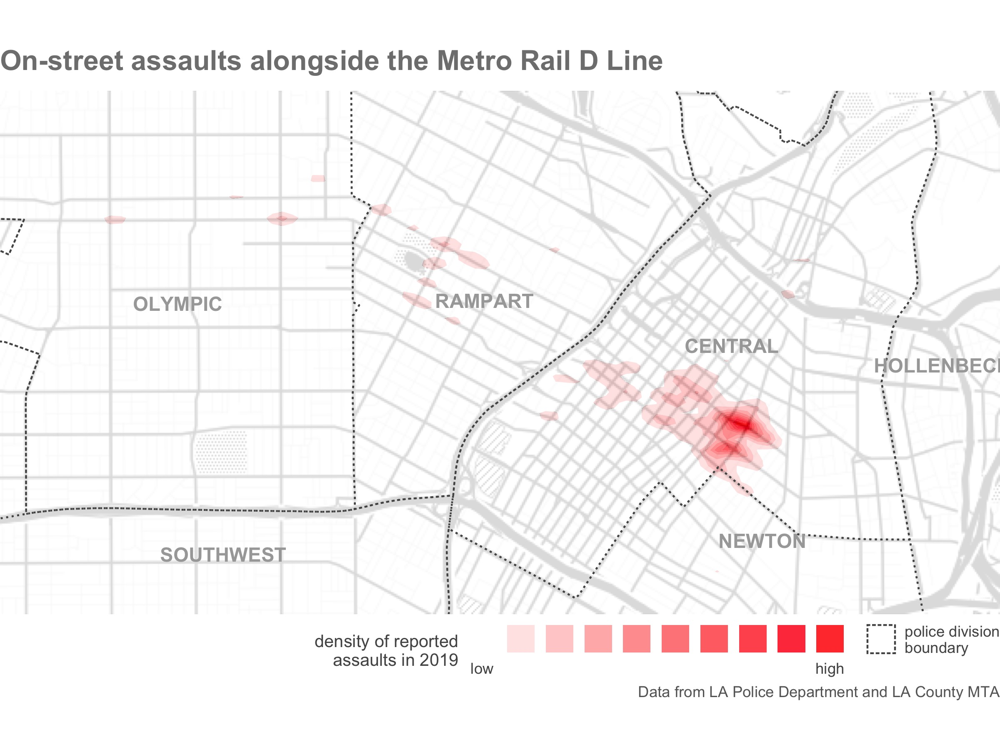
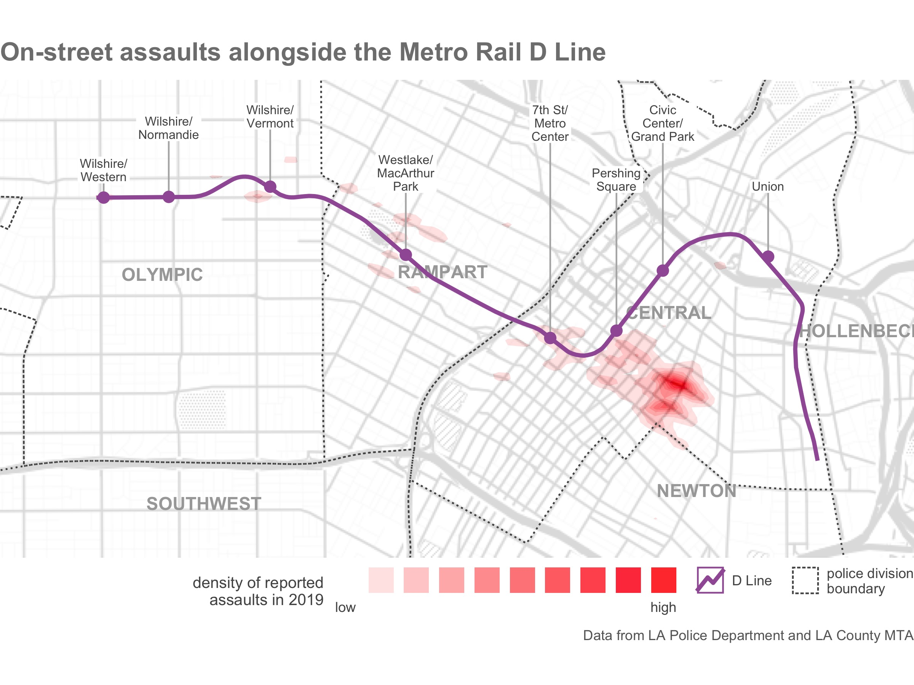

```{r setup, include=FALSE, cache=FALSE}
library(learnr)
knitr::opts_chunk$set(echo = FALSE)

# Load packages
library(ggmap)
library(ggrepel)
library(httr)
library(osmdata)
library(sf)
library(tidyverse)

# Copy files
if (!dir.exists("css")) dir.create("css")
walk(
  dir("../css/"), 
  ~ file.copy(str_glue("../css/{.}"), str_glue("css/{.}"), overwrite = TRUE)
)


# Load data --------------------------------------------------------------------
robberies <- read_sf("../../extdata/toronto_robberies.gpkg") %>% 
  filter(premisetype == "outside")
divisions_file <- "../../extdata/toronto_police_divisions.zip"
unzip(divisions_file, exdir = tempdir())
divisions <- str_glue("{tempdir()}/Police Boundaries Data.shp") %>% 
  read_sf() %>% 
  select(division = FIELD_6)
nightclubs <- divisions %>% 
  filter(division == 52) %>% 
  st_bbox() %>% 
  opq() %>% 
  add_osm_feature(key = "amenity", value = "nightclub") %>% 
  osmdata_sf()
nightclub_points <- nightclubs %>% 
  {
    bind_rows(
      pluck(., "osm_points"), 
      st_centroid(pluck(., "osm_polygons"))
    )
  }
```


## Introduction

The purpose of most crime maps is to help people make decisions, be they 
professionals working out how best to respond to crime problems or citizens
holding local leaders to account. We can make it easier for people to make 
decisions by putting crime data into a relevant context. We have already done
this by adding base maps, titles, legends and so on to our maps.

Since crime is concentrated in a few places, readers of our crime maps will 
often be interested in understanding what features of the environment cause 
specific types of crime to concentrate in particular places. Where patterns of
crime are driven by particular facilities -- such as late-night violence being
driven by the presence of bars selling alcohol -- it can be useful to highlight
specific features on our maps.

For example, imagine the manager responsible for security on the D Line of Los 
Angeles Metro Rail is focused on reducing violence against passengers and (as
well as analysing violence on stations and trains) is interested in 
understanding which stations are in neighbourhoods with high levels of violent
crime. To help with this, you might produce a map showing the density of 
on-street assaults recorded by local police.

```{r la-metro-assaults-map, include=FALSE, warning=FALSE, message=FALSE}
if (
  !file.exists("images/la_metro_assaults_map1.jpg") |
  !file.exists("images/la_metro_assaults_map2.jpg")
) {
  
  # set map limits
  limits <- c(left = -118.50, bottom = 33.975, right = -118.25, top = 34.075)
  limits_crime <- limits %>% 
    set_names(c("xmin", "ymin", "xmax", "ymax")) %>% 
    {
      .["xmax"] <- -118.26
      .
    }
  
  # download LA Metro Rail lines and stations
  # Source: https://developer.metro.net/docs/gis-data/rowada/
  temp_dir <- str_glue("{tempdir()}/la_metro/")
  dir.create(temp_dir)
  GET(
    "https://developer.metro.net/wp-content/uploads/2020/01/MetroROW.zip",
    write_disk(str_glue("{temp_dir}/lines.zip"), overwrite = TRUE)
  )
  GET(
    "https://developer.metro.net/wp-content/uploads/2019/10/802_805_RedPurple_Stations_0316.zip",
    write_disk(str_glue("{temp_dir}/stations.zip"), overwrite = TRUE)
  )
  unzip(str_glue("{temp_dir}/lines.zip"), exdir = temp_dir)
  unzip(str_glue("{temp_dir}/stations.zip"), exdir = temp_dir)
  
  # load rail data
  lines <- str_glue("{temp_dir}Developer.metro/Shapefiles/Existing.shp") %>% 
    read_sf() %>% 
    janitor::clean_names()
  stations <- str_glue("{temp_dir}/RedPurpleLine0316.shp") %>% 
    read_sf() %>% 
    janitor::clean_names() %>% 
    filter(str_detect(line, "Purple"))
  station_names <- stations %>% 
    st_coordinates() %>% 
    as_tibble() %>% 
    add_column(name = stations$station) %>% 
    mutate(
      name = name %>% 
        str_replace(" / ", "/") %>% 
        str_remove(" - Metro Red & Purple Lines") %>%
        str_remove(" Station$")
    )
  
  # create buffered bounding box around line
  limits <- lines %>% 
    filter(name == "Purple Line") %>% 
    st_transform(32610) %>% 
    st_buffer(1000) %>% 
    st_transform(4326) %>% 
    st_bbox()
  
  # load crime data
  la_crime <- crimedata::get_crime_data(
    cities = "Los Angeles", 
    type = "core",
    output = "sf"
  ) %>% 
    filter(offense_group == "assault offenses", location_category == "street") %>% 
    st_crop(limits)
  
  # load LAPD divisions
  # Source: https://geohub.lacity.org/datasets/031d488e158144d0b3aecaa9c888b7b3_0
  divisions <- read_sf("https://opendata.arcgis.com/datasets/031d488e158144d0b3aecaa9c888b7b3_0.geojson") %>% 
    janitor::clean_names() %>% 
    mutate(area_full = st_area(.))
  divisions_label <- divisions %>% 
    st_crop(limits) %>% 
    mutate(
      area_remaining = st_area(.),
      area_prop = as.numeric(area_remaining / area_full)
    ) %>% 
    filter(area_prop > 0.1)
  
  la_metro_assaults_map1 <- limits %>% 
    set_names(c("left", "bottom", "right", "top")) %>%
    get_stamenmap(zoom = 13, maptype = "toner-background") %>% 
    ggmap() +
    geom_density2d_filled(
      aes(longitude, latitude), 
      data = la_crime, 
      na.rm = TRUE, 
      alpha = 0.85, 
      bins = 10, 
      adjust = 0.2
    ) +
    geom_sf(
      aes(linetype = "12"),
      data = divisions, 
      inherit.aes = FALSE, 
      colour = "grey33", 
      fill = NA
    ) +
    geom_sf_text(
      aes(label = aprec),
      data = divisions_label, 
      inherit.aes = FALSE, 
      colour = "grey66",
      fontface = "bold",
      size = 4
    ) +
    scale_colour_manual(
      values = c(`TRUE` = "#A05DA5", `FALSE` = "grey60"),
      labels = c(`TRUE` = "D Line", `FALSE` = "other Metro lines"),
      guide = guide_legend(nrow = 2, override.aes = list(fill = NA), order = 2)
    ) +
    scale_fill_manual(
      values = colorRampPalette(c("white", "red"))(10),
      labels = c("low", rep("", 8), "high"),
      guide = guide_legend(nrow = 1, label.position = "bottom", order = 1)
    ) +
    scale_linetype_manual(
      values = c("12" = "12"),
      labels = c("12" = "police division\nboundary")
    ) +
    labs(
      title = "On-street assaults alongside the Metro Rail D Line",
      caption = "Data from LA Police Department and LA County MTA",
      colour = NULL,
      fill = "density of reported\nassaults in 2019",
      linetype = NULL
    ) +
    coord_sf() +
    theme_void() +
    theme(
      legend.justification = "right",
      legend.position = "bottom",
      legend.text = element_text(colour = "grey33", margin = margin()),
      legend.title = element_text(colour = "grey33", size = 10),
      legend.title.align = 1,
      plot.caption = element_text(colour = "grey40"),
      plot.title = element_text(
        colour = "grey50", 
        face = "bold", 
        size = 16, 
        margin = margin(b = 9)
      )
    )
  
  la_metro_assaults_map2 <- la_metro_assaults_map1 +
    geom_sf(
      aes(colour = name == "Purple Line"),
      data = filter(lines, name == "Purple Line"),
      inherit.aes = FALSE,
      size = 1.25,
      key_glyph = draw_key_timeseries
    ) +
    geom_label_repel(
      aes(X, Y, label = str_wrap(name, width = 10)), 
      data = station_names, 
      colour = "grey33", 
      lineheight = 0.9,
      size = 2.75, 
      label.size = NA,
      label.padding = unit(0.1, "lines"),
      box.padding = 1, 
      direction = "y",
      max.time = 2,
      max.iter = 10^5,
      segment.colour = "grey70",
      ylim = c(34.06, NA)
    ) +
    geom_sf(data = stations, inherit.aes = FALSE, colour = "#A05DA5", size = 3)
  
  ggsave(
    "images/la_metro_assaults_map1.jpg",
    la_metro_assaults_map1,
    units = "px",
    width = 1600,
    height = 1200
  )
  
  ggsave(
    "images/la_metro_assaults_map2.jpg",
    la_metro_assaults_map2,
    units = "px",
    width = 1600,
    height = 1200
  )
  
}
```

<p class="full-width-image"></p>

This is a good crime map: it shows the data in a reasonable way, places the 
data layer at the top of the visual hierarchy and provides suitable context in 
the title, legend etc. But it is a much less useful map than it could be because
it doesn't show where the Metro Rail stations are and this information is not
included in the base map. A much better map would add extra layers of data 
showing the Metro Rail stations and the line connecting them.

<p class="full-width-image"></p>

From this second map, it is much easier to see that Pershing Square station is 
closest to a high-violence area, with more minor concentrations of violence
close to the 7th St/Metro Center and Westlake/MacArthur Park stations.

In this tutorial we will learn how to find relevant data about places and add
extra layers to our maps to help readers understand the context within which
crimes occur. 

As an example, imagine you have been asked to analyse the locations of personal 
robberies (i.e. robberies of individuals, rather than businesses) in the Toronto 
Police 52nd District, which covers much of the downtown core of the city. 
Records of robberies from 2014 to 2019 are available at 
`https://github.com/mpjashby/crimemapping/raw/main/inst/extdata/toronto_robberies.gpkg`

First, write the code needed to download the data into an object called 
`robberies` and filter the data so that only robberies occurring outdoors are
included.

```{r intro-exercise1, exercise=TRUE, exercise.lines=20}

```

```{r intro-exercise1-solution}
# Load packages
library(sf)
library(tidyverse)

# Download the data
robberies <- read_sf("https://github.com/mpjashby/crimemapping/raw/main/inst/extdata/toronto_robberies.gpkg")

# Peek at a few rows of data
head(robberies, n = 5)

# Now we know whether a robbery occurred outside is stored in the `premisetype`
# column, we can filter the data
robberies <- filter(robberies, premisetype == "outside")

# Peek at a few rows of data again to check the result is what we expect
head(robberies, n = 5)
```

We will continue to use this example throughout the rest of this tutorial.


## Finding data

If you are producing crime maps on behalf of a particular organisation such as
a police agency or a body responsible for managing a place, it is likely that
they will hold spatial data that is relevant to the local area. For example, 
many city governments will hold records of local businesses. It will sometimes
be necessary to track down which department or individual holds this data, and
it may also be necessary to convert data into formats that are useful for 
spatial analysis.

Some organisations may also have agreements to share data with others. For 
example, both universities and public agencies such as police forces in the
United Kingdom have agreements with the national mapping agency Ordnance Survey
to share a wide variety of spatial data. If you are producing maps on behalf of
an organisation, it will often be useful to ask what data they hold that might
be relevant, or ask for a specific dataset you think would help improve a map.


### Open data

*Open data* is data that is released by organisations or individuals that can be
freely used by others. Organisations such as local governments increasingly
release data about their areas as open data -- almost all of the data we have
used so far in this course is open data released by different local and national
governments.

Open data is extremely useful because you can skip the often lengthy and painful
process of getting access to data and wrangling it into a format you can use. 
This means you can move on much more quickly to analysing data, reaching
conclusions and making decisions. Watch this video to find out more about the
value of open data.


Open data is published in a wide variety of formats and distributed in different
ways. Some data might only be distributed by an organisation sending you a DVD
or memory stick. Most of the time, however, data will be released online.

Many cities (especially in developed countries) now maintain open-data websites
that act as a repository for all their open data. For example, the City of 
Bristol in England publishes the 
[Open Data Bristol website](https://opendata.bristol.gov.uk/pages/homepage/).
Anyone can use this website to download data on everything from population
estimates to politicians' expenses. Many of these datasets can be useful for
crime mapping. For example, you can download the locations of
[CCTV cameras](https://opendata.bristol.gov.uk/explore/dataset/council-cctv-cameras/information/)
(useful in criminal investigations),
[street lights](https://opendata.bristol.gov.uk/explore/dataset/streetlights-and-street-furniture/information/)
(relevant to designing out crime) and the [catchment areas of secondary schools](https://opendata.bristol.gov.uk/explore/dataset/secondary-school-areas-of-first-priority/information/)
(helpful if a crime-prevention strategy includes visits to schools).

Different local governments may use different terms for the same types of 
information, so it sometimes takes some trial and error to find if a particular
dataset is available. Some data might also be held by organisations other than
the main local government agency for a particular place. For example, data on
the locations of electricity substations (useful if you are trying to prevent
metal thefts from infrastructure networks) might be held by a power company. All
this means that tracking down a particular dataset might require some detective
work.

To try to make this process easier, some countries have established national
open-data portals such as 
[Open Data in Canada](https://open.canada.ca/en/open-data/), 
[Open Government India](https://data.gov.in/),
[data.gov.uk in the United Kingdom](https://data.gov.uk/) 
and [data.gov in the United States](https://www.data.gov/). There are also
international repositories such as the 
[African Development Bank Data Portal](https://dataportal.opendataforafrica.org/),
[openAfrica](https://africaopendata.org/), the 
[Open Data Network](http://www.opendatanetwork.com/) and 
[Data Portals](https://dataportals.org/), which seeks to list all the open data
portals run by different governments and other organisations.


### Citing data

Organisations that provide data often do so on condition that users of the data
follow certain rules. For example, you can use data on the Open Data Bristol 
website as long as you follow the conditions of the 
[Open Government Licence](http://www.nationalarchives.gov.uk/doc/open-government-licence/version/3/).
The most-common requirement of an open-data licence is that anyone using the 
data acknowledges the data source in any maps, reports or other outputs they 
produce. In the case of the Open Government Licence, users of the data are 
required to add a declaration to any outputs declaring:

> Contains public sector information licensed under the Open Government Licence
> v3.0.

Complying with open-data licences is a legal requirement, so it is important to
make sure you understand what obligations you are accepting when you use a 
particular dataset. You can typically find the conditions for using a dataset on
the website that you download the data from. If you are required to add an
attribution statement to your maps, a good place to do this is by adding it to
any other information you place in the `caption` argument of the `labs()` 
function in a `ggplot()` or `ggmap()` stack.


## Shapefiles

In this course we have used spatial data provided in different formats including
geopackages (`.gpkg`) and geoJSON (`.geojson`) files, as well as creating 
spatial objects from tabular data in formats like CSV and Excel files. But there 
is one spatial-data format that we haven't yet learned to use: the *shapefile*.

The shapefile format was created by Esri, the company that makes the ArcGIS 
suite of mapping software. It was perhaps the first spatial format that could be
read by a wide variety of mapping software, which meant that lots of providers
of spatial data began to provide data in shapefile format. Shapefiles are 
limited in various ways that mean they are unlikely to be a good choice for 
storing your own data, but it is important to know how to use them because many
spatial datasets are still provided as shapefiles for historical reasons.

One of the complications of using shapefiles (and why they're not a good choice
for storing your own data) is that different parts of the data are stored in 
separate files. So while the co-ordinates of the points, line or polygons are
stored in a file with a `.shp` extension, the non-spatial attributes of each
spatial feature (such as the date on which a crime occurred or the name of a
neighbourhood) are stored in a separate file with a `.dbf` extension and details
of the co-ordinate reference system are stored in a `.prj` file -- a single 
dataset might be held in up to 16 separate files on a computer. All the files 
that make up a shapefile have the same file name, differing only in the file 
extension (e.g. `.shp`, `.dbf`, etc.). For example, if a `.shp` file is called
`robberies.shp` then it will be accompanied by a file called `robberies.dbf` and
one called `robberies.prj`, as well as a `robberies.shx` index file and possibly
several others. All these separate files make it more-complicated to manage 
shapefiles than other spatial file formats such as the geopackage.

Because storing spatial data in a shapefile requires multiple different files,
shapefile data is usually distributed in a `.zip` file that contains all the
component files. This means that to access a shapefile will have to add a step 
to our usual routine for downloading and opening a data file. To minimise the
hassle associated with using shapefiles, in general we will:

  1. download the `.zip` file if we don't have a local copy already,
  2. create a temporary directory where we can store the unzipped shapefile, so
     we can save space on our computers by only permanently keeping the (often
     much smaller) `.zip` file,
  3. unzip the `.zip` file into the temporary directory,
  4. load the shapefile data from the temporary directory.

For example, the Toronto Police Service publishes the boundaries of police
divisions in shapefile format. We can load this data using this process. 
Unfortunately it isn't possible to run this code within this interactive 
tutorial because of security restrictions on saving files on your computer. You 
can test this code by copying it into a new R Script in RStudio and running the
code from there.

```r
# Step 1: download the .zip file to a temporary file
divisions_file <- tempfile(fileext = ".zip")
download.file(
  url = "https://github.com/mpjashby/crimemapping/raw/main/inst/extdata/toronto_police_divisions.zip", 
  destfile = divisions_file
)

# Step 2: create a temporary directory
# The `tempdir()` function returns a location on your computer that is used for
# storing temporary files. *Any files stored in this temporary directory will be
# deleted when you restart your computer*, so it's a useful place to put files
# that you will only need for a short time so they won't clutter up your
# computer. Since we want to store the shapefile in a sub-directory of the
# temporary directory, we will use `str_glue()` to add a relevant sub-directory
# name to the end of the temporary directory name -- `unzip()` will then
# create this directory in the background at Step 3.
divisions_dir <- str_glue("{tempdir()}/tps_divisions")

# Step 3: unzip file
unzip(divisions_file, exdir = divisions_dir)

# Step 5: load the data
divisions <- read_sf(str_glue("{divisions_dir}/Police Boundaries Data.shp"))
```


<div class="box notewell">

Note that although a shapefile consists of several different files, we only need
to load the file with the extension `.shp` -- the `read_sf()` function will find
all the data it needs from the other files.

Once we have loaded a shapefile into R using `read_sf()`, we can treat it in the
same way as any other spatial dataset -- it is only loading shapefiles that is
different from other spatial data formats.

</div>


<div class="box extra-detail">

<h5 id="shapefile-box1-title" class="box-title">How did you know the name of the `Police Boundaries Data.shp` file?</h5>

<div id="shapefile-box1" class="box-content">

If you need to find out the name of the shapefile within the zip file, you can
use the `list = TRUE` argument to the `unzip()` function to produce a list of
files that are inside the zip file rather than unzip any files. For example, the
code `unzip(divisions_file, list = TRUE)` would produce a data frame of file
names:

```{r}
divisions_file %>% unzip(list = TRUE) %>% knitr::kable()
```

</div>

</div>

<script>
$("#shapefile-box1-title").click(function () { $("#section-shapefile-box1").toggle("slow") })
</script>


## Data from OpenStreetMap

<a href="https://www.openstreetmap.org/"></a>

Often we can get map data from the organisation we are working for, or from 
open-data portals run by governments or international organisations. But 
sometimes they won't hold the information we need.

Fortunately, there is another source of data: OpenStreetMap (OSM). This is a
global resource of map data created by volunteers (and started at UCL), using a
mixture of open data from governments, data contributed by charities and data 
collected by the volunteers themselves. Watch this video to learn a bit more 
about OpenStreetMap.


We can download OSM data directly into R using the `osmdata` package. This 
package allows us to choose particular features from the billions of features
worldwide that are included in the OSM database. To choose features, we must:

  1. specify the bounding box of the area we want to download data for using the
     `opq()` function,
  2. specify what type of features we want to download using the
     `add_osm_feature()` function,
  3. download the data using the `osmdata_sf()` function, and
  4. extract the type of spatial object (points, lines or polygons) that we are
     interested in.

Imagine that in your analysis of robberies in downtown Toronto, you have been asked
to consider the question of whether robberies are clustered around nightclubs.
To answer this question, we need to know the locations of nightclubs in the area
we are interested in. If we search the 
[City of Toronto Open Data Portal for the word 'nightclubs'](https://open.toronto.ca/?s=nightclubs)
we will see that this information is not published as open data. Fortunately we
can extract nightclub locations from OpenStreetMap using the `osmdata` package.

To do this, we first need to calculate the bounding box of the area we are 
interested in. Assuming we have already loaded the boundaries of Toronto Police
divisions into an object called `divisions`, write the code needed to filter 
that object so that only the boundary for the 52nd division is included, then
calculate the bounding box for that layer and store it in an object called
`divisions_bbox`.

```{r osm-exercise1, exercise=TRUE}

```

```{r osm-exercise1-hint-1}
# You can use the `filter()` function to filter only the rows of data that you 
# want to keep in the data
```

```{r osm-exercise1-hint-2}
# You can use the `st_bbox()` function to calculate the bounding box of the 52nd 
# division boundary
```

```{r osm-exercise1-hint-3}
# If you need to find out the name of the relevant variable in the `divisions` 
# object, you can use `head(divisions)` to see the first few rows.
```

```{r osm-exercise1-hint-4}
divisions_bbox <- divisions %>% 
  filter(division == 52) %>% 
  st_bbox()
```

The second thing we need to know is what search terms to use in the 
`add_osm_feature()` function to return the locations of nightclubs. 
OpenStreetMap has hundreds of feature categories, all in the format 
`key=value`. Sometimes we will only need to search for a particular 
key (category of feature), such as the 
[`highway` key](https://wiki.openstreetmap.org/wiki/Key:highway) that 
contains all the features that show roads (from motorways to winding lanes
leading to farms in the countryside), tracks and paths. In other cases, we will 
want to search for a particular value (type of feature within a category), such 
as searching for the value 
[`natural=water`](https://wiki.openstreetmap.org/wiki/Tag:natural%3Dwater) to
search for lakes, rivers, etc. 

The best place to find out how a feature you are interested in is recorded in 
the OSM database is to look at the
[OpenStreetMap Wiki](https://wiki.openstreetmap.org/wiki/Map_features). 
Nightclubs are recorded in OSM using the tag `amenity=nightclub`.

Now that we know the bounding box of the area we are interested in and the tag
for the type of feature we want, we can download the data from OpenStreetMap.

```{r osm-exercise2, exercise=TRUE, exercise.setup="osm-exercise1-hint-4"}
# Define the bounding box of the area we want to search
nightclubs <- opq(divisions_bbox) %>% 
  # Define the features we want
  add_osm_feature(key = "amenity", value = "nightclub") %>% 
  # Download those features for that area
  osmdata_sf()

# Print the result
nightclubs
```

You'll see that the object `nightclubs` has quite complicated structure, but 
that nested within it is an object called `osm_points` that is an SF object with
`r scales::comma(nrow(nightclubs$osm_points))` rows and another SF object called 
`osm_polygons`. Even within a particular type of feature, some places might be
represented as points (e.g. a point placed at the front entrance of a nightclub)
while others are represented as polygons (e.g. the outline of the building 
containing a nightclub).

We can use the `pluck()` function from the `purrr` package to extract the parts
of the `nightclubs` object that we want. If we extract the SF object called
`osm_points` and look at the first few rows using 
`head(pluck(nightclubs, "osm_points"), n = 5)`, we can see:

```{r}
nightclubs %>% pluck("osm_points") %>% head(5)
```

We can see from this that most of the fields are blank, but there is a `name`
column and a `geometry` column that we can use to plot the locations of the
nightclubs.

We also need to check the contents of the `osm_polygons` layer inside the 
`nightclubs` object, to see if it contains details of a different nightclub or
just a duplicate of one of the rows in the `osm_points` layer. Type the code
needed to extract the `osm_polygons` layer and view the first few rows.

```{r osm-exercise3, exercise=TRUE}

```

```{r osm-exercise3-solution}
nightclubs %>% pluck("osm_polygons") %>% head(5)
```

Since we might have data contained in both the `osm_points` and `osm_polygons`
layers, it will probably be convenient to merge the two layers by converting the
polygon layer to a point layer using the `st_centroid()` function and then 
merging the two layers using the `bind_rows()` function from the `dplyr` 
package. We can put all this together into one piece of code.

```{r osm-exercise4, exercise=TRUE}
bind_rows(
  pluck(nightclubs, "osm_points"), 
  st_centroid(pluck(nightclubs, "osm_polygons"))
)
```


<div class="box extra-detail">

<h5 id="osm-box1-title" class="box-title">What does the warning `st_centroid assumes attributes are constant over geometries of x` mean?</h5>

<div id="osm-box1" class="box-content">

You might have seen a warning saying 
`st_centroid assumes attributes are constant over geometries of x`. You will see
this warning when you use the `st_centroid()` function. It is there to remind
you that columns in the original data (which the SF package refers to as
_attributes_ associated with each spatial feature) refer to the polygon as a 
whole, but in the object produced by `st_centroid()` it will appear that the
columns relate to the centroid point. In many cases this will not be a problem,
but it could expose you to the ecological fallacy so it is sometimes useful to 
be reminded.

</div>

</div>

<script>
$("#osm-box1-title").click(function () { $("#section-osm-box1").toggle("slow") })
</script>


This code references the `nightclubs` object twice, which means we cannot use
this code within a pipeline in the usual way. Fortunately, there is a special
feature of the pipe that haven't looked at yet: the dot (`.`) operator. We can
use this as a place-holder to represent the object on the left-hand side of the
`%>%` operator. To do this, we have to place the function that we want to use
inside a pair of braces (`{}`). For example:

```{r osm-exercise5, exercise=TRUE}
nightclubs %>% 
  {
    bind_rows(
      pluck(., "osm_points"), 
      st_centroid(pluck(., "osm_polygons"))
    )
  }
```

We could then add this to the previous pipeline we used to download the data 
from OSM and extract the data we need in one block of code.

```{r osm-exercise6, exercise=TRUE, exercise.setup="osm-exercise1-hint-4"}
nightclub_points <- opq(divisions_bbox) %>% 
  # Define the features we want
  add_osm_feature(key = "amenity", value = "nightclub") %>% 
  # Download those features for that area
  osmdata_sf() %>% 
  # Extract 
  {
    bind_rows(
      pluck(., "osm_points"), 
      st_centroid(pluck(., "osm_polygons"))
    )
  }
```

We now have everything we need to map outdoor robberies in downtown Toronto in
relation to nightclubs. Create a map showing a suitable base map, the density of 
robberies in the 52nd Division, the locations of nightclubs as individual points
and the boundary of the division.

```{r osm-exercise7-setup}
divisions <- filter(divisions, division == 52)
```

```{r osm-exercise7, exercise=TRUE, exercise.lines=27, fig.asp=1, out.width="100%"}

```

```{r osm-exercise7-solution}
# There are lots of design decisions you could make in producing a map -- the
# following code is a minimal map, which you could improve on in several ways
divisions %>% 
  st_bbox() %>% 
  set_names(c("left", "bottom", "right", "top")) %>% 
  get_stamenmap(zoom = 13) %>% 
  ggmap() +
  geom_density2d_filled(
    aes(lon, lat), 
    data = robberies, 
    bins = 9, 
    alpha = 0.9, 
    adjust = 0.5
  ) +
  geom_sf(data = nightclub_points, inherit.aes = FALSE, colour = "red") +
  geom_sf(data = divisions, inherit.aes = FALSE, fill = NA) +
  scale_fill_brewer() +
  labs(caption = str_wrap(
    str_glue(
      "Contains information licensed under the Open Government Licence – ",
      "Toronto and data from OpenStreetMap"
    ), 
    width = 60
  )) +
  theme_void() +
  theme(legend.position = "none")
```

From this map, it looks like nightclub locations might be part of the 
explanation for where outdoor personal robberies occur in the 52nd Division, 
since there is a relatively high density of robberies around the main cluster of
nightclubs. But it also seems like this relationship does not tell the whole 
story, since the highest density of robberies is in an area with no nightclubs.


<div class="box notewell">

Just as with other sources of map data, you are legally required to 
[cite data from OpenStreetMap](https://wiki.openstreetmap.org/wiki/Draft_Attribution_Guideline)
if you use it. The code in the exercise above, for example, cites OpenStreetMap 
and uses the wording required in the licence that accompanies open data from the 
City of Toronto: 
"[Contains information licensed under the Open Government Licence – Toronto](https://open.toronto.ca/open-data-license/)".

</div>


<p class="credits">The OpenStreetMap logo is a trademark of the OpenStreetMap Foundation, and is used with their permission. This tutorial not endorsed by or affiliated with the OpenStreetMap Foundation.</p>


## In summary


<div class="box welldone">

In this tutorial we have learned how to find open data, including data from
OpenStreetMap, and add it to our maps to help readers better understand crime 
patterns.

</div>


To find out more about the skills we have worked on in this tutorial, you may
want to read:

  * [a paper exploring how open crime data can be used in researching crime](https://doi.org/10.1080/15230406.2014.972456), and
  * [a more-detailed introduction to the `osmdata` package written by Mark Padgham and Robin Lovelace](https://docs.ropensci.org/osmdata/articles/osmdata.html).

