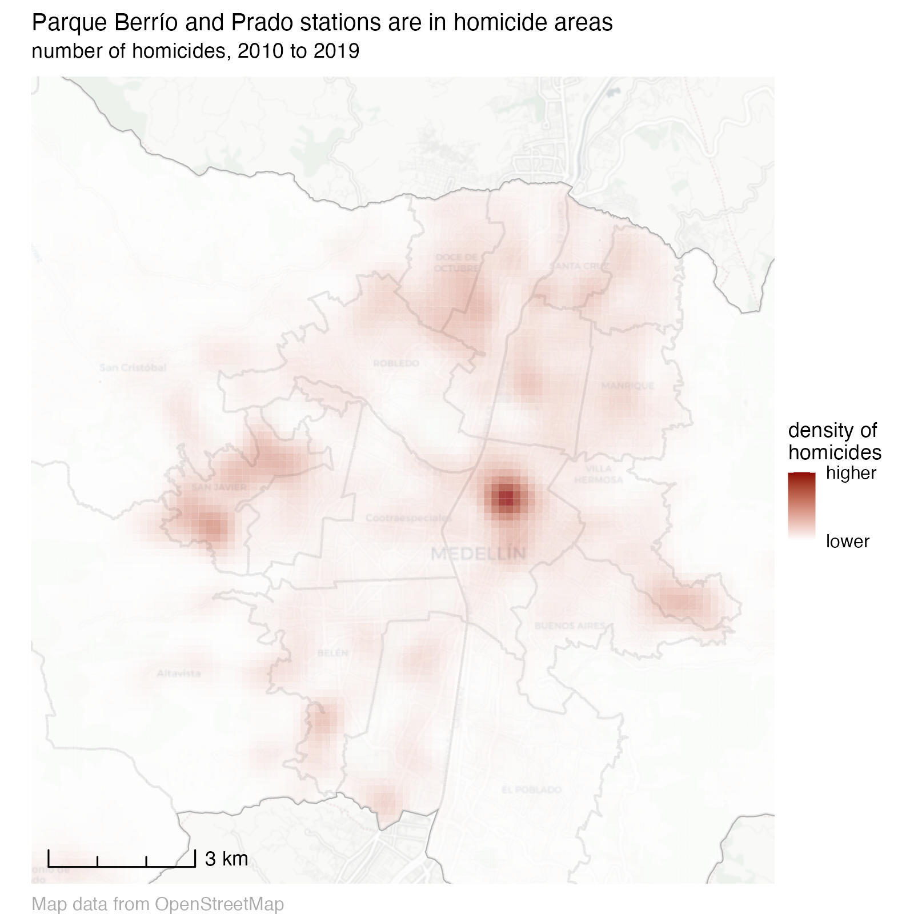
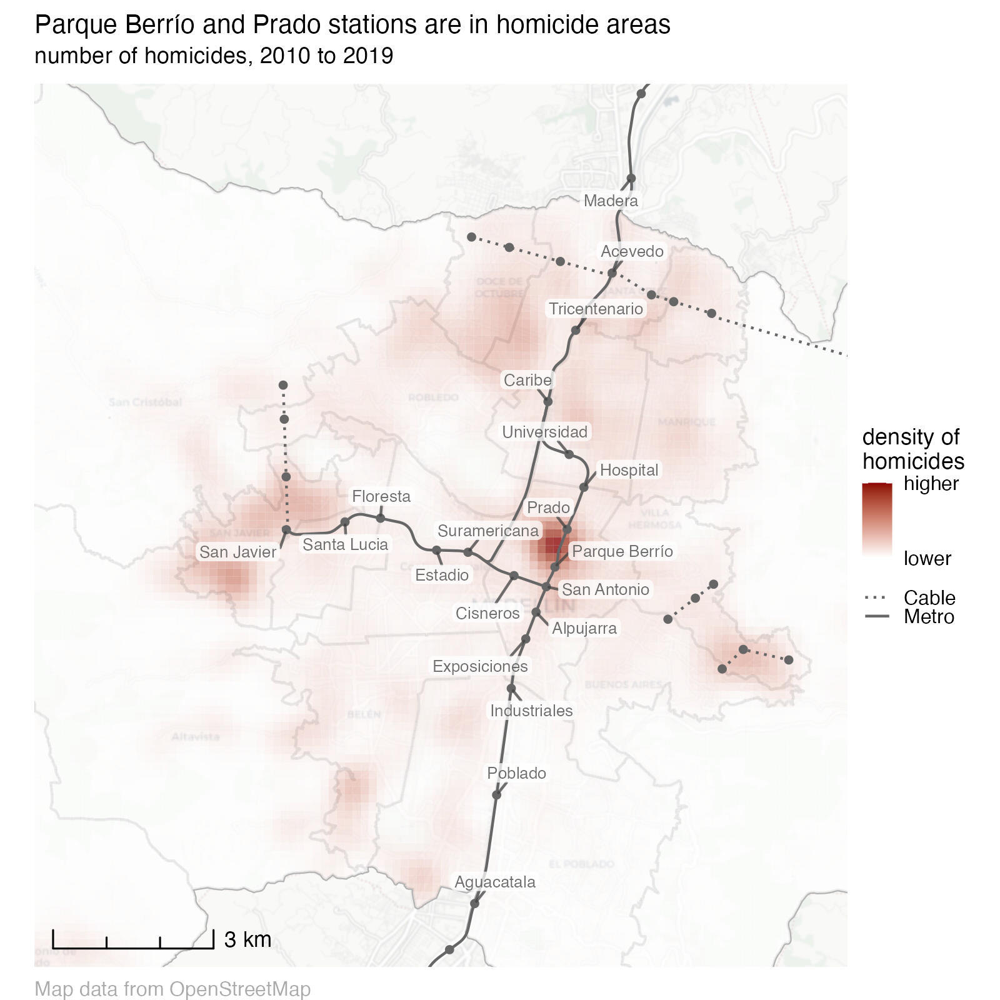
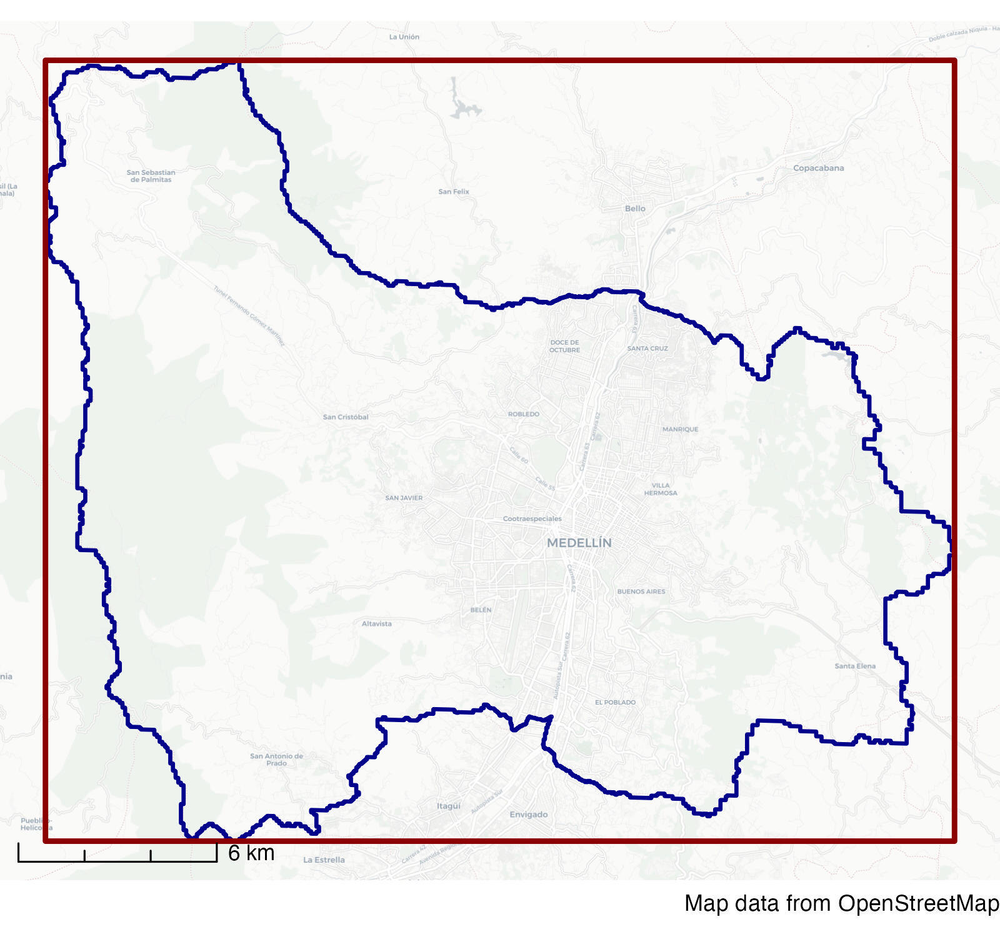

```{r setup, include=FALSE, cache=FALSE}
library(learnr)
knitr::opts_chunk$set(echo = FALSE)

# Load packages
library(ggspatial)
library(leaflet)
library(osmdata)
library(sf)
library(sfhotspot)
library(tidyverse)

# Copy files
if (!dir.exists("css")) dir.create("css")
walk(
  dir("../css/"), 
  ~ file.copy(str_glue("../css/{.}"), str_glue("css/{.}"), overwrite = TRUE)
)


# Load data --------------------------------------------------------------------

# Neighbourhoods
medellin_comunas <- read_sf("https://mpjashby.github.io/crimemappingdata/medellin_comunas.gpkg") |> 
  janitor::clean_names() |> 
  st_transform("EPSG:3115") |> 
  select(nombre, geom)

# Homicides
medellin_homicides <- read_csv2("https://mpjashby.github.io/crimemappingdata/medellin_homicides.csv") |> 
  remove_missing(vars = c("longitud", "latitud")) |> 
  st_as_sf(coords = c("longitud", "latitud"), crs = "EPSG:4326")

# Metro lines
metro_lines_file <- tempfile(fileext = ".zip")
download.file(
  url = "https://mpjashby.github.io/crimemappingdata/medellin_metro_lines.zip",
  destfile = metro_lines_file
)
unzip(metro_lines_file, exdir = tempdir())
medellin_metro_lines <- tempdir() |> 
  str_glue("/medellin_metro_lines.shp") |> 
  read_sf()

# Metro stations
medellin_metro_stns <- read_csv("https://mpjashby.github.io/crimemappingdata/medellin_metro_stns.csv") |> 
  mutate(
    nombre = str_remove(str_remove(nombre, "Estación "), " \\(Línea \\w\\)")
  ) |> 
  group_by(nombre) |> 
  summarise(across(everything(), first)) |> 
  st_as_sf(coords = c("x", "y"), crs = "EPSG:4326", remove = FALSE)

# Bus stops
# We are downloading this data direct from source for two reasons:
#   1. OSM is a live database and the results are likely to change over time.
#   2. The structure of the result object might change slightly, in which case
#      the tutorial should reflect what students will actually see.
# This obviously carries the risk that the data will stop being available or the
# API will be down when a student tries to use the tutorial.
la_candelaria_bbox <- medellin_comunas |> 
  filter(nombre == "LA CANDELARIA") |> 
  st_transform("EPSG:4326") |> 
  st_bbox()
bus_stops <- la_candelaria_bbox |> 
  opq() |> 
  add_osm_feature(key = "highway", value = "bus_stop") |> 
  osmdata_sf()
```


## Introduction

The purpose of most crime maps is to help people make decisions, be they 
professionals working out how best to respond to crime problems or citizens
holding local leaders to account. We can make it easier for people to make 
decisions by putting crime data into a relevant context. We have already started 
to do this by adding base maps, titles, legends and so on to our maps.

Since crime is concentrated in a few places, readers of our crime maps will 
often be interested in understanding what features of the environment are 
related to specific concentrations of crime in particular places. Where patterns 
of crime are related to particular facilities -- such as late-night violence 
being driven by the presence of bars selling alcohol -- it can be useful to 
highlight specific features on our maps.

As an example, imagine you are the manager responsible for security on the metro
network in Medellin, Colombia. There are several mountains within Medellin, so 
the city metro network consists of both railway lines in the valley and cable 
cars up the mountains. The security manager for the metro company will certainly 
analyse violence on the company's stations and vehicles, but may also be 
interested in which stations are in neighbourhoods that themselves have high 
levels of violence.

To help with this, you might produce a map showing the density of homicides 
recorded by local police.

```{r metro-homicides-map, eval=FALSE}
library(ggrepel)

medellin_homicides_density <- medellin_homicides |> 
  st_transform("EPSG:3115") |> 
  hotspot_kde(
    grid = hotspot_grid(medellin_comunas, cell_size = 150), 
    bandwidth_adjust = 0.25
  ) |> 
  st_intersection(medellin_comunas)

medellin_homicides_map1 <- ggplot() +
  annotation_map_tile(type = "cartolight", zoomin = 0, progress = "none") +
  geom_sf(
    data = medellin_comunas, 
    colour = "grey70", 
    fill = NA, 
    linewidth = 0.5
  ) +
  geom_sf(
    aes(fill = kde), 
    data = medellin_homicides_density, 
    alpha = 0.75, 
    colour = NA
  ) +
  annotation_scale(style = "ticks") +
  scale_fill_gradient(
    low = "white", 
    high = "darkred",
    breaks = range(pull(medellin_homicides_density, "kde")),
    labels = c("lower", "higher")
  ) +
  scale_linetype_manual(values = c("Metro" = "solid", "Cable" = "12")) +
  lims(x = c(-75.65, -75.525), y = c(6.19, 6.325)) +
  coord_sf(crs = "EPSG:4326") +
  labs(
    title = "Parque Berrío and Prado stations are in homicide areas",
    subtitle = "number of homicides, 2010 to 2019",
    caption = "Map data from OpenStreetMap",
    fill = "density of\nhomicides",
    linetype = NULL
  ) +
  theme_void() +
  theme(
    legend.key.height = unit(0.4, "lines"),
    legend.key.width = unit(0.8, "lines"),
    legend.text = element_text(size = rel(0.7)),
    legend.title = element_text(size = rel(0.8)),
    plot.title = element_text(size = rel(0.9)),
    plot.subtitle = element_text(size = rel(0.8), margin = margin(3, 0, 6, 0)),
    plot.caption = element_text(colour = "grey67", size = rel(0.7), hjust = 0)
  )

medellin_homicides_map2 <- medellin_homicides_map1 +
  geom_sf(
    aes(linetype = sistema), 
    data = medellin_metro_lines, 
    colour = "grey40"
  ) +
  geom_sf(data = medellin_metro_stns, size = 1, colour = "grey40") +
  geom_label_repel(
    aes(x = x, y = y, label = nombre),
    data = filter(medellin_metro_stns, linea %in% c("A", "B")),
    alpha = 0.75,
    colour = "grey25",
    fill = "white",
    label.padding = unit(0.1, "lines"),
    label.size = NA,
    min.segment.length = 0,
    size = 2.2
  ) +
  coord_sf(crs = "EPSG:4326")

ggsave(
  "inst/tutorials/10_place_data/images/medellin_homicides_map1.jpg",
  medellin_homicides_map1,
  units = "px",
  width = 1600,
  height = 1600
)

ggsave(
  "inst/tutorials/10_place_data/images/medellin_homicides_map2.jpg",
  medellin_homicides_map2,
  units = "px",
  width = 1600,
  height = 1600
)
```

<p class="full-width-image"></p>

This is an acceptable crime map: it shows the data in a reasonable way, places 
the data layer at the top of the visual hierarchy and provides suitable context 
in the title, legend etc. But it is a much less useful map than it could be 
because it doesn't show where the metro stations are and this information is not
included in the base map. A much better map would add extra layers of data 
showing the metro stations and the line connecting them.

<p class="full-width-image"></p>

From this second map, it is much easier to see that Parque Berrío and Prado 
stations are closest to an area with relatively high numbers of homicides.

In this tutorial we will learn how to find relevant data about places and add
extra layers to our maps to help readers understand the context within which
crimes occur. 

To get started, watch this video that walks through the code needed to download 
data from OpenStreetMap for use on our maps.


## Loading CSV data

Throughout this tutorial, we will use homicides in the Colombian city of 
Medellin as an example. Data on the locations of homicides in Medellin from 2010 
to 2019 is available at 
`https://mpjashby.github.io/crimemappingdata/medellin_homicides.csv`. 

In previous tutorials, we have used the `read_csv()` function from the `readr`
package to load data from CSV files. The `read_csv()` function assumes that (as
the name 'comma-separated values' suggests) the columns in a CSV file are
separated by commas (`,`). But not all countries use commas as the column 
separator in CSV files: some countries use semi-colons (`;`) instead. This is
usually because those countries also use commas instead of periods as the 
decimal separator inside numbers (so that the number three-point-one-four is
written `3,14` instead of `3.14` as in English). If commas are used as decimal 
separators in numbers in a file, commas cannot also be used to separate columns 
from one another -- otherwise there would be no way to know if a comma 
represented the decimal mark in a number or the boundary between two columns.

If we try to load a CSV file that uses semi-colon separators using the 
`read_csv()` function, all the data on each row will be loaded as a single
column:

```{r intro-exercise1, exercise=TRUE}
library(tidyverse)

medellin_homicides <- read_csv("https://mpjashby.github.io/crimemappingdata/medellin_homicides.csv")

head(medellin_homicides)
```

This is obviously not what we want, so we need to use a different function to
load this data. Fortunately, the `readr` package has another function that can
handle CSV files created using the conventions of countries that use semi colons
to separate columns: `read_csv2()`.

How should you know when to use `read_csv2()` rather than `read_csv()`? If you
don't know whether a file uses commas or semi colons to separate columns, the 
easiest thing is probably to use `read_csv()` first. Now load the file and
use `head()` to look at the first few rows: if you see all the data has
appeared in a single column that contains several semi colons, then you'll know
to change your code to use `read_csv2()` instead.

For this dataset, if you load it with `read_csv2()` you should find that the
structure of the data is more as you'd expect it to be.

```{r intro-exercise2, exercise=TRUE}
medellin_homicides <- read_csv2("https://mpjashby.github.io/crimemappingdata/medellin_homicides.csv")

head(medellin_homicides)
```

In the rest of this tutorial we will use data from different sources to better
understand clusters of homicides in the La Candelaria neighbourhood of downtown 
Medellin. 

<!--

Use this map (created with the `leaflet` package) to look around the
La Candelaria neighbourhood -- the markers show the locations of the metro
stations inside the neighbourhood boundary.

-->


```{r lacandelaria-map, message=FALSE, warning=FALSE, fig.asp=1, out.width="100%", eval=FALSE}
la_candelaria <- medellin_comunas |> 
  filter(nombre == "LA CANDELARIA") |> 
  st_transform("EPSG:4326") |> 
  mutate(nombre = str_to_title(nombre))

la_candelaria_bbox <- st_bbox(la_candelaria)

centro_metro_stns <- medellin_metro_stns |> 
  st_intersection(la_candelaria) |> 
  mutate(nombre = str_glue("{nombre} {str_to_lower(sistema)} station"))

leaflet() |> 
  fitBounds(
    lng1 = pluck(la_candelaria_bbox, "xmin"), 
    lat1 = pluck(la_candelaria_bbox, "ymin"), 
    lng2 = pluck(la_candelaria_bbox, "xmax"), 
    lat2 = pluck(la_candelaria_bbox, "ymax")
  ) |> 
  addProviderTiles(provider = "Esri.WorldStreetMap") |>
  addPolygons(
    data = la_candelaria,
    color = "darkblue",
    fill = NA
  ) |> 
  addPolylines(
    data = medellin_metro_lines, 
    color = "black", 
    opacity = 1, 
    weight = 2
  ) |> 
  addCircleMarkers(
    data = medellin_metro_stns, 
    color = NA, 
    fill = "black", 
    fillOpacity = 1, 
    radius = 3
  ) |> 
  addMarkers(
    data = centro_metro_stns, 
    label = ~ htmltools::htmlEscape(nombre),
    labelOptions = labelOptions(textsize = "16px")
  ) |> 
  addMiniMap(zoomLevelOffset = -3, toggleDisplay = TRUE)
```


### Check your understanding

```{r intro-quiz}
quiz(
  caption = "",
  
  question(
    "Which function should you use to load a CSV file of crime locations that uses semi-colons to separate the columns?",
    answer("`read_csv2()` from the `readr` package", correct = TRUE),
    answer(
      "`read_csv()` from the `readr` package",
      message = "`read_csv()` is used to load CSV files that use commas to separate columns."
    ),
    answer(
      "`read.csv2()` from the `base` package",
      message = "While the `read.csv2()` function from the `base` package will load CSV files that use semi-colons to separate columns, it is better to use a function from the `readr` package so that the loaded data will be in a tibble rather than a data frame, and so that text values will not be silently changed to categorical values."
    ),
    answer(
      "`read_sf()` or `st_read()` from the `sf` package",
      message = "CSV is not a spatial file format (even when it contains columns that represent co-ordinates), so it is best not to load them with functions from the `sf` package (which expect to handle spatial file formats). While `read_sf()` and `st_read()` can open CSV files, both functions assume all the columns contain text values, meaning you then have to use another function to convert column values to numbers, dates, etc."
    ),
    correct = random_praise(),
    allow_retry = TRUE,
    random_answer_order = TRUE
  )
  
)
```


## Finding data

If you are producing crime maps on behalf of a particular organisation such as
a police agency or a body responsible for managing a place, it is likely that
they will hold spatial data that is relevant to the local area. For example, 
many city governments will hold records of local businesses. It will sometimes
be necessary to track down which department or individual holds this data, and
it may also be necessary to convert data into formats that are useful for 
spatial analysis.

Some organisations may also have agreements to share data with others. For 
example, both universities and public agencies such as police forces in the
United Kingdom have agreements with the national mapping agency Ordnance Survey
to share a wide variety of spatial data. If you are producing maps on behalf of
an organisation, it will often be useful to ask what data they hold that might
be relevant, or ask for a specific dataset you think would help improve a map.


### Open data

*Open data* is data that is released by organisations or individuals that can be
freely used by others. Organisations such as local governments increasingly
release data about their areas as open data -- almost all of the data we have
used so far in this course is open data released by different local and national
governments.

Open data is extremely useful because you can skip the often lengthy and painful
process of getting access to data and wrangling it into a format you can use. 
This means you can move on much more quickly to analysing data, reaching
conclusions and making decisions. Watch this video to find out more about the
value of open data.


Open data is published in a wide variety of formats and distributed in different
ways. Some data might only be distributed by an organisation sending you a DVD
or memory stick. Most of the time, however, data will be released online.

Many cities (especially but not only in developed countries) now maintain 
open-data websites that act as a repository for all their open data. For 
example, the City of Bristol in England publishes the 
[Open Data Bristol website](https://opendata.bristol.gov.uk/pages/homepage/).
Anyone can use this website to download data on everything from population
estimates to politicians' expenses. Many of these datasets can be useful for
crime mapping. For example, you can download the locations of
[CCTV cameras](https://opendata.bristol.gov.uk/explore/dataset/council-cctv-cameras/information/)
(useful in criminal investigations),
[street lights](https://opendata.bristol.gov.uk/explore/dataset/streetlights-and-street-furniture/information/)
(relevant to designing out crime) and the [catchment areas of secondary schools](https://opendata.bristol.gov.uk/explore/dataset/secondary-school-areas-of-first-priority/information/)
(helpful if a crime-prevention strategy includes visits to schools).

Different local governments may use different terms for the same types of 
information, so it sometimes takes some trial and error to find if a particular
dataset is available. Some data might also be held by organisations other than
the main local government agency for a particular place. For example, data on
the locations of electricity substations (useful if you are trying to prevent
metal thefts from infrastructure networks) might be held by a power company. All
this means that tracking down a particular dataset might require some detective
work.

To try to make this process easier, some countries have established national
open-data portals such as 
[Open Data in Canada](https://open.canada.ca/en/open-data/), 
[Open Government India](https://data.gov.in/),
[data.gov.uk in the United Kingdom](https://data.gov.uk/) 
and [data.gov in the United States](https://www.data.gov/). There are also
international repositories such as the 
[African Development Bank Data Portal](https://dataportal.opendataforafrica.org/),
[openAfrica](https://africaopendata.org/), the 
[Open Data Network](http://www.opendatanetwork.com/) and 
[Data Portals](https://dataportals.org/), which seeks to list all the open data
portals run by different governments and other organisations.


### Citing data

Organisations that provide data often do so on condition that users of the data
follow certain rules. For example, you can use data on the Open Data Bristol 
website as long as you follow the conditions of the 
[Open Government Licence](http://www.nationalarchives.gov.uk/doc/open-government-licence/version/3/).
The most-common requirement of an open-data licence is that anyone using the 
data acknowledges the data source in any maps, reports or other outputs they 
produce. In the case of the Open Government Licence, users of the data are 
required to add a declaration to any outputs declaring:

> Contains public sector information licensed under the Open Government Licence
> v3.0.

Complying with open-data licences is a legal requirement, so it is important to
make sure you understand what obligations you are accepting when you use a 
particular dataset. You can typically find the conditions for using a dataset on
the website that you download the data from. If you are required to add an
attribution statement to your maps, a good place to do this is by adding it to
any other information you place in the `caption` argument of the `labs()` 
function in a `ggplot()` stack.


### Check your understanding

```{r open-data-quiz}
quiz(
  caption = "",
  
  question(
    "Which one of these statements about open data is true?",
    answer("We can use open data for any purpose as long as we comply with the requirements of the licence the data is released under.", correct = TRUE),
    answer(
      "We can use open data for any purpose -- there is no need to acknowledge the source of the data.",
      message = "While we can often use open data for almost any purpose, it is important to comply with the requirements of the licence the data was released under. Most open-data licences include a requriement to acknowledge the source of the data."
    ),
    answer(
      "We can use open data, but only for non-commercial purposes.",
      message = "Most open data licences allow us to use data for both commercial and non-commercial purposes, as long as we comply with the other requirements of the licence -- most often this includes a requriement to acknowledge the source of the data."
    ),
    answer(
      "We can download open data but we cannot use it for any project that will be published online.",
      message = "Organisations usually publish open data to make it easier for other organisations and individuals to use that data to make products and analyse local issues. It would be extremely unusual for an open-data licence to stop people from using the data in a project that was going to be published online."
    ),
    correct = random_praise(),
    allow_retry = TRUE,
    random_answer_order = TRUE
  )
  
)
```


## Shapefiles

In this course we have used spatial data provided in different formats including
geopackages (`.gpkg`) and geoJSON (`.geojson`) files, as well as creating 
spatial objects from tabular data in formats like CSV and Excel files. But there 
is one spatial-data format that we haven't yet learned to use: the *shapefile*.

The shapefile format was created by Esri, the company that makes the ArcGIS 
suite of mapping software. It was perhaps the first spatial format that could be
read by a wide variety of mapping software, which meant that lots of providers
of spatial data began to provide data in shapefile format. Shapefiles are 
limited in various ways that mean they are unlikely to be a good choice for 
storing your own data, but it is important to know how to use them because many
spatial datasets are still provided as shapefiles for historical reasons.

One of the complications of using shapefiles (and why they're not a good choice
for storing your own data) is that different parts of the data are stored in 
separate files. So while the co-ordinates of the points, line or polygons are
stored in a file with a `.shp` extension, the non-spatial attributes of each
spatial feature (such as the date on which a crime occurred or the name of a
neighbourhood) are stored in a separate file with a `.dbf` extension and details
of the co-ordinate reference system are stored in a `.prj` file -- a single 
dataset might be held in up to 16 separate files on a computer. All the files 
that make up a shapefile have the same file name, differing only in the file 
extension (e.g. `.shp`, `.dbf`, etc.). For example, if a `.shp` file is called
`robberies.shp` then it will be accompanied by a file called `robberies.dbf` and
one called `robberies.prj`, as well as a `robberies.shx` index file and possibly
several others. All these separate files make it more-complicated to manage 
shapefiles than other spatial file formats such as the geopackage.

Because storing spatial data in a shapefile requires multiple different files,
shapefile data is usually distributed in a `.zip` file that contains all the
component files. This means that to access a shapefile will have to add a step 
to our usual routine for downloading and opening a data file. To minimise the
hassle associated with using shapefiles, in general we will:

  1. download the `.zip` file if we don't have a local copy already,
  2. create a temporary directory where we can store the unzipped shapefile, so
     we can save space on our computers by only permanently keeping the (often
     much smaller) `.zip` file,
  3. unzip the `.zip` file into the temporary directory,
  4. load the shapefile data from the temporary directory.

For example, the routes of metro lines in Medellin are available in shapefile
format at: 

```
https://mpjashby.github.io/crimemappingdata/medellin_metro_lines.zip
```


To load the data from this file, we can use the process shown above.

::: {.tutorial}

Unfortunately it isn't possible to run this code within this interactive 
tutorial because of security restrictions on saving files on your computer from 
within a tutorial. You can test this code by copying it into a new R Script in 
RStudio and running the code from there. Note that this code assumes you have
already loaded the `sf` and `tidyverse` packages.

:::


```r
# Step 1: download the .zip file to a temporary file
metro_lines_file <- tempfile(fileext = ".zip")
download.file(
  url = "https://mpjashby.github.io/crimemappingdata/medellin_metro_lines.zip", 
  destfile = metro_lines_file
)

# Step 2: create a temporary directory
# The `tempdir()` function returns a location on your computer that is used for
# storing temporary files. *Any files stored in this temporary directory will be
# deleted when you restart your computer*, so it's a useful place to put files
# that you will only need for a short time so they won't clutter up your
# computer. Since we want to store the shapefile in a sub-directory of the
# temporary directory, we will use `str_glue()` to add a relevant sub-directory
# name to the end of the temporary directory name -- `unzip()` will then
# create this directory in the background at Step 3.
metro_lines_dir <- str_glue("{tempdir()}/metro_lines")

# Step 3: unzip file
unzip(metro_lines_file, exdir = metro_lines_dir)

# Step 5: load the data
medellin_metro_lines <- metro_lines_dir |> 
  str_glue("/medellin_metro_lines.shp") |> 
  read_sf()
```


::: {.box .notewell}

Note that although a shapefile consists of several different files, we only need
to load the file with the extension `.shp` -- the `read_sf()` function will find
all the data it needs from the other files.

Once we have loaded a shapefile into R using `read_sf()`, we can treat it in the
same way as any other spatial dataset -- it is only loading shapefiles that is
different from other spatial data formats.

:::


<div class="box extra-detail">

<h5 id="shapefile-box1-title" class="box-title">How did you know the name of the `medellin_metro_lines.shp` file?</h5>

<div id="shapefile-box1" class="box-content">

If you need to find out the name of the shapefile within the zip file, you can
use the `list = TRUE` argument to the `unzip()` function to produce a list of
files that are inside the zip file rather than unzip any files. For example, the
code `unzip(metro_lines_file, list = TRUE)` would produce a data frame of file
names:

```{r}
metro_lines_file |> unzip(list = TRUE) |> knitr::kable()
```

**Make sure you run `unzip(metro_lines_file, list = TRUE)` in the R console
rather than in your script file, to minimise the amount of unnecessary output
that your script produces.**

</div>

</div>

<script>
$("#shapefile-box1-title").click(function () { $("#section-shapefile-box1").toggle("slow") })
</script>


<!-- ### Check your understanding -->

<!-- ```{r open-data-quiz} -->
<!-- quiz( -->
<!--   caption = "", -->

<!--   question( -->
<!--     "", -->
<!--     answer("", correct = TRUE), -->
<!--     answer( -->
<!--       "", -->
<!--       message = "" -->
<!--     ), -->
<!--     answer( -->
<!--       "", -->
<!--       message = "" -->
<!--     ), -->
<!--     answer( -->
<!--       "", -->
<!--       message = "" -->
<!--     ), -->
<!--     correct = random_praise(), -->
<!--     allow_retry = TRUE, -->
<!--     random_answer_order = TRUE -->
<!--   ) -->

<!-- ) -->
<!-- ``` -->


## Data from OpenStreetMap

<a href="https://www.openstreetmap.org/"></a>

Often we can get map data from the organisation we are working for, or from 
open-data portals run by governments or international organisations. But 
sometimes they won't hold the information we need.

Fortunately, there is another source of data: OpenStreetMap (OSM). This is a
global resource of map data created by volunteers (and started at UCL), using a
mixture of open data from governments, data contributed by charities and data 
collected by the volunteers themselves. Watch this video to learn a bit more 
about OpenStreetMap.


We have already used OSM data in this course: all of the base maps we have used
when we create maps with `ggplot()` are based on data from OpenStreetMap. But
we have very little control over which information is and is not included in
base maps. Sometimes we need more control over the data, and that means 
downloading data direct from OSM.

We can download OSM data into R using the `osmdata` package. This package allows 
us to choose particular features from the billions of features worldwide that 
are included in the OSM database. To choose features, we must:

  1. specify the _bounding box_ of the area we want to download data for using 
     the `opq()` function,
  2. specify what type of features we want to download using the
     `add_osm_feature()` function,
  3. download the data using the `osmdata_sf()` function, and
  4. extract the type of spatial object (points, lines or polygons) that we are
     interested in.

Imagine that in your analysis of homicides in Medellin, you have been asked
to consider the question of whether homicides are clustered near to bus stops.
To answer this question, we need to know the locations of bus stops in the area
we are interested in. This information is not published as open data by the
Medellin city authorities. Fortunately we can extract bus-stop locations from 
OpenStreetMap using the `osmdata` package.

To do this, we first need to calculate the bounding box of the La Candelaria 
neighbourhood that we are interested in. A bounding box is the smallest 
rectangle that a particular spatial shape will fit inside. For example, the
red rectangle on this map shows the bounding box of the city of Medellin (shown
in blue).

```{r bbox-map, eval=FALSE}
medellin_boundary <- medellin_comunas |> 
  st_transform("EPSG:4326") |> 
  st_buffer(10) |> 
  st_union() |> 
  st_as_sf()

medellin_bbox <- medellin_boundary |> 
  st_bbox() |> 
  st_as_sfc() |> 
  st_as_sf()

medellin_bbox_map <- ggplot() +
  annotation_map_tile(type = "cartolight", zoomin = 1, progress = "none") +
  geom_sf(
    data = medellin_boundary, 
    colour = "darkblue", 
    fill = NA, 
    linewidth = 0.75
  ) +
  geom_sf(data = medellin_bbox, colour = "darkred", fill = NA, linewidth = 1) +
  annotation_scale(style = "ticks", location = "bl") +
  labs(caption = "Map data from OpenStreetMap") +
  theme_void()

ggsave(
  "inst/tutorials/10_place_data/images/medellin_bbox_map.jpg",
  medellin_bbox_map,
  units = "px",
  width = 1600,
  height = 1500
)
```

<p class="full-width-image"></p>


You can calculate the bounding box of an SF object using the `st_bbox()` 
function.

::: {.tutorial}

Assuming we have already loaded the neighbourhood boundaries into an object 
called `medellin_comunas`, write the code needed to filter that object so that 
only the boundary for the La Candelaria neighbourhood is included, then
calculate the bounding box for that layer and store it in an object called
`la_candelaria_bbox`. 

Note that the `medellin_comunas` object uses the Colombia MANGA West Zone
co-ordinate system (EPSG code 3115), but the `osmdata` package only works with
bounding boxes specified as longitudes and latitudes. This means you will also
need to transform the dataset to use the WGS84 co-ordinate system (EPSG code
4326) before you calculate the bounding box.


```{r osm-exercise1, exercise=TRUE}

```

```{r osm-exercise1-hint-1}
# You can use the `filter()` function to filter only the rows of data that you 
# want to keep in the data
```

```{r osm-exercise1-hint-2}
# Remember to use `st_transform()` to make sure the data uses the correct
# co-ordinate system. You can use the `st_bbox()` function to calculate the 
# bounding box of the 52nd division boundary.
```

```{r osm-exercise1-hint-3}
# If you need to find out the name of the relevant variable in the 
# `medellin_comunas` object, you can use `head(medellin_comunas)` to see the 
# first few rows.
```

:::


```{r osm-exercise1-hint-4}
la_candelaria_bbox <- medellin_comunas |> 
  filter(nombre == "LA CANDELARIA") |> 
  st_transform("EPSG:4326") |> 
  st_bbox()

head(la_candelaria_bbox)
```

The second thing we need to know is what search terms to use in the 
`add_osm_feature()` function to return the locations of bus stops. 
OpenStreetMap has hundreds of feature categories, all in the format 
`key=value`. Sometimes we will only need to search for a particular 
key (category of feature), such as the 
[`highway` key](https://wiki.openstreetmap.org/wiki/Key:highway) that 
contains all the features that show roads (from motorways to winding lanes
leading to farms in the countryside), tracks and paths. In other cases, we will 
want to search for a particular value (type of feature within a category), such 
as searching for the value 
[`natural=water`](https://wiki.openstreetmap.org/wiki/Tag:natural%3Dwater) to
search for lakes, rivers, etc. 

The best place to find out how a feature you are interested in is recorded in 
the OSM database is to look at the
[OpenStreetMap Wiki](https://wiki.openstreetmap.org/wiki/Map_features). 
Bus stops are recorded in OSM using the tag `highway=bus_stop`.

Now that we know the bounding box of the area we are interested in and the tag
for the type of feature we want, we can download the data from OpenStreetMap.

```{r osm-exercise2, exercise=TRUE}
# Define the bounding box of the area we want to search
bus_stops <- opq(la_candelaria_bbox) |> 
  # Define the features we want
  add_osm_feature(key = "highway", value = "bus_stop") |> 
  # Download those features for that area
  osmdata_sf()

# Print the result (note the result is not a data frame, so we cannot use the
# `head()` function)
bus_stops
```

You'll see that the object `bus_stops` has quite complicated structure, but 
that nested within it is an object called `osm_points` that is an SF object with
`r scales::comma(nrow(bus_stops$osm_points))` rows and another SF object called 
`osm_polygons`. Even within a particular type of feature, some places might be
represented as points (e.g. a point placed at a bus stop) while others are 
represented as polygons (e.g. the outline of a bus station).

We can use the `pluck()` function from the `purrr` package (part of the 
tidyverse) to extract the parts of the `bus_stops` object that we want. If we 
extract the SF object called `osm_points` and look at the first few rows using 
`bus_stops |> pluck("osm_points") |> head(n = 5)`, we can see:

```{r}
bus_stops |> pluck("osm_points") |> head(5)
```

We can see from this that most of the fields are blank, but there is a `name`
column and a `geometry` column that we can use to plot the locations of the
bus stops.

We also need to check the contents of the `osm_polygons` layer inside the 
`bus_stops` object, to see if it contains details of a any more bus stops that
are not included in the `osm_points` layer. 


::: {.tutorial}

Type the code needed to extract the `osm_polygons` layer and view the first few 
rows.

```{r osm-exercise3, exercise=TRUE}

```

:::


::: {.book}

To check this, we can again use the `pluck()` function:

:::


```{r osm-exercise3-solution}
bus_stops |> pluck("osm_polygons") |> head(5)
```

In this case, we can see that there are 
`r scales::comma(nrow(bus_stops$osm_polygons))` rows in the `osm_polygons`
object. In cases where we have data contained in both the `osm_points` and 
`osm_polygons` layers, we need to merge the two layers by converting the polygon 
layer to a point layer using the `st_centroid()` function and then  merging the 
two layers using the `bind_rows()` function from the `dplyr` package. We can put 
all this together into one piece of code.

```{r osm-exercise4, exercise=TRUE}
bind_rows(
  pluck(bus_stops, "osm_points"), 
  st_centroid(pluck(bus_stops, "osm_polygons"))
)
```


<div class="box extra-detail">

<h5 id="osm-box1-title" class="box-title">What does the warning `st_centroid assumes …` mean?</h5>

<div id="osm-box1" class="box-content">

You might have seen a warning saying 
`st_centroid assumes attributes are constant over geometries of x`. You will see
this warning when you use the `st_centroid()` function. It is there to remind
you that columns in the original data (which the SF package refers to as the
_attributes_ associated with each spatial feature) refer to the polygon as a 
whole, but in the object produced by `st_centroid()` it will appear that the
columns relate to the centroid point. In many cases this will not be a problem,
but it could expose you to the ecological fallacy so it is sometimes useful to 
be reminded.

</div>

</div>

<script>
$("#osm-box1-title").click(function () { $("#section-osm-box1").toggle("slow") })
</script>


This code references the `bus_stops` object twice, which means we cannot use
this code within a pipeline in the usual way. This means it will be necessary to
save the result produced by `osmdata_sf()` in an object and then combine the
points and polygon centroids in a separate piece of code.


::: {.tutorial}

We now have everything we need to map homicides in La Candelaria in relation to 
bus stops. Create a map showing a suitable base map, the density of 
homicides in the La Candelaria neighbourhood, the locations of bus stop as 
individual points and the boundary of the neighbourhood.

You will need to:

  1. Create an object holding the boundary of the La Candelaria neighbourhood.
     Remember the boundaries of Medellin neighbourhoods are contained in the
     `medellin_comunas` object.
  2. Estimate the density of homicides in the La Candelaria neighbourhood. The
     homicide locations are stored in the `medellin_homicides` object, although
     you will probably want to extract only those in La Candelaria before
     estimating the density.
  3. Extract the bounding box of the neighbourhood boundary and use that to get
     the locations of bus stops, taking into account that some bus stops might 
     be stored in the OSM database as points and others as polygons.
  4. Create a map showing the density of homicides, the locations of bus stops
     and the boundary of the neighbourhood.


```{r osm-exercise5, exercise=TRUE, message=FALSE, warning=FALSE, exercise.lines=68, fig.asp=1, out.width="100%"}

```

:::


::: {.book}

Now that we have everything we need, we can create a map of homicides in La
Candelaria.

:::


```{r osm-exercise5-solution}
# There are lots of design decisions you could make in producing a map -- the
# following code is a minimal map, which you could improve on in several ways

# Create neighbourhood boundary
la_candelaria <- medellin_comunas |> 
  filter(nombre == "LA CANDELARIA") |> 
  # This object needs to use the same co-ordinate system as `medellin_homicides`
  # so we can use `st_intersection()`, so transform it first
  st_transform("EPSG:3115")

# Estimate homicide density
la_candelaria_homicide_density <- medellin_homicides |> 
  st_transform("EPSG:3115") |> 
  # Extract only those homicides occurring within the La Candelaria 
  # neighbourhood boundary (otherwise `hotspot_kde()` will be very slow)
  st_intersection(la_candelaria) |> 
  hotspot_kde(
    grid = hotspot_grid(la_candelaria, cell_size = 100), 
    bandwidth_adjust = 0.33,
    quiet = TRUE
  ) |> 
  st_intersection(la_candelaria)

# Get bus stop locations
bus_stops <- la_candelaria |> 
  # `opq()` needs longitude/latitude co-ordinates, so transform before 
  # calculating the bounding box
  st_transform("EPSG:4326") |> 
  st_bbox() |> 
  opq() |> 
  # Define the features we want
  add_osm_feature(key = "highway", value = "bus_stop") |> 
  # Download those features for that area
  osmdata_sf()

# Extract bus stop locations as points
bus_stop_points <- bind_rows(
  pluck(bus_stops, "osm_points"), 
  st_centroid(pluck(bus_stops, "osm_polygons"))
)

# Plot map
ggplot() +
  annotation_map_tile(type = "cartolight", zoomin = 0, progress = "none") +
  geom_sf(
    aes(fill = kde), 
    data = la_candelaria_homicide_density, 
    alpha = 0.7, 
    colour = NA
  ) +
  geom_sf(data = la_candelaria, colour = "grey40", fill = NA, linewidth = 1.5) +
  geom_sf(data = bus_stop_points, colour = "darkred") +
  scale_fill_distiller(
    direction = 1, 
    breaks = range(pull(la_candelaria_homicide_density, "kde")),
    labels = c("lower", "higher")
  ) +
  labs(
    caption = str_glue(
      "Contains data from OpenStreetMap\n",
      "Homicide data: Alcaldía de Medellín (CC-BY-SA)"
    ),
    fill = "homicide\ndensity"
  ) +
  # We can add the `fixed_plot_aspect()` function to the `ggplot()` stack to
  # force the map to be square, rather than a rectangle
  fixed_plot_aspect() +
  theme_void()
```

From this map, it looks like homicides do not cluster particularly around bus
stops. This would probably be welcome information for the city's public 
transport managers.


::: {.box .notewell}

Just as with other sources of map data, you are legally required to 
[cite data from OpenStreetMap](https://wiki.openstreetmap.org/wiki/Draft_Attribution_Guideline)
if you use it. The code in the exercise above, for example, cites data from two
sources:

  * "Contains data from OpenStreetMap" acknowledges that both the base map and
    the bus-stop locations were obtained from OpenStreetMap.
  * "Homicide data: Alcaldía de Medellín (CC-BY-SA)" acknowledges that the
    Medellin homicide data were released by the Mayor of Medellin under the
    [Creative Commons Attribution Share-alike](https://opendefinition.org/licenses/cc-by-sa/) 
    (CC-BY-SA) licence.

:::


<p class="credits">The OpenStreetMap logo is a trademark of the OpenStreetMap Foundation, and is used with their permission. This tutorial not endorsed by or affiliated with the OpenStreetMap Foundation.</p>


## In summary


::: {.box .welldone}

In this tutorial we have learned how to find open data, including data from
OpenStreetMap, and add it to our maps to help readers better understand crime 
patterns. We will be able to use these skills to add data to future maps that
we make so that readers can gain more insight into crime patterns or other
phenomena that we might be analysing.

:::


::: {.box .reading}

To find out more about the skills we have worked on in this tutorial, you may
want to read:

  * [a paper exploring how open crime data can be used in researching crime](https://doi.org/10.1080/15230406.2014.972456), and
  * [a more-detailed introduction to the `osmdata` package written by Mark Padgham and Robin Lovelace](https://docs.ropensci.org/osmdata/articles/osmdata.html).

:::

