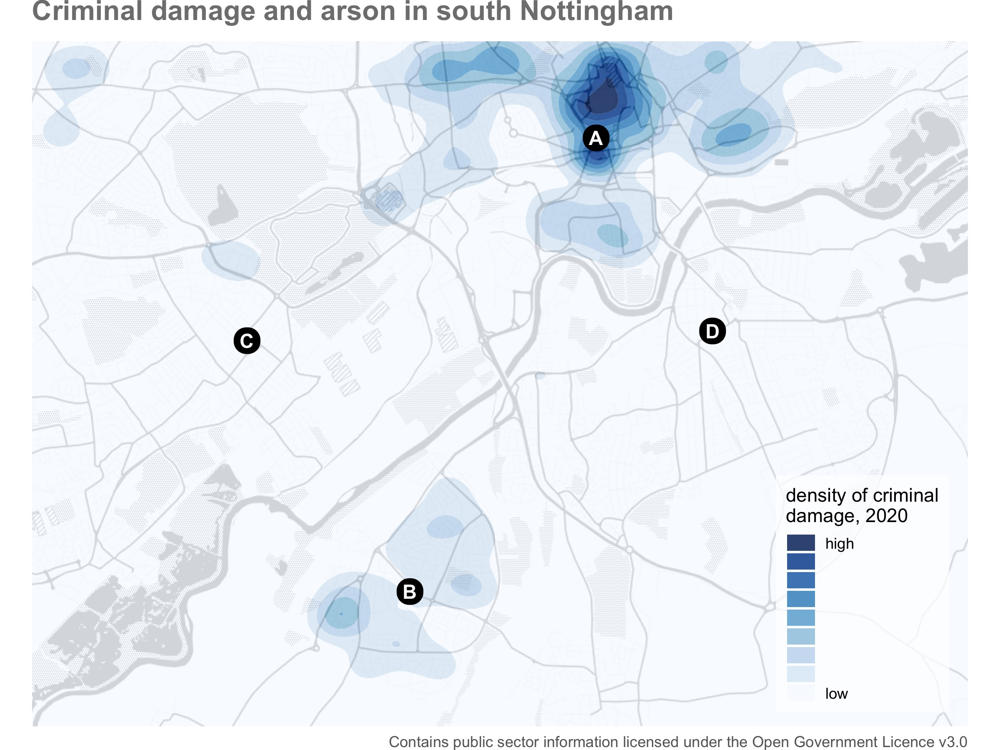
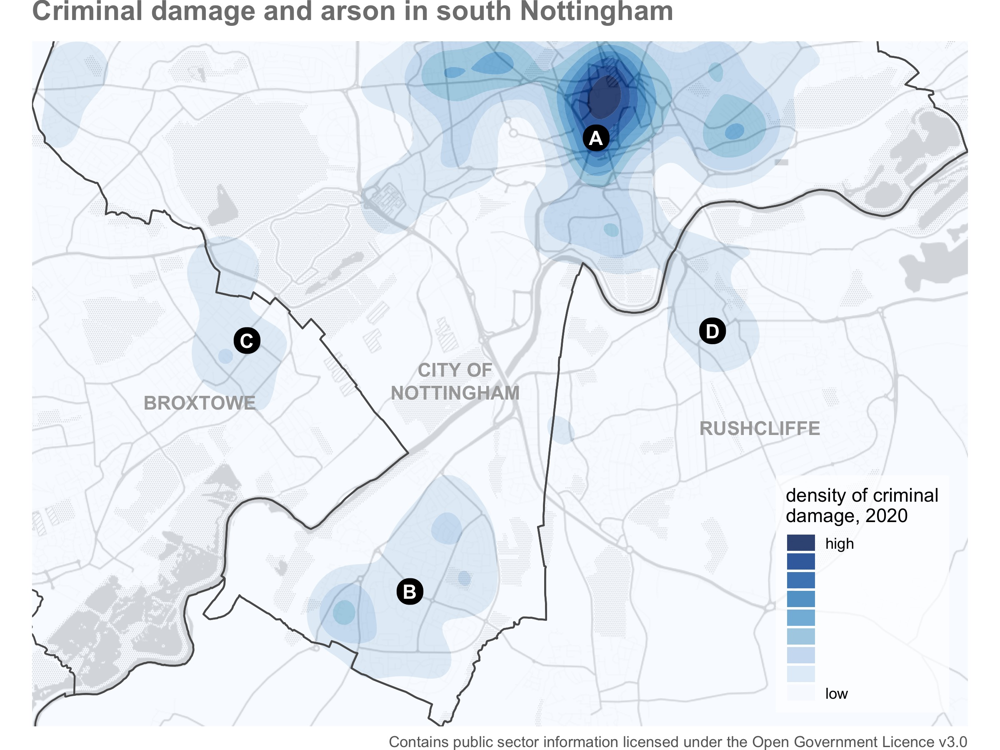
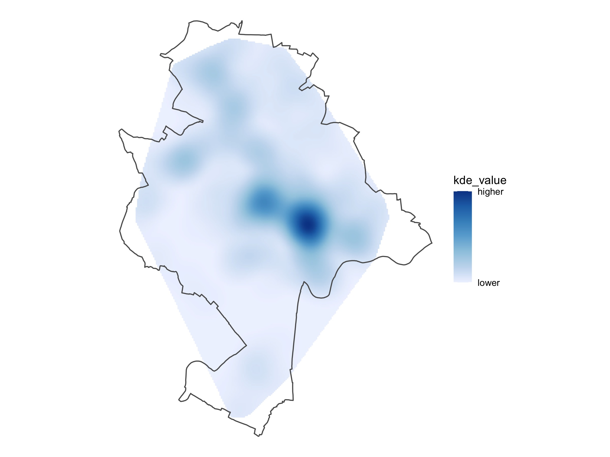
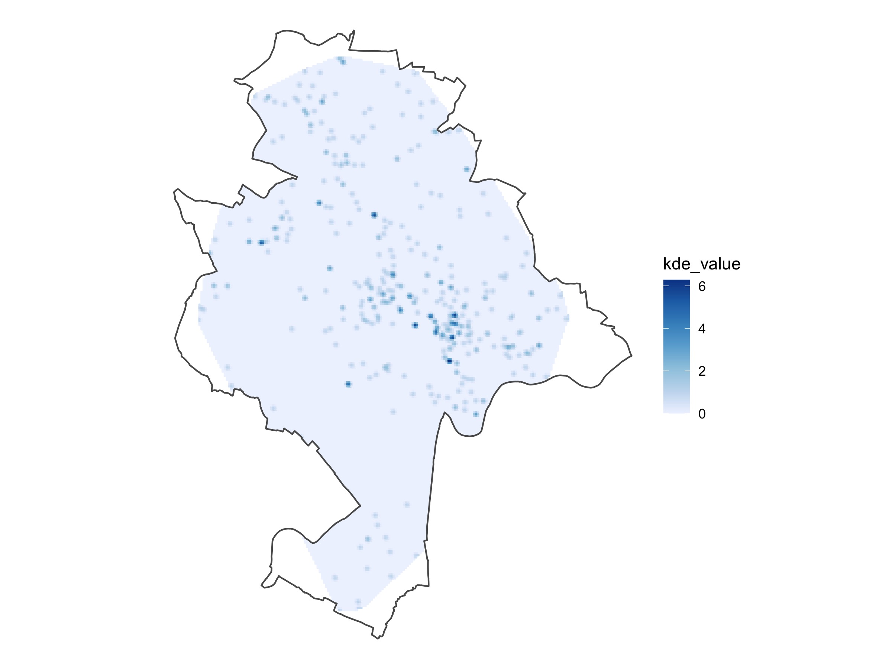

```{r setup, include=FALSE, message=FALSE, warning=FALSE}
library(learnr)
tutorial_options(exercise.timelimit = 120)
knitr::opts_chunk$set(echo = FALSE)

# Load packages
library(ggmap)
library(ggspatial)
library(osmdata)
library(sf)
library(spdep)
library(SpatialKDE)
library(tidyverse)

# Copy files
if (!dir.exists("css")) dir.create("css")
walk(
  dir("../css/"), 
  ~ file.copy(str_glue("../css/{.}"), str_glue("css/{.}"), overwrite = TRUE)
)

# Load data
districts <- read_sf("../../extdata/nottinghamshire_districts.gpkg")

nottingham_boundary <- districts %>% 
  filter(district_name == "Nottingham") %>% 
  st_transform(27700)

wards <- read_sf("https://github.com/mpjashby/crimemapping/raw/main/inst/extdata/nottingham_wards.gpkg") %>% 
  filter(ward_name %in% c("Castle", "Lenton & Wollaton East", "Meadows"))

wards_grid <- wards %>% 
  st_transform(27700) %>% 
  create_grid_rectangular(cell_size = 50)

weapons <- read_sf("https://github.com/mpjashby/crimemapping/raw/main/inst/extdata/nottingham_weapons.gpkg") %>% 
  st_transform(27700)

weapons_grid <- create_grid_rectangular(weapons, cell_size = 50)

weapons_kde <- kde(weapons, band_width = 100, grid = weapons_grid)

burglaries <- read_csv("https://github.com/mpjashby/crimemapping/raw/main/inst/extdata/nottingham_burglaries.csv.gz") %>% 
  st_as_sf(coords = c("longitude", "latitude"), crs = 4326) %>% 
  st_intersection(wards)

if (file.exists("www/nottingham_buildings.Rds")) {
  nottingham_buildings <- read_rds("www/nottingham_buildings.Rds")
} else {
  nottingham_buildings <- wards %>% 
    st_bbox() %>% 
    opq() %>% 
    add_osm_feature(key = "building") %>% 
    osmdata_sf()
}
```


## What is a hotspot?

Crime is heavily concentrated in several different ways. A small number of 
offenders commit a large proportion of crime (even though most people commit 
offences occasionally) and a small number of people are repeatedly victimised.
For most types of crime, a large proportion of crime occurs in a small number of
places. ** ["A hotspot is a specific location or small area where an unusual amount of criminal activity occurs"](http://www.justiceacademy.org/iShare/Library-CrimeMappingNews/Vol2Issue2.pdf)**.

Crime hotspots can occur in several different forms. Watch this video to 
understand why hotspots are important in understanding and responding to crime.


<!-- Some places are *chronic* hotspots -- they have more crime than surrounding  -->
<!-- areas over a sustained period (which may appear to be permanent). Chronic  -->
<!-- hotspots are often generated by a facility that draws vulnerable people into an -->
<!-- area, such as a tourist attraction that draws crowds of people who are  -->
<!-- vulnerable to pickpocketing. Other places are *acute* hotspots, in which crime -->
<!-- increases in a place that previously experienced no or few crimes. This may be -->
<!-- the result of some change in the environment or how it's managed, such as new -->
<!-- management at a bar that ignores drug dealing that the previous owners would  -->
<!-- have not permitted. -->

When analysing hotspots, it is best to focus on *small* areas such as an
apartment block, a shopping centre, a park or a single street. Focusing on 
smaller areas is important because resources to respond to crime are almost 
always limited, so it is important that those resources are directed where the
problem is worst. Analysing larger areas, such as a neighbourhood or a police 
sector, is much more difficult because larger areas are always made up of many
smaller areas, each of which might be quite different from one another. This 
means that the factors causing one street to be a hotspot might be quite 
different from the factors that make another street in the same district into a
hotspot. Conflating different problems with different causes makes it much
harder to find effective ways to reduce crime in any one place. This can be 
avoided by keeping hotspots small: in an urban area, a useful rule of thumb is
that you should be able to stand in the middle of a hotspot and see the whole
hotspot area.

Being able to identify hotspots using crime mapping is important because it 
forms a vital first step in many place-focused responses to crime. As an example
of this, watch this video about how police in Philadelphia worked with 
researchers to use crime mapping to identify where to deploy foot patrols to
reduce crime.


## Better density maps

We have already learned to use density maps to highlight areas with relatively
high levels of crime. So far, we've relied on the `geom_density_2d_filled()`
function from the `ggplot2()` package to estimate the density of crime in 
different regions of our maps. This approach is quick, but it has some 
drawbacks.

One of the limitaions of estimating density using `geom_density_2d_filled()` is
that it estimates density for every point on the map, whether or not we have
data for that area. This map of criminal damage and arson offences in part of
Nottingham in England clearly shows that these offences are concentrated in the
city centre (area A), with another concentration in the suburb of Clifton (area
B). Conversely, areas C and D look like they have a very low density of these
offences.

```{r notts-damage-map, include=FALSE, message=FALSE, warning=FALSE}
if (
  !file.exists("images/nottingham_damage.jpg") |
  !file.exists("images/nottinghamshire_damage.jpg")
) {
  
  city_damage <- read_sf("../../extdata/nottingham_damage.gpkg")
  county_damage <- read_sf("../../extdata/nottinghamshire_damage.gpkg")
  
  map_crop <- districts %>% 
    filter(district_name == "City of\nNottingham") %>% 
    st_bbox() %>% 
    set_names(c("left", "bottom", "right", "top")) %>% 
    {
      .[["top"]] <- 52.96
      .
    }
  
  districts_crop <- districts %>% 
    filter(
      district_name %in% c("Broxtowe", "City of\nNottingham", "Rushcliffe")
    ) %>% 
    st_crop(map_crop)
  
  points <- tribble(
    ~longitude, ~latitude, ~label,
    -1.150, 52.950, "A",
    -1.182, 52.903, "B",
    -1.210, 52.929, "C",
    -1.130, 52.930, "D"
  ) %>% 
    st_as_sf(coords = c("longitude", "latitude"), crs = 4326)
  
  city_map <- map_crop %>% 
    get_stamenmap(zoom = 13, maptype = "toner-background") %>% 
    ggmap() +
    geom_density2d_filled(
      aes(longitude, latitude), 
      data = city_damage, 
      na.rm = TRUE,
      bins = 9, 
      n = 300,
      adjust = 0.5,
      alpha = 0.85
    ) +
    geom_sf_label(
      aes(label = label), 
      data = points, 
      inherit.aes = FALSE, 
      label.r = unit(0.5, "lines"),
      label.size = NA, 
      colour = "white",
      fill = "black",
      fontface = "bold", 
      size = 4
    ) +
    scale_fill_brewer(
      labels = c("low", rep("", 7), "high"),
      guide = guide_legend(reverse = TRUE)
    ) +
    labs(
      title = "Criminal damage and arson in south Nottingham",
      caption = "Contains public sector information licensed under the Open Government Licence v3.0",
      fill = "density of criminal\ndamage, 2020"
    ) +
    theme_void() +
    theme(
      legend.background = element_rect(colour = NA, fill = rgb(1, 1, 1, 0.75)),
      legend.justification = c(1, 0),
      legend.key.height = unit(0.75, "lines"),
      legend.margin = margin(6, 6, 6, 6),
      legend.position = c(0.98, 0.02),
      plot.caption = element_text(colour = "grey40"),
      plot.title = element_text(
        colour = "grey50", 
        face = "bold", 
        size = 16, 
        margin = margin(b = 9)
      )
    )
  
  county_map <- map_crop %>% 
    get_stamenmap(zoom = 13, maptype = "toner-background") %>% 
    ggmap() +
    geom_density2d_filled(
      aes(longitude, latitude), 
      data = county_damage, 
      na.rm = TRUE,
      bins = 9, 
      n = 300,
      adjust = 0.5,
      alpha = 0.85
    ) +
    geom_sf(data = districts, inherit.aes = FALSE, fill = NA) +
    geom_sf_text(
      aes(label = str_to_upper(district_name)),
      data = districts_crop,
      inherit.aes = FALSE,
      colour = "grey66",
      fontface = "bold",
      lineheight = 1
    ) +
    geom_sf_label(
      aes(label = label), 
      data = points, 
      inherit.aes = FALSE, 
      label.r = unit(0.5, "lines"),
      label.size = NA, 
      colour = "white",
      fill = "black",
      fontface = "bold", 
      size = 4
    ) +
    scale_fill_brewer(
      labels = c("low", rep("", 7), "high"),
      guide = guide_legend(reverse = TRUE)
    ) +
    labs(
      title = "Criminal damage and arson in south Nottingham",
      caption = "Contains public sector information licensed under the Open Government Licence v3.0",
      fill = "density of criminal\ndamage, 2020"
    ) +
    theme_void() +
    theme(
      legend.background = element_rect(colour = NA, fill = rgb(1, 1, 1, 0.75)),
      legend.justification = c(1, 0),
      legend.key.height = unit(0.75, "lines"),
      legend.margin = margin(6, 6, 6, 6),
      legend.position = c(0.98, 0.02),
      plot.caption = element_text(colour = "grey40"),
      plot.title = element_text(
        colour = "grey50", 
        face = "bold", 
        size = 16, 
        margin = margin(b = 9)
      )
    )
  
  ggsave(
    "images/nottingham_damage.jpg",
    city_map,
    width = 1200 / 150,
    height = 900 / 150,
    dpi = 300
  )
  
  ggsave(
    "images/nottinghamshire_damage.jpg",
    county_map,
    width = 1200 / 150,
    height = 900 / 150,
    dpi = 300
  )
  
}
```

<p class="full-width-image"></p>

If we were thinking about where to concentrate efforts to prevent criminal
damage in this area, we would probably give very low priority to areas C and D.
But the absence of crime there is solely an artefact of us not having data for
those areas. The boundary of the City of Nottingham administrative district is 
quite a lot smaller than the urban area of Nottingham, so if we only have data
for the City of Nottingham then it will inaccurately appear that places that are 
on the map but not covered by the data have no crime. This second map includes
data for the surrounding districts as well, from which we can see that areas C
and D actually have higher densities of criminal damage than it previously 
appeared.

<p class="full-width-image"></p>

To deal with this and other limitations of density maps created using 
`geom_density_2d_filled()`, we will need to take more control over how the 
density layer is constructed. We will do this using functions from the 
`SpatialKDE` package.


### Estimating density with `SpatialKDE`

Behind the scenes, the process of kernel density estimation (KDE) involves:

  1. if the data uses a geographic co-ordinate system (i.e. one where locations
     a expressed using latitude and longitude), transforming the data to use a
     projected co-ordinate system so that we can specify distances in units such
     as metres or feet rather than decimal degrees,
  2. creating a grid of cells covering the area we are interested in,
  3. for each crime, identify all the other crimes within a certain distance
     (called the *bandwidth*),
  4. count all the crimes within the bandwidth, but *weight* that count so that
     closer crimes are weighted more highly and crimes that are further away are
     weighted less highly,
  5. total up the weighted count for all the crimes in each cell, and
  6. display the total for each cell on the map.

To demonstrate this process, lets create a density map of possession of weapons 
offences in Nottingham in 2020. The data for this are available at
`https://github.com/mpjashby/crimemapping/raw/main/inst/extdata/nottingham_weapons.gpkg`
and can be loaded directly using `read_sf()` becuse they are already stored in a
spatial format. The data in this file uses latitude and longitude to store 
locations, so we will transform it to a projected co-ordinate reference system 
(i.e. one based on metres) to make the KDE process easier. Since the data are 
for an area of Great Britain we will use the British National Grid, for which 
the EPSG code is `27700`. Run the code needed to load the data into an object 
called `weapons`, then transform the co-ordinates to the British National Grid 
and display the first few rows.

```{r density-exercise1, exercise=TRUE, exercise.lines=5}

```

```{r density-exercise1-solution}
weapons <- read_sf("https://github.com/mpjashby/crimemapping/raw/main/inst/extdata/nottingham_weapons.gpkg") %>% 
  st_transform(27700)

head(weapons)
```

The next step in the KDE process is to produce a grid of cells that will be the
basis of the KDE layer. We do this using the `create_grid_rectangular()`
function, which requires us to specify the size of each grid cell. Smaller grid
cells produce KDE layers that look less pixelated, but at the expense of
slightly longer processing time. For now we will choose a 50-metre cell size,
but we can easily revisit that decision later. All the functions in the
`SpatialKDE` library can handle SF objects, so we don't need to specify which
columns in the data contain the X and Y co-ordinates of our data, as we did with
`geom_density_2d_filled()`.

```{r density-exercise2, exercise=TRUE}
library(SpatialKDE)

weapons_grid <- create_grid_rectangular(weapons, cell_size = 50)
```

We can now use the `kde()` function from `SpatialKDE` to estimate the density of
weapons-possession offences in each cell in the grid we have just created.

There are several different methods (called *kernels*) for weighting points in 
the KDE process. The default method, called the *quartic* kernel, is generally 
the best option and is also the default, so we will generally will not need to 
change this.

Choosing the right bandwidth requires more thought. The larger the bandwidth, 
the smoother the density layer will appear to be. If we choose a bandwidth that
is too large, our map will show too little detail to be useful. If we choose a
bandwidth that is too small, the lack of smoothing will make it harder to see
patterns in the data. The most-appropriate bandwidth will often depend on the 
circumstances, and we will typically determine a suitable bandwidth by trial and
error. To begin with we will choose a bandwidth of 100 metres.

```{r density-exercise3, exercise=TRUE}
weapons_kde <- kde(weapons, band_width = 100, grid = weapons_grid)

head(weapons_kde)
```

We can see that the `weapons_kde` object is an SF object that contains the
geometry to each grid cell and a `kde_value` column showing the KDE estimate. We
can plot this layer very simply to get a better idea of the output that the 
`kde()` function produces.

```{r density-exercise4, exercise=TRUE, fig.asp=1, out.width="100%"}
ggplot() + geom_sf(data = weapons_kde)
```

From this map we can see several things. The first is that the grid created by
`create_rectangular_grid()` has not produced a grid covering the bounding box of
the `weapons` layer, which is what `geom_density_2d_filled()` would have done.
Instead, the grid only covers what is referred to by geographers as the *convex
hull* of the data. This is the smallest shape that contains all the points in 
the data: if the crimes were represented by pins stuck into a board, the convex
hull would be the shape made by an elastic band stretched around the outermost
pins. This reduces (but doesn't eliminate) the problem of calculating spurious
density estimates for areas that are not covered by the data.

We can also perhaps see from this map of the `weapons_kde` layer that it is made
up of thousands of cells, each of which (like any object we plot with 
`ggplot()`) can have a separate `colour` for the line around the cell and a
`fill` colour for the area inside the cell. 

At the moment, there are so many cells that the lines around the cells make it 
very hard to see the centre of the cells. We will deal with this by specifying
that *both* the `colour` and `fill` should be determined by the value of the
`kde_value` column in the data.

```{r density-exercise5, exercise=TRUE, fig.asp=1, out.width="100%"}
ggplot() +
  geom_sf(aes(colour = kde_value, fill = kde_value), data = weapons_kde)
```

Because the `kde_value` column is controlling two aesthetics (`colour` and 
`fill`), if we want to change the colour scheme using a `scale_` function we
have to do this for both `colour` and `fill`. We could do this like this:

```r
ggplot() +
  geom_sf(aes(colour = kde_value, fill = kde_value), data = weapons_kde) +
  scale_colour_distiller(direction = 1) +
  scale_fill_distiller(direction = 1)
```

But rather than duplicate the arguments inside both `scale_` functions (and then
have to make sure we remember to make any changes inside both functions), we can
save ourselves a line of code by specifying one scale and then making it apply 
to both aesthetics:

```r
ggplot() +
  geom_sf(aes(colour = kde_value, fill = kde_value), data = weapons_kde) +
  scale_colour_distiller(direction = 1, aesthetics = c("colour", "fill"))
```

Looking at this map, it is very hard to see any patterns of weapons possession
because we have chosen a bandwidth that is too small. Write the code needed to
estimate the KDE layer again using the `kde()` function with a bandwidth of 
1,000 metres and then plot this on a map.

```{r density-exercise6, exercise=TRUE, exercise.lines=6, fig.asp=1, out.width="100%"}

```

```{r density-exercise6-solution}
weapons_kde <- kde(weapons, band_width = 1000, grid = weapons_grid)

ggplot() +
  geom_sf(aes(colour = kde_value, fill = kde_value), data = weapons_kde) +
  scale_colour_distiller(direction = 1, aesthetics = c("colour", "fill"))
```

This larger bandwidth makes it much easier to see patterns in the data. If you
call `kde()` with different values of `band_width` between 100 and 1,000 metres,
you will see how the choice of bandwidth affects the appearance of the map.

Because this method of kernel density estimation uses `geom_sf()` to plot the
density estimates rather than `geom_density_2d_filled()`, we need to make some
minor changes to how we present the data. To produce a suitable legend for a KDE
map using `geom_density_2d_filled()`, we used the `labels` argument to the
`scale_fill_brewer()` function to specify that all but the first and last labels
in the legend should be blank, e.g. using `c("lower", rep("", 7), "higher")`.
When using `geom_sf()` to plot the KDE estimates, we instead use the `breaks`
argument to `scale_colour_distiller()` to specify that there should be two 
labels corresponding to the highest and lowest value in the data, and the 
`labels` argument to specify what those two labels should be. To find the 
highest and lowest density values, we extract the `kde_value` column from the
`weapons_kde` object using the `pull()` function and then use the `range()` 
function to calculate the values.

```{r density-exercise7-setup}
weapons_kde <- kde(weapons, band_width = 1000, grid = weapons_grid)
```

```{r density-exercise7, exercise=TRUE, fig.asp=1, out.width="100%"}
ggplot() +
  geom_sf(aes(colour = kde_value, fill = kde_value), data = weapons_kde) +
  scale_colour_distiller(
    breaks = range(pull(weapons_kde, kde_value)),
    labels = c("lower", "higher"),
    direction = 1, 
    aesthetics = c("colour", "fill")
  ) +
  theme_void()
```


## Clipping a KDE layer

The KDE layer we have created using the functions in the `SpatialKDE` package is
based on the convex hull of the crime data, rather than the bounding box that 
was used by `geom_density_2d_filled()`. This reduces the number of cells in the
grid that are outside the area covered by the data, but there will still be
many cells in our KDE layer that represent areas not covered by our dataset. We
can see this by plotting the boundary of the City of Nottingham over our new KDE 
layer, which also shows there are some parts of the city that are outside our
KDE grid because no weapons-possession offences were recorded there (they are
mostly fields or rivers).

```{r overlay-map, include=FALSE, message=FALSE, warning=FALSE}
if (!file.exists("images/nottingham_weapons_overlay.jpg")) {
  
  weapons_kde <- kde(weapons, band_width = 1000, grid = weapons_grid)
  
  overlay_map <- ggplot() +
    geom_sf(aes(colour = kde_value, fill = kde_value), data = weapons_kde) +
    geom_sf(data = filter(districts, district_name == "Nottingham"), fill = NA) +
    scale_colour_distiller(
      breaks = range(pull(weapons_kde, kde_value)),
      labels = c("lower", "higher"),
      direction = 1, 
      aesthetics = c("colour", "fill")
    ) +
    theme_void()
  
  ggsave(
    "images/nottingham_weapons_overlay.jpg",
    overlay_map,
    width = 1200 / 150,
    height = 900 / 150,
    dpi = 300
  )
  
}
```

<p class="full-width-image"></p>

We can deal with this problem by clipping the KDE layer to the City of 
Nottingham boundary. Since the `kde()` function produces an SF object, this is
easy to do using the `st_intersection()` function from the `sf` package.

To clip the KDE layer to the city boundary, we first need to load the boundary.
In this case, we will load a dataset containing all the district boundaries in
Nottinghamshire and then filter it to keep only the city boundary. Since 
`st_intersection()` produces an error if used with datasets that use different
co-ordinate systems, we will also transform the boundary so that it represents 
co-ordinates using the British National Grid.

```{r kde-exercise8, exercise=TRUE}
nottingham_boundary <- read_sf("https://github.com/mpjashby/crimemapping/raw/main/inst/extdata/nottinghamshire_districts.gpkg") %>% 
  filter(district_name == "Nottingham") %>% 
  st_transform(27700)
```

We can now create a clipped KDE layer using `st_intersection()`, which acts as a
spatial filter, keeping only the elements of the first object passed to the 
function that are located within the polygon that is given as the second 
argument. In this case, it will produce an object containing the KDE values for
only those cells in our grid that are within the city boundary.

`st_intersection()` can take a minute or two to run and (depending on the speed 
of your computer) may not finish before the time limit set for running code 
within this tutorial expires. If you see an error saying 
`Your code ran longer than the permitted timelimit for this exercise` or 
`reached elapsed time limit`, you can continue with the rest of the tutorial as
usual.

```{r kde-exercise9, exercise=TRUE, exercise.setup="density-exercise7-setup", exercise.timelimit=300, fig.asp=1}
weapons_kde_clipped <- st_intersection(weapons_kde, nottingham_boundary)
```

We can plot the clipped KDE layer on a basic map and overlay it with the 
boundary of the City of Nottingham, which shows that `weapons_kde_clipped` now
only contains grid cells that are inside the city boundary.

```{r clipped-map, include=FALSE, message=FALSE, warning=FALSE}
if (!file.exists("images/nottingham_weapons_clipped.jpg")) {
  
  weapons_kde_clipped <- st_intersection(weapons_kde, nottingham_boundary)
  
  clipped_map <- ggplot() +
    geom_sf(
      aes(colour = kde_value, fill = kde_value), 
      data = weapons_kde_clipped
    ) +
    geom_sf(data = nottingham_boundary, fill = NA) +
    scale_colour_distiller(direction = 1, aesthetics = c("colour", "fill")) +
    theme_void()
  
  ggsave(
    "images/nottingham_weapons_clipped.jpg", 
    clipped_map,
    width = 1200 / 150,
    height = 900 / 150,
    dpi = 300
  )
  
}
```

<p class="full-width-image"></p>


## Showing the density of risk

In the tutorial on mapping area data we learned how to produce maps showing the
*incidence rate* of crime by dividing the number of crimes by a measure of the
population at risk of being targeted. We will often only have population 
estimates for areas, such as census estimates of the number of people living in
an area. But for some crimes we have access to estimates of the people (or,
more often, objects) at risk of being a target of a particular crime. In these
cases, we can produce better maps of the risk of crime in different areas by
producing a *dual KDE* map that shows the density of crime *risk* in different
places.

To create a dual KDE map, we estimate the density of crime as in the previous
section, then estimate the density of the population at risk using the same
technique. Since the incidence rate is calculated as the number of crimes 
divided by the number of people or objects at risk, we can calculate the density
of risk by dividing the density of crime estimated for each cell in the grid by
the density of population estimated for the same cell.

To do this, we will use reports of burglaries in three wards in Nottingham in 
2020. Since the essential element of the crime of burglary is that an offender 
enters a building as a trespasser in order to steal something, the best measure 
of the population at risk of burglary is the number of *buildings* in each area. 
This is an example of why the routine activities approach to thinking about 
crime that we introduced in a previous tutorial emphasises thinking about 
*targets* of crime rather than focusing exclusively on crime victims. In this 
case, one person might be the owner of a large number of buildings (e.g. a farm 
with lots of out-buildings) or lots of people might own a single building (such 
as a house converted into flats). By thinking about the targets that are 
attacked by offenders, we can identify that burglary rates should be calculated 
based on buildings rather than, for example, residential population.


### Data wrangling

Before we can create our KDE layers we have to complete some data wrangling. We
will extract the boundaries for the wards of interest from a dataset of 
boundaries for all wards in Nottingham using `filter()` as we have done 
previously. To extract only the burglaries occurring in those three wards from
a dataset of all burglaries in Nottingham, we will use `st_intersection()` as
we did in the previous section.

```{r risk-exercise1, exercise=TRUE}
wards <- read_sf("https://github.com/mpjashby/crimemapping/raw/main/inst/extdata/nottingham_wards.gpkg") %>% 
  filter(ward_name %in% c("Castle", "Lenton & Wollaton East", "Meadows"))

burglaries <- read_csv("https://github.com/mpjashby/crimemapping/raw/main/inst/extdata/nottingham_burglaries.csv.gz") %>% 
  st_as_sf(coords = c("longitude", "latitude"), crs = 4326) %>% 
  st_intersection(wards)
```

We do not have a source of open data for all the buildings in Nottingham, so we
will use the `osmdata` package to get the locations of buildings from 
OpenStreetMap (OSM). Run the code needed to download data from OSM for all the
buildings in the three wards we are interested in and store it in an object 
called `nottingham_buildings`. The OSM feature key for a building is 'building' 
and it is not necessary to specify a value (since we want to capture all types 
of building). The `osmdata` package expects data to use the WGS84 co-ordinate 
reference system, so make sure any data sources you use are projected using that 
system (EPSG code 4326).

```{r risk-exercise2, exercise=TRUE, exercise.lines=10}

```

```{r risk-exercise2-hint-1}
# Remember to load the `osmdata` package
```

```{r risk-exercise2-hint-2}
# To download OSM data, use the `opq()` function to specify the bounding box of
# the area you want to download data for, the `add_osm_feature()` function to
# specify what type of features to download and the `osmdata_sf()` function to
# download the data as an SF object
```

```{r risk-exercise2-hint-3}
library(osmdata)

nottingham_buildings <- wards %>% 
  st_bbox() %>% 
  opq() %>% 
  add_osm_feature(key = "?????") %>% # <- specify type of data here
  osmdata_sf()

nottingham_buildings
```

```{r risk-exercise2-hint-4}
library(osmdata)

nottingham_buildings <- wards %>% 
  st_bbox() %>% 
  opq() %>% 
  add_osm_feature(key = "building") %>% 
  osmdata_sf()

nottingham_buildings
```

Looking at the `nottingham_buildings` object, we can see that OSM contains data
on buildings stored as points, polygons and multipolygons (we can ignore the
few linestrings tagged as buildings, since they don't make sense). Let's plot
these features on a base map to check that OSM has reasonable coverage of the
buildings in these three wards.

```{r risk-exercise3, exercise=TRUE, message=FALSE, exercise.lines=28, fig.asp=1, out.width="100%"}
wards %>% 
  st_bbox() %>% 
  set_names(c("left", "bottom", "right", "top")) %>% 
  get_stamenmap(zoom = 13, maptype = "toner-lite") %>% 
  ggmap() + 
  # add building features stored as points
  geom_sf(
    data = pluck(nottingham_buildings, "osm_points"), 
    inherit.aes = FALSE, 
    colour = "lightgreen",
    size = 0.25
  ) +
  # add building features stored as polygons
  geom_sf(
    data = pluck(nottingham_buildings, "osm_polygons"), 
    inherit.aes = FALSE, 
    fill = "lightblue"
  ) + 
  # add building features stored as multi-polygons
  geom_sf(
    data = pluck(nottingham_buildings, "osm_multipolygons"), 
    inherit.aes = FALSE, 
    fill = "pink"
  ) +
  # add ward boundaries
  geom_sf(data = wards, inherit.aes = FALSE, colour = "purple", fill = NA) +
  theme_void()
```

It looks like almost all the streets in the three wards we are interested in are
lined with buildings in the OSM data, which is what we would expect of streets
in an urban area. There are some streets without buildings in the top-left of 
the map, but these streets are outside our three wards so this does not matter.

We can also see from this map that the `r scales::comma(nrow(pluck(nottingham_buildings, "osm_points")))`
point features in the OSM data (shown as green dots on the map) typically 
represent the corners of buildings that are also represented as polygons, so we
know we can ignore the points layer within the OSM data.

Since the `kde()` function works on points, we need to convert the polygon and 
multipolygon layers to points by calculating their centroids, then merge the two 
layers together. This will generate a warning that 
`st_centroid does not give correct centroids for longitude/latitude data` but we
can ignore this because the calculated centroids will be good enough for our
purposes (if we wanted to, we could transform the data to use the British 
National Grid, calculate the centroids and then transform it back).

Since we are only interested in those buildings in three particular wards, we
can also at this stage remove any buildings that are outside those wards using
`st_intersection()` as we have already done for the `burglaries` object.

```{r risk-exercise4, exercise=TRUE}
nottingham_building_centroids <- bind_rows(
  st_centroid(pluck(nottingham_buildings, "osm_polygons")),
  st_centroid(pluck(nottingham_buildings, "osm_multipolygons"))
) %>% 
  st_intersection(wards)
```


### Calculating dual kernel density

We now have the object `burglaries` that contains the locations of each burglary
in the three Nottingham wards that we are interested in, and the object
`nottingham_building_centroids` that contains the centroids of each building in
those three wards. We can use these layers to estimate the density of burglaries
and buildings, then combine these to estimate the density of burglary risk.

In our previous KDE map of weapons possession, we based our grid on the convex 
hull of the crime data, meaning that some areas of the city were not covered by 
our KDE layer because no crimes occurred there. For a dual KDE map, we need the 
grid that we will use to calculate the density of crime to cover the same area 
as the grid we will use to calculate the density of the population at risk. To 
make sure both KDE layers cover the same area, we will base our grid on the 
ward outlines. Run the code needed to create a rectangular grid of 50-metre 
cells and store it in an object called `wards_grid`. Remember that we want the
grid to be specified using the British National Grid (EPSG code 27700), so you
will need to transform the data before creating the grid.

```{r risk-exercise5, exercise=TRUE}

```

```{r risk-exercise5-hint-1}
# Use the `create_grid_rectangular()` function from the `SpatialKDE` package to
# create the grid, using the `cell_size` argument to specify the cell size. You
# can get more help on this function by typing `?create_grid_rectangular` in the
# R console.
```

```{r risk-exercise5-hint-2}
# Make sure the grid is based on the `wards` object that contains the ward
# boundaries
```

```{r risk-exercise5-hint-3}
wards_grid <- wards %>% 
  st_transform(27700) %>% 
  create_grid_rectangular(cell_size = 50)
```

We can use this same grid to calculate both KDE layers. We must also use the
same bandwidth (in this example, 1 kilometre) to calculate the density of both 
burglaries and buildings. Once again, we will need to transform the data before 
using it. Since we will combine the two KDE layers, we will also give the 
columns containing the density estimates for each cell a different name in the 
two datasets.

```{r risk-exercise6, exercise=TRUE, exercise.setup="risk-exercise4"}
kde_burglaries <- burglaries %>% 
  st_transform(27700) %>% 
  kde(band_width = 1000, grid = wards_grid) %>% 
  rename(kde_burglary = kde_value)
kde_buildings <- nottingham_building_centroids %>% 
  st_transform(27700) %>% 
  kde(band_width = 1000, grid = wards_grid) %>% 
  rename(kde_building = kde_value)
```

Since the to KDE objects `kde_burglaries` and `kde_buildings` were created from
the same grid, we already know that there are the same number of rows in both
objects and that the cells appear in the same order in both. This means we can
combine the two layers using `bind_cols()` -- which simply combines objects by
adding all the columns from the first object and then all the columns from the
second -- rather than having to use a function such as `left_join()`. Since both
objects contain a column for the geometry of each cell, we will avoid 
duplication by removing this from one of the datasets before combining them.

Once we have combined the density estimates for burglaries and buildings, we can
calculate the density of burglary risk by simply dividing one by the other to
create the column `kde_risk`. There are two cases where dividing `kde_burglary`
by `kde_building` will produce an invalid result. If, for a particular cell, the
density of burglaries and density of buildings are both zero, dividing one by
the other will produce the result `NaN`, for 'not a number'. If the density of
burglaries is greater than zero but the density of buildings is exactly zero,
the result will be `Inf`, for 'infinite'. We can deal with both these problems
by checking if `kde_risk` is a finite number using the `is.finite()` function 
(`NaN` is not a finite number), and if it is not a finite number replacing the
value with zero.

Since `wards_grid` covers a larger area than the boundaries of the wards, we 
will also clip the `kde_risk` layer to the ward boundaries. To do this, we first
transform `kde_risk` back to the WGS84 co-ordinate reference system, since that
is what the `wards` object uses and that is what `ggmap()` uses to plot base
maps.

```{r risk-exercise7, exercise=TRUE, exercise.setup="risk-exercise6"}
kde_risk <- kde_burglaries %>% 
  bind_cols(st_drop_geometry(kde_buildings)) %>% 
  mutate(
    kde_risk = kde_burglary / kde_building,
    kde_risk = ifelse(is.finite(kde_risk), kde_risk, 0)
  ) %>% 
  st_transform(4326) %>% 
  st_intersection(wards)
```

We can now plot this estimate of the density of burglary risk. By controlling
for the density of buildings, this map shows us where building owners *on 
average* face the highest risk of being burgled. This might be useful in working
out, for example, which building owners should be offered visits from a 
crime-prevention advisor or funding to install crime-prevention measures.

```{r risk-exercise8, exercise=TRUE, message=FALSE, exercise.lines=40, exercise.setup="risk-exercise7", fig.align='center', fig.asp=1}
wards %>% 
  st_bbox() %>% 
  set_names(c("left", "bottom", "right", "top")) %>% 
  get_stamenmap(zoom = 14, maptype = "toner-lite") %>% 
  ggmap() + 
  # add risk layer
  geom_sf(
    aes(fill = kde_risk),
    data = kde_risk,
    inherit.aes = FALSE,
    alpha = 0.8,
    colour = NA,
    size = NA
  ) +
  # add ward boundaries
  geom_sf(data = wards, inherit.aes = FALSE, fill = NA) + 
  scale_fill_distiller(
    breaks = range(pull(kde_risk, "kde_risk")),
    labels = c("lower", "higher"),
    direction = 1
  ) +
  labs(
      title = "Burglary risk in south-west Nottingham",
      subtitle = str_glue(
        "dual kernel density of burglary risk in Castle, Lenton & Wollaton ",
        "East and Meadows wards"
      ),
      caption = str_glue(
        "Contains public sector information licensed under the Open ",
        "Government Licence v3.0"
      ),
      fill = "density of burglary risk, 2020"
  ) +
  theme_void() +
  theme(
    legend.position = "bottom",
    plot.caption = element_text(colour = "grey40"),
    plot.subtitle = element_text(margin = margin(t = 6, b = 6)),
    plot.title = element_text(colour = "grey50", face = "bold", size = 16)
  )
```


## Finding hotspots

We now know how to produce a better map of the density of crime in different
areas. But how do we know which areas count as hotspots and which don't? 

There are several ways to answer this question. If we were planning a particular
activity to respond to a crime problem, we might know what resources we had
available to respond. For example, we might know that we have enough funding to
provide crime-prevention visits to 100 premises. In that case, we can order the
cells in the `kde_risk` object according to which have the highest estimates of
risk, then count all the premises in each cell until we have reached our limit.

To do this, we need to know how many buildings are in each grid cell. We have
already learned how to count crimes in areas when we learned about mapping area
data, so we can apply the same technique to count buildings. Specifically, we
will use `st_join()` to find out which grid cell each building is in, `count()`
to find the number of buildings in each cell and `right_join()` to join these
counts to the relevant grid cells.

```{r hotspot-exercise1, exercise=TRUE, exercise.lines=19, exercise.setup="risk-exercise7"}
# Add a unique identifier for each grid cell, which we will use to join the 
# counts to later in the process
kde_risk <- mutate(kde_risk, id = row_number())

kde_risk_with_counts <- nottingham_building_centroids %>% 
  st_join(select(kde_risk, id)) %>% 
  # Drop the geometry column to speed up processing, since we will add it back
  # in when we use `right_join()` below anyway
  st_drop_geometry() %>% 
  count(id, name = "building_count") %>% 
  right_join(kde_risk, by = "id") %>% 
  # Any cells with zero buildings will be have NA values in the `building_count`
  # column, so replace these with zeros
  replace_na(list(building_count = 0)) %>% 
  # `right_join()` converts our SF object into a tibble, so convert it back
  st_as_sf()

kde_risk_with_counts
```

We can now order the dataset with the cells with highest burglary risk at the 
top and calculate the *cumulative total* (also called a running total) using the
`cumsum()` function. We can use this running total to find the 100 buildings in 
the cells with highest burglary risk

```{r hotspot-exercise2, exercise=TRUE, exercise.lines=13, exercise.setup="hotspot-exercise1"}
cells_for_prevention <- kde_risk_with_counts %>% 
  # Arrange cells from highest to lowest burglary risk
  arrange(desc(kde_risk)) %>% 
  # Remove cells without buildings that won't contribute to the building count
  filter(building_count > 0) %>% 
  # Count the number of buildings in a cell and all the cells with higher 
  # burglary risk than that cell
  mutate(sum_buildings = cumsum(building_count)) %>% 
  # Keep only those cells that contain the first 100 buildings
  filter(sum_buildings < 100)

cells_for_prevention
```

We could now plot the `cells_for_prevention` object on a map to show the grid
cells containing the buildings that would receive the crime-prevention visits.
We could also use `st_join()` to join those cells to the dataset of buildings
in the `nottingham_building_centroids` object, which would give us a list of
buildings to visit.


### Distinguishing hotspots from random variation

This density map shows a density estimate based on 100 points placed completely
at random -- there are no real patterns in the data except for statistical 
noise. Nevertheless, the KDE process makes it appear that there are patterns in 
the data (if you reload this tutorial, this map will change appearance 
completely, since the random numbers used for the x and y co-ordinates of the 
points will be regenerated).

```{r random-map, fig.asp=1, fig.align='center'}
tibble(x = runif(100, 0, 100), y = runif(100, 0, 100)) %>% 
  ggplot() + 
  geom_density_2d_filled(aes(x, y), bins = 9) + 
  scale_fill_brewer(
    labels = c("lower", rep("", 7), "higher"),
    palette = "Oranges", 
    direction = 1,
    guide = guide_legend(reverse = TRUE)
  ) +
  coord_fixed() +
  labs(fill = "density") +
  theme_void()
```

This is a problem because we might end up responding to an apparent problem that
is nothing but an artefact of the random variation that we expect to see in many
processes, including crime. If we did nothing then it is very likely that we 
would see the apparent patterns change. But the harm caused by crime means it is
very hard to sit back and do nothing to respond to it, and many would consider 
it immoral to do so. So police and other agencies are very likely to try to
respond to crime patterns, even if those patterns have occurred by chance. This
is very frustrating, because if we were to go back and look at the same data in
a few months time it is very likely that the apparent hotspots would have 
shifted to somewhere different, making all the effort spent in responding to
crime seem worthless (which they may have been).

We can try to avoid this problem of wasting resources responding to random
variation in crime by determining whether the number of crimes in an area is
more than the greatest number we would reasonably expect if there were no actual
patterns in the data (if you have studied statistics before, you might recognise
this as a description of a *null hypothesis*, but you don't need to have studied
statistics to apply this technique).

To determine if the number of crimes in each area is greater than we would 
expect by chance, we can use the *Getis-Ord Gi* statistic* (also called the
*local G* statistic, spoken out-loud as the *GI star statistic*). If the Gi* 
statistic for an area is greater than a certain value, we can say that the 
number of crimes in that area is higher than we would expect if there were no 
patterns in the data -- we will call these areas hotspots.

We can calculate the Gi* statistic in R using the `localG()` function from the
`spdep` package. We will calculate the statistic for every cell in a grid. To
do this, `localG()` needs to know which grid cells neighbour each other. We can
work this out using the `dnearneigh()` function and convert the result to a
format that `localG()` can work with using the `nb2listw()` function, both also
from the `spdep` package.

In this example, we will find the hotspots of robbery in Nottingham in 2020,
based on a grid of 100-metre cells. We already know how to load the robbery
data, create a grid of cells and count the robberies in each grid cell, so we 
can do this quickly.

```{r hotspot-exercise3, exercise=TRUE, exercise.lines=17}
robbery <- read_csv("https://github.com/mpjashby/crimemapping/raw/main/inst/extdata/nottingham_robberies.csv.gz") %>% 
  st_as_sf(coords = c("longitude", "latitude"), crs = 4326)

robbery_grid <- robbery %>% 
  st_transform(27700) %>% 
  create_grid_rectangular(cell_size = 100) %>% 
  mutate(id = row_number())

robbery_counts <- robbery %>% 
  st_transform(27700) %>% 
  st_join(robbery_grid) %>% 
  st_drop_geometry() %>% 
  count(id, name = "robbery_count") %>% 
  right_join(robbery_grid, by = "id") %>% 
  replace_na(list(robbery_count = 0)) %>% 
  st_as_sf()
```

`dnearneigh()` can calculate whether two cells are neighbours in several 
different ways. We want cells to be treated as neighbours if they directly
touch each other, either along an edge or at a corner. We also want, for 
technical reasons, for cells to be considered to be neighbours of themselves. 
Since our grid cells are square, the centre of every neighbouring cell will 
always be within 1.5 times the width of the cell. We will therefore set the 
minimum distance at which cells are treated as neighbours as zero metres and the 
maximum distance at which they are treated as neighbours as 150 metres (because
our cells are 100 metres across).

The `dnearneigh()` and `localG()` functions need data in different formats, so
we will also convert between different formats as explained in the comments in
the next block of code.

```{r hotspot-exercise4, exercise=TRUE, exercise.setup="hotspot-exercise3"}
robbery_neighbours <- robbery_grid %>% 
  # Calculate the co-ordinates of the centre of each cell
  st_centroid() %>% 
  # Extract these co-ordinates into a matrix, which is what `dnearneigh()` uses
  st_coordinates() %>% 
  # Calculate which cells are neighbours
  dnearneigh(0, 150) %>% 
  # Specify that each cell should be considered as a neighbour of itself
  include.self()
```

`robbery_neighbours` is an 'NB' object. This is not the format that `localG()`
needs, but we should keep `robbery_neighbours` as an 'NB' object because we will
need it in that format later. This means we will need to convert 
`robbery_neighbours` into the format that `localG()` needs using the 
`nb2listw()` function in the code below. We will use `nb2listw()` with the
argument `style = "B"` to specify that each cell should either be considered a 
neighbour of another cell or not, rather than weighting neighbouring cells 
according to how far away they are (which is the default).

Now we have everything else ready, we can extract the `robbery_count` column 
from `robbery_counts` using the `pull()` function, then calculate the Gi* 
statistic using `localG()`.

```{r hotspot-exercise5, exercise=TRUE, exercise.setup="hotspot-exercise4"}
robbery_gi <- robbery_counts %>% 
  pull(robbery_count) %>% 
  localG(listw = nb2listw(robbery_neighbours, style = "B"))
```

`robbery_gi` is a numeric vector giving the Gi* statistic for each cell in the
robbery grid. We can add these values to our `robbery_counts` object using the
`add_column()` function.

The Gi* statistic is an example of a more general group of statistics called
$Z$ *scores*. Statisticians compare the $Z$ scores produced by statistical 
procedures such as the `localG()` function to reference values to decide if a
$Z$ score is large enough to be treated as statistically significant, i.e. if it
is large enough to conclude that it is larger than we would expect if there were
no actual patterns in the data. Deciding on the right reference value to compare
a $Z$ score to can be difficult because of what's known as the multiple 
comparison problem (which we don't need to go into detail about), but 
fortunately we can use the `p.adjustSP()` function from the `spdep` package to 
do this for us. 

Unfortunately, `p.adjustSP()` uses $p$ values as an input rather than $Z$ scores 
and there is no function in R to convert between $Z$ scores and $p$ values. This 
is because the statisticians who create R functions consider it mathematically 
very easy to convert between $Z$ scores and $p$ values using a mathematical 
formula. It is easy for a statistician, but the formula -- 
`p = 2 * pnorm(-abs(as.numeric(z)))` -- can look quite complicated. It is 
probably easiest just to look up this formula if you need it again rather than 
understanding it in detail.

```{r hotspot-exercise6, exercise=TRUE, exercise.lines=15, exercise.setup="hotspot-exercise5"}
robbery_counts_gi <- robbery_counts %>% 
  add_column(gistar = robbery_gi) %>%
  mutate(
    # Convert the Z scores to p values
    pvalue = 2 * pnorm(-abs(as.numeric(robbery_gi))),
    # Calculate if the p values are statistically significant, which by 
    # convention is if p < 0.05
    significant = p.adjustSP(pvalue, robbery_neighbours) < 0.05
  ) %>% 
  # Remove the `pvalue` column, since we only needed it for `p.adjustSP()`
  select(-pvalue)

# Report how many cells are statistically significant
robbery_counts_gi %>% st_drop_geometry() %>% count(significant)
```

We can see from the output from the `count()` function that only a small
proportion of the cells in our grid are statistically significant according to
the Gi* statistic, i.e. have higher robbery counts than we would expect if there
were no actual patterns in our data.

We could use this information in various ways. For example, if we wanted to give
local police officers a printed map of which areas to patrol, we could simply
show the significant cells over a base map. If we wanted to highlight only the
significant cells on a KDE map, we could filter the `robbery_counts_gi` object
so it only contained the significant cells and then use that to clip a KDE layer
using `st_intersection()`. We will do this in the next section of this tutorial.


## Putting it all together

In this tutorial we have learned several techniques for improving our hotspot
maps, including how to clip a kernel density estimation layer to the boundary of
the area we have data for, how to create dual KDE maps and how to find 
significant hotspots using the Gi* statistic. In this final section we will
combine some of these techniques to produce a map showing the density of 
violent crime at statistically significant violence hotspots in Nottingham in
2020.

The following code is all that is needed to produce this map. Read through the
comments accompanying the code to see how what we have learned in this tutorial
fits together, then run the code to produce the map. It is possible that this
code will not run in this tutorial because of limits on how long code can run in
an R tutorial. If that happens, paste the code below into a blank R script in
RStudio and run it from there to see the map.

```{r final-exercise1, exercise=TRUE, exercise.lines=117}
# Prepare ----------------------------------------------------------------------

# Load packages
library(ggmap)
library(sf)
library(SpatialKDE)
library(spdep)
library(tidyverse)

# Load data and transform to British National Grid, which is easier for working
# with functions from both SpatialKDE and spdep
violence <- read_csv("https://github.com/mpjashby/crimemapping/raw/main/inst/extdata/nottingham_violence.csv.gz") %>% 
  st_as_sf(coords = c("longitude", "latitude"), crs = 4326) %>% 
  st_transform(27700)
nottingham <- read_sf("https://github.com/mpjashby/crimemapping/raw/main/inst/extdata/nottinghamshire_districts.gpkg") %>% 
  filter(district_name == "Nottingham") %>% 
  st_transform(27700)


# Estimate kernel density ------------------------------------------------------

# Create a grid and add a row number for later use with `right_join()`
nottingham_grid <- nottingham %>% 
  create_grid_rectangular(cell_size = 100) %>% 
  mutate(id = row_number())

# Create KDE layer
violence_kde <- kde(violence, band_width = 1000, grid = nottingham_grid)


# Find significant grid cells --------------------------------------------------

# Count crimes
violence_count <- violence %>% 
  st_join(nottingham_grid) %>% 
  st_drop_geometry() %>% 
  count(id, name = "violence_count") %>% 
  right_join(nottingham_grid, by = "id") %>% 
  replace_na(list(violence_count = 0)) %>% 
  st_as_sf()

# Find neighbours for each grid cell
nottingham_neighbours <- nottingham_grid %>% 
  st_centroid() %>% 
  st_coordinates() %>% 
  dnearneigh(0, 150) %>% 
  include.self()

# Calculate Gi* statistic
violence_gi <- violence_count %>% 
  pull(violence_count) %>% 
  localG(listw = nb2listw(nottingham_neighbours, style = "B"))

# Calculate significance
violence_count_gi <- violence_count %>% 
  add_column(gistar = violence_gi) %>%
  mutate(
    pvalue = 2 * pnorm(-abs(as.numeric(violence_gi))),
    significant = p.adjustSP(pvalue, nottingham_neighbours) < 0.05
  ) %>% 
  select(-pvalue) %>% 
  arrange(id)

# Filter KDE layer so only significant cells remain and clip to city boundary
violence_kde_sig <- violence_kde %>% 
  add_column(significant = pull(violence_count_gi, significant)) %>% 
  filter(significant == TRUE) %>% 
  st_intersection(nottingham) %>% 
  # Transform to WGS84 for mapping together with a base map from `ggmap()`
  st_transform(4326)


# Plot map ---------------------------------------------------------------------

nottingham_grid %>% 
  st_transform(4326) %>% 
  st_bbox() %>% 
  set_names(c("left", "bottom", "right", "top")) %>% 
  get_stamenmap(zoom = 13, maptype = "toner-lite") %>% 
  ggmap() + 
  # Add density for significant cells
  geom_sf(
    aes(fill = kde_value), 
    data = violence_kde_sig, 
    inherit.aes = FALSE, 
    alpha = 0.8,
    colour = NA
  ) +
  # Add city boundary
  geom_sf(data = nottingham, inherit.aes = FALSE, fill = NA, size = 1.5) +
  scale_fill_distiller(
    breaks = range(pull(violence_kde_sig, kde_value)),
    labels = c("lower", "higher"),
    direction = 1
  ) +
  labs(
      title = "Nottingham violence hotspots",
      subtitle = str_glue(
        "density of violence in places with more violence than expected by ",
        "chance"
      ),
      caption = str_glue(
        "Contains public sector information licensed under the Open ",
        "Government Licence v3.0"
      ),
      fill = str_wrap("density of violence at significant hotspots, 2020", 15)
  ) +
  theme_void() +
  theme(
    plot.caption = element_text(colour = "grey40"),
    plot.subtitle = element_text(margin = margin(t = 6, b = 6)),
    plot.title = element_text(colour = "grey50", face = "bold", size = 16)
  )
```


