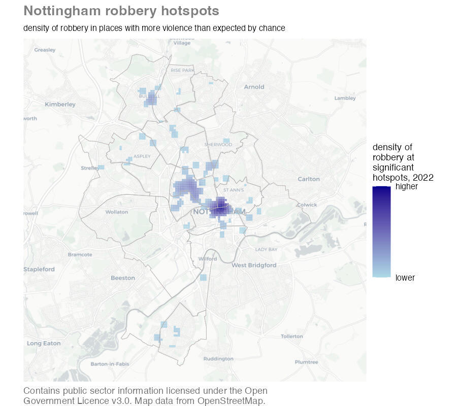

```{r setup, include=FALSE, message=FALSE, warning=FALSE}
library(learnr)
tutorial_options(exercise.timelimit = 120)
knitr::opts_chunk$set(echo = FALSE)

# Load packages
library(ggspatial)
library(osmdata)
library(sf)
library(sfhotspot)
library(tidyverse)

# Copy files
if (!dir.exists("css")) dir.create("css")
walk(
  dir("../css/"), 
  ~ file.copy(str_glue("../css/{.}"), str_glue("css/{.}"), overwrite = TRUE)
)

# Load data --------------------------------------------------------------------


## Boundaries ----

wards <- read_sf("https://mpjashby.github.io/crimemappingdata/nottingham_wards.gpkg") |> 
  st_transform("EPSG:27700") |> 
  filter(ward_name %in% c("Castle", "Lenton & Wollaton East", "Meadows"))

burglaries <- read_csv("https://mpjashby.github.io/crimemappingdata/nottingham_burglary.csv.gz") |> 
  st_as_sf(coords = c("longitude", "latitude"), crs = 4326) |> 
  st_transform("EPSG:27700") |> 
  st_intersection(wards)

robbery <- read_csv("https://mpjashby.github.io/crimemappingdata/nottingham_robbery.csv.gz") |> 
  st_as_sf(coords = c("longitude", "latitude"), crs = 4326) |> 
  st_transform(27700)

robbery_gistar <- hotspot_gistar(robbery, cell_size = 100)


## Buildings ----

if (file.exists("www/nottingham_buildings.Rds")) {
  nottingham_buildings <- read_rds("www/nottingham_buildings.Rds")
} else {
  nottingham_buildings <- wards |> 
    st_transform("EPSG:4326") |> 
    st_bbox() |> 
    opq() |> 
    add_osm_feature(key = "building") |> 
    osmdata_sf()
}

nottingham_building_centroids <- bind_rows(
  st_centroid(pluck(nottingham_buildings, "osm_polygons")),
  st_centroid(pluck(nottingham_buildings, "osm_multipolygons"))
) |> 
  st_transform("EPSG:27700") |> 
  st_intersection(wards)

building_counts <- hotspot_count(
  nottingham_building_centroids, 
  grid = hotspot_grid(wards, cell_size = 100)
) |> 
  # Clip the result to the area for which we have data
  st_intersection(wards)


## Burglary risk ----

if (file.exists("www/nottingham_burglary_risk.Rds")) {

  burglary_risk <- read_rds("www/nottingham_burglary_risk.Rds")

} else {

  burglary_risk <- hotspot_dual_kde(
    burglaries, 
    nottingham_building_centroids, 
    bandwidth_adjust = 0.25, 
    grid = hotspot_grid(wards, cell_size = 100)
  ) |> 
    st_intersection(wards)
  
  write_rds(burglary_risk, "www/nottingham_burglary_risk.Rds", compress = "gz")
  
}

burglary_risk_filtered <- filter(burglary_risk, is.finite(kde))

burglary_risk_bldg <- burglary_risk |> 
  select(burglary_count = n, kde) |> 
  st_drop_geometry() |> 
  bind_cols(building_counts) |> 
  filter(is.finite(kde))
```


## What is a hotspot?

Crime is heavily concentrated in several different ways. A small number of 
offenders commit a large proportion of crime (even though most people commit 
minor offences occasionally) and a small number of people are repeatedly 
victimised. For most types of crime, a large proportion of crime occurs in a 
small number of places. **A hotspot is a specific location or small area where 
an unusual amount of criminal activity occurs**.

Crime hotspots can occur in several different forms. Watch this video to 
understand why hotspots are important in understanding and responding to crime.


Some places are *chronic* hotspots -- they have more crime than surrounding
areas over a sustained period (which may appear to be permanent). Chronic
hotspots are often generated by a facility that draws vulnerable people into an
area, such as a tourist attraction that draws crowds of people who are
vulnerable to pickpocketing. Other places are *acute* hotspots, in which crime
increases in a place that previously experienced no or few crimes. This may be
the result of some change in the environment or how it's managed, such as new
management at a bar that ignores drug dealing that the previous owners would
have not permitted.

When analysing hotspots, it is best to focus on *small* areas such as an
apartment block, a shopping centre, a park or a single street. Focusing on 
smaller areas is important because resources to respond to crime are almost 
always limited, so it is important that those resources are directed where the
problem is worst. 

Analysing larger areas, such as a neighbourhood or a police sector, is much more 
difficult because larger areas are always made up of many smaller areas, each of 
which might be quite different from one another. This means that the factors 
causing one street to be a hotspot might be quite different from the factors 
that make another street in the same district into a hotspot. Conflating 
different problems with different causes makes it much harder to find effective 
ways to reduce crime in any one place. 

These difficulties can be avoided (at least partly) by keeping hotspots small: 
in an urban area, a useful rule of thumb is that you should be able to stand in 
the middle of a hotspot and see the whole hotspot area.

Being able to identify hotspots using crime mapping is important because it 
forms a vital first step in many place-focused responses to crime. As an example
of this, watch this video about how police in Philadelphia worked with 
researchers to use crime mapping to identify where to deploy foot patrols to
reduce crime.


In this tutorial we will learn how to make maps that could be useful in 
identifying and responding to hotspots of crime. As an example, we will create
this map showing hotspots of robbery in Nottingham, England.


```{r make-robbery-map, eval=FALSE}
# This dataset is not loaded above, so we load it here
nottingham <- read_sf("https://mpjashby.github.io/crimemappingdata/nottingham_wards.gpkg") |> 
  st_transform("EPSG:27700")

robbery_gi <- robbery |> 
  hotspot_gistar(cell_size = 100, bandwidth_adjust = 0.25) |> 
  filter(gistar > 0, pvalue < 0.05) |> 
  st_intersection(nottingham)

nottingham_robbery_map <- ggplot() + 
  annotation_map_tile(type = "cartolight", zoomin = 0, progress = "none") +
  geom_sf(
    aes(fill = kde), 
    data = robbery_gi, 
    alpha = 0.8,
    colour = NA
  ) +
  geom_sf(data = nottingham, colour = "grey70", fill = NA) +
  scale_fill_gradient(
    low = "lightblue",
    high = "darkblue",
    breaks = range(pull(robbery_gi, kde)),
    labels = c("lower", "higher")
  ) +
  fixed_plot_aspect() +
  labs(
      title = "Nottingham robbery hotspots",
      subtitle = str_glue(
        "density of robbery in places with more violence than expected by ",
        "chance"
      ),
      # Don't forget to add the licence statement -- it's a legal requirement!
      caption = str_wrap(
        str_glue(
          "Contains public sector information licensed under the Open ",
          "Government Licence v3.0. Map data from OpenStreetMap."
        ),
        width = 60
      ),
      fill = str_wrap("density of robbery at significant hotspots, 2022", 15)
  ) +
  theme_void() +
  theme(
    legend.text = element_text(size = rel(0.7)),
    legend.title = element_text(size = rel(0.8)),
    plot.caption = element_text(colour = "grey40", hjust = 0),
    plot.subtitle = element_text(margin = margin(t = 6, b = 6), size = rel(0.7)),
    plot.title = element_text(colour = "grey50", face = "bold", size = rel(1.2))
  )

ggsave(
  here::here("inst/tutorials/11_mapping_hotspots/images/nottingham_robbery_map.jpg"), 
  nottingham_robbery_map,
  width = 900 / 150,
  height = 800 / 150,
  dpi = 150
)
```

<p class="full-width-image"></p>


### Check your understanding

```{r why-maps-quiz}
quiz(
  caption = "",
  question("Which *one* of these statements is true?",
    answer("Crime is very geographically concentrated – we can expect half of crime to be concentrated in about 5% of micro places", correct = TRUE),
    answer("Crime is usually not geographically concentrated at micro places"),
    answer("Crime is slightly geographically concentrated – we can expect half of crime to be concentrated in about one quarter of micro places"),
    answer("Crime is extremely geographically concentrated – we can expect half of crime to be concentrated in about 1% of micro places"),
    correct = "That's correct – based on previous studies, we can expect half of crime to be concentrated in about 5% of micro places",
    incorrect = "That's not correct – try re-watching the first video above and then try the question again.",
    allow_retry = TRUE,
    random_answer_order = TRUE
  )
)
```


## Showing the density of risk

In the tutorial on mapping area data we learned how to produce maps showing the
*incidence rate* of crime by dividing the number of crimes by a measure of the
population at risk of being targeted. We will often only have population 
estimates for areas, such as census estimates of the number of people living in
an area. But for some crimes we have access to estimates of the people (or,
more often, objects) at risk of being a target of a particular crime. In these
cases, we can produce better maps of the risk of crime in different areas by
producing a *dual KDE* map that shows the density of crime *risk* in different
places.

To create a dual KDE map, we must estimate the density of crime and compare it 
to an estimate the density of the population at risk. Since the incidence rate 
is calculated as the number of crimes divided by the number of people or objects 
at risk, we can calculate the density of risk by dividing the density of crime 
estimated for each cell in the grid by the density of population estimated for 
the same cell. The `hotspot_dual_kde()` function from the `sfhotspot` package
does this for us.

To illustrate making a dual KDE map, we will use reports of burglaries in three 
wards in Nottingham in 2020. Since the essential element of the crime of 
burglary in England is that an offender enters a _building_ as a trespasser in 
order to steal something, the best measure of the population at risk of burglary 
is the number of _buildings_ in each area (the definition of burglary is more 
complicated than this, but we don't need to worry about that here). 

Burglary is a good example of why the routine activities approach to thinking 
about crime that we introduced in a previous tutorial emphasises thinking about 
_targets_ of crime rather than focusing only on crime _victims_. In the case of
burglary, one person might be the owner of a large number of buildings (e.g. a 
farm with lots of out-buildings) or lots of people might own a single building 
(such as a house converted into flats). By thinking about the targets that are 
attacked by offenders, we can identify that burglary rates should be calculated 
based on buildings rather than, for example, residential population. Note that 
if our crime data only included _residential_ burglaries then we would want to
use _residential_ buildings as our denominator, but in this case we have data
for all burglaries, both residential and non-residential.


### Data wrangling

Before we can create our dual KDE layer, we have to complete some data 
wrangling. We will extract the boundaries for the wards of interest from a 
dataset of boundaries for all wards in Nottingham using `filter()` as we have 
done previously. To extract only the burglaries occurring in those three wards 
from a dataset of all burglaries in Nottingham, we will use `st_intersection()`.
We will also transform both datasets to use the British National Grid (EPSG code
27700), since we will need to do that anyway before calculating the KDE values.

```{r risk-exercise1, exercise=TRUE}
wards <- read_sf("https://mpjashby.github.io/crimemappingdata/nottingham_wards.gpkg") |> 
  st_transform("EPSG:27700") |> 
  filter(ward_name %in% c("Castle", "Lenton & Wollaton East", "Meadows"))

burglaries <- read_csv("https://mpjashby.github.io/crimemappingdata/nottingham_burglary.csv.gz") |> 
  st_as_sf(coords = c("longitude", "latitude"), crs = 4326) |> 
  st_transform("EPSG:27700") |> 
  st_intersection(wards)
```


::: {.box .notewell}

`st_intersection()` can take longer to run than the maximum time limit for 
running code within this tutorial. If you see an error saying `Your code ran 
longer than the permitted time limit for this exercise` or `reached elapsed time 
limit`, you can continue with the rest of the tutorial as usual.

:::


We do not have a source of open data for all the buildings in Nottingham, so we
will use the `osmdata` package to get the locations of buildings from 
OpenStreetMap (OSM). You may remember from a previous tutorial that to do this 
we need to know which key (and possibly value) the OSM database uses for storing
the locations of buildings. The OSM feature key for a building is 'building' 
and it is not necessary to specify a value (since we want to capture all types 
of building). The `osmdata` package expects data to use the WGS84 co-ordinate 
reference system, so we must also make sure any data sources we use are 
projected using that system (EPSG code 4326).


::: {.tutorial}

Run the code needed to download data from OSM for all the buildings in the three 
wards we are interested in and store it in an object called 
`nottingham_buildings`. 

```{r risk-exercise2, exercise=TRUE, exercise.lines=10}

```

```{r risk-exercise2-hint-1, eval=FALSE}
# Remember to load the `osmdata` package
```

```{r risk-exercise2-hint-2}
# To download OSM data, use:
#   * `st_transform()` to transform the data to use the WGS84 co-ordinate system
#   * `st_bbox()` to calculate the bounding box of the wards
#   * `opq()` to set up the OSM query 
#   * `add_osm_feature()` to specify what type of features to download
#   * `osmdata_sf()` to download the data as an SF object
```

```{r risk-exercise2-hint-3}
library(osmdata)

nottingham_buildings <- wards |> 
  st_transform("EPSG:4326") |> 
  st_bbox() |> 
  opq() |> 
  add_osm_feature(key = "?????") |>  # <- specify type of data here
  osmdata_sf()

nottingham_buildings
```

:::


```{r risk-exercise2-hint-4}
library(osmdata)

nottingham_buildings <- wards |> 
  st_transform("EPSG:4326") |> 
  st_bbox() |> 
  opq() |> 
  add_osm_feature(key = "building") |> 
  osmdata_sf()

nottingham_buildings
```

Looking at the `nottingham_buildings` object, we can see that OSM contains data
on buildings stored as points, polygons and multipolygons (we can ignore the
few linestrings tagged as buildings, since it doesn't make sense for a building
to be represented as a single line rather than a point or a polygon). 


<div class="box extra-detail">

<h5 id="risk-box1-title" class="box-title">What is a multipolygon?</h5>

<div id="risk-box1" class="box-content">

OpenStreetMap stores features in several different ways. The most basic types
are points, lines and polygons. But there are also multipolygons (and
multilines). These are features that represent complex structures such as 
clusters of buildings that are separate structures but are related to each 
other. For example, a hospital with several buildings might be represented in
OpenStreetMap as a single multipolygon feature.

</div>

</div>

<script>
$("#risk-box1-title").click(function () { $("#section-risk-box1").toggle("slow") })
</script>


Let's plot these features on a base map to check that OSM has reasonable 
coverage of the buildings in these three wards.

```{r risk-exercise3, exercise=TRUE, message=FALSE, exercise.lines=23, fig.asp=1, out.width="100%"}
ggplot() +
  annotation_map_tile(type = "cartodark", zoomin = 0, progress = "none") +
  # Add building features stored as points
  geom_sf(
    data = pluck(nottingham_buildings, "osm_points"), 
    colour = "green",
    size = 0.1
  ) +
  # Add building features stored as polygons
  geom_sf(
    data = pluck(nottingham_buildings, "osm_polygons"), 
    colour = NA,
    fill = "blue"
  ) + 
  # Add building features stored as multi-polygons
  geom_sf(
    data = pluck(nottingham_buildings, "osm_multipolygons"), 
    colour = NA,
    fill = "darkred"
  ) +
  geom_sf(data = wards, colour = "red", fill = NA, linewidth = 1.25) +
  theme_void()
```


::: {.box .notewell}

Remember that `osmdata_sf()` gets OSM data for the area covered by the _bounding 
box_ of the input feature, not the feature boundaries. This means some of the
buildings returned by the code above will be outside the wards we are interested
in. We will deal with this in a minute.

:::


It looks like almost all the streets in the three wards we are interested in are
lined with buildings in the OSM data, which is what we would expect of streets
in an urban area. There are some streets without buildings in the top-left of 
the map, but these streets are outside our three wards so this does not matter.

We can also see from this map that the 
`r scales::comma(nrow(pluck(nottingham_buildings, "osm_points")))` point 
features in the OSM data (shown as green dots on the map) typically represent 
the corners of buildings that are also represented as polygons, so we know we 
can ignore the points layer within the OSM data.

Since the `hotspot_dual_kde()` function works on points, we need to convert the 
polygon and multipolygon layers to points by calculating their centroids, then 
merge the two layers together. This will generate a warning that 
`st_centroid does not give correct centroids for longitude/latitude data` but we
can ignore this because the calculated centroids will be good enough for our
purposes (if we wanted to, we could transform the data to use the British 
National Grid, calculate the centroids and then transform it back).

Since we are only interested in those buildings in three particular wards, we
can also at this stage remove any buildings that are outside those wards using
`st_intersection()`, as we have already done for the `burglaries` object. Since
the `wards` object uses the British National Grid and `st_intersection()`
requires both datasets to use the same co-ordinate system, we will transform
the building centroids before clipping them.

```{r risk-exercise4, exercise=TRUE, eval=FALSE}
nottingham_building_centroids <- bind_rows(
  st_centroid(pluck(nottingham_buildings, "osm_polygons")),
  st_centroid(pluck(nottingham_buildings, "osm_multipolygons"))
) |> 
  st_transform("EPSG:27700") |> 
  st_intersection(wards)
```


<div class="box extra-detail">

<h5 id="risk-box2-title" class="box-title">What does the warning `st_centroid assumes …` mean?</h5>

<div id="risk-box2" class="box-content">

You might have seen a warning saying 
`st_centroid assumes attributes are constant over geometries of x`. You will see
this warning when you use the `st_centroid()` function. It is there to remind
you that columns in the original data (which the SF package refers to as the
_attributes_ associated with each spatial feature) refer to the polygon as a 
whole, but in the object produced by `st_centroid()` it will appear that the
columns relate to the centroid point. In many cases this will not be a problem,
but it could expose you to the ecological fallacy so it is sometimes useful to 
be reminded.

</div>

</div>

<script>
$("#risk-box2-title").click(function () { $("#section-risk-box2").toggle("slow") })
</script>


<div class="box extra-detail">

<h5 id="risk-box3-title" class="box-title">What does the warning `attribute variables are assumed …` mean?</h5>

<div id="risk-box3" class="box-content">

`st_intersection()` produces a warning message whenever it is used:

```
Warning: attribute variables are assumed to be spatially constant throughout all
geometries
```

As long as you are simply using `st_intersection()` to remove parts of the data
outside a boundary, you can ignore this message.

</div>

</div>

<script>
$("#risk-box3-title").click(function () { $("#section-risk-box3").toggle("slow") })
</script>


### Calculating dual kernel density

We now have the object `burglaries` that contains the locations of each burglary
in the three Nottingham wards that we are interested in, and the object
`nottingham_building_centroids` that contains the centroids of each building in
those three wards. We can use these layers to estimate the density of burglaries
and buildings, then combine these to estimate the density of burglary risk.

`hotspot_dual_kde()` works in the same way as `hotspot_kde()`, except that it
requires two datasets. In this case, that means one dataset of crime locations 
and one dataset of building locations. `hotspot_dual_kde()` will set the cell 
size and bandwidth automatically, but we can set them manually using the 
`cell_size`, `bandwidth_adjust` and `grid` arguments in the same way we have 
done for `hotspot_kde()`. In this case, we will use the `hotspot_grid()` helper 
function to create a grid based on the boundaries of the wards we are interested 
in. All the spatial objects we are going to use here have co-ordinates specified 
using the British National Grid because we have already transformed them, so we 
do not need to do any transformation here.

```{r risk-exercise5, exercise=TRUE}
burglary_risk <- hotspot_dual_kde(
  burglaries, 
  nottingham_building_centroids, 
  bandwidth_adjust = 0.25, 
  grid = hotspot_grid(wards, cell_size = 100),
  quiet = TRUE
) |> 
  st_intersection(wards)

head(burglary_risk)
```

You might recall from earlier in this tutorial that the value of the `kde`
column in the object produced by `hotspot_dual_kde()` is calculated by dividing
the density of burglary in each grid cell by the density of buildings in the
same grid cell. There are two cases where this will produce a result that is not
a finite number:

  * If, for a particular cell, the density of burglaries and density of 
    buildings are both zero, dividing one by the other will produce the result 
    `NaN`, for 'not a number'.
  * If the density of burglaries is greater than zero but the density of 
    buildings is exactly zero, the result will be `Inf`, for 'infinite'.

Since it is not possible to calculate burglary risk in either of those cases, we
can exclude these cases from the `burglary_risk` object by using `filter()`
together with the `is.finite()` function (R does not count `NaN` as a finite 
number):

```r
burglary_risk <- hotspot_dual_kde(
  burglaries, 
  nottingham_building_centroids, 
  bandwidth_adjust = 0.25, 
  grid = hotspot_grid(wards, cell_size = 100)
) |> 
  st_intersection(wards)

burglary_risk_filtered <- filter(burglary_risk, is.finite(kde))
```

You might wonder why we didn't simply add `filter()` to the existing pipeline
that creates the `burglary_risk` object. It is because we will need the 
unfiltered object in the next section. But for now …

We can plot the estimate of the density of burglary risk. By controlling
for the density of buildings, this map shows us where building owners *on 
average* face the highest risk of being burgled. This might be useful in working
out, for example, which building owners should be offered visits from a 
crime-prevention advisor or funding to install crime-prevention measures.

```{r risk-exercise6, exercise=TRUE, message=FALSE, exercise.lines=36, fig.align='center', fig.asp=1}
ggplot() +
  annotation_map_tile(type = "cartolight", zoomin = 0, progress = "none") +
  # Add burglary risk layer
  geom_sf(
    aes(fill = kde), 
    data = burglary_risk_filtered, 
    alpha = 0.8, 
    colour = NA
  ) +
  # Add ward boundaries
  geom_sf(data = wards, fill = NA) + 
  scale_fill_distiller(
    breaks = range(pull(burglary_risk_filtered, "kde")),
    labels = c("lower", "higher"),
    direction = 1
  ) +
  labs(
      title = "Burglary risk in south-west Nottingham",
      subtitle = str_glue(
        "dual kernel density of burglary risk in Castle, Lenton & Wollaton ",
        "East and Meadows wards"
      ),
      caption = str_glue(
        "Contains public sector information licensed under the Open ",
        "Government Licence v3.0"
      ),
      fill = "density of burglary risk, 2020"
  ) +
  theme_void() +
  theme(
    legend.position = "bottom",
    plot.caption = element_text(colour = "grey40"),
    plot.subtitle = element_text(margin = margin(t = 6, b = 6)),
    plot.title = element_text(colour = "grey50", face = "bold", size = 16)
  )
```


### Check your understanding

```{r dual-kde-quiz}
quiz(
  caption = "",

  question("Which *one* of these statements is true?",
    answer("`hotspot_dual_kde()` requires co-ordinates to use a projected co-ordinate system (i.e. not longitude and latitude).", correct = TRUE),
    answer("`hotspot_dual_kde()` can work on any co-ordinates, whether they use a geographic co-ordinate system (i.e. longitude and latitude) or a projected system."),
    answer("`hotspot_dual_kde()` requires co-ordinates to use a geographic co-ordinate system (i.e. longitude and latitude)."),
    answer("`hotspot_dual_kde()` does not work with co-ordinates, so it does not matter which type of co-ordinate system a dataset uses."),
    allow_retry = TRUE,
    random_answer_order = TRUE
  ),
  
  question(
    "Why do we usually clip the result of `hotspot_dual_kde()` using `st_intersection()`?",
    answer("To eliminate any areas that we do not have data for, since displaying KDE values for such areas on a map might be misleading.", correct = TRUE),
    answer("To make our maps look nicer."),
    answer("To transform the co-ordinate system our data uses from the system `hotspot_dual_kde()` uses to the one we need to produce a map."),
    answer("To make it easier to see the other layers on our map."),
    allow_retry = TRUE,
    random_answer_order = TRUE
  )
)
```


## Finding hotspots

We now know how to produce a better map of the density of crime in different
areas. But how do we know which areas count as hotspots and which don't? 

There are several ways to answer this question. If we were planning a particular
activity to respond to a crime problem, we might know what resources we had
available to respond. For example, we might know that we have enough funding to
provide crime-prevention visits to 100 locations. In that case, we can order the
cells in a KDE object according to which have the highest estimates of risk, 
then count all the premises in each cell until we have reached our limit.

To do this, we need to know how many buildings are in each grid cell. We have
already learned how to count crimes in areas when we learned about mapping area
data. When we want to count crimes in each cell in a grid, we can use the 
`hotspot_count()` function from the `sfhotspot` package to count the number of
buildings in each grid cell. We will then be able to combine those building 
counts to the estimates of burglary risk we have already calculated.


::: {.box .notewell}

So that we can join the building counts to the burglary risk estimates, it is
important that both layers are based on the same grid. In the code above we
created a grid with the code `hotspot_grid(wards, cell_size = 100)`, so to make
sure we use the same grid to count buildings we can either use that same code
again, or we could have saved the result of that code as an object (maybe called
`nottingham_wards_grid`) and then provided that object to the `grid` argument of
both `hotspot_dual_kde()` and `hotspot_count()`.

Note that the results of `hotspot_dual_kde()` and `hotspot_count()` will only
have the same structure before we wrangle then any further, for example by using
`filter()` as in the previous section. This is why we saved an unfiltered 
version of the dataset in the `burglary_risk` object.

:::


```{r count-exercise1, exercise=TRUE}
building_counts <- hotspot_count(
  nottingham_building_centroids, 
  grid = hotspot_grid(wards, cell_size = 100)
) |> 
  # Clip the result to the area for which we have data
  st_intersection(wards)

head(building_counts)
```

The `building_counts` and `burglary_risk` objects have the same structure: each
row represents a cell in the same grid, and the rows are in the same order 
(because both grids were created by identical calls to `hotspot_grid()`). This
means we can combine the two objects using the `bind_cols()` function from the 
`dplyr` package (part of the tidyverse). 

```{r count-exercise2, exercise=TRUE}
burglary_risk_bldg <- bind_cols(burglary_risk, building_counts)

head(burglary_risk_bldg)
```

Looking at this object, we can see that `bind_cols()` has changed the column
names. This is because some of the column names were duplicated across the two
datasets. Some of these new column names, such as `ward_code...3` would be
difficult to work with, so lets go back and remove duplicate columns before we
combine the two datasets together.

```{r count-exercise3, exercise=TRUE}
burglary_risk_bldg <- burglary_risk |> 
  # Keep only the `n` and `kde` columns, renaming `n` to `burglary_count`
  # because there is also a column called `n` in the `building_counts` object
  select(burglary_count = n, kde) |> 
  # Remove the geometry column (since an identical one exists in 
  # `building_counts`). Note that we do this separately because we can't use
  # `select()` to remove the `geometry` column.
  st_drop_geometry() |> 
  bind_cols(building_counts) |> 
  # After calling `bind_cols()` it is safe to use `filter()` to wrangle the
  # data
  filter(is.finite(kde))
```

We can now order the dataset with the cells with highest burglary risk at the 
top and calculate the *cumulative total* (also called a running total) of 
buildings using the `cumsum()` function. We can use this running total to find 
the 100 buildings in the cells with highest burglary risk.

```{r count-exercise4, exercise=TRUE, exercise.lines=13, eval=FALSE}
cells_for_prevention <- burglary_risk_bldg |> 
  # Arrange cells from highest to lowest burglary risk
  arrange(desc(kde)) |> 
  # Count the number of buildings in a cell and all the cells with higher 
  # burglary risk than that cell
  mutate(sum_buildings = cumsum(n)) |> 
  # Keep only those cells that contain the first 100 buildings
  filter(sum_buildings < 100)

head(cells_for_prevention)
```

We could now plot the `cells_for_prevention` object on a map to show the grid
cells containing the buildings that would receive the crime-prevention visits.
We could also use `st_join()` to join those cells to the dataset of buildings
in the `nottingham_building_centroids` object, which would give us a list of
buildings to visit.


### Distinguishing hotspots from random variation

The density maps below show density estimates based on 1,000 points placed 
completely at random on 16 different maps. There are no real patterns in the 
data except for statistical noise. Nevertheless, the KDE process makes it appear 
that there are patterns in the data (if you reload this tutorial, these maps 
will change appearance completely, since the random numbers used for the x and y 
co-ordinates of the points will be regenerated).

```{r random-map, fig.asp=1, fig.align='center'}
tibble(
  x = runif(n = 1000 * 16, min = 0, max = 100), 
  y = runif(n = 1000 * 16, min = 0, max = 100),
  group = rep(1:16, each = 1000)
)  |>  
  ggplot() + 
  geom_density_2d_filled(aes(x, y), bins = 9) + 
  scale_fill_brewer(
    labels = c("lower", rep("", 7), "higher"),
    palette = "Oranges", 
    direction = 1,
    guide = guide_legend(reverse = TRUE)
  ) +
  facet_wrap(vars(group), ncol = 4) +
  coord_fixed() +
  labs(fill = "density") +
  theme_void() +
  theme(strip.text = element_blank())
```

This is a problem because we might end up responding to an apparent problem that
is nothing but an artefact of the random variation that we expect to see in many
processes, including crime.

If the police and other agencies looked at these patterns and did nothing in
response to them, it is likely that over time some of the areas with high
density would become areas of low density, and _vice versa_. However, the harm
caused by crime means it is very hard for agencies to justify sitting back and
do nothing to respond to it -- many people would consider it immoral to do so.
So police and other agencies are very likely to try to respond to crime 
patterns, even if those patterns might have occurred by chance. This is very
frustrating, because if we were to go back and look at the same data in a few
months time it is very likely that the apparent hotspots would have shifted to
somewhere different, making all the effort spent in responding to crime seem
worthless (which, if the apparent patterns were actually artefacts of the KDE
process, it may have been).

You might be thinking it's better safe than sorry, and that police should 
respond to the apparent patterns just in case they represent real concentrations
in crime. But police resources are always scarce, so responding to one problem 
in one place means not responding to another problem in another place. This is
known as the _opportunity cost_ of acting: if police focus their limited 
resources in one area, that comes at the cost of not being able to deploy those
resources in other areas that might need it more.

We can try to avoid this problem of wasting resources responding to random
variation in crime by determining whether the number of crimes in an area is
more than the greatest number we would reasonably expect if there were no actual
patterns in the data (if you have studied statistics before, you might recognise
this as a description of a *null hypothesis*, but you don't need to have studied
statistics to apply the techniques in this course).

To determine if the number of crimes in each area is greater than we would 
expect by chance, we can use the *Getis-Ord Gi\* statistic* (also called the
*local G* statistic, spoken out-loud as the *G-I star statistic*). If the Gi* 
statistic for an area is greater than a certain value, we can say that the 
number of crimes in that area is higher than we would expect if there were no 
patterns in the data. We will call areas with more crimes than we would expect
by chance as _hotspots_.

To see how this is done, watch this video that walks through the code needed to 
make a hotspot map using the Gi* statistic.


We can calculate the Gi* statistic using the `hotspot_gistar()` function from 
the `sfhotspot` package. This works in a similar way to the `hotspot_kde()`
function, in that it takes an SF object of the locations of crimes and returns 
an SF object with a grid of cells, along with the Gi* value for each grid cell.
Like `hotspot_kde()`, `hotspot_gistar()` will choose default values for several
ways in which we could fine-tune the calculation of the Gi* statistic, but we 
could over-ride these defaults if we wanted to.

In this example, we will find the hotspots of robbery in Nottingham in 2020,
based on a grid of 100-metre cells. We will store this in an object called
`robbery`, transform it to use the British National Grid co-ordinate system (so
we can specify the cell size in metres) and then use the resulting object to 
calculate the Gi* values.

```{r hotspot-exercise3, exercise=TRUE}
robbery <- read_csv("https://mpjashby.github.io/crimemappingdata/nottingham_robbery.csv.gz") |> 
  st_as_sf(coords = c("longitude", "latitude"), crs = 4326) |> 
  st_transform(27700)

robbery_gistar <- hotspot_gistar(robbery, cell_size = 100, quiet = TRUE)

# Use the `sample_n()` function from the `dplyr` package to return a random
# sample of 10 rows from the result
sample_n(robbery_gistar, 10)
```

The `robbery_gistar` object contains one row for each cell in a grid of cells
covering the area of the robbery data. Each row has four columns:

  * `n` shows the number of robberies that occurred in that grid cell,
  * `kde` shows the density of robberies in that cell,
  * `gistar` shows the Gi* value for that cell, and
  * `pvalue` shows the $p$-value for that cell.

The Gi* statistic is an example of a more general group of statistics called
$Z$ *scores*. Statisticians and data analysts compare the $Z$ scores produced by 
statistical procedures such as `hotspot_gistar()` to reference values to decide 
if a $Z$ score is large enough to be treated as statistically significant, i.e. 
if it is large enough to conclude that it is larger than we would expect if 
there were no actual patterns in the data. Deciding on the right reference value 
to compare a $Z$ score to can be difficult because of what's known as the 
multiple comparison problem (which we don't need to go into detail about).
Fortunately, the values in the `pvalue` column have already been automatically
adjusted to take account of the multiple comparison problem, so we can interpret 
the $p$-values instead of interpreting the Gi* statistic directly.


::: {.box .notewell}

Since Gi* is a relative measure, if you have data for a large area (e.g. a 
country) but only want to show data for a smaller area (e.g. a city), the Gi* 
values will be influenced by the large areas with no crime and all of the city 
is likely to be identified as a hotspot. To prevent this, it is important to 
clip the dataset before calculating the Gi* values, as well as then clipping 
afterwards where necessary.

:::


By convention, $p$-values are considered to be significant if they are _less 
than 0.05_. So if $p<0.05$, we can say that the number of robberies occurring in 
a given grid cell is significantly different from zero. Values of Gi* greater 
than zero indicate cells with more robberies than expected and values of Gi* 
less than zero indicate cells with fewer robberies than expected. We can combine 
these two values to find cells with significantly _more_ robberies than expected
by chance, which are those cells for which $Z>0$ and $p<0.05$. To put that into
R code, we would write `gistar > 0` and `p < 0.05`.

We could use this information in various ways. For example, if we wanted to give
local police officers a printed map of which areas to patrol, we could simply
show the significant hotspot cells over a base map.

```{r hotspot-exercise4, exercise=TRUE, message=FALSE, fig.asp=1, out.width="100%"}
# Plot a map
ggplot() +
  annotation_map_tile(type = "cartolight", zoomin = 0, progress = "none") +
  geom_sf(
    data = filter(robbery_gistar, gistar > 0, pvalue < 0.05), 
    fill = "red", 
    alpha = 0.75,
    colour = NA
  ) +
  fixed_plot_aspect() +
  theme_void()
```

Since `hotspot_gistar()` also estimates density for each grid cell, we could 
more usefully show the density of robberies in each cell, but only for cells 
that the Gi* values showed were significant hotspots.

```{r hotspot-exercise5, exercise=TRUE, fig.asp=1, out.width="100%"}
ggplot() +
  annotation_map_tile(type = "cartolight", zoomin = 0, progress = "none") +
  geom_sf(
    aes(fill = kde),
    data = filter(robbery_gistar, gistar > 0, pvalue < 0.05), 
    alpha = 0.75,
    colour = NA
  ) +
  scale_fill_distiller(direction = 1) + 
  fixed_plot_aspect() +
  theme_void()
```

This map could be very useful for police officers deciding where to conduct
anti-robbery patrols, because it not only shows the areas with the highest
density of robberies but only shows those areas if there are more robberies
than we would expect by chance. This makes it more likely that officers won't
waste time chasing apparent patterns that are actually the result of random
variation.


### Check your understanding

```{r gistar-quiz}
quiz(
  caption = "",

  question("`robbery_gi` is an object storing a result produced by the `hotspot_gistar()` function. Which of these pieces of code could be used to extract _only_ those rows in the data with significant p-values?",
    answer("`filter(robbery_gi, pvalue < 0.05)`", correct = TRUE),
    answer(
      "`filter(robbery_gi, pvalue > 0.05)`",
      message = "That code would extract only _non-significant_ p-values. Try again!"
    ),
    answer(
      "`filter(robbery_gi, pvalue <= 0.05)`",
      message = "Almost right, but not quite. Try re-reading the section of the tutorial above."
    ),
    answer(
      "`filter(robbery_gi, pvalue == 0.05)`",
      message = "That's not right. Try re-reading the section of the tutorial above."
    ),
    allow_retry = TRUE,
    random_answer_order = TRUE
  ),
  
  question("Which *one* of these statements is true about an SF object called `robberies_in_nottingham`?",
    answer("We cannot remove the `geometry` column of an SF object with `select()`, so we must use `st_drop_geometry()` instead.", correct = TRUE),
    answer("We can remove the `geometry` column with the code `select(robberies_in_nottingham, -geometry)`."),
    answer("We can remove the `geometry` column with the code `filter(robberies_in_nottingham, -geometry)`."),
    answer("There is no way to remove the `geometry` column from an SF object."),
    allow_retry = TRUE,
    random_answer_order = TRUE
  )
)
```


## Putting it all together

::: {.box .welldone}

In this tutorial we have learned about hotspots, how to create dual KDE maps and 
how to find significant hotspots using the Gi* statistic. We can put this all
together to create a complete script for producing a map of robbery hotspots in
Nottingham

:::

The following code is all that is needed to produce this map. Read through the
comments accompanying the code to see how what we have learned in this tutorial
fits together, then run the code to produce the map. 


::: {.box .notewell}

It is possible that this code will not run in this tutorial window because of 
limits on how long code can run in an R tutorial. If that happens, paste the 
code below into a blank R script in RStudio and run it from there to see the 
map.

:::


```{r final-exercise1, exercise=TRUE, exercise.lines=66, message=FALSE, fig.asp=1, out.width="100%"}
# Prepare ----------------------------------------------------------------------

# Load packages
library(ggspatial)
library(sf)
library(sfhotspot)
library(tidyverse)

# Load data and transform to British National Grid, which is easier to work with
# for functions that use spatial units such as metres
robbery <- read_csv("https://mpjashby.github.io/crimemappingdata/nottingham_robbery.csv.gz") |> 
  st_as_sf(coords = c("longitude", "latitude"), crs = "EPSG:4326") |> 
  st_transform("EPSG:27700")
nottingham_wards <- read_sf("https://mpjashby.github.io/crimemappingdata/nottingham_wards.gpkg") |> 
  st_transform("EPSG:27700")


# Find significant grid cells --------------------------------------------------

# Calculate Gi* statistic, filter for only significant hotspot cells and clip to
# the city boundary
robbery_gi <- robbery |> 
  hotspot_gistar(cell_size = 100, bandwidth_adjust = 0.25, quiet = TRUE) |> 
  filter(gistar > 0, pvalue < 0.05) |> 
  st_intersection(nottingham_wards)


# Plot map ---------------------------------------------------------------------

ggplot() + 
  annotation_map_tile(type = "cartolight", zoomin = 0, progress = "none") +
  # Add density for significant cells
  geom_sf(
    aes(fill = kde), 
    data = robbery_gi, 
    alpha = 0.8,
    colour = NA
  ) +
  # Add ward boundaries
  geom_sf(data = nottingham_wards, colour = "grey70", fill = NA) +
  scale_fill_distiller(
    breaks = range(pull(robbery_gi, kde)),
    labels = c("lower", "higher"),
    direction = 1
  ) +
  fixed_plot_aspect() +
  labs(
      title = "Nottingham robbery hotspots",
      subtitle = str_glue(
        "density of robbery in places with more violence than expected by ",
        "chance"
      ),
      # Don't forget to add the licence statement -- it's a legal requirement!
      caption = str_glue(
        "Contains public sector information licensed under the Open ",
        "Government Licence v3.0. Map data from OpenStreetMap."
      ),
      fill = str_wrap("density of robbery at significant hotspots, 2022", 15)
  ) +
  theme_void() +
  theme(
    plot.caption = element_text(colour = "grey40", hjust = 0),
    plot.subtitle = element_text(margin = margin(t = 6, b = 6)),
    plot.title = element_text(colour = "grey50", face = "bold", size = 16)
  )
```

