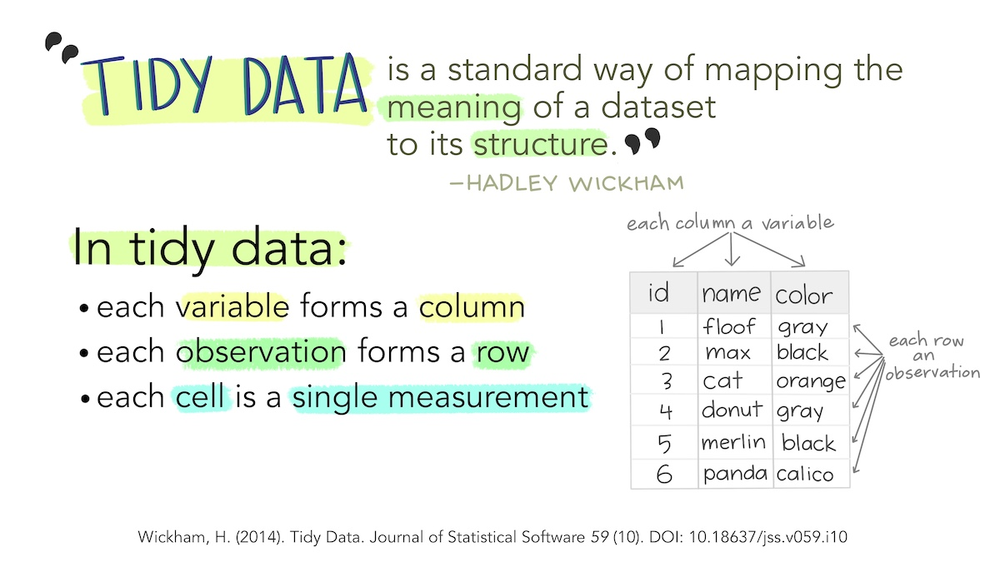
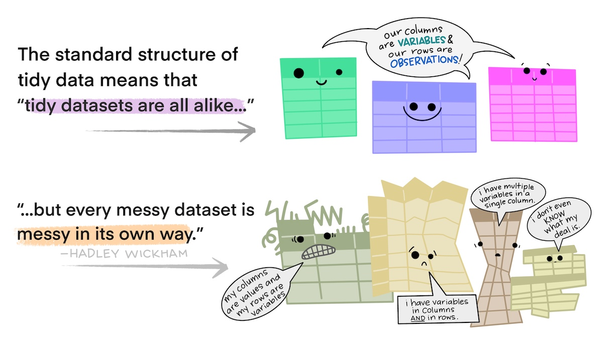
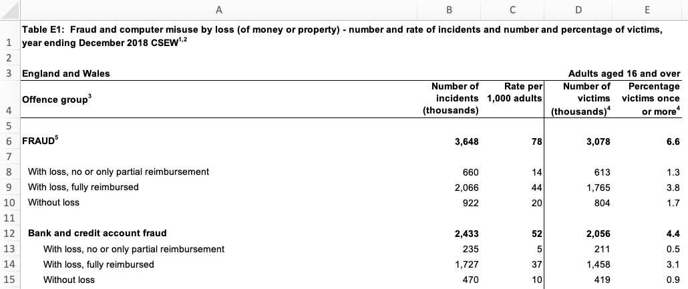
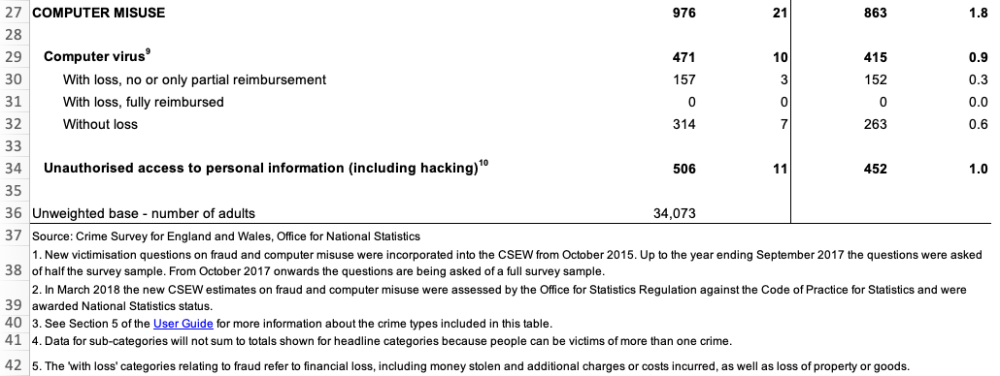
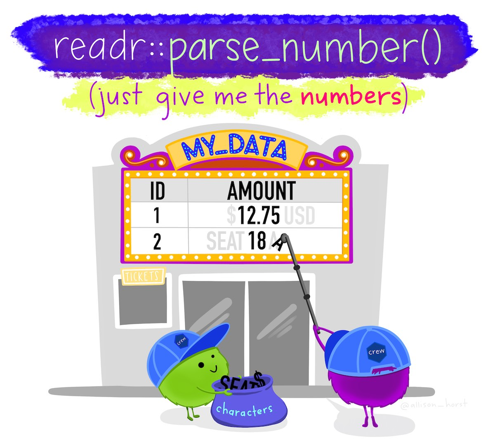

```{r setup, include=FALSE, message=FALSE, warning=FALSE}
library(learnr)
tutorial_options(exercise.timelimit = 120)
knitr::opts_chunk$set(echo = FALSE)

# Load packages
library(sf)
library(tidygeocoder)
library(tidyverse)

# Copy files
if (!dir.exists("css")) dir.create("css")
walk(
  dir("../css/"), 
  ~ file.copy(str_glue("../css/{.}"), str_glue("css/{.}"), overwrite = TRUE)
)

# Load data
crime_counts <- tribble(
  ~area, ~assault, ~robbery, ~burglary,
  "Northville", 4, 2, 10,
  "Middletown", 6, 5, 20,
  "Southam", 10, 0, 10
)

victims <- tribble(
  ~first_name, ~last_name, ~age_sex,
  "Lyda", "Gartrell", "40/F",
  "Colby", "Clausen", "26",
  "Cornelius", "Cola", "21/M",
  "Melina", "Shehan", "25/F",
  "Alfredo", "Matamoros", "18/M"
)

addresses <- read_csv("../../extdata/chicago_addresses.csv.gz")

addresses_for_geocoding <- addresses %>% 
  drop_na(address) %>% 
  mutate(address = str_to_upper(str_glue("{address}, CHICAGO, IL"))) %>% 
  select(address) %>% 
  distinct(address)

if (file.exists("www/chicago_addresses_geocoded.Rds")) {
  addresses_geocoded <- read_rds("www/chicago_addresses_geocoded.Rds")
} else {
  addresses_geocoded <- geocode(
    addresses_for_geocoding, 
    address = "address", 
    method = "osm"
  )
  write_rds(addresses_geocoded, "www/chicago_addresses_geocoded.Rds")
}

monthly_counts <- tribble(
  ~area, ~jan_2020, ~feb_2020, ~mar_2020, ~apr_2020, ~may_2020,
  "Northville", 13, 10, 12, 9, 10,
  "Middletown", 21, 19, 22, 19, 20,
  "Southam", 15, 13, 16, 15, 14
)

burglary_values <-  tibble(
  date = lubridate::as_datetime(runif(
    n = 5, 
    min = as.numeric(lubridate::ymd_hm("2020-01-01 00:00")), 
    max = as.numeric(lubridate::ymd_hm("2020-01-31 23:59"))
  )),
  value = c(1320, 653, 2068, -1, 580)
)

uk_data <- tribble(
  ~month, ~longitude, ~latitude, ~location, ~lsoa_name,
  "2020-01", -1.12, 53.3, "On or near Supermarket", "Bassetlaw 013C",
  "2020-02", -0.993, 53.2, "On or near Turner Lane", "Newark and Sherwood 001A",
  "2020-05", -1.25, 53.1, "On or near Brookdale Road", "Ashfield 004C",
  "2020-08", -1.16, 53.0, "On or near Raithby Close", "Nottingham 006B",
  "2020-10", -1.18, 53.0, "On or near Bowden Avenue", "Ashfield 013A"
)
```


## Introduction

Data is the foundation of everything we do in crime mapping. To make a crime map 
needs data on the locations and types of crimes; data on roads, buildings and
natural features to make up a base map, and data on other features (such as
particular types of facility) that might be relevant to why crime happens in
particular place.

<p class="full-width-image"></p>

Until now, all the data we have used has been *tidy data*. Data is tidy if it
comes in a particular format where every *variable* (e.g. the date on which a 
crime occurred) is stored in a separate *column* and data for every 
*observation* (e.g. all the data about a particular crime, a particular offender
etc.) is stored in a separate *row*. For typical crime data, that means each
crime is represented by one row in the data and each thing that we know about
that crime is stored in a separate column.

Unfortunately, not all the data we might like to use in crime mapping is 
available in a tidy format. The people, organisations and systems and produce
data store it in many formats, which are often not tidy and not easy to analyse.
Messy data is more difficult to work with because every messy dataset has a
unique structure, which we have to remember every time we want to work with it.

Tidy data, on the other hand, is easier to work with because its format is
familiar and consistent. Many R functions are also designed to work with tidy
data, so tidying our datasets often makes analysis quicker, too.

The first step to analysing messy data is therefore to wrangle it into a tidy 
format. We have already seen this principle at work when we use the 
`clean_names()` function from the `janitor` package to convert column names into 
a consistent format so that we don't have to keep remembering which unique 
format the column names are in.

In this tutorial we will learn how to tidy messy data to make it easier to work
with.

<p class="credits">[Stats Illustrations by Allison Horst](https://github.com/allisonhorst/stats-illustrations) licensed under the [Creative Commons Attribution licence](https://github.com/allisonhorst/stats-illustrations/blob/master/license).</p>


## Tidying the structure of data

<p class="full-width-image"></p>

Every messy dataset is messy in its own unique way, but often messiness comes 
from the structure of data not being tidy.
Tabular data can come in two general formats: *long* and *wide*. For example,
imagine a dataset showing counts of several different types of crime in several
different areas. We could store this data in wide format, where there is a 
column for the name of the area and then a column for each type of crime.

```{r wide-table}
crime_counts %>% 
  knitr::kable() %>%
  kableExtra::kable_styling(full_width = FALSE)
```

Wide-format data are often useful for presentation -- you might often see a
table like this in a report or article. But wide data are less useful for 
analysis because one of the variables -- 'type of crime' -- is being stored not
as a variable but in the various column names. One sign that your data has this
problem is if several of the columns form a group of columns, separate from the 
others. In this case, there is a group of columns that show crime counts that is 
different from the other column that shows the area name.

Fortunately, we can easily convert this data (which is stored in the object
`crime_counts`) into long format using the `pivot_longer()` function from the
`tidyr` package. To use `pivot_longer()`, we have to specify in the `cols`
argument which columns we want to 'gather' together into one column to store the 
category names and one column to store the values. We can specify the columns
we want to gather as a vector, i.e. `c(assault, burglary, robbery)`.

```{r structure-exercise1, exercise=TRUE}
library(tidyverse)

pivot_longer(crime_counts, cols = c(assault, burglary, robbery))
```

By default, `pivot_longer()` calls the new column of category names `name` and
the new column of values `value`. We can specify more-descriptive names using 
the `names_to` and `values_to` arguments.

```{r structure-exercise2, exercise=TRUE}
pivot_longer(
  crime_counts, 
  cols = c(assault, burglary, robbery), 
  names_to = "type", 
  values_to = "count"
)
```

It is better to have the names of different categories stored as a single 
variable rather than as the names of several variables because they are easier
to work with that way. For example, if the data are in long format you could 
sort the categories alphabetically using `arrange(crime_counts, type)`, or you 
could transform the names to title case using 
`mutate(crime_counts, type = str_to_title(type))`. Both these operations would 
be harder to do if the data were in wide format.

A common reason for data to be stored in wide format is where repeated 
observations are made of some value over time. For example, we might have 
monthly counts of crimes for different areas.

```{r monthly-table}
monthly_counts %>% 
  knitr::kable() %>%
  kableExtra::kable_styling(full_width = FALSE)
```

Storing data in this way is particularly awkward because variable names can only
contain text, so R does not know that the column names represent dates. This
means, for example, that we could not filter the dataset to only include data
from after a certain date.

When we want to gather a large number of columns together, it can get tedious to 
type all the column names for the `cols` argument to `pivot_longer()`. Instead, 
since we want to gather all the columns except one, we can just specify that we 
should *not* gather the `area` column, which implicitly tells `pivot_longer()` 
to gather all the other columns. We tell `pivot_longer()` not to gather the area
column by specifying `cols = -area` (note the minus sign in front of the column
name). Run the code needed to gather a dataset called `monthly_counts` so that
the names of the monthly counts are stored in a variable called `month` and the
monthly counts themselves are stored in a variable called `count`.

```{r structure-exercise3, exercise=TRUE, exercise.lines=7}

```

```{r structure-exercise3-solution}
pivot_longer(
  monthly_counts, 
  cols = -area, 
  names_to = "month", 
  values_to = "count"
)
```

There is still a problem with this data, which is that the `month` variable
contains not date values but instead the month and year stored as text. We will
learn how to deal with this issue in a future tutorial.


### Skipping unwanted rows in imported data

Data released by government organisations are often designed to be viewed by
humans rather than processed by statistical software. We can see this in this
screen shot of a [dataset produced by the UK Office for National Statistics on
cybercrime in the UK](https://www.ons.gov.uk/peoplepopulationandcommunity/crimeandjustice/datasets/crimeinenglandandwalesexperimentaltables) based on responses to the Crime Survey for England and
Wales.

<p class="full-width-image"></p>

Looking at the row numbers on the left-hand side, we can see that the that the
first row is taken up not with the column names (as in a tidy dataset) but with
the title of the dataset. The next row is blank, and the third row then contains
some metadata to say that the data relates to England and Wales and to adults
aged 16 and over. Only on row four do we see the column names. There are also
blank rows within the data that are used to separate out different categories of
data.

If we try to import this data using, for example, the `read_excel()` function
from the `readxl` package, we will find various problems.

```{r structure-exercise4, exercise=TRUE}
library(readxl)

# Since `.xlsx` files are binary files, we need to add `mode = "wb"` on Windows.
# On other platforms it makes no difference, but adding `mode = "wb" does not
# cause any problems.
download.file(
  url = "https://www.ons.gov.uk/file?uri=/peoplepopulationandcommunity/crimeandjustice/datasets/crimeinenglandandwalesexperimentaltables/yearendingdecember2018/additionalfraudandcybercrimetablesyearendingdecember2018correction.xlsx",
  destfile = str_glue("{tempdir()}/cybercrime.xlsx"),
  mode = "wb"
)

read_excel(str_glue("{tempdir()}/cybercrime.xlsx"), sheet = "Table E1")
```

It's clear that this dataset has not loaded in the way that we want, because
the first row don't contain the column names. Fortunately, we can deal with this
problem using the `skip` argument to the `read_excel()` function. This allows us
to specify a number of rows to ignore at the start of the dataset. In this case,
we want to ignore the first three rows of the data (the table title, a blank
line and the the metadata line), so we can specify `skip = 3`. The same `skip`
argument also exists in the `read_csv()` function for reading CSV data and the
`read_tsv()` function for reading tab-separated data.

```{r structure-exercise5, exercise=TRUE, exercise.setup="structure-exercise4"}
read_excel(
  str_glue("{tempdir()}/cybercrime.xlsx"), 
  sheet = "Table E1", 
  skip = 3
)
```

This has dealt with the problem caused by the extra rows at the top of the data.
But if we look at the bottom of the dataset, we will see that there are also
several rows of footnotes. These footnotes are important for us to have read so
that we understand the data, but they aren't part of the data itself. 

<p class="full-width-image"></p>

We can remove these extra rows at the end of our data using the `slice()`
function from the `dplyr` package. `slice()` allows us to choose certain rows
from our data by row number. Looking at the screen shot above, our data finishes
on row 34 (row 36 looks like part of our data but the value there actually shows
the number of people involved in the survey, not a number of incidents). But:

  * we have already removed the first three rows using the `skip` argument to 
    `read_excel()`, and
  * row four of the original spreadsheet has become our column names,
  
so row 34 on the spreadsheet is actually row 30 in our loaded dataset. Knowing 
this, we can remove all the rows below row 30 using `slice()`:

```{r structure-exercise6, exercise=TRUE, exercise.setup="structure-exercise4"}
str_glue("{tempdir()}/cybercrime.xlsx") %>% 
  read_excel(sheet = "Table E1", skip = 3) %>% 
  slice(1:30)
```

The final problem with the structure of this dataset is the blank rows that are
used to separate different crime categories in the original table. We can deal
with this using the `remove_empty()` function from the `janitor` package, which
removes all rows and/or columns that contain only `NA` values. We will also 
clean the column names at the same time and then rename the columns to be 
shorter, which will make it easier to refer to them in our code.

```{r structure-exercise7, exercise=TRUE, exercise.setup="structure-exercise4"}
library(janitor)

str_glue("{tempdir()}/cybercrime.xlsx") %>% 
  read_excel(sheet = "Table E1", skip = 3) %>% 
  slice(1:30) %>% 
  remove_empty(which = "rows") %>% 
  clean_names() %>% 
  rename(
    offence = offence_group3, 
    crimes = number_of_incidents_thousands, 
    incidence = rate_per_1_000_adults, 
    victims = number_of_victims_thousands_4, 
    prevalence = percentage_victims_once_or_more4
  )
```

This dataset now has a tidy structure: each row represents an observation (in
this case, data about a particular type of crime), each column represents a 
piece of information about the observation and each cell represents a single
value. We still need to clean up the footnote numbers that appear in some of the
values, but we will deal with that later in this tutorial.


### Separating multiple variables stored in a single column

Sometimes datasets include multiple variables in a single column. For example,
data about crime victims stored in an object called `victims` might include a 
single column representing both age and sex.

```{r victims-table}
victims %>% 
  knitr::kable() %>%
  kableExtra::kable_styling(full_width = FALSE)
```

It would be easier to wrangle this data (e.g. to filter by age) if the data in
the `age_sex` column was stored in two separate columns. Making this change 
would also make sure our data meets the definition of being tidy: every variable
should be stored in a separate column.

We can split the `age_sex` column into two using the `separate()` function from
the `tidyr` package. We specify the existing column we want to split using the
`col` argument, the names of the new columns we want to create using the `into`
argument and the character(s) that represent the boundary between the two pieces
of data in each column (in this case, `/`).

```{r structure-exercise8, exercise=TRUE}
separate(victims, col = age_sex, into = c("age", "sex"), sep = "/")
```

You might have noticed that this function produced a warning message saying 
`Expected 2 pieces. Missing pieces filled with NA in 1 rows [2]`. This is
because the second row of data in the `victims` object only contains one of the
two pieces of data. When this happens, `separate()` fills in the values that are
present from the left, filling any remaining columns to the right with `NA`. If 
this is what we want (as it is here), we can silence this warning by specifying 
`fill = "right"`. If instead we wanted `separate()` to fill in columns with `NA`
values from the left, we could specify `fill = "left"`.

Another issue with the separated data is that because the column `age_sex` was
a character column, both `age` and `sex` are character columns, too. Since `age`
is actually numeric, we can get `separate()` to convert this new column to the
correct type automatically by specifying `convert = TRUE`.

```{r structure-exercise9, exercise=TRUE}
separate(
  victims, 
  col = age_sex, 
  into = c("age", "sex"), 
  sep = "/",
  convert = TRUE,
  fill = "right"
)
```

We now know how to convert a data into a tidy format using `pivot_longer()` to
convert data to long format, remove non-data rows using `slice()`, 
`remove_empty()` and the `skip` argument to many functions like `read_csv()`, 
and split columns with `separate()`. In the next section, we'll learn how to
tidy the content of individual cells.

<p class="credits">[Stats Illustrations by Allison Horst](https://github.com/allisonhorst/stats-illustrations) licensed under the [Creative Commons Attribution licence](https://github.com/allisonhorst/stats-illustrations/blob/master/license).</p>


## Tidying the content of cells

As well as data with a messy structure, you might be provided with data with 
messy content inside some of the cells. In this section we will clean messy 
content, mostly using functions from the `stringr` package that is loaded 
automatically when we load `tidyverse`. All the functions in the `stringr`
package start with `str_` so that they are easy to remember.

We can change the case of text using one of four `str_to_` functions:

```{r case-table}
tribble(
  ~input, ~`function`, ~output,
  "A stRinG oF TeXT", "`st_to_lower()`", str_to_lower("A stRinG oF TeXT"),
  "A stRinG oF TeXT", "`st_to_upper()`", str_to_upper("A stRinG oF TeXT"),
  "A stRinG oF TeXT", "`st_to_sentence()`", str_to_sentence("A stRinG oF TeXT"),
  "A stRinG oF TeXT", "`st_to_title()`", str_to_title("A stRinG oF TeXT")
) %>% 
  knitr::kable() %>% 
  kableExtra::kable_styling(full_width = FALSE)
```

We can also remove unwanted text from within values. For example, if there is
unwanted white-space (spaces, tabs, etc.) at the beginning or end of a string of
characters, we can remove it with `str_trim()`. `str_squish()` does the same 
thing, but also reduces any repeated white-space characters in a string of text
down to a single space. For example, `str_squish("  A string   of text")`
produces the result ``r str_squish("  A string   of text")``.

<p class="full-width-image"></p>

Data from the UK police open data website includes the words 'on or near' at the 
start of every value in the `location` column of the data. This is to remind 
users that the locations of crimes are deliberately obscured by being 'snapped' 
to the centre of the street on which they occur to protect victims' privacy. 

```{r uk-data-table, include=TRUE}
uk_data %>% 
  knitr::kable() %>% 
  kableExtra::kable_styling(full_width = FALSE)
```

We don't need this constant value for analysis, and for large datasets it can 
unnecessarily increase the size of the data when we save it to a file. For this 
reason we might want to remove this constant value using the `str_remove()` 
function.

```{r content-exercise1, exercise=TRUE}
mutate(uk_data, location = str_remove(location, "On or near "))
```

The `lsoa_name` code of this dataset includes the name of the small statistical
area in which each crime occurred. Each name is made up of the name of the
local government district covering the area followed by a unique code. If we
wanted to extract just the district name (for example so we could count the
number of crimes in each district) we can do that by removing the code that
follows the district name. To do this we need to use a *regular expression*, 
which is a way of describing a pattern in a string of characters. Regular 
expressions can be used to find, extract or remove characters that match a
specified pattern. 

Regular expressions can be complicated, so we will only scratch the surface of 
what's possible here. You can find out much more about about them in the 
[article on regular expressions included in the `stringr` package](https://stringr.tidyverse.org/articles/regular-expressions.html).
The coded description of the pattern of characters we need to match the code at
the end of the `lsoa_name` column is `\\s\\w{4}$`. This is made up three parts:

  * `\\s` means match exactly one white-space character (e.g. a space or a tab),
  * `\\w{4}` means match exactly four word characters (i.e. any letter, any 
    number or some punctuation marks), and
  * `$` means match the end of the string.
  
So `\\s\\w{4}$` means match exactly one white-space character followed by 
exactly four word characters at the end of the string. We can use this pattern
as the second argument to the `str_remove()` function to remove the characters
matched by the pattern.

```{r content-exercise2, exercise=TRUE}
mutate(uk_data, district = str_remove(lsoa_name, "\\s\\w{4}$"))
```

We could also use regular expressions together with `str_extract()` to keep only 
the characters matched by the pattern, `str_replace()` to replace the first 
group of characters matched by the pattern and `str_replace_all()` to replace
all the groups of characters matched by the pattern. For more tips on using 
regular expressions together with functions from the `stringr` package, see the 
[`stringr` package cheat sheet](https://github.com/rstudio/cheatsheets/raw/master/strings.pdf)
or visit [regexr.com](https://regexr.com/).


### Converting between types of variable

Sometimes columns in your data will be stored as the wrong type of variable.
`read_csv()` and other functions from the `readr` package try to guess what type
of variable is contained in each column based on what is contained in the first
few rows, but this does not always work. For example, a variable containing 
numbers might be stored as characters, meaning functions like `mean()` will not
work. In cases like this, we can use the `as.numeric()` function to convert the
character variable into a numeric variable.

```{r content-exercise3, exercise=TRUE}
# Some numbers stored as text (note the quote marks around each number)
numbers_as_text <- c("14", "6", "17")

# Trying to find the mean of these numbers stored as characters will produce 
# `NA` and a warning
mean(numbers_as_text)

# If we use `as.numeric()` then `mean()` now works
mean(as.numeric(numbers_as_text))
```



We can use equivalent functions to convert columns to different types, e.g.
`as.character()` to convert a variable to characters and `as.logical()` to
convert a variable to only `TRUE` and `FALSE` values. Be careful, though: if you
try to convert a variable to a data type that makes no sense, you are likely to
find all of your values replaced with `NA`.

Sometimes numbers will be stored alongside other values, such as when currency
values are stored together with a currency symbol. We can deal with values like
these by using the `parse_number()` function from the `readr` package, which 
strips all the non-numeric characters from a value and then converts the numeric
characters to a number. For example, `parse_number("Room 14A")` produces the
numeric value ` `r parse_number("Room 14A")` `.


### Recoding categorical variables

Crime data often includes categorical variables, such as crime types or location
categories. It can be useful to change these categories, for example so that we
can join two datasets or abbreviate category names for use in the axis labels of
a chart.

We can use the `ifelse()` function to chance particular values, but this only
allows us to change a single value and can produce slightly untidy code. Instead
we can use  the `recode()` function from the `dplyr` package to change one or
more values at the same time. For example, if we wanted to change the value
`Supermarket` to `Shop` in the UK police data.

```{r recoding-exercise1, exercise=TRUE}
# Once again we will remove the unnecessary 'On or near ' using `str_remove()`
mutate(
  uk_data, 
  location = recode(
    str_remove(location, "On or near "),
    "Supermarket" = "Shop"
  )
)
```

Run the code needed to change the value `Nottingham` to `City of Nottingham` in
the `district` column in the `uk_data` object (you will need to create the 
`district` column from the `lsoa_name` first).

```{r recoding-exercise2, exercise=TRUE}

```

```{r recoding-exercise2-solution}
uk_data %>% 
  mutate(
    district = str_remove(lsoa_name, "\\s\\w{4}$"),
    district = recode(district, "Nottingham" = "City of Nottingham")
  ) %>% 
  # Select only some columns to make the result easier to see below
  select(lsoa_name, district)

```


### Missing values

We have already encountered the `NA` value, which R uses to represent a value 
that is missing from a dataset. While R uses `NA` to represent missing values,
some data providers use other codes. Fortunately, we can convert any value to
`NA` so that we know that it represents a missing value.

Imagine that you have been provided with a dataset of burglaries that includes 
an estimate of the value of the goods that were stolen in British pounds. You 
have been told that when the value of the stolen goods wasn't known, this is 
recorded as the value `-1` in the data. If we use `mean()` to estimate the 
average value of property stolen, the value `-1` will give us an incorrect 
result. If we instead convert that value to `NA` first, `mean()` will know to 
ignore that value as long as we specify the argument `na.rm = TRUE`.

```{r missing-exercise1, exercise=TRUE}
# Print some rows of burglary values
head(burglary_values)

# Try to calculate the mean value -- no error, but the answer is wrong
# `pull()` is used to extract the `value` column from `burglary_values`
mean(pull(burglary_values, "value"))

# Convert `-1` to `NA` first, now you get the correct mean value
burglary_values <- mutate(
  burglary_values,
  value = ifelse(value == -1, NA, value)
)

# Calculate the mean value again, now excluding the missing value
mean(pull(burglary_values, "value"), na.rm = TRUE)
```

Excluding the value `-1` makes a substantial difference to the mean, increasing
it by over £100.


<p class="credits">[Stats Illustrations by Allison Horst](https://github.com/allisonhorst/stats-illustrations) licensed under the [Creative Commons Attribution licence](https://github.com/allisonhorst/stats-illustrations/blob/master/license).</p>


## Geocoding locations

Throughout this course we have used geographic data that includes locations 
stored as pairs of co-ordinates, e.g. latitude and longitude or easting and 
northing. Sometimes geographic data will not contain co-ordinates but instead
store the locations of places or events as free-text addresses.

<a href="http://www.kelleysgrilleandbar.com/" title="Kelley's Grill 
& Bar website"></a>

Address fields can be very messy indeed. This is  because addresses can often be 
stored in different formats, include different abbreviations or use different 
spellings (including typos). For example, the official postal address 
'[Kelley's Grill & Bar](http://www.kelleysgrilleandbar.com/), 15540 State 
Avenue, Basehor, Kansas 66007, United States' could be stored in a local police 
report as:

  * Kelly's Bar, 15540 US Highway 40, Basehor
  * Kelley's Grille, 15540 State
  * Kelley's, 15540 State Av
  * Kelley's Bar and Grill, 15540 State Ave
  * Kelley's Bar, State Av and 155th St
  * Kelly's Grill, State Ave btwn 155 and 158

All of these address descriptions would probably be good enough for local police
officers to know which building the author intended to reference. But since all
these different addresses relate to the same physical location, they would make
it very hard to (for example) work out how many incidents had occurred at 
Kelley's Grill & Bar using `count()` or a similar function.

To make use of data containing addresses, it is typically necessary to *geocode*
the locations, i.e. to convert the addresses into co-ordinates. The many ways to
describe an address mean that geocoding is often quite hard.

<a href="https://jessecambon.github.io/tidygeocoder/" title="tidygeocoder website"></a>

We can geocode addresses in R using the 
[`tidygeocoder` package](https://jessecambon.github.io/tidygeocoder/), which
provides an interface to several online geocoding services. 

To run a geocoding service an organisation has to maintain a database of many 
millions of addresses (which must be constantly updated) and handle addresses in
many different formats, so organisations typically charge for these services or 
limit how many addresses you can geocode for free. Most services also require 
you to register, even if you are only making few-enough queries that you will 
not be charged. `tidygeocoder` supports several geocoding services:

```{r geocoding-services}
tribble(
  ~service, ~coverage, ~registration, ~`free limits`,
  "[Nominatim](https://nominatim.org/)", "Worldwide", "not required", "1 address per second",
  "[Location IQ](https://locationiq.com/)", "Worldwide", "[register for Location IQ](https://locationiq.com/register)", "5,000 addresses per day",
  "[Geoapify](https://www.geoapify.com/)", "Worldwide", "[register for Geoapify](https://myprojects.geoapify.com/login)", "3,000 addresses per day",
  "[OpenCage](https://opencagedata.com/)", "Worldwide", "[register for OpenCage](https://opencagedata.com/users/sign_up)", "2,500 addresses per day",
  "[TomTom](https://developer.tomtom.com/)", "Worldwide", "[register for TomTom](https://developer.tomtom.com/user/register)", "2,500 addresses per day",
  "[Google](https://developers.google.com/maps/documentation/geocoding/overview)", "Worldwide", "[register for Google](https://cloud.google.com/maps-platform/)", "40,000 addresses per month",
  "[Geocodio](https://www.geocod.io/)", "United States and Canada", "[register for Geocodio](https://dash.geocod.io/register)", "2,500 addresses per day",
  "[US Census](https://geocoding.geo.census.gov/)", "United States", "not required", "none"
) %>% 
  knitr::kable() %>% 
  kableExtra::kable_styling(full_width = FALSE)
```

The `tidygeocoder` package also supports some other services that do not offer
any free option -- you can find out more about these options on the 
[package website](https://jessecambon.github.io/tidygeocoder/articles/geocoder_services.html).

<!--
Nominatim is the only service that provides world-wide coverage and does not 
require registration, but it also has the lowest limit on the number of 
addresses (`r scales::comma(60 * 60)`) you can geocode each day.
-->

To illustrate the geocoding process, we will find co-ordinates for the addresses
in the object `addresses`, which holds data for 10 sexual assaults in Chicago.

```{r}
addresses %>% knitr::kable() %>% kableExtra::kable_styling(full_width = FALSE)
```

Since most geocoding services limit the number of addresses you can look up at
a time, the first step in geocoding is removing duplicate addresses and rows 
with missing address values. This avoids us geocoding identical addresses 
several times, which would otherwise unnecessarily increase our chance of 
hitting the limit on geocoding queries each day.

We will also add the city and state to the end of each address, since at the 
moment (as with much data produced by local organisations) it includes only the 
building number and street.

```{r geocoding-exercise1, exercise=TRUE}
addresses_for_geocoding <- addresses %>% 
  # Drop rows that have NA values in the `address` column
  drop_na(address) %>% 
  # Add city and state then convert to upper case so that `count()` will not 
  # treat identical addresses as different because of different cases, e.g. 
  # 'ST' vs 'St' as abbreviations for 'Street'
  mutate(address = str_to_upper(str_glue("{address}, CHICAGO, IL"))) %>% 
  # Select only the address column, since we won't send the other columns to the
  # geocoding function
  select(address) %>% 
  # Find all the unique rows in the data
  distinct(address)

head(addresses_for_geocoding)
```

Since two addresses in the data were duplicates and one address was missing, we
now have eight unique addresses, stored in a tibble with a single column. We can
use this as the input to the `geocode()` function from the `tidygeocoder`
package. The `address` argument specifies which column in the data contains the
addresses and the `method` column specifies which geocoding service to use. In
this case we use the Nominatim service (because it does not require registration 
and works worldwide). Nominatim is based on OpenStreetMap data, so can be chosen 
by specifying `method = "osm"`.

```{r geocoding-exercise2, exercise=TRUE}
library(tidygeocoder)

addresses_geocoded <- geocode(
  addresses_for_geocoding, 
  address = "address", 
  method = "osm"
)

addresses_geocoded
```

Now that we have the latitude and longitude for each address, we can join that
back to the original data using the address column to match the two datasets 
together. To do this we will create a temporary column in the original 
`addresses` object that matches the formatting changes we made to the original
address.

```{r geocoding-exercise3, exercise=TRUE}
addresses %>% 
  # Create a temporary address column to use in matching the geocoded addresses
  mutate(temp_address = str_to_upper(str_glue("{address}, CHICAGO, IL"))) %>% 
  # `left_join()` keeps all the rows in the left-hand dataset (the original
  # `addresses` object) and matching rows in the right-hand dataset (the 
  # geocoding results)
  left_join(addresses_geocoded, by = c("temp_address" = "address")) %>% 
  # Remove the temporary address column
  select(-temp_address)
```

We can now use this data as we would any other spatial data. We would often
start by converting our new object to an SF object using `st_as_sf()`. In that
case, remember that all the geocoding services return co-ordinates as latitude
and longitude using the WGS84 co-ordinate reference system, so you should use 
the EPSG code 4326.


## Conflicts between function names

R packages are written by experts in different types of data analysis. This 
means we can use R to conduct all sorts of analysis, including cutting-edge
techniques. But because R packages are not all written by people working for a
single organisation, it means there can sometimes be functions from different
packages that have the same name -- often because they do similar (but not
necessarily identical) things. 

This can be a problem because R might be running a function from one package
when you think you have written code that uses a function from another package.
If the two functions have different arguments or produce different types of 
result, your code is unlikely to run properly. For example, if two functions 
have the same name but one produces an SF object while the other produces a
tibble, that might cause problems later in your code if you are using other 
functions that expect to receive a particular type of input.

One example of functions from two different packages with the same name is the
`geocode()` function. We have already learned that the `tidygeocoder` package
contains a function called `geocode()`, but the `ggmap` package (which we use to
download base maps) also has a function called `geocode()`.

If both the `tidygeocoder` and `ggmap` packages are loaded, R will use the
`geocode()` function from the package that has been loaded most recently. So if
your script includes the code:

```r
library(ggmap)
library(tidygeocoder)

# [Code to load data, etc.]

# Geocode some data
geocoded_data <- geocode(ungeocoded_data)
```

Then R will use the `geocode()` function from `tidygeocoder`, since that was
loaded *after* `ggmap`. But if you reverse the order in which these packages
are loaded:

```r
library(tidygeocoder)
library(ggmap)

# [Code to load data, etc.]

# Geocode some data
geocoded_data <- geocode(ungeocoded_data)
```

Then R will use the `geocode()` function from `ggmap` because that package was
loaded after `tidygeocoder`.

Knowing which of the two functions R uses when you type `geocode()` is important
because they accept different inputs. The `geocode()` function from `ggmap`
expects the first argument to contain a vector of addresses, while the 
`geocode()` function from `tidygeocoder` expects a data frame or tibble. If
you provide the wrong type of input, either function will produce an error.

When you load a package that includes a function with the same name as a 
function in a package that is already loaded, R will print a message in the
console. For example, if you run `library(ggmap)` and then
`library(tidygeocoder)`, you will see a message saying the function from the
already loaded package has been *masked* and so will be replaced by the function
from the newly loaded package:

```
Attaching package: ‘tidygeocoder’

The following object is masked from ‘package:ggmap’:

    geocode
```

When you see a message like this, it means you need to check which version of 
that function you want to use. If you want to use the function from the
most-recently loaded package then you don't need to do anything. If you want to
use the function that has been masked, you need to take one of the steps 
explained below.

Our R scripts very often load the `tidyverse` package, which loads eight
packages (`dplyr`, `forcats`, `ggplot2`, `purrr`, `readr`, `tibble`, `tidyr` and
`stringr`) that we often need to use. Because `tidyverse` itself loads several
packages, it produces a separate message to let you know which existing 
functions have been masked when you load `tidyverse`. If `library(tidyverse)` is
the first code you run after starting R, that message will look something like 
this:

```
── Conflicts ──────────────────────────────────────── tidyverse_conflicts() ──
x dplyr::filter() masks stats::filter()
x dplyr::lag()    masks stats::lag()
```

Since we more commonly want the tidyverse functions than the functions they mask
(for example, we frequently use the `filter()` function from `dplyr` but rarely
use the function with the same name in the `stats` package), it is common to
load `tidyverse` after loading all the other packages needed for our code.

There are several ways you can resolve conflicts between functions from
different packages:

  * Make sure you load packages in the order that gives you access to the
    functions you need. This can be simple if there are few conflicts, but can
    fall apart if you later change your code to load different packages. This is
    the option that almost everyone uses most of the time (and most people use
    all of the time).
  * Specify which function you want to use using the `::` notation that we have
    already used in previous tutorials, e.g. by using the code
    `ggmap::geocode()` or `tidygeocoder::geocode()`.
  * Load the `conflicted` package, which produces an error whenever you try to
    use a function that is included in more than one loaded package. This makes
    it easy to know when there is a potential conflict, which you can then 
    resolve using the `conflict_prefer()` function.
    
In this final option, the authors of the `conflicted` package recommend that you
specify which conflict-prone functions to use by calling `conflict_prefer()`
just after you've loaded all the packages you need for your script. For example:

```r
# This code produces several conflicts:
# *  the `stats` package, which is loaded automatically in the background when 
#    you start R, contains a function called `filter()`
# *  `MASS` contains a function called `select()`
# *  `dplyr` contains functions called `filter()` and `select()`
library(dplyr)
library(MASS)
library(conflicted)

# This code specifies that in the case of both conflicts, we want to use the
# functions from `dplyr`
conflict_prefer("select", "dplyr")
conflict_prefer("filter", "dplyr")

# In the rest of this script, any reference to `filter()` or `select()` will
# use the functions with those names in the `dplyr` package, not those from
# `stats` or `MASS`
```

Understanding function-name conflicts is important because they can be the cause
of errors that are (for reasons we needn't explain in detail) extremely hard to 
track down the cause of. So make sure that when you load packages, you take note
of any messages in the console that warn you that functions have been masked. As
with other messages in R, they will not always need you to take any action, but
you always need to read the message and make a decision about whether to take 
any action.


#### Check your understanding

```{r conflict-quiz}
question(
  "If you load two packages in R that both contain a function with the same name, which function will R use by default?",
  answer("The function from the package that was loaded *last*", correct = TRUE),
  answer("The function from the package that was loaded *first*"),
  answer("Neither function will run because R will produce an error."),
  answer("The function that is from the `tidyverse` suite of packages."),
  correct = random_praise(),
  incorrect = random_encouragement(),
  allow_retry = TRUE,
  random_answer_order = TRUE
)
```


## In summary

<div class="box welldone">

In this tutorial we have learned to tidy messy data to make it easier to work
with. In real-world data analysis (not just crime mapping), you will often have
to deal with data that is messy in different ways. Fortunately, you can use R to
fix all of these problems in a way that minimises the risk that you might 
introduce mistakes when you clean the data.

</div>

You can find out more about data cleaning and tidying with these 
resources:

  * A [tutorial on using the `pivot_longer()` and `pivot_wider()` functions to 
    convert data between long and wide format](https://tidyr.tidyverse.org/articles/pivot.html).
  * A more-detailed [Introduction to `tidygeocoder`](https://jessecambon.github.io/tidygeocoder/articles/tidygeocoder.html).
  * An [introduction to some other packages than can help you clean and tidy data](https://rfortherestofus.com/2019/12/how-to-clean-messy-data-in-r/).
  * A more-detailed [description of how to use the `conflicted` package](https://conflicted.r-lib.org/).
    
<p class="full-width-image"></p>

<p class="credits">[Stats Illustrations by Allison Horst](https://github.com/allisonhorst/stats-illustrations) licensed under the [Creative Commons Attribution licence](https://github.com/allisonhorst/stats-illustrations/blob/master/license).</p>

