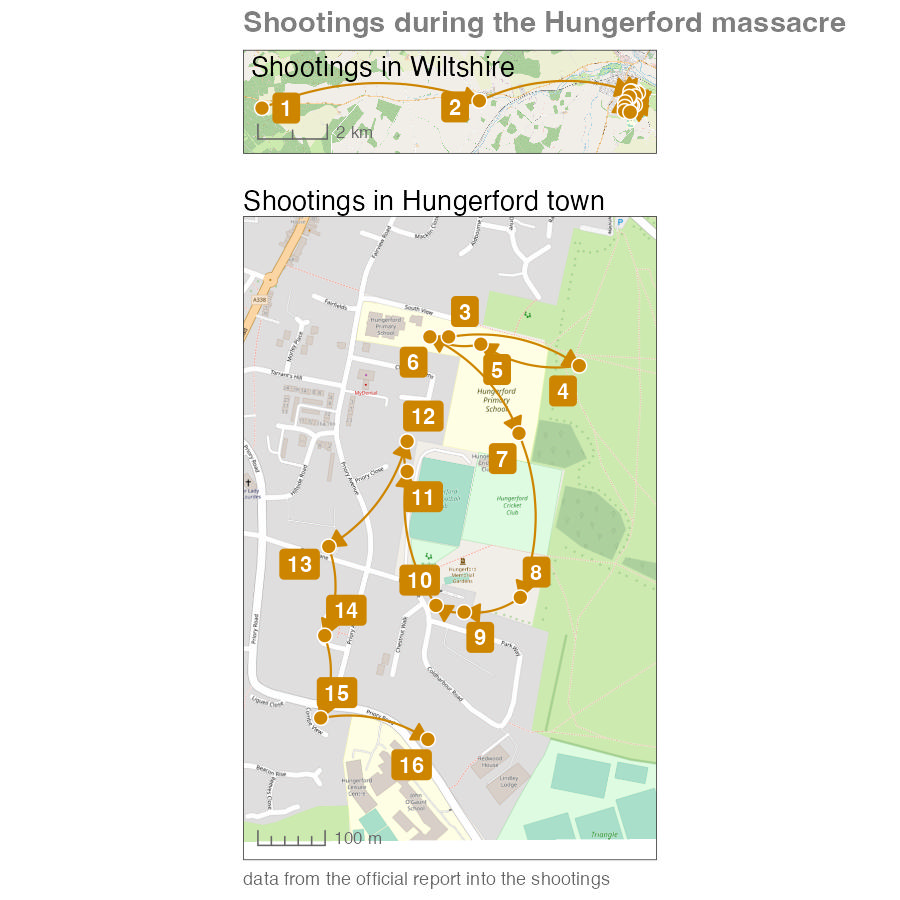

```{r setup, include=FALSE, message=FALSE, warning=FALSE}
library(learnr)
tutorial_options(exercise.timelimit = 120)
knitr::opts_chunk$set(echo = FALSE, fig.align='center')

# Load packages
library(ggrepel)
library(ggspatial)
library(patchwork)
library(sf)
library(tidyverse)

# Copy files
if (!dir.exists("css")) dir.create("css")
walk(
  dir("../css/"), 
  ~ file.copy(str_glue("../css/{.}"), str_glue("css/{.}"), overwrite = TRUE)
)

# Load data --------------------------------------------------------------------


## Hungerford data ----
hungerford_shootings <- tribble(
  ~latitude, ~longitude, ~victims,
  51.4078, -1.6683, "Susan GODFREY†",
  51.4094, -1.5779, "Kakaub DEAN",
  51.4116, -1.5147, "Roland MASON†\nSheila MASON†\nMarjorie JACKSON\nLisa MILDENHALL",
  51.4112, -1.5119, "Kenneth CLEMENTS†",
  51.4115, -1.5140, "Roger BRERETON†\nLinda CHAPMAN\nAlison CHAPMAN",
  51.4116, -1.5151, "Abdur KHAN†\nAlan LEPETIT\nHazel HASLETT\nGeorge WHITE†\nDorothy RYAN†\nIvor JACKSON",
  51.4103, -1.5132, "Betty TOLLADAY",
  51.4081, -1.5132, "Francis BUTLER†",
  51.4079, -1.5144, "Marcus BARNARD†",
  51.4080, -1.5150, "Ann HONEYBONE",
  51.4098, -1.5156, "John STORMS",
  51.4102, -1.5156, "Douglas WAINWRIGHT†\nKathleen WAINWRIGHT\nKevin LANCE\nEric VARDY†",
  51.4088, -1.5173, "Sandra HILL†",
  51.4076, -1.5174, "Victor GIBBS†\nMyrtle GIBBS†\nMichael JENNINGS\nMyra GEATER",
  51.4065, -1.5175, "Ian PLAYLE†",
  51.4062, -1.5152, "George NOON"
) |> 
  mutate(
    coords = xy_transform(
      longitude, 
      latitude, 
      from = "EPSG:4326", 
      to = "EPSG:27700"
    ),
    order = row_number()
  ) |> 
  unnest(cols = "coords") |> 
  mutate(across(c(x, y), round)) |> 
  select(victims, order, easting = x, northing = y)

hungerford_lines <- hungerford_shootings |> 
  rename(x_end = easting, y_end = northing) |> 
  mutate(x_start = lag(x_end), y_start = lag(y_end)) |> 
  remove_missing(vars = c("x_start", "y_start"), na.rm = TRUE)

hungerford_shootings_sf <- hungerford_shootings |> 
  st_as_sf(coords = c("easting", "northing"), crs = "EPSG:27700")


# Create stored maps -----------------------------------------------------------

hungerford_map_overall <- ggplot() +
  # Plot base map
  annotation_map_tile(zoomin = 1, progress = "none") +
  # Plot lines between points
  geom_curve(
    aes(x = x_start, y = y_start, xend = x_end, yend = y_end),
    data = hungerford_lines, 
    arrow = arrow(length = unit(3, "mm"), type = "closed"),
    curvature = -0.2,
    colour = "orange3"
  ) +
  # Plot points
  geom_sf(
    data = hungerford_shootings_sf, 
    shape = 21,
    colour = "white",
    fill = "orange3",
    size = 3
  ) +
  geom_label_repel(
    aes(x = easting, y = northing, label = order),
    data = filter(hungerford_shootings, order %in% 1:2), 
    colour = "white",
    fill = "orange3",
    fontface = "bold",
    label.size = NA
  ) +
  annotation_scale(style = "ticks", line_col = "grey40", text_col = "grey40") +
  scale_y_continuous(expand = expansion(2)) +
  labs(title = " Shootings in Wiltshire") +
  coord_sf(crs = "EPSG:27700") +
  theme_void() +
  theme(
    panel.border = element_rect(colour = "grey20", fill = NA),
    plot.title = element_text(margin = margin(b = -18))
  )

hungerford_map_town <- ggplot() +
  annotation_map_tile(zoomin = 1, progress = "none") +
  # Plot lines between points
  geom_curve(
    aes(x = x_start, y = y_start, xend = x_end, yend = y_end),
    data = slice(hungerford_lines, 3:n()), 
    arrow = arrow(length = unit(3, "mm"), type = "closed"),
    curvature = -0.2,
    colour = "orange3"
  ) +
  # Plot points
  geom_sf(
    data = slice(hungerford_shootings_sf, 3:n()), 
    shape = 21,
    colour = "white",
    fill = "orange3",
    size = 3
  ) +
  geom_label_repel(
    aes(x = easting, y = northing, label = order),
    data = slice(hungerford_shootings, 3:n()), 
    colour = "white",
    fill = "orange3",
    fontface = "bold",
    label.size = NA
  ) +
  annotation_scale(style = "ticks", line_col = "grey40", text_col = "grey40") +
  scale_x_continuous(expand = expansion(0.3)) +
  scale_y_continuous(expand = expansion(0.3)) +
  coord_sf(crs = "EPSG:27700") +
  labs(
    title = "Shootings in Hungerford town"
  ) +
  theme_void() +
  theme(
    panel.border = element_rect(colour = "grey20", fill = NA),
    plot.margin = margin(t = 12)
  )
```


<!-- Case linkage: http://eknygos.lsmuni.lt/springer/605/117-133.pdf -->


## Introduction

It's common in crime mapping to treat each crime as a separate event. But a 
large proportion of crimes are committed by a relatively small proportion of all
the people who commit crime. These persistent or repeat offenders commit crimes
frequently, maybe several times a day in the case of some people. One type of
repeat offending is the *crime series*, in which an offender or group of 
offenders commits the same or related crimes in different places over time. 


### Case linkage

One of the difficulties in studying serial offending is in identifying which 
offences are committed by the same offender. *Case linkage* is the process of 
identifying crime series by looking for similarities in the method used by an 
offender (e.g. entering a house by  breaking a lock on a side door out of sight 
from the street) or by evidence left at the scene (such as fingerprints or DNA). 
Case linkage is typically an imperfect process -- investigators might believe 
that two offences were committed by the same person, but in most cases they are 
unlikely to know for sure unless the offender has been caught (and sometimes not
even then).

Watch this video to learn a bit more about crime linkage.


Once crimes have been linked together as being part of the same series, it can 
be useful to map them to better understand how the series has progressed. In 
this tutorial we will learn how to map linked cases.


### The case used in this tutorial

Due to the uncertainty of case linkage, there is little publicly available data
on the locations of serial crimes. The available data tends to focus on serial
murders. To minimise the likelihood of anyone taking this course having been
directly affected by -- or know anyone affected by -- the cases we use in this
tutorial, we will use a historical example.

```{r include=FALSE}
hungerford_murder_count <- hungerford_shootings |> 
  mutate(murder_count = str_count(victims, "†")) |>  
  summarise(murder_count = sum(murder_count)) |> 
  pull(murder_count)
```

The [Hungerford massacre](https://en.wikipedia.org/wiki/Hungerford_massacre) 
occurred in southern England in August 1987, when a marauding attacker (also 
known as a spree offender) killed `r hungerford_murder_count` people and shot 
many others in the space of about 90 minutes. We will use a dataset called 
`hungerford_shootings` that contains the names of each victim and the 
approximate location at which they were shot (recorded as eastings and northings 
in the British National Grid). This data is taken from the 
[official report into the massacre](https://www.jesip.org.uk/uploads/media/incident_reports_and_inquiries/Hungerford%20Shootings.pdf). 
The `order` column shows the order in which the victims were shot. These are the 
first few rows of the dataset (the dagger symbol † shows that the victim was 
killed):

```{r}
hungerford_shootings |> 
  mutate(victims = str_replace_all(victims, "\\n", ", ")) |> 
  head(5) |> 
  knitr::kable()
```

In this tutorial we will learn how to create this composite map of the locations
of the shootings in this crime series.

```{r make-hungerford-map, eval=FALSE}
hungerford_map <- (hungerford_map_overall / hungerford_map_town) + 
  plot_annotation(
    title = "Shootings during the Hungerford massacre",
    caption = "data from the official report into the shootings",
    theme = theme(
      plot.caption = element_text(colour = "grey40", hjust = 0),
      plot.title = element_text(colour = "grey50", face = "bold", size = 14)
    )
  )

ggsave(
  here::here("inst/tutorials/13_crime_series/images/hungerford_map.jpg"), 
  hungerford_map,
  width = 900 / 150,
  height = 900 / 150,
  dpi = 150
)
```


<p class="full-width-image"></p>


## Mapping linked cases

Mapping crime series can be useful for several reasons. For example, a map of a
crime series might help the jurors in a criminal trial to better understand the
sequence of events that the suspect is accused of. This can be especially 
helpful if the sequence is complicated or especially long.

At the moment, the `hungerford_shootings` dataset contains the *point* location 
of each event and the order in which they occurred. To show a sequence of events 
on a map, we need to link each event with those that happened immediately before 
and after it. 

```{r}
hungerford_shootings |> 
  mutate(victims = str_replace_all(victims, "\\n", ", ")) |> 
  head(5) |> 
  knitr::kable()
```

One way to do this is to draw lines on the map connecting each incident in turn. 
To do this, we will create a dataset where each row contains _two_ pairs of 
co-ordinates: one representing the location of a particular shooting and the
other representing the location of the _previous_ shooting. To do that, we will:

  1. Take the `hungerford_shootings` dataset and rename the existing columns
     holding the co-ordinates so that it is clear those co-ordinates are for the
     _end_ of each line between points. To do this we will use the `rename()`
     function from the `dplyr` package.
  2. Add two new columns to each row that show the co-ordinates of the row in
     the dataset immediately above the current row (i.e. the row that represents
     the location before the current location. We will do this with the `lag()` 
     function, also from `dplyr`.
  3. Use these two pairs of co-ordinates to plot lines on a map.

```{r linked-exercise1, exercise=TRUE}
hungerford_lines <- hungerford_shootings |> 
  rename(x_end = easting, y_end = northing) |> 
  mutate(x_start = lag(x_end), y_start = lag(y_end)) |> 
  # Remove the first line, which contains missing values and which we don't need
  remove_missing(vars = c("x_start", "y_start"), na.rm = TRUE)

head(hungerford_lines)
```

<div class="box extra-detail">

<h5 id="linked-box1-title" class="box-title">Why does this code include `remove_missing()`?</h5>

<div id="linked-box1" class="box-content">

You might notice that the values in the first row of the `x_start` and `x_end` 
columns in the `hungerford_lines` object are `NA` values. This is because these
columns have been created using the `lag()` function, which gets the value from
the same column in the row immediately above. The first row doesn't have a row
immediately above it, so `lag()` returns `NA`. Since the first row does not
represent a link between shootings in any case, we can remove it with
`remove_missing()`.

</div>

</div>

<script>
$("#linked-box1-title").click(function () { $("#section-linked-box1").toggle("slow") })
</script>

This method for creating lines between points is one of several ways we could
achieve the same result. For example, we could create lines connecting the 
points and store them as SF objects. However, the code to do that is more 
complicated and gives us slightly less control over the appearance of the lines, 
so we will not use that method. Using the method shown in the box above means 
the lines on our map are not SF objects, so we cannot use `geom_sf()` to add 
them to the map. Instead, we will create a map using the `geom_segment()` 
function from the `ggplot2` package.

```{r linked-exercise2, exercise=TRUE, exercise.lines=23}
# Convert the `hungerford_shootings` object to SF
hungerford_shootings_sf <- st_as_sf(
  hungerford_shootings, 
  coords = c("easting", "northing"), 
  crs = "EPSG:27700"
)

# Plot a basic map
ggplot() +
  # Plot base map
  annotation_map_tile(zoomin = 0, progress = "none") +
  # Plot lines between points
  geom_segment(
    aes(x = x_start, y = y_start, xend = x_end, yend = y_end), 
    data = hungerford_lines
  ) +
  # Plot points
  geom_sf(data = hungerford_shootings_sf) +
  # Since one of our layers is not an SF object, tell `ggplot()` what 
  # co-ordinate system to use
  coord_sf(crs = "EPSG:27700") +
  theme_void()
```

This map is not particularly useful -- we will return to that in a minute.

If you look at this code, you'll see that we've included the function
`coord_sf()` in our `ggplot()` stack. In all the previous maps that we have 
made, we have used `geom_sf()` to plot geographic data on our maps. `geom_sf()`
understands how to translate co-ordinates specified using different co-ordinate
systems to locations on the surface of each map. Other functions in the 
`geom_*()` family of functions do not know how to do this automatically, so we
must specify the co-ordinate system by adding the `coord_sf()` function to the
stack. We only need to use one argument to `coord_sf()`: the `crs` argument to
specify the co-ordinate system that our data uses. In this case, we know that
the co-ordinates in the `hungerford_lines` object are specified using the 
British National Grid, which has the EPSG code 27700.

The map we have made above shows the sequence of events, but there are at least 
four ways that we can make it better.

  1. It would be useful to be able to see a larger area around the shooting
     locations, to see more of the town surrounding the area in which the crimes
     occurred.
  2. We don't know which order to move through the sequence of lines. We can 
     deal with this by adding arrows to show the direction of travel.
  3. The straight lines make it look like the offender travelled across fields
     between locations, which is probably not true. Since we do not have data on
     what routes the offender took, we can replace the straight lines with 
     curves to indicate that the exact route is unknown.
  4. Because the first two shootings occurred outside the town, the map has to
     cover a large area and this makes it harder to see the sequence of events 
     in the town itself.


### Extending the map area

By default, `ggplot()` works out the limits of the area shown on the map based
on the area covered by the data we add to each stack with functions from the
`geom_*()` family of functions. Usually this works well, but in this case the
distribution of the shootings means that the map shows only a small slice of the 
town of Hungerford and the surrounding area. It would be useful for readers to
be able to see a larger area, to be able to better identify where the shootings
occurred. 

To expand the area shown on the map, we can use `scale_y_continuous()` function
from the `ggplot2` package. We have used the `scale_fill_distiller()`
and `scale_fill_gradient()` functions in previous tutorials to control how 
columns in the data are represented as colours on the map. The 
`scale_y_continuous()` function is similar, in that it controls the vertical
(Y) axis on the map. We don't need to use most of the capabilities of
`scale_y_continuous()` because `ggplot()` sets reasonable default values. The
only argument we need to set is the `expand` argument, which controls how far
the map should extend around the area covered by the data.

The easiest way to set the correct values for the `expand` function is to use 
the `expansion()` helper function. We can use this to specify how much extra 
area around the data we want to include on the map. For example, `expansion(2)`
means that the Y axis of the map should cover the area covered by the data and 
twice that distance either side of the data.


```{r linked-exercise3, exercise=TRUE, exercise.lines=15, out.width="100%"}
# Plot a basic map
ggplot() +
  # Plot base map
  annotation_map_tile(zoomin = 0, progress = "none") +
  # Plot lines between points
  geom_segment(
    aes(x = x_start, y = y_start, xend = x_end, yend = y_end), 
    data = hungerford_lines
  ) +
  # Plot points
  geom_sf(data = hungerford_shootings_sf) +
  scale_y_continuous(expand = expansion(2)) +
  coord_sf(crs = "EPSG:27700") +
  theme_void()
```

::: {.box .notewell}

The `scale_y_continuous()` function specifically controls the vertical (Y) axis
of the map, so it only adds space above and below the data on the map. If we
wanted to add space to the left and right of the data, we would need to use the
`scale_x_continuous()` function. But in this case, since the map is already very 
wide relative to its height, we will not make the map any wider.

:::


### Adding arrows and curves

To add an arrow to the end of each line segment we can use the `arrow()`
helper function from the `ggplot2` package to specify the `arrow` argument of
the `geom_segment()` function in our `ggplot()` stack. Here, we make the arrow
head smaller than the default by setting `length = unit(3, "mm")` and choose the
style of the arrow head with `type = "closed"`.

To prevent the arrow heads from obscuring the points, we will give the points a
thin white border by specifying `shape = 21` (a circle with a separate border)
and `colour = "white"`, as well as making the points slightly bigger with 
`size = 2`.

```{r linked-exercise4, exercise=TRUE, exercise.lines=22, out.width="100%"}
ggplot() +
  # Plot base map
  annotation_map_tile(zoomin = 0, progress = "none") +
  # Plot lines between points
  geom_segment(
    aes(x = x_start, y = y_start, xend = x_end, yend = y_end),
    data = hungerford_lines, 
    arrow = arrow(length = unit(3, "mm"), type = "closed"),
    colour = "orange3"
  ) +
  # Plot points
  geom_sf(
    data = hungerford_shootings_sf,
    shape = 21,
    colour = "white",
    fill = "orange3",
    size = 3
  ) +
  scale_y_continuous(expand = expansion(2)) +
  coord_sf(crs = "EPSG:27700") +
  theme_void()
```

This makes it easier to see that the shootings started at the point on the left
of the map, but makes the problem of understanding the sequence of events in the
town itself even worse. We will deal with this in the next section.

In the map above, we used the `geom_segment()` function to add the lines to our
map. If we change this to `geom_curve()` the lines will become curved rather
than straight. By specifying `curvature = -0.2` we get a slightly straighter
line than the default, and a left-hand curve because the value of `curvature` is
negative.

The other change we can make at this point is to add a layer of labels showing 
the order in which the shootings occurred. We don't want the labels to overlap 
the points, so we will use `geom_label_repel()` from the `ggrepel` package to 
create labels that are automatically offset from the points they relate to. 
For now, we will just label the first two locations. 

At this point we can also make some minor changes to the map -- adding a title
and scale bar, putting a neat line around the map -- the purpose of which will
become clear in the next section.

```{r linked-exercise5, exercise=TRUE, exercise.lines=41, out.width="100%"}
library(ggrepel)

hungerford_map_overall <- ggplot() +
  # Plot base map
  annotation_map_tile(zoomin = 0, progress = "none") +
  # Plot lines between points
  geom_curve(
    aes(x = x_start, y = y_start, xend = x_end, yend = y_end),
    data = hungerford_lines, 
    arrow = arrow(length = unit(3, "mm"), type = "closed"),
    curvature = -0.2,
    colour = "orange3"
  ) +
  # Plot points
  geom_sf(
    data = hungerford_shootings_sf, 
    shape = 21,
    colour = "white",
    fill = "orange3",
    size = 3
  ) +
  geom_label_repel(
    aes(x = easting, y = northing, label = order),
    data = filter(hungerford_shootings, order %in% 1:2), 
    colour = "white",
    fill = "orange3",
    fontface = "bold",
    label.size = NA
  ) +
  annotation_scale(style = "ticks", line_col = "grey40", text_col = "grey40") +
  scale_y_continuous(expand = expansion(2)) +
  labs(title = " Shootings in Wiltshire") +
  coord_sf(crs = "EPSG:27700") +
  theme_void() +
  theme(
    panel.border = element_rect(colour = "grey20", fill = NA),
    plot.title = element_text(margin = margin(b = -18))
  )

hungerford_map_overall
```

Now we have added arrow heads and curved lines, in the next section we will
learn how to solve the problem of the events in the town itself being unclear on
the map.


## Multiple maps

<p class="full-width-image"></p>

Our existing map is difficult to understand because we have a mix of some events
very close together (including several on the same street) and some that 
occurred further away. This means the closer events overlap on the map, 
especially now that we have made the points larger to distinguish them from the
lines linking each event.

<a href="https://patchwork.data-imaginist.com/"></a>

To deal with this problem we can display two maps: one showing the whole area 
covered by the points and a second (sometimes called an *inset map*) showing 
only the events in the town of Hungerford itself. We will do this using the 
[`patchwork` package](https://patchwork.data-imaginist.com/) to combine multiple
maps made using `ggplot()`.

We have already saved the first map as `hungerford_map_overall`. We can create a
map showing only the shootings in Hungerford itself by removing the first two
points from `hungerford_points_sf` (since they represent shootings outside the
town itself). We can do this for all the existing layers using `slice()`.

We will use the `plot.margin` argument to the `theme()` function to add a small 
amount of space at the top of this map, which will help separate it from the 
first map when we put them together. We will also get the map to cover a 
slightly larger area than it would by default by using the 
`scale_x_continuous()` and `scale_y_continuous()` functions.

```{r multiple-exercise1, exercise=TRUE, exercise.lines=41, fig.asp=1}
hungerford_map_town <- ggplot() +
  annotation_map_tile(zoomin = 0, progress = "none") +
  # Plot lines between points
  geom_curve(
    aes(x = x_start, y = y_start, xend = x_end, yend = y_end),
    data = slice(hungerford_lines, 3:n()), 
    arrow = arrow(length = unit(3, "mm"), type = "closed"),
    curvature = -0.2,
    colour = "orange3"
  ) +
  # Plot points
  geom_sf(
    data = slice(hungerford_shootings_sf, 3:n()), 
    shape = 21,
    colour = "white",
    fill = "orange3",
    size = 3
  ) +
  geom_label_repel(
    aes(x = easting, y = northing, label = order),
    data = slice(hungerford_shootings, 3:n()), 
    colour = "white",
    fill = "orange3",
    fontface = "bold",
    label.size = NA
  ) +
  annotation_scale(style = "ticks", line_col = "grey40", text_col = "grey40") +
  scale_x_continuous(expand = expansion(0.3)) +
  scale_y_continuous(expand = expansion(0.3)) +
  coord_sf(crs = "EPSG:27700") +
  labs(
    title = "Shootings in Hungerford town"
  ) +
  theme_void() +
  theme(
    panel.border = element_rect(colour = "grey20", fill = NA),
    plot.margin = margin(t = 12)
  )

hungerford_map_town
```

We can now combine the two maps using the `patchwork` package. To place two 
plots next to each other using `patchwork` you just add one map object to the
other using the `|` operator. To place one plot on top of the other, you use the
`/` operator (you can combine plots in more-complicated ways by combining these
operators, together with parentheses).

```{r multiple-exercise2, exercise=TRUE, fig.asp=1.3}
library(patchwork)

(hungerford_map_overall / hungerford_map_town)
```

When we created the `hungerford_map_overall` object in the previous section, we
gave the map title a _negative_ border using the `plot.title` argument to the
`theme()` function. This had the effect of moving the title downwards onto the
map to save space, since the top-left corner of the map was empty. We also added
a scale bar, since when you present two related maps of different scales next to 
one another, it is useful to show the scales of both maps to help readers relate
them to one another.

We can add shared titles and captions to combined maps created with `patchwork`
using the `plot_annotation()` function. This function has a `theme` argument,
which we can use to change the appearance of the shared title and caption just
as we use `theme()` to change the appearance of elements on single maps.

```{r multiple-exercise4, exercise=TRUE, fig.asp=1.3}
(hungerford_map_overall / hungerford_map_town) + 
  plot_annotation(
    title = "Shootings during the Hungerford massacre",
    caption = "data from the official report into the shootings",
    theme = theme(
      plot.caption = element_text(colour = "grey40", hjust = 0),
      plot.title = element_text(colour = "grey50", face = "bold", size = 14)
    )
  )
```

There are various other improvements that we could make to this map based on the
mapping skills we have already learned during this course. For example, we could
add the locations of buildings or particular facilities using data from 
OpenStreetMap. What information we choose to present on the map will depend on 
what information we think it is important to communicate to our audience.


<!--
## Plotting the journey to crime

For many crimes (especially predatory crimes), offenders must travel to and from 
the location of the offence. Investigators will sometimes know some points along
this journey, but not the whole route. For example, detectives investigating a
kidnapping murder may know where the victim was taken from and where the body 
was found, but not know where the offender or victim were between those points.
For a more-common crime such as car theft, police may know where a car was 
stolen from and where it was recovered, but not have any information about where
it was between those times.

When investigating crimes involving travel between points, it will often be 
useful to work out the route taken between two points. For example, establishing
a possible route might make it possible to check CCTV cameras, analyse toll-road 
records or seek witnesses along the way. A potential route might also allow an
analyst to consider whether any other crimes along that route might be part of a
crime series. If pairs of points are known for multiple crimes that are believed
to be a linked series, it is possible that looking for overlapping parts of the 
routes between pairs of points might help identify the offender's anchor point.

We can plot the fastest route between two locations on foot or in a vehicle 
using tools that were designed for transport planning. The 
[`stplanr` package](https://docs.ropensci.org/stplanr/) uses data from the
OpenStreetMap routing service to work out the fastest route between two points.
-->


## Putting it all together

::: {.box}

In this tutorial we have learned how to map crime series, focusing on displaying
a sequence of events on a map. We have also learned how to combine maps using 
the `patchwork` package.

:::

```{r names-killed}
names_killed <- hungerford_shootings |> 
  pull("victims") |> 
  str_split("\n") |> 
  unlist() |> 
  str_subset("†") |> 
  str_remove("†") |> 
  as_tibble() |> 
  separate(value, into = c("first", "last")) |> 
  arrange(last) |> 
  mutate(name = str_glue("{first} {last}")) |> 
  pull("name") |> 
  str_to_title() |> 
  knitr::combine_words(oxford_comma = FALSE)
```

When we are mapping crime data, it is important to remember that the rows in the
data we are using often represent traumatic events that have happened to people.
In this tutorial, every row in the data represents one or more people who were
killed or injured during the massacre. The people killed during the tragedy were
`r names_killed`.

<p class="full-width-image image-border"></p>

You can put the code from this tutorial together to see everything that is 
needed to make a composite map of the Hungerford massacre from the original data 
file called `hungerford_shootings`.

```{r summary-exercise1, exercise=TRUE, exercise.lines=117, fig.asp=1.3}
library(ggrepel)
library(ggspatial)
library(patchwork)
library(sf)
library(tidyverse)


# Prepare data -----------------------------------------------------------------

# Create lines showing progression between points
hungerford_lines <- hungerford_shootings |> 
  rename(x_end = easting, y_end = northing) |> 
  mutate(x_start = lag(x_end), y_start = lag(y_end)) |> 
  # Remove the first line, which contains missing values and which we don't need
  remove_missing(vars = c("x_start", "y_start"), na.rm = TRUE)

# Convert the `hungerford_shootings` object to SF
hungerford_shootings_sf <- st_as_sf(
  hungerford_shootings, 
  coords = c("easting", "northing"), 
  crs = "EPSG:27700"
)


# Make component maps ----------------------------------------------------------

hungerford_map_overall <- ggplot() +
  # Plot base map
  annotation_map_tile(zoomin = 0, progress = "none") +
  # Plot lines between points
  geom_curve(
    aes(x = x_start, y = y_start, xend = x_end, yend = y_end),
    data = hungerford_lines, 
    arrow = arrow(length = unit(3, "mm"), type = "closed"),
    curvature = -0.2,
    colour = "orange3"
  ) +
  # Plot points
  geom_sf(
    data = hungerford_shootings_sf, 
    shape = 21,
    colour = "white",
    fill = "orange3",
    size = 3
  ) +
  geom_label_repel(
    aes(x = easting, y = northing, label = order),
    data = filter(hungerford_shootings, order %in% 1:2), 
    colour = "white",
    fill = "orange3",
    fontface = "bold",
    label.size = NA
  ) +
  annotation_scale(style = "ticks", line_col = "grey40", text_col = "grey40") +
  scale_y_continuous(expand = expansion(2)) +
  labs(title = " Shootings in Wiltshire") +
  coord_sf(crs = "EPSG:27700") +
  theme_void() +
  theme(
    panel.border = element_rect(colour = "grey20", fill = NA),
    plot.title = element_text(margin = margin(b = -18))
  )

hungerford_map_town <- ggplot() +
  annotation_map_tile(zoomin = 0, progress = "none") +
  # Plot lines between points
  geom_curve(
    aes(x = x_start, y = y_start, xend = x_end, yend = y_end),
    data = slice(hungerford_lines, 3:n()), 
    arrow = arrow(length = unit(3, "mm"), type = "closed"),
    curvature = -0.2,
    colour = "orange3"
  ) +
  # Plot points
  geom_sf(
    data = slice(hungerford_shootings_sf, 3:n()), 
    shape = 21,
    colour = "white",
    fill = "orange3",
    size = 3
  ) +
  geom_label_repel(
    aes(x = easting, y = northing, label = order),
    data = slice(hungerford_shootings, 3:n()), 
    colour = "white",
    fill = "orange3",
    fontface = "bold",
    label.size = NA
  ) +
  annotation_scale(style = "ticks", line_col = "grey40", text_col = "grey40") +
  scale_x_continuous(expand = expansion(0.3)) +
  scale_y_continuous(expand = expansion(0.3)) +
  coord_sf(crs = "EPSG:27700") +
  labs(
    title = "Shootings in Hungerford town"
  ) +
  theme_void() +
  theme(
    panel.border = element_rect(colour = "grey20", fill = NA),
    plot.margin = margin(t = 12)
  )


# Combine maps and add titles --------------------------------------------------

(hungerford_map_overall / hungerford_map_town) + 
  plot_annotation(
    title = "Shootings during the Hungerford massacre",
    caption = "data from the official report into the shootings",
    theme = theme(
      plot.caption = element_text(colour = "grey40", hjust = 0),
      plot.title = element_text(colour = "grey50", face = "bold", size = 14)
    )
  )

```

<p class="credits"><a href="https://www.getreading.co.uk/news/berkshire-history/gallery/30-years-hungerford-massacre-13495555">Photograph of PC Roger Brereton's funeral from Berkshire Live</a></p>

<p class="credits"><a href="https://twitter.com/allison_horst">Artwork by @allison_horst</a></p>
