```{r setup, include=FALSE, message=FALSE, warning=FALSE}
library(learnr)
tutorial_options(exercise.timelimit = 120)
knitr::opts_chunk$set(echo = FALSE)

# Load packages
library(sf)
library(tidyverse)

# Copy files
if (!dir.exists("css")) dir.create("css")
walk(
  dir("../css/"), 
  ~ file.copy(str_glue("../css/{.}"), str_glue("css/{.}"), overwrite = TRUE)
)
```

## Introduction

We already know how to produce useful maps in R so that people can use them to
make decisions about understanding and responding to crime problems. But maps 
are only one part of most spatial analysis. In practice, maps are usually
part of a larger report in which you as an analyst will explain what your maps
show and perhaps make recommendations about what decisions people should make.

You are probably used to creating graphics in one piece of software (such as a
map in R or a chart in Excel) and then importing or pasting those graphics into
another program (such as Word) to including them in a written report. This way
of working is often fine, but it has some shortcomings. For example, if you want
to make a change to a graphic (maybe to correct a typo), you then have to import
it into your writing program again. More importantly, it can become hard to keep
track of which version of a graphic you need to import and you may end up 
including the wrong version of a file. 

The same problem applies to numbers that you might calculate in statistical
software such as R. You might calculate a statistic such as the mean number of 
burglaries in local council wards, then paste the result into Word to include it
in your report. But if you then realise later on that there is a problem with
your data and re-run your code, it would be very easy (especially in a long 
report) to forget that you needed to update the mean value presented in the
report. The risk of making errors like this is particularly high if you are 
asked to update an existing report based on new data. Perhaps the worst aspect
of this problem is that you will never know if the numbers in your final report
are correct, unless you go back and check every one of them in whatever program
you used to generate the numbers in the first place.

We can describe this risk of a report containing obsolete charts or incorrect
statistics by saying that is is not *reproducible* -- if we were asked to go 
back and demonstrate each stage in producing the report to prove that we had
done everything correctly, it would be very hard to do so. This is important 
because the reports that analysts write about crime are so often used to make
decisions about how to respond to crime. An error in copying and pasting a 
number from R or Excel into Word could lead to police officers being deployed to
the wrong place, or the wrong local council being given funding to install
crime-prevention measures.

In this tutorial we will learn to use a tool called *Quarto* to write reports
directly in RStudio, integrating data, maps and statistics directly into reports
so that they are always up-to-date. Quarto can be used to produce detailed and 
polished reports in a way that makes sure they are always up to date. For
example, the report 
[*Stop and Search in London*](https://discovery.ucl.ac.uk/id/eprint/10115766/1/2020-Q3.pdf)
was created entirely in Quarto.

<p class="centered-image">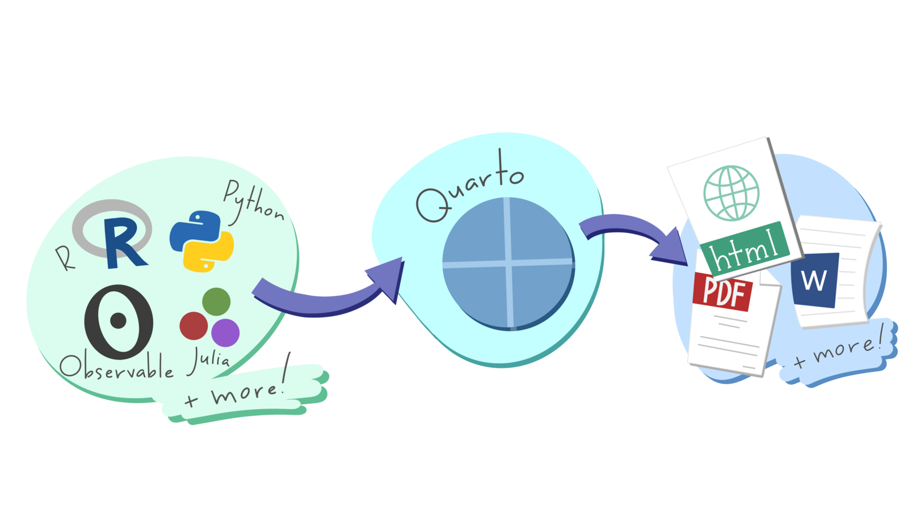</p>


## Markdown

*Markdown* is a way of formatting plain text so that a computer can convert it
into different file formats. For example, RStudio can convert Markdown documents
into Word, PDF, PowerPoint and many other formats. 


```{r markdown-flowchart, echo=FALSE, eval=FALSE}
library(Gmisc)

box_markdown <- boxGrob(
  "a Markdown\ndocument",
  x = unit(0.2, "npc"),
  bjust = "right"
)
box_rstudio <- boxGrob("… can be processed\nby RStudio into …")
box_word <- boxGrob(
  "Word",
  x = unit(0.8, "npc"),
  y = unit(0.8, "npc"),
  width = unit(0.15, "npc"),
  bjust = "left"
)
box_pdf <- boxGrob(
  "PDF",
  x = unit(0.8, "npc"),
  y = unit(0.65, "npc"),
  width = unit(0.15, "npc"),
  bjust = "left"
)
box_pp <- boxGrob(
  "PowerPoint",
  x = unit(0.8, "npc"),
  y = unit(0.5, "npc"),
  width = unit(0.15, "npc"),
  bjust = "left"
)
box_web <- boxGrob(
  "web page",
  x = unit(0.8, "npc"),
  y = unit(0.35, "npc"),
  width = unit(0.15, "npc"),
  bjust = "left"
)
box_other <- boxGrob(
  "other formats",
  x = unit(0.8, "npc"),
  y = unit(0.2, "npc"),
  width = unit(0.15, "npc"),
  bjust = "left"
)

arw <- arrow(type = "open")

# create file
png(
  here::here("inst/tutorials/14_writing_reports/images/markdown_flowchart.png"),
  width = 800,
  height = 300,
  units = "px"
)

# create new page
grid::grid.newpage()

# print connections
connectGrob(box_markdown, box_rstudio, type = "horizontal", arrow_obj = arw)
connectGrob(box_rstudio, box_word, type = "Z", arrow_obj = arw)
connectGrob(box_rstudio, box_pdf, type = "Z", arrow_obj = arw)
connectGrob(box_rstudio, box_pp, type = "Z", arrow_obj = arw)
connectGrob(box_rstudio, box_web, type = "Z", arrow_obj = arw)
connectGrob(box_rstudio, box_other, type = "Z", arrow_obj = arw)

# print boxes
box_markdown
box_rstudio
box_word
box_pdf
box_pp
box_web
box_other

# write plot to file
dev.off()
```


<p class="full-width-image">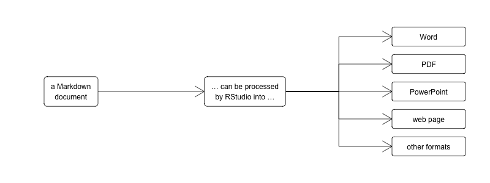</p>

Markdown uses plain-text characters to represent formatting such as titles, 
italic text and so on. For example, the Markdown text:

```lang-md
# Introduction

In this tutorial we will learn to use a tool called *Quarto* to write reports directly in RStudio.
```

produces the output:


::: {.faux-markdown}

<h1>Introduction</h1>

<p>In this tutorial we will learn to use a tool called <em>Quarto</em> to 
write reports directly in RStudio.</p>

:::


In this example, the character `#` followed by a space at the start of a line 
mean that line should be shown as a first-level heading and the asterisks (`*` 
-- we could also have used the underscore character `_`) around the word 
`Quarto` indicate that it should be emphasised (typically with *italic* 
text).


::: {.box .notewell}

In Markdown we use the hash character `#` followed by a space to indicate that a 
line should be formatted as a top-level heading. The space after the `#` is
important – if you write `#Introduction` instead of `# Introduction` then R will
not recognise that line as representing a heading and it will not be formatted
properly.

:::


Markdown is designed to be easy to read and easy to write. It is perfectly 
possible, for example, to read the unformatted Markdown text in the example 
above. Since Markdown files (which have the file extension `.md`) are plain 
text, it's also possible to open them on virtually any computer. Markdown is
very widely used on the web -- using underscores to mark out italic text 
and asterisks to mark out bold text even works in messaging apps such as 
Telegram and WhatsApp.

In Markdown you describe the *structure* of a document, not its appearance. The 
appearance of the document (which fonts it uses, what margins the pages have and
so on) are determined by the templates that RStudio uses to convert markdown
files into documents of different types. This can save you a lot of time, 
because you don't need to specify fonts and other formatting. Instead, you can
concentrate on the structure of your argument rather than the details of
formatting. 

You can create your own templates for documents (for example if you want to 
create documents that match a particular corporate style) but in this course we 
will use the templates built into RStudio, which are designed to create 
documents that communicate data effectively.


### Markdown document structure

To create paragraphs in Markdown, you simply split text with a blank line. So
this Markdown text:

```lang-md
In this tutorial we will learn to use a tool called _Quarto_ to write reports directly in RStudio.
Markdown is a way of formatting plain text so that a computer can convert it into different file formats.
```

produces the output:


::: {.faux-markdown}

In this tutorial we will learn to use a tool called _Quarto_ to write reports
directly in RStudio.
Markdown is a way of formatting plain text so that a computer can convert it
into different file formats.

:::


because there is no blank line between the first and second sentences. We can
split this into two paragraphs just by adding a blank line:

```lang-md
In this tutorial we will learn to use a tool called _Quarto_ to write reports directly in RStudio.

Markdown is a way of formatting plain text so that a computer can convert it into different file formats.
```

which produces the output:


::: {.faux-markdown}

In this tutorial we will learn to use a tool called _Quarto_ to write reports
directly in RStudio.

Markdown is a way of formatting plain text so that a computer can convert it
into different file formats.

:::


#### Headings

There are six levels of headings available in Markdown documents, although it is
very unlikely that you will need all six. Headings are specified by adding one 
or more `#` characters to the start of the line, followed by a space:

```lang-md
# First-level heading

## Second-level heading

### Third-level heading
```

produces:


::: {.faux-markdown}

<h1>First-level heading</h1>

<h2>Second-level heading</h2>

<h3>Third-level heading</h3>

:::


Headings should have at least one blank line above and below them, so that they
stand out from the surrounding code. I usually leave three blank lines before a
second-level heading and two blank lines before other headings, with exactly one
blank line after every type of heading.


::: {.box .notewell}

Remember that Markdown describes the *structure* of a document, not its 
appearance, so you should not choose a heading level based on what size of text
it produces in a particular output format. It is often best to save the 
first-level heading for your document title, so break the document up into 
sections by specifying second-level headings and then break those sections up
into sub-sections with third-level headings etc.

:::


#### Lists

Markdown supports two types of list: ordered lists and unordered lists. You can
make an ordered list by putting each list item on a new line and starting each
line with a number followed by a full stop (`.`). You make an unordered list in
the same way, but starting each line with an asterisk:

```lang-md
1. A list of items
2. for which the ordering
3. of items is important

* A list of items
* for which the ordering
* of items is *not* important
```

produces:


::: {.faux-markdown}

1. A list of items
2. for which the ordering
3. of items is important

* A list of items
* for which the ordering
* of items is *not* important

:::


#### Quotes

If you want to insert a quote into your Markdown document, you can do that by
putting a greater-than (`>`) symbol followed by a space at the start of each
line of the quote:

```lang-md
> In this tutorial we will learn to use a tool called _Quarto_ to write reports directly in RStudio.
```

produces 


::: {.faux-markdown}

<blockquote>
In this tutorial we will learn to use a tool called _Quarto_ to write reports 
directly in RStudio.
</blockquote>

:::


### Inline elements

As well as using Markdown to describe the structure of a document, you can use
it to mark up particular text within a paragraph. We've already seen how to do 
this using `_to emphasise text_` (usually displayed in _italics_). We can also 
`**strongly emphasise**` text, which will usually appear in **bold**. Note that
the `_`, `*` or `**` characters must be touching a word on exactly one side:

  * `some _emphasised_ text` produces some _emphasised_ text
  * `some_emphasised_text` does not produce emphasised text
  * `some _ emphasised _ text` does not produce emphasised text

We can add links to a document using the format `[link text](URL)`. For example,
the text:

```lang-md
[learn about the tidyverse](https://www.tidyverse.org/)
```

produces the link:


::: {.faux-markdown}

[learn about the tidyverse](https://www.tidyverse.org/)

:::


There are several other Markdown codes for describing different elements within
a document, including images, videos and segments of code. You can find out more
about what's possible with Markdown on the 
[Markdown Basics page of the Quarto website](https://quarto.org/docs/authoring/markdown-basics.html).


### Processing Markdown in RStudio

Once you've written a Markdown document, you can convert it into a web page, a
Word document or a PDF file from within RStudio. First, save your document with 
a `.md` file extension -- this tells RStudio that the file is a Markdown 
document. You should now see a new button at the top of the RStudio script panel 
marked `Preview`. 

<p class="centered-image">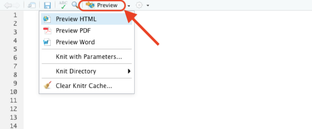</p>

If you click on the small downward-pointing triangle next to that button, you 
have the option to produce your report in 
<abbr title="hypertext markup language">HTML</abbr> (web page) format, PDF or 
Microsoft Word. HTML format is useful for creating documents to be published on 
the web, but also for quickly previewing documents in RStudio while you are 
working on them. Click on the relevant option to create the document in your
format of choice.

You do not need to have Microsoft Word installed on your computer to produce 
Word documents from Markdown files in RStudio, although you will need Word (or
other word-processing software) to view the file.

To create PDF files from Markdown in RStudio, your computer has to have a 
version of software called TeX installed. If you've never heard of TeX, you can
install it automatically using the `tinytex` R package. To install TeX, just run
this R code _once_ on your computer:

```r
install.packages("tinytex")
tinytex::install_tinytex()
```

TeX should now be installed on your computer. After you have restarted RStudio
you will be able to create PDFs from within RStudio.

::: {.box .notewell}

Note that you only have to install TeX once on each computer you use, so you
should not include `tinytex::install_tinytex()` in any Quarto scripts that
you write.

:::


## Quarto

Markdown allows you to create static documents in RStudio. We can add all types
of R output -- including maps, tables, charts and the results of calculations --
to Markdown documents using *Quarto*, which is built into RStudio.

Quarto is a system that converts Markdown documents that contain chunks of code
written in R or Python, runs the code and then integrates the Markdown text and
the code results into one or more output files. Quarto can produce web pages,
Word documents, PDF files, presentations, websites, e-books and other formats.

A Quarto file is just like a Markdown document except that it has the file
extension `.qmd` rather than the extension `.md`. The `.qmd` extension tells 
RStudio that a file will contain a mixture of text formatted with Markdown and
code that produces tables, charts and so on.

Since Quarto can produce many types of document, RStudio has a dialogue box in
which you can select from all the installed Quarto templates. Click on the 
'new file' button in the top-left corner of the RStudio window and then on
`Quarto Document…`

<p class="centered-image">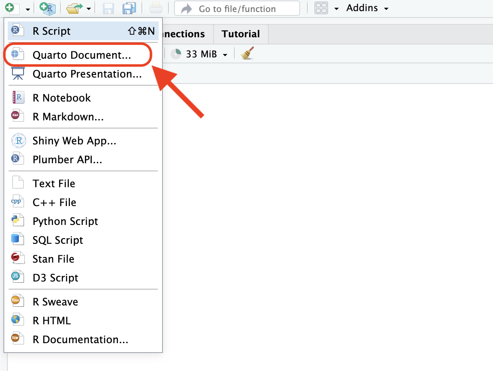</p>

This will open a box containing all the Quarto templates that are installed
on your computer. Some of these are installed by default and some may have been
added by packages that you have installed.

<p class="centered-image">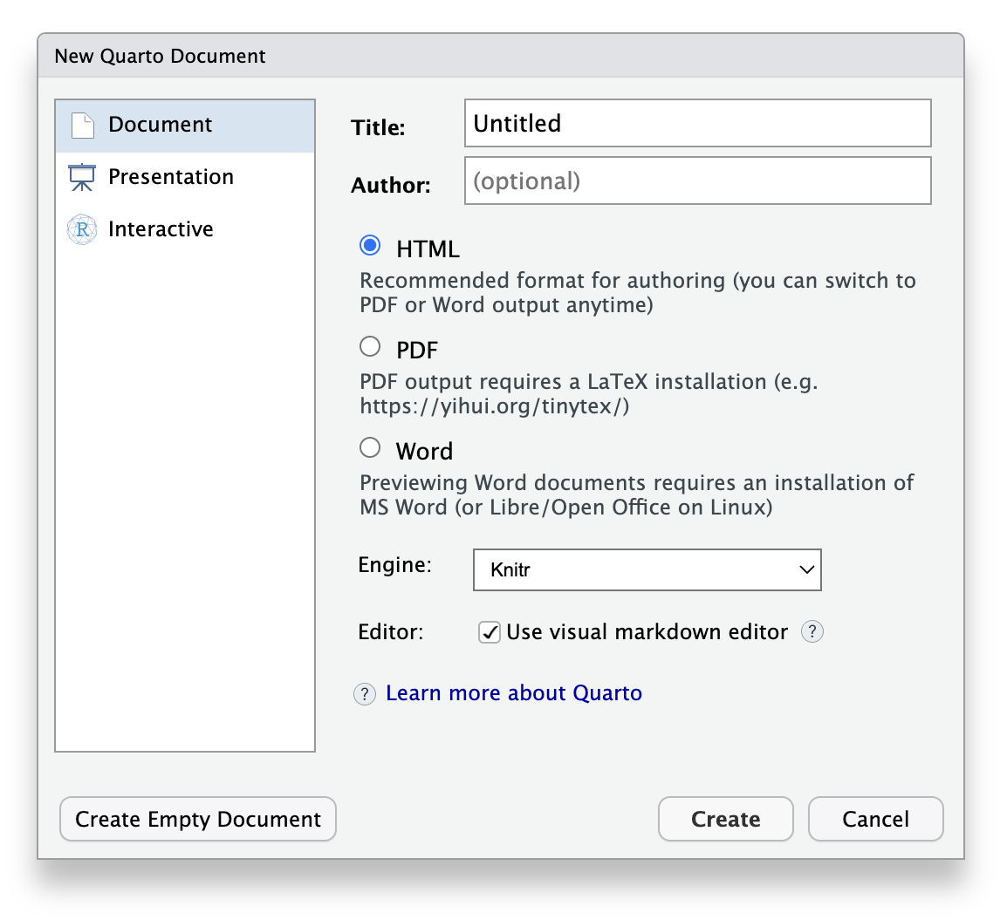</p>

You can edit Quarto documents in two ways in RStudio. When you create a new
Quarto document, RStudio will open it in the _Visual editor_. This allows you to
write the text content of your document as you would in word-processing software
such as Word. For example, you can make text bold using buttons on the tool bar
at the top of the document, or using standard keyboard short-cuts such as 
`Ctrl+B` on Windows or `Command+B` on Mac. There is also a _Source editor_, 
which allows you to edit the underlying Markdown formatted text directly. 

In this tutorial we will use the Visual editor, but you can choose to use the
Source editor if you prefer. To switch between the two editors, slick the 
`Source` or `Visual` buttons at the left-hand end of the formatting tool bar at
the top of the Quarto document window.

Whichever editor you use, Quarto documents start with a *header* that provides 
some basic information about the document, such as the title. A simple Quarto 
header looks like this:

```yaml
---
title:  "An Quarto document"
author: "Joe Bloggs"
date:   "3 March 2021"
---
```

The header is written in yet another programming language called 
[YAML](https://en.wikipedia.org/wiki/YAML). You don't need to know the details 
of YAML to write headers for Quarto documents. Two things you do need to know, 
though: 

  * The three dashes (`---`) are important, because they tell RStudio that the 
    content inside the dashes is the document header. The dashes must appear at
    the start of a line on their own.
  * Indentation matters in YAML. Every line takes the form `key: value` and in 
    most cases the key must be at the very start of the line. Lines in YAML are
    not limited to 80 characters, so you should not break a single value (such
    as the document title) over multiple lines.


### R code in Quarto

Quarto will process everything in an Quarto document after the header 
(marked with `---`) as Markdown text. The only exception to this is when you
include sections of code in an Quarto document.

You can include R code inside a line of Markdown text (known as *inline* code)
and the result of that code will be included in the document output. To do this 
in the visual editor, you type a lower-case `r` followed by a space, then the 
code you want to run. You then select the text from the letter `r` to the end of
the code, open the `Format` menu in the Quarto tool bar and select `Code`
(alternatively you can select the text and use the keyboard short-cut 
`Command+D` on Mac or `Ctrl+D` on Windows).

For example, if you wanted to insert today's date into a Quarto document, you
can type:

<p class="centered-image">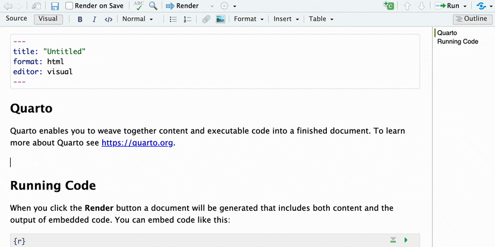</p>

Which would produce the output:

<p class="centered-image">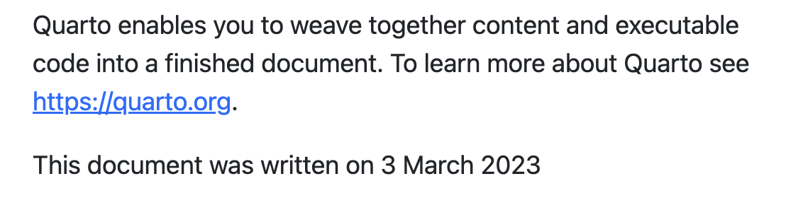</p>

Putting R code inline is fine for simple pieces of code, but longer pieces of
code included inline would become difficult to read (and therefore difficult to
debug). Fortunately, we can put as much code as we like in a *code block*. To
add a block of R code to an Quarto document, we open the `Insert` menu on the
Quarto tool bar, click `Code Chunk` and then `R`. You will then see a grey box
appear at the point in your document where you had placed the cursor, with the
text `{r}` at the start of the box.

We can use code chunks to run longer pieces of code that would be difficult to
read if the code were inline. For example, if you wanted to load a data file of
crime data, filter it for crimes occurring in a particular month and then count
the number of rows, you could do the calculation in a code chunk and then 
include the result inline:

<p class="centered-image">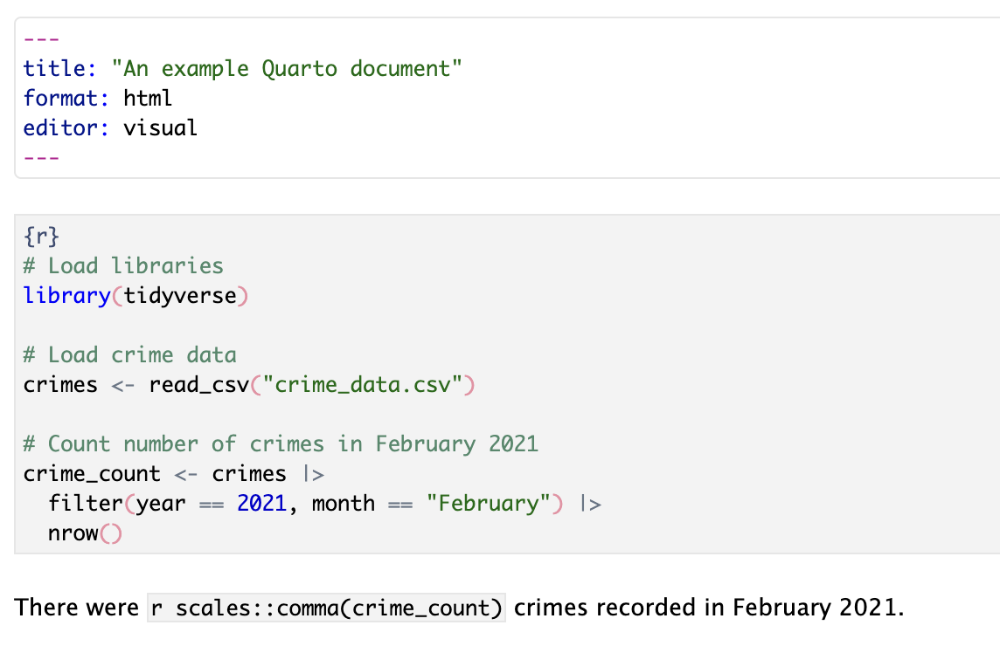</p>

Note that to make the Quarto document more readable, RStudio has given the
R code chunk a grey background, in contrast to the white background of the rest
of the document. If a code chunk does not have a grey background, this is a good
sign that there is something wrong: maybe you haven't saved the file with a 
`.qmd` file extension, or maybe you have not inserted the code block correctly.

Code chunks can also be used to insert tables and charts (including maps) into
a Quarto document. To add a nicely formatted table of data, use the `kable()` 
function from the `knitr` library. For example:

```r
# Print table of crime counts in each police division
crimes |> 
  filter(year == 2021, month == "February") |> 
  count(division) |> 
  # We haven't loaded the `knitr` package, so we need to refer to the `kable()`
  # function using the `::` operator
  knitr::kable()
```

We can also use code chunks to produce graphics. In this case, you just include
the code to produce your map or chart in a code chunk as you normally would.

To help keep track of code chunks, we can name them. To name a code chunk, put a
single space after the letter `r` in the line that begins the chunk and then 
give the chunk name. Names can include letters, numbers and dashes (`-`). For
example, if we wanted to call the chunk above `count-all-crimes` we would start
the code chunk with the code `{r count-all-crimes}`.

The package that converts Quarto documents into other formats is called `knitr` 
-- actually, it's a bit more complicated than that, but one of the nice
things about Quarto is you don't need to worry about what's happening behind
the scenes.

<p class="full-width-image">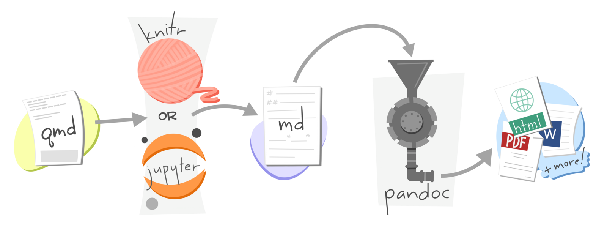</p>

The default Quarto template is set up so that the final document that is
produced from your Quarto file will include both the code that you include in
any code chunks *and* the output that the code produces. For example, this 
Quarto document:

<p class="centered-image">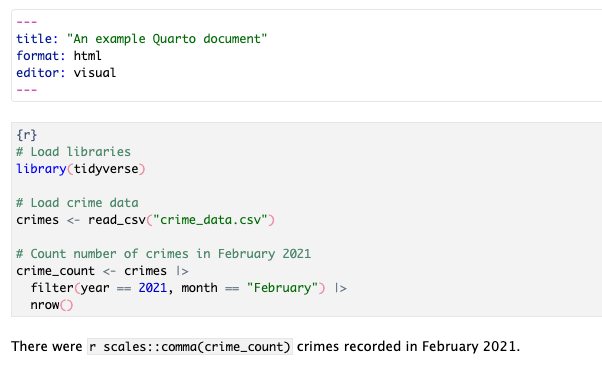</p>

Produces this output, which is probably not what you want:

<p class="centered-image image-border">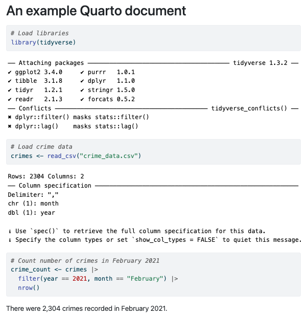</p>

We can control the results of code chunks using *chunk options*, sometimes 
called *knitr options*. We put these on the first line of each code chunk, with
each option on a separate line and each line starting with the characters `#| `
(referred to as a _hash-pipe_). Note that the `#|` _must_ be followed by a space
for Quarto to recognise it as a chunk option.

To specify that the code in our R code chunks should not be printed in the final
document, we can set the chunk option `#| echo: false`. To specify that both the 
R code and the _output_ produced by that code in each code chunk (e.g. and 
messages or warnings) should not be shown, we can set the chunk option 
`#| include: false`. 

If we change the code in our previous example to include this line, the output
becomes much more like the report we want:

<p class="centered-image image-border">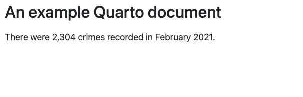</p>

If a code chunk produces a chart or map then we *do* want to show the output 
(although not the code), so in that case we should not set `#| include: false` 
-- we do not need to set `#| include: true` because it is the default.

Since we probably don't want any chunks in our code to include the code in our
final document, we could end up setting the chunk option `#| echo: false` for 
every code chunk. In a long or complicated document, this would get tedious. 
Fortunately, we can set chunk options *globally* (i.e. for all chunks in a 
document) by setting them in the YAML document header. To do this, we add a key
called `execute` to the header. Instead of giving the `execute` key a value such
as `true` or `false`, we instead indent the _next_ line of the header by exactly
two spaces and then set the chunk option `echo: false`. If we wanted to set 
multiple global chunk options here, we would put each one on a new line, all of
the lines indented by two spaces from the start of each document. 

```yaml
---
title:  "An Quarto document"
author: "Joe Bloggs"
date:   "3 March 2021"
execute:
  echo: false
---
```

Some of the R code we write produces messages or warnings that we will not want
to include in our Quarto documents. For example, readers of a report based on
crime data are unlikely to want to see the warning produced by the 
`st_intersection()` function, and will probably be quite surprised if this 
appears in their code. To hide these messages, we can split the code needed to
produce a map into two code chunks: one to do the pre-processing that often
creates messages or warnings, and a second chunk to create the map itself.

<p class="centered-image">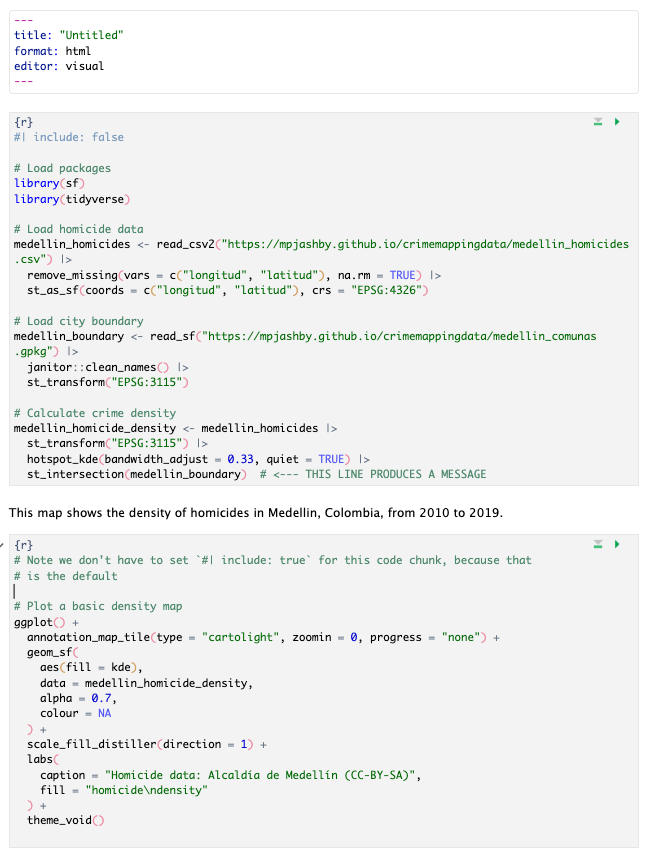</p>


## Rendering Quarto

Once you've written the text for your document and added the code needed to
produce statistics, tables and figures, it's time to convert your Quarto file
to a document in the format you need. This process is called *rendering*.

In RStudio you can render a Quarto document by clicking the `Render` button (if
you can't see the `Render` button at the top of your Quarto document, that is a
sign you haven't saved the file as a `.qmd` file). By default, RStudio will 
produce an HTML file (a web page) and open it in the HTML viewer built into 
RStudio. You can produce other formats instead of a web page by clicking on the 
downward-pointing arrow next to the `Render` button and then choosing the format
you want.

You can control the output format that RStudio will produce by changing the
`format:` value in the YAML header of your Quarto document. The default is
`format: html`, but you can also use `format: pdf` to produce a PDF file,
`format: docx` to produce a Word document, `format: epub` to produce an e-book,
`format: pptx` to produce a PowerPoint presentation. There are 
[many other ouput formats available](https://quarto.org/docs/output-formats/all-formats.html).


::: {.box .notewell}

If you have a choice of which format to produce a report in, I would suggest you
choose HTML because it can do things (like include interactive maps made with
`leaflet`) that Word and PDF format cannot, and can easily be read on mobile 
devices. If, for whatever reason, you cannot choose HTML, I recommend choosing 
PDF format since it is readable on almost all computers, even those that do not
have Word installed on them. Only produce reports in Word format if you are 
specifically required to submit something in that format.

:::


Whatever format you choose, the output file will be saved in the same folder on
your computer that you saved your `.qmd` file in, and will have the same file
name but with a different file extension (`.html`, `.pdf`, `.docx`, etc.). If 
you render the document again, RStudio will overwrite the previous output file.

When you render a Quarto document, RStudio will run all the code in the file so
that it can knit the results together with the document text. This is similar to
running the code in a `.R` file using the `Source` button, except that when
RStudio runs the code in a Quarto document, RStudio can only access functions
from the packages that are loaded in the Quarto document itself, and only make 
use of objects created inside the Quarto document. This means that nothing you
do in the console or in any other files you have open in RStudio (e.g. loading a 
package or creating an object) affects the results that will be produced when
you render a Quarto document.

Since rendering a Quarto document involves running all the code contained in it,
it is possible that the code will cause errors at the time when the Quarto
document is rendered. When this happens, the R error message will appear in the
RStudio Render panel. When you run a `.R` file that produces an error, the error
message typically tells you which line of code the error occurred on. But when
an error occurs while rendering a Quarto file, the error message only specifies 
the first and last lines of the _part_ of the document in which the error
occurred. If the error occurred inside a code chunk, the error message will
refer to the first and last lines of that chunk, but the error itself could have
occurred anywhere inside that chunk. If the error occurs _outside_ a code chunk,
the error message will report that the error occurred somewhere between the last
line of the previous code chunk and the first line of the next code chunk. It is
up to you to find the exact location of the error.


### Making self-contained HTML documents

Web pages written in HTML typically make use of images, videos and other 
resources stored in separate files. In fact, the web page you're reading now
makes use of resources stored in 51 separate files. This works well on the web,
since it allows resources to be shared between lots of HTML files, which reduces
how much data has to be stored and transmitted across networks. But it works 
less well when you want to send an HTML report to someone else over email, since
it can be hard to keep track of all the external files associated with a 
particular HTML file.

To deal with this problem, we can tell Quarto that when it creates an HTML 
report, all the necessary data and other resources should be embedded inside the
HTML file itself. This makes the HTML file larger, but easier to manage. To make
HTML reports produced by Quarto self-contained in this way, we can change the
`format` section of the header of a Quarto document from simply `format: html`
to instead specify exactly what settings we want to be used to create that HTML
file:

```yaml
format:
  html:
    embed-resources: true
```

There are lots of other ways we can use the `format` section of the header in a
Quarto document to fine-tune how the resulting document works. You can find out
more [in the HTML section of the Quarto website](https://quarto.org/docs/output-formats/html-basics.html).


## In summary

::: {.box .welldone}

In this tutorial we have learned how to use Markdown to create structured 
text using simple formatting codes and how to integrate that text with our code
to produce integrated reports that include the results of our analysis. This 
means we can make our work *reproducible* so that we can avoid all the mistakes
that can happen if we have to copy and paste statistics and graphics into 
reports written in software like Word. 

It also means we can produce periodic reports with updated data very easily, 
since we can just choose the data we want the report to be based on using 
`filter()` at the start of our file and render the document. This can save a 
huge amount of time in producing reports such as performance bulletins or 
monthly summaries of crime in an area.

:::


To get used to working with Quarto files, download 
[this example report](https://github.com/mpjashby/crimemapping/raw/main/inst/example_quarto_report.qmd)
to your computer and open it in RStudio. Now make the following changes:

  1. Change the global chunk options so that the code used in each code chunk is
     not shown in the final document.
  3. Render the file into documents of at least two different formats (e.g. HTML
     and Word). If you have installed `tinytex` on your computer so that you can
     create PDF documents, look at how different the document appears in PDF
     format compared to HTML format because of the different templates used.

There is a lot more you can do with Quarto. To find out more, refer to these
resources.

  * [R for Data Science chapter on Quarto](https://r4ds.hadley.nz/quarto.html).
  * A [gallery of different documents, websites and presentations written with Quarto](https://quarto.org/docs/gallery/).

<p class="credits"><a href="https://twitter.com/allison_horst">Artwork by @allison_horst</a></p>
