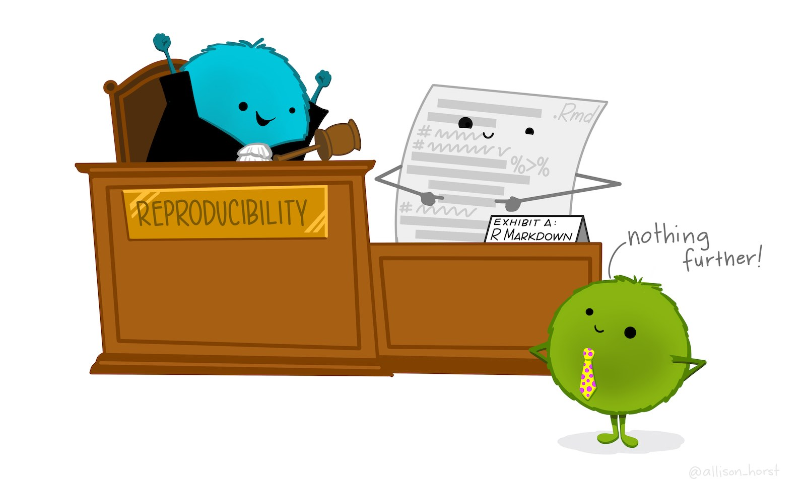
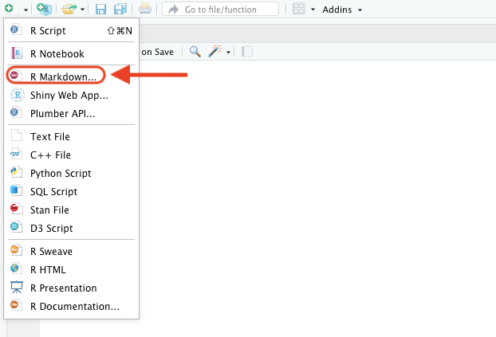
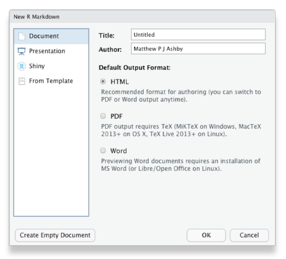
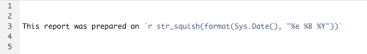
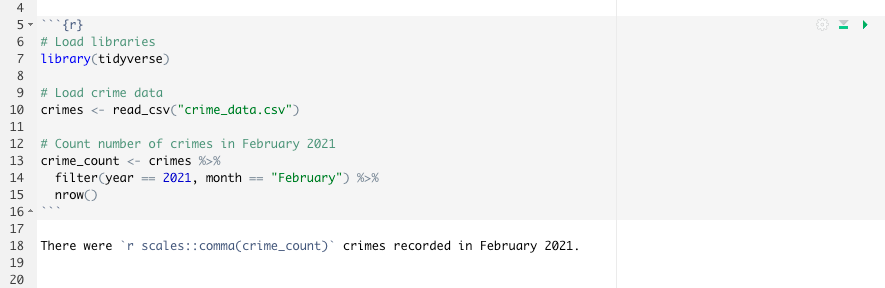
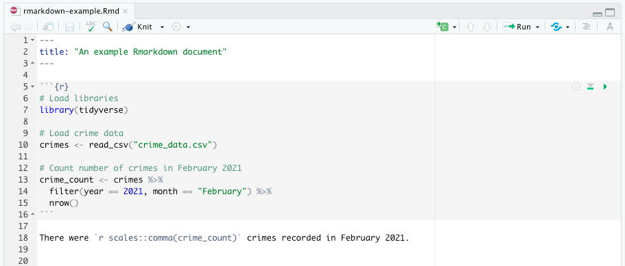
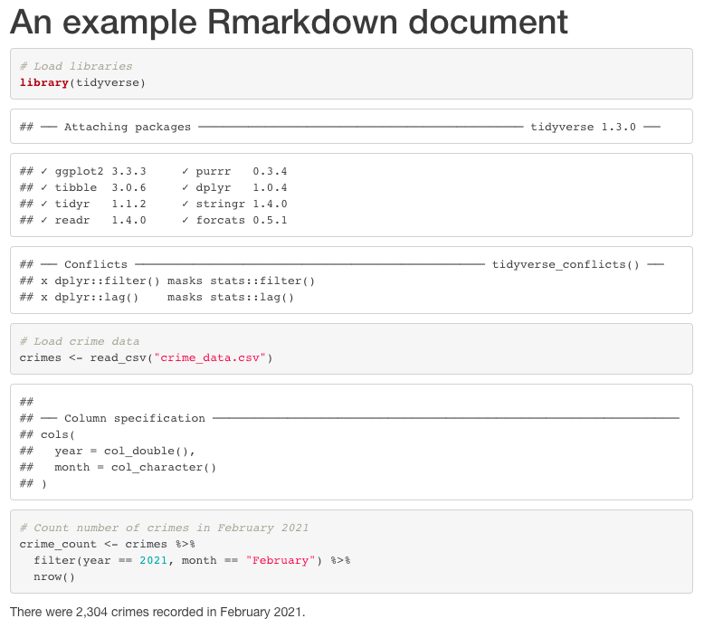
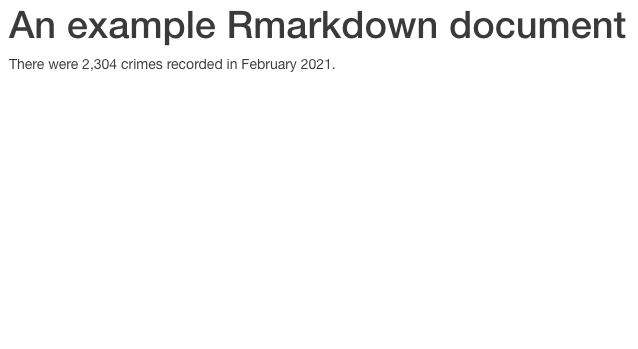
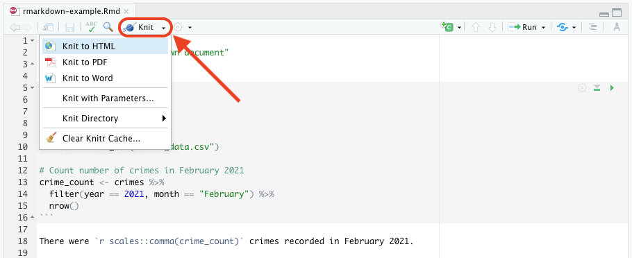
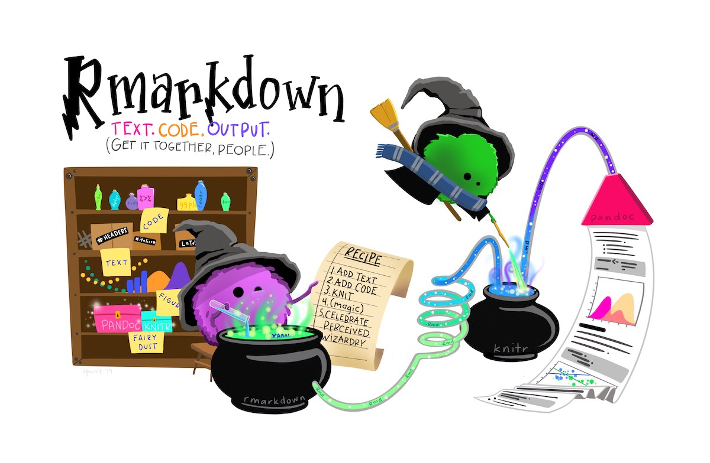

```{r setup, include=FALSE, message=FALSE, warning=FALSE}
library(learnr)
tutorial_options(exercise.timelimit = 120)
knitr::opts_chunk$set(echo = FALSE)

# Load packages
library(sf)
library(tidyverse)

# Copy files
if (!dir.exists("css")) dir.create("css")
walk(
  dir("../css/"), 
  ~ file.copy(str_glue("../css/{.}"), str_glue("css/{.}"), overwrite = TRUE)
)
```

## Introduction

We already know how to produce useful maps in R so that people can use them to
make decisions about understanding and responding to crime problems. But maps 
are only one part of most spatial analysis. In practice, maps are usually
part of a larger report in which you as an analyst will explain what your maps
show and perhaps make recommendations about what decisions people should make.

You are probably used to creating graphics in one piece of software (such as a
map in R or a chart in Excel) and then importing or pasting those graphics into
another program (such as Word) to including them in a written report. This way
of working is often fine, but it has some shortcomings. For example, if you want
to make a change to a graphic (maybe to correct a typo), you then have to import
it into your writing program again. More importantly, it can become hard to keep
track of which version of a graphic you need to import and you may end up 
including the wrong version of a file. 

The same problem applies to numbers that you might calculate in statistical
software such as R. You might calculate a statistic such as the mean number of 
burglaries in local council wards, then paste the result into Word to include it
in your report. But if you then realise later on that there is a problem with
your data and re-run your code, it would be very easy (especially in a long 
report) to forget that you needed to update the mean value presented in the
report. The risk of making errors like this is particularly high if you are 
asked to update an existing report based on new data.

We can describe this risk of our report containing obsolete charts or incorrect
statistics by saying that is is not *reproducible* -- if we were asked to go 
back and demonstrate each stage in producing the report to prove that we had
done everything correctly, it would be very hard to do so. This is important 
because the reports that analysts write about crime are so often used to make
decisions about how to respond to crime. An error in copying and pasting a 
number from R or Excel into Word could lead to police officers being deployed to
the wrong place, or the wrong local council being given funding to install
crime-prevention measures.

In this tutorial we will learn to use a tool called *Rmarkdown* to write reports
directly in RStudio, integrating data, maps and statistics directly into reports
so that they are always up-to-date. Rmarkdown can be used to produce complicated
and polished reports in a way that makes sure they are always up to date. For
example, the report 
[*Stop and Search in London*](https://discovery.ucl.ac.uk/id/eprint/10115766/1/2020-Q3.pdf)
was created entirely in Rmarkdown.

<p class="full-width-image"></p>

<p class="credits">[Stats Illustrations by Allison Horst](https://github.com/allisonhorst/stats-illustrations) licensed under the [Creative Commons Attribution licence](https://github.com/allisonhorst/stats-illustrations/blob/master/license).</p>


## Markdown

*Markdown* is a way of formatting plain text so that a computer can convert it
into different file formats. For example, RStudio can convert Markdown documents
into Word, PDF, PowerPoint and many other formats. 

<p class="full-width-image"></p>

Markdown uses plain-text characters to represent formatting such as titles, 
italic text and so on. For example, the Markdown text:

```lang-md
# Introduction

In this tutorial we will learn to use a tool called *Rmarkdown* to write reports
directly in RStudio.
```

produces the output:

<div style="margin: 1em; padding: 1em; border: 1px solid #CCCCCC; border-radius: 0.2em;">

<h1 style="margin-top: 0.5em;">Introduction</h1>

<p>In this tutorial we will learn to use a tool called <em>Rmarkdown</em> to 
write reports directly in RStudio.</p>

</div>

In this example, the character `#` at the start of a line mean that line 
should be shown as a first-level heading and the asterisks (`*` -- we could also
have used the underscore character `_`) around the word `Rmarkdown` indicate 
that it should be emphasised (typically with *italic* text).

Markdown is designed to be easy to read and easy to write. It is perfectly 
possible, for example, to read the unformatted Markdown text in the example 
above. Since Markdown files (which have the file extension `.md`) are plain 
text, it's also possible to open them on virtually any computer. Markdown is
also very widely used on the web -- using underscores to mark out italic text 
and asterisks to mark out bold text even works in messaging apps such as 
Telegram and WhatsApp.

In Markdown you describe the *structure* of a document, not its appearance. The 
appearance of the document (which fonts it uses, what margins the pages have and
so on) are determined by the templates that RStudio uses to convert markdown
files into documents of different types. This can save you a lot of time, 
because you don't need to specify fonts and other formatting. Instead, you can
concentrate on the structure of your argument rather than the details of
formatting. 

You can create your own templates for documents (for example if you want to 
create documents that match a particular corporate style) but in this course we 
will use the templates built into RStudio, which are designed to create 
documents that communicate data effectively.


### Markdown document structure

To create paragraphs in Markdown, you simply split text with a blank line. So
this Markdown text:

```lang-md
In this tutorial we will learn to use a tool called _Rmarkdown_ to write reports
directly in RStudio.
Markdown is a way of formatting plain text so that a computer can convert it
into different file formats.
```

produces the output:

<div style="margin: 1em; padding: 1em; border: 1px solid #CCCCCC; border-radius: 0.2em;">

In this tutorial we will learn to use a tool called _Rmarkdown_ to write reports
directly in RStudio.
Markdown is a way of formatting plain text so that a computer can convert it
into different file formats.

</div>

because there is no blank line between the first and second sentences. We can
split this into two paragraphs just by adding a blank line:

```lang-md
In this tutorial we will learn to use a tool called _Rmarkdown_ to write reports
directly in RStudio.

Markdown is a way of formatting plain text so that a computer can convert it
into different file formats.
```

which produces the output:

<div style="margin: 1em; padding: 1em; border: 1px solid #CCCCCC; border-radius: 0.2em;">

In this tutorial we will learn to use a tool called _Rmarkdown_ to write reports
directly in RStudio.

Markdown is a way of formatting plain text so that a computer can convert it
into different file formats.

</div>


#### Headings

There are six levels of headings available in Markdown documents, although it is
very unlikely that you will need all six. Headings are specified by adding one 
or more `#` characters to the start of the line, followed by a space:

```lang-md
# First-level heading

## Second-level heading

### Third-level heading
```

produces:

<div style="margin: 1em; padding: 1em; border: 1px solid #CCCCCC; border-radius: 0.2em;">

<h1>First-level heading</h1>

<h2>Second-level heading</h2>

<h3>Third-level heading</h3>

</div>

Remember that Markdown describes the *structure* of a document, not its 
appearance, so you should not choose a heading level based on what size of text
it produces in a particular output format. It is often best to save the 
first-level heading for your document title, so break the document up into 
sections by specifying second-level headings and then break those sections up
into sub-sections with third-level headings etc.


#### Lists

Markdown supports two types of list: ordered lists and unordered lists. You can
make an ordered list by putting each list item on a new line and starting each
line with a number followed by a full stop (`.`). You make an unordered list in
the same way, but starting each line with an asterisk:

```lang-md
1. A list of items
2. for which the ordering
3. of items is important

* A list of items
* for which the ordering
* of items is *not* important
```

produces:

<div style="margin: 1em; padding: 1em; border: 1px solid #CCCCCC; border-radius: 0.2em;">

1. A list of items
2. for which the ordering
3. of items is important

* A list of items
* for which the ordering
* of items is *not* important

</div>


#### Quotes

If you want to insert a quote into your Markdown document, you can do that by
putting a greater-than (`>`) symbol followed by a space at the start of each
line of the quote:

```lang-md
> In this tutorial we will learn to use a tool called _Rmarkdown_ to write 
> reports directly in RStudio.
```

produces 

<div style="margin: 1em; padding: 1em; border: 1px solid #CCCCCC; border-radius: 0.2em;">

<blockquote>
In this tutorial we will learn to use a tool called _Rmarkdown_ to write reports 
directly in RStudio.
</blockquote>

</div>


### Inline elements

As well as using Markdown to describe the structure of a document, you can use
it to mark up particular text within a paragraph. We've already seen how to do 
this using `_to emphasise text_` (usually displayed in _italics_). We can also 
`**strongly emphasise**` text, which will usually appear in **bold**. Note that
the `_`, `*` or `**` characters must be touching a word on at least one side --
if you type ` _ ` with spaces on each side you will get an underscore character
in the output, not emphasised text.

We can add links to a document using the format `[link text](URL)`. For example,
the text:

```lang-md
[learn about the tidyverse](https://www.tidyverse.org/)
```

produces the link:

<div style="margin: 1em; padding: 1em; border: 1px solid #CCCCCC; border-radius: 0.2em;">

[learn about the tidyverse](https://www.tidyverse.org/)

</div>

There are several other Markdown codes for describing different elements within
a document, including images, videos and segments of code. You can find out more
about what's possible with Markdown in the 
[Markdown Syntax chapter of the book *R Markdown: The Definitive Guide*](https://bookdown.org/yihui/rmarkdown/markdown-syntax.html).


### Processing Markdown in RStudio

Once you've written a Markdown document, you can convert it into a web page, a
Word document or a PDF file. First, save your document with a `.md` file 
extension -- this tells RStudio that the file is a Markdown document. You should
now see a new button at the top of the RStudio script panel marked `Preview`. 

<p class="centered-image"></p>

If you click on the small downward-pointing triangle next to that button, you 
have the option to produce your report in 
<abbr title="hypertext markup language">HTML</abbr> (web page) format, PDF or 
Microsoft Word. HTML format is useful for creating documents to be published on 
the web, but also for quickly previewing documents in RStudio while you are 
working on them. Click on the relevant option to create the document in your
format of choice.

You do not need to have Microsoft Word installed on your computer to produce 
Word documents from Markdown files in RStudio, although you will need Word (or
other word-processing software) to view the file.

To create PDF files from Markdown in RStudio, your computer has to have a 
version of software called TeX installed. If you've never heard of TeX, you can
install it automatically using the `tinytex` R package. To install TeX, just run
this R code once:

```r
install.packages("tinytex")
tinytex::install_tinytex()
```

TeX should now be installed on your computer. After you have restarted RStudio
you will be able to create PDFs from within RStudio.


## Rmarkdown

Markdown allows you to create static documents in RStudio. We can add all types
of R output -- including maps, tables, charts and the results of calculations --
to Markdown documents using *Rmarkdown*, which is built into RStudio.


An Rmarkdown file is just like a Markdown document except that it has the file
extension `.Rmd` rather than the extension `.md`. The `.Rmd` extension tells 
RStudio that a file will contain a mixture of text formatted with Markdown and
R code that produces tables, charts and so on.

Rmarkdown documents start with a *header* that provides some basic information 
about the document, such as the title. A simple Rmarkdown header looks like 
this:


```yaml
---
title:  "An Rmarkdown document"
author: "Joe Bloggs"
date:   "3 March 2021"
---
```

The header is written in yet another programming language called 
[YAML](https://en.wikipedia.org/wiki/YAML). You don't need to know the details 
of YAML to write headers for Rmarkdown documents. Two things you do need to 
know, though: 

  * The three dashes (`---`) are important, because they tell RStudio that the 
    content inside the dashes is the document header. The dashes must appear at
    the start of a line on their own.
  * Indentation matters in YAML, so if you have long titles or need to write
    more-complicated headers for Rmarkdown documents, read 
    [this tutorial](https://bookdown.org/yihui/bookdown/r-markdown.html) first.

Since Rmarkdown can produce many types of document, RStudio has a dialog box in
which you can select from all the installed Rmarkdown templates. Click on the 
'new file' button in the top-left corner of the RStudio window and then on
`Rmarkdown`

<p class="centered-image"></p>

This will open a box containing all the Rmarkdown templates that are installed
on your computer. Some of these are installed by default and some may have been
added by packages that you have installed. For example, you can create a resumé
in Rmarkdown with the [`vitae` package](https://pkg.mitchelloharawild.com/vitae/).
Rmarkdown can produce a wide range of document types -- this tutorial is written
in Rmarkdown using a template provided by a package called 
[`learnr`](https://rstudio.github.io/learnr/), which is designed to produce
interactive tutorials for learning R.

<p class="centered-image"></p>


### R code in Rmarkdown

RStudio will process everything in an Rmarkdown document after the header 
(marked with `---`) as Markdown text. The only exception to this is when you
include sections of R code in an Rmarkdown document.

You can include R code inside a line of Markdown text (known as *inline* code). 
To do this, start your R code with `` `r `` and end it with `` ` ``. For 
example, you could add the current date in your document:

<p class="centered-image"></p>

Which would produce the output:

<div style="margin: 1em; padding: 1em; border: 1px solid #CCCCCC; border-radius: 0.2em;">

This report was prepared on `r str_squish(format(Sys.Date(), "%e %B %Y"))`

</div>

Putting R code inline is fine for simple pieces of code, but longer pieces of
code included inline would become difficult to read (and therefore difficult to
debug). Fortunately, we can put as much code as we like in a *code block*. To
add a block of R code to an Rmarkdown document, we add a new line and start it
with the characters ```` ```{r} ```` without spaces. To end a code chunk, 
include the characters ```` ``` ```` on a line on their own.

We can use code chunks to run longer pieces of code that would be difficult to
read if the code were inline. For example, if you wanted to load a data file of
crime data, filter it for crimes occurring in a particular month and then count
the number of rows, you could do the calculation in a code chunk and then 
include the result inline:

<p class="centered-image"></p>

Note that to make the Rmarkdown document more readable, RStudio has given the
R code chunk a grey background, in contrast to the white background of the rest
of the document. If a code chunk does not have a grey background, this is a good
sign that there is something wrong: maybe you haven't saved the file with a 
`.Rmd` file extension, or maybe there are blank spaces before the ```` ``` ````
characters that start and end the code block.

Code chunks can also be used to insert tables and charts (including maps) into
an Rmarkdown document. To add a nicely formatted table, use the `kable()`
function from the `knitr` library. For example:

```r
# Print table of crime counts in each police division
crimes %>% 
  filter(year == 2021, month == "February") %>% 
  count(division) %>% 
  # We haven't loaded the `knitr` package, so we need to refer to the `kable()`
  # function using the `::` operator
  knitr::kable()
```

We can also use code chunks to produce graphics. In this case, you just include
the code to produce your map or chart in a code chunk as you normally would --
when you create a new Rmarkdown document in RStudio, there is an example plot
already included to show you how it's done.

To help keep track of code chunks, we can name them. To name a code chunk, put a
single space after the letter `r` in the line that begins the chunk and then 
give the chunk name. Names can include letters, numbers and dashes (`-`). For
example, if we wanted to call the chunk above `count-all-crimes` we would start
the code chunk with the code ```` ```{r count-all-crimes} ````.

The package that converts Rmarkdown documents into other formats is called 
`knitr` -- actually, it's a bit more complicated than that, but one of the nice
things about Rmarkdown is you don't need to worry about what's happening behind
the scenes.

The default Rmarkdown template is set up so that the final document that is
produced from your Rmarkdown file will include both the code that you include in
any code chunks *and* the output that the code produces. For example, this 
Rmarkdown document:

<p class="centered-image"></p>

Produces this output, which is probably not what you want:

<p class="centered-image image-border"></p>

We can control the results of code chunks using *chunk options*, sometimes 
called *knitr options*. We put these on the first line of each code chunk, 
inside the braces (`{}`) after the letter `r`. If the chunk has a name (which is
good practice), separate the options from the name with a comma and a space.

To specify that the code in our R code chunks should not be printed in the final
document, we can set the chunk option `echo=FALSE`. To specify that the R 
output produced by the code in each code chunk, we can set the chunk option
`include=FALSE`. So if we wanted our code chunk to produce no output at all, we
could change the first line of the code chunk to read
```` ```{r count-all-crimes, echo=FALSE, include=FALSE} ````.

If we change the code in our previous example to include this line, the output
becomes much more like the report we want:

<p class="centered-image image-border"></p>


If a code chunk produces a chart or map then we *do* want to show the output 
(although not the code), so in that case we should not set `include=FALSE` -- we
do not need to set `include=TRUE` because it is the default.

Since we probably don't want any chunks in our code to include the code in our
final document, we could end up setting the chunk option `echo=FALSE` for every
code chunk. In a long or complicated document, this would get tedious. 
Fortunately, we can set chunk options *globally* (i.e. for all chunks in a 
document) by giving our *first* code chunk the name `setup` and then inside that
chunk calling the code `knitr::opts_chunk$set(echo = FALSE)`. The function name
`opts_chunk$set` might look a little strange, but fortunately this line of code
is included in the default Rmarkdown template, so we rarely need to remember it.
All we need to do in most cases is change the default `echo = TRUE` to 
`echo = FALSE`. We can also use the `setup` chunk to load and packages we need 
for our code, since it is easy to look at this first chunk in any document to 
see which packages are needed.

There a few other chunk options that are useful. If you know your code will
produce some messages or warnings *and you are happy that you have understood
those messages/warnings and don't need to take any action* then you can hide
the message/warning text by setting the options `message=FALSE` and/or
`warning=FALSE`. However, this is risky -- if your code produces some messages
or warnings you weren't expecting then you will not see them. This can lead to
you spending a long time trying to find out why your code isn't producing the
results you expect when there is a warning that explains the problem but which
you can't see because of `warning=TRUE`. So if you set either of these options,
make sure you take them out again if you run into any problems. Even better,
only set these options when you've already run your complete document 
successfully so that you know there are no problems.

Charts and maps based on `ggplot()` or `ggmap()` stacks can include built-in
titles. To add a title to a table, we can use the `fig.cap` chunk option, e.g.
`fig.cap="Number of crimes in each division, February 2021"`. We can control the 
size of graphics produced by code chunks using the `fig.width` and `fig.height`
options, e.g. `fig.width=10` to get a graphic that is 10 inches wide. There is
a complete list of available chunk options in the 
[Rmarkdown Reference Guide](https://rstudio.com/wp-content/uploads/2015/03/rmarkdown-reference.pdf).


## Knitting Rmarkdown

Once you've written the text for your document and added the code needed to
produce statistics, tables and figures, it's time to convert your Rmarkdown file
to a document in the format you need. this process is called *knitting* because 
it knits together text, code and output to produce the final product.

In RStudio you can knit an Rmarkdown document by clicking the `Knit` button (if
you can't see the `Knit` button at the top of your Rmarkdown document, that is a
sign you haven't saved the file as a `.Rmd` file. By default, RStudio will 
produce an HTML file (a web page) and open it in the HTML viewer built into 
RStudio. You can produce other formats instead of a web page by clicking on the 
downward-pointing arrow next to the `Knit` button and then choosing the format
you want.

<p class="centered-image"></p>

If you choose a different format from the default, RStudio will add a line to
the header of your Rmarkdown document so that the next time you click the `Knit`
button your document will be produced in the same format as you specified the
previous time. For example, if you choose `Knit to PDF` from the drop-down menu,
RStudio will add `output: pdf_document` to your document header and the next
time you click the `Knit` button a PDF will be produced. If you want to produce
a different format, just click the triangle next to the `Knit` button again and
choose the format you want.

Whatever format you choose, the output file will be saved in the same folder on
your computer that you saved your `.Rmd` file in, and will have the same file
name but with a different file extension (`.html`, `.pdf`, `.docx`, etc.). If 
you knit the document again, RStudio will overwrite the previous output file.


## In summary

<p class="full-width-image"></p>

In this tutorial we have learned how to use Markdown to create structured 
text using simple formatting codes and how to integrate that text with our code
to produce integrated reports that include the results of our analysis. This 
means we can make our work *reproducible* so that we can avoid all the mistakes
that can happen if we have to copy and paste statistics and graphics into 
reports written in software like Word. It also means we can produce periodic
reports with updated data very easily, since we can just choose the data we want
the report to be based on using `filter()` at the start of our file and knit the
document. This can save a huge amount of time in producing reports such as 
performance bulletins or monthly summaries of crime in an area.

To get used to working with Rmarkdown files, download 
[this example report](https://github.com/mpjashby/crimemapping/raw/main/inst/example_rmarkdown_report.Rmd)
to your computer and open it in RStudio. Now make the following changes:

  1. Change the chunk options of the code chunk `divisional-table` so that the
     table has a caption.
  2. Change the global chunk options so that the code used in each code chunk is
     not shown in the final document.
  3. Knit the file into documents of at least two different formats (e.g. HTML
     and Word). If you have installed `tinytex` on your computer so that you can
     create PDF documents, look at how different the document appears in PDF
     format compared to HTML format because of the different templates used.

There is a lot more you can do with Rmarkdown. To find out more, refer to these
resources.

  * The [Rmarkdown Reference Guide](https://rstudio.com/wp-content/uploads/2015/03/rmarkdown-reference.pdf) written by RStudio.
  * A [gallery of different documents, websites and presentations written with Rmarkdown](https://rmarkdown.rstudio.com/gallery.html).
  * [Rmarkdown: the definitive guide](https://bookdown.org/yihui/rmarkdown/) by
    Yihui Xie, J. J. Allaire and Garrett Grolemund -- a book-length explanation
    of everything that Rmarkdown can do.

<p class="credits">[Stats Illustrations by Allison Horst](https://github.com/allisonhorst/stats-illustrations) licensed under the [Creative Commons Attribution licence](https://github.com/allisonhorst/stats-illustrations/blob/master/license).</p>

