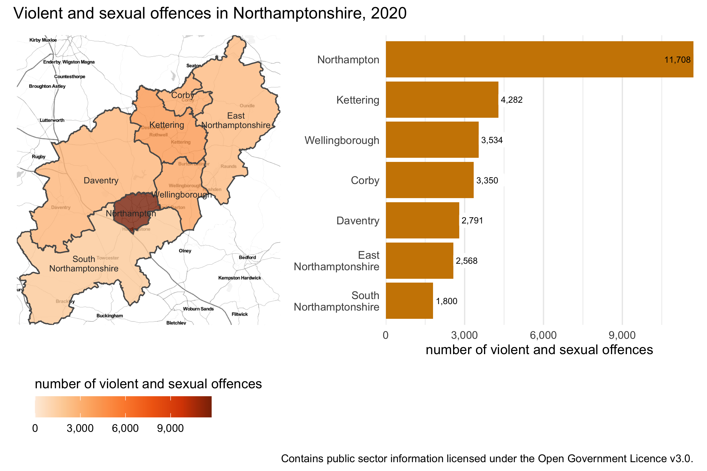

```{r setup, include=FALSE, message=FALSE, warning=FALSE}
library(learnr)
tutorial_options(exercise.timelimit = 120)
knitr::opts_chunk$set(echo = FALSE)

# Load packages
library(ggrepel)
library(gt)
library(sf)
library(tidyverse)

# Copy files
if (!dir.exists("css")) dir.create("css")
walk(
  dir("../css/"), 
  ~ file.copy(str_glue("../css/{.}"), str_glue("css/{.}"), overwrite = TRUE)
)

# Load data
burglary <- read_rds("../../extdata/northants_burglary.rds")
vehicle_theft <- read_rds("../../extdata/south_africa_vehicle_theft.Rds")
violence <- read_rds("../../extdata/malaysia_violence_counts.Rds")

vehicle_theft_wider <- vehicle_theft %>% 
  mutate(crime_category = recode(
    crime_category,
    "Theft of motor vehicle" = "theft_of",
    "Theft out of or from motor vehicle" = "theft_from"
  )) %>% 
  pivot_wider(names_from = crime_category, values_from = theft_rate)
```


## Introduction

Making maps is the core of analysing spatial data. But just because a particular
dataset has a spatial element to it does not mean that a map is the best way to
present that data. In this tutorial we will learn some other techniques for 
presenting data that can be more effective than maps for answering certain 
questions about spatial data. 

As with so much in spatial analysis, whether it is best to make a map or use
some other technique to convey information will depend on the circumstances. 
When you decide how to communicate information about the data you are analysing,
you will need to consider the questions you are trying to answer, the audience
that you are communicating to, what they will be using the information for and
in what circumstances they will be using it.

While the best choice of how to communicate spatial information will depend on
the circumstances, there are a few instances in which maps are typically *not*
the best way to communicate your data. These are:


#### When you only need to convey a handful of pieces of information
  
Maps are very effective for communicating detailed information, such as the
density of crime across thousands of cells in a KDE grid. But to do this, maps
typically encode information into aesthetics such as colour, size and so on.
This is necessary for communicating large amounts of information, but it makes
the connection between the data and the visual representation of the data less
direct. If you only need to communicate a small amount of information, there is
less justification for forcing your audience to mentally translate the aesthetic
into whatever it represents. 

<p class="full-width-image"></p>

For example, if you wanted to show the number of violent and sexual offences in
each of the seven districts in Northamptonshire in England, a choropleth map is
less clear than a bar chart (for example, in being able to decipher if there 
were more offences in Kettering or in Wellingborough). 

A map might be a useful addition to the bar chart in this case if you are trying 
to communicate information to people who are not familiar with the locations of 
the districts. But in most circumstances in which you would be conveying this 
type of information the audience will probably already have at least some 
knowledge of the area.


#### When you need to convey several different things about one place
  
Maps are generally most effective when they show a single piece of data about
each place. For example, a choropleth map shows a single shade of colour for
each area on the map to represent a single value, such as the frequency of crime
in that area. If you wanted to show the frequency of burglary *and* the
frequency of robbery in the same area on a map, this would be quite hard. So if
you need to convey multiple different things about each place, it is generally
best to do this in a table or chart, rather than a map. 

One exception to this is when you present multiple maps side by side, each 
showing a single thing about an area. These are called *small multiple* maps and
we will learn about them in a future tutorial.


#### When the geographic relationship between places on the map is not the most important thing about them

Maps emphasise the spatial relationship between different places, but it does
this at the expense of making non-spatial relationships between those places
less obvious. If the spatial relationships are the most important thing that you
want to convey, a map makes sense. For example, a hotspot map is often a very 
good way to communicate where crime is most concentrated. But in other cases the
geographic relationships between variables will be much less important. For 
example, if you wanted to show the relationship between the amount of crime in
an area and the level of poverty there, a scatter plot would probably be a 
more-effective way to do this than a map would be.


## Tables

Well-designed tables can be a very effective way of communicating information,
whereas badly-design tables can be confusing and even lead your audience to
give up trying to engage with the information you're trying to communicate. 

Tables used to present information almost always show only a summary of the 
available data, so the first step in preparing a table is to wrangle the data
into the right format. In a previous tutorial we learned about the `summarise()`
function from the `dplyr` package that we can use to produce summaries of rows
of data.

To learn about creating a good table for displaying summary data in a report, we
will use the example of the frequency of different types of violence in the 
different states of Malaysia in 2017. This data is already loaded in an object
called `violence`. We can get a feel for the data by looking at a random sample 
of rows using the `slice_sample()` function function from the `dplyr` package
(remember `dplyr` is loaded automatically by `tidyverse`).

```{r tables-exercise1, exercise=TRUE}
library(tidyverse)

slice_sample(violence, n = 10)
```

The output of `slice_sample()` looks acceptable as a table, especially if it is 
included in an Rmarkdown document, but readers of our reports probably don't 
want to know the type of each variable (underneath the variable names) and won't
want to page through the table if there are more rows or columns than can fit in
the available space.


### Making data wider for presentation

One issue with printing the `violence` object as a table is that it has 
`r scales::comma(nrow(violence))` rows, so it will take up a lot of space on a
page or screen. We can make the data more compact by converting it from long
format to wide format. In the previous tutorial on tidying messy data we learned
that data are often easier to analyse in long format. But it is often better to
present data in a table in wide format.

To convert the table to a wider format we can use the `pivot_wider()` function
from the `tidyr` package, just was we used the corresponding `pivot_longer()` 
function to tidy data in the messy-data tutorial. To make data wider, we specify
a single column in the data to use as the names of multiple new columns using 
the `names_from` argument and a column to use as the values for the new columns
using the `values_from` argument.

```{r tables-exercise2, exercise=TRUE}
pivot_wider(violence, names_from = crime_type, values_from = count)
```

Now the table has only 
`r nrow(pivot_wider(violence, names_from = crime_type, values_from = count))`
rows, which makes it much easier to present both on screen and in print. We can
also see that the `year` column is *constant* (all the values are the same), so
we can remove this using the `select()` function from `dplyr`. We can also 
use `select()` to change the order of the columns from left to right so that the
two types of robbery appear next to each other.


### Using the `gt` package to make better tables

<a href="https://gt.rstudio.com/"></a>

We can create much better display tables with the [`gt` package](https://gt.rstudio.com/),
which is designed to format data for display. The `gt` package works in a 
similar way to the `ggplot2` package, in that tables are made up of stacks of
functions that contribute to the appearance of the final table. One difference
is that the layers in a `gt` stack are joined using the pipe operator (`%>%`)
rather than the plus operator (`+`).

We can create a very basic `gt` table by just passing a data frame or tibble to
the `gt()` function. So we can add `gt()` to the end of the pipeline of 
functions we have already started to build to create a good display table.

```{r tables-exercise3, exercise=TRUE}
violence %>% 
  pivot_wider(names_from = crime_type, values_from = count) %>% 
  select(
    region, state, murder, rape, `aggravated assault`, `armed robbery`, 
    `unarmed robbery`
  ) %>% 
  gt()
```

This table is already better than the default table produced by Rmarkdown if we
just print a data frame or tibble. The `gt` table does not take up the whole
width of the page unnecessarily (which can make it harder to read across rows)
and has hidden the type of each column.

Note that in the code above, some of the variable names are surrounded by 
back ticks (`` ` ``). There are spaces in these variable names, so we use back
ticks to stop R from interpreting the first space as the end of the variable
name.

We can add more functions to the `gt()` stack to adjust the appearance of the
table. For example, we can format the numeric columns as numbers using the 
`fmt_number()` function. This adds thousand separators (in British English, 
commas) to make it easier to read the large numeric values and can make various
other changes such as adding a prefix or suffix to numbers (useful for showing
units), scaling numbers (useful for very large numbers) or automatically 
formatting numbers according to the conventions of the language your computer is
set to use (referred to in R help pages as the *locale* of your computer).

In this case we don't want any decimal places (since the crime counts are all
whole numbers), so we set `decimals = 0`. We can use the default values of all 
the other arguments to `fmt_number()` -- use `?gt::fmt_number` to find out more
about the different options available.

```{r tables-exercise4, exercise=TRUE}
violence %>% 
  pivot_wider(names_from = crime_type, values_from = count) %>% 
  select(
    region, state, murder, rape, `aggravated assault`, `armed robbery`, 
    `unarmed robbery`
  ) %>% 
  gt() %>% 
  fmt_number(
    columns = vars(
      murder, rape, `aggravated assault`, `armed robbery`, `unarmed robbery`
    ),
    decimals = 0
  )
```

Depending on the types of data in our table, we could also have used functions
such as `fmt_currency()`, `fmt_date()` or `fmt_percent()` to format columns.

The `region` column only has two values: `West Malaysia` for states and 
territories in Peninsular Malaysia and `East Malaysia` for states on the island
of Borneo. Rather than repeat these two values on every row of the table -- 
which is a waste of space and makes the table more cluttered than necessary -- 
we can instead group the rows according to these two regions and then only show
the region names once at the top of each group.

`gt()` will automatically create group headings in a table if the data frame or
tibble passed to `gt()` contains groups created by the `group_by()` function 
from the `dplyr` package.

```{r tables-exercise5, exercise=TRUE}
violence %>% 
  pivot_wider(names_from = crime_type, values_from = count) %>% 
  select(
    region, state, murder, rape, `aggravated assault`, `armed robbery`, 
    `unarmed robbery`
  ) %>% 
  group_by(region) %>% 
  # functions from `dplyr`, `tidyr` etc above and functions from `gt` below
  gt() %>% 
  fmt_number(
    columns = vars(
      murder, rape, `aggravated assault`, `armed robbery`, `unarmed robbery`
    ),
    decimals = 0
  )
```

In tables containing lots of numbers it can be difficult to see patterns. One 
way to help readers to understand patterns is to map the numbers to an aesthetic
property such as colour that people can easily see patterns in. To do this, we
can colour the cells in a column according to the value of each cell using the 
`data_color()` function (note the spelling of 'color' in this function). To use 
`data_color()`, we specify the columns we want to shade using the `columns` 
argument and the colours we want to use using the `colors` argument (note the 
spelling again). 

The `columns` argument needs the name of a column wrapped in the `vars()` helper 
function (we don't need to understand why) and the `colors` argument needs the 
result produced by a function that converts numeric values to shades of colour. 
We will use the `col_numeric()` function from the `scales` package, which 
converts numbers to colour shades on a linear scale. To calculate the colour 
shades, `col_numeric()` needs to know the range of possible values that we want
the colour scale to cover. In this case we just want the colour scale to cover
the values in the data, so we specify `domain = NULL` to say that we do not want
to provide a range of values manually.

```{r tables-exercise7, exercise=TRUE, exercise.lines=24}
violence %>% 
  pivot_wider(names_from = crime_type, values_from = count) %>% 
  select(
    region, state, murder, rape, `aggravated assault`, `armed robbery`, 
    `unarmed robbery`
  ) %>% 
  group_by(region) %>% 
  # functions from `dplyr`, `tidyr` etc above and functions from `gt` below
  gt() %>% 
  fmt_number(
    columns = vars(
      murder, rape, `aggravated assault`, `armed robbery`, `unarmed robbery`
    ),
    decimals = 0
  ) %>% 
  data_color(
    columns = vars(`unarmed robbery`),
    colors = scales::col_numeric("Oranges", domain = NULL)
  ) %>% 
  data_color(
    columns = vars(rape),
    colors = scales::col_numeric("Blues", domain = NULL)
  )
```

It's worth noting that in this table we use two different colours to show the
patterns in the frequency of murder and unarmed robbery. This is because we want 
readers to remember that different types of crime are *different* and so 
comparisons that treat crimes as being equivalent to one another are likely to
be flawed. If we used the same colour across columns, readers might end up 
seeing that the shade used for unarmed robberies in Kuala Lumpur was darker than
the shade showing the number of murders and conclude that unarmed robberies were 
a bigger problem than murders. This would be a potentially false conclusion 
because a single murder and a single unarmed robbery are not the same in terms 
of their seriousness. For the same reason the table does not include a column 
showing the total number of crimes in each state -- when we total all types of 
crime together, we are implicitly assuming that all types of crime are the same 
when that is obviously untrue.


### Adding summary rows

The final thing we will add to this table is a summary row containing the total 
number of each type of crime across all the states and territories. We do this
using the `summary_rows()` function from `gt`. We specify the columns we want to
summarise using the `columns` argument as we did for `fmt_number()`. To specify
what function we want to use to summarise the rows, we set the `fns` argument to
`fns = list(sum)`, since the `sum()` function returns the total of a series of
numbers. If wanted to produce a summary row showing, for example, the mean 
number of crimes in a state, we could instead specify `fns = list(mean)`. By
default, `summary_rows()` formats the calculated summary values as numbers using
`fmt_numeric()`, we also need to specify `decimals = 0` as before.

```{r tables-exercise8, exercise=TRUE, exercise.lines=31}
violence %>% 
  pivot_wider(names_from = crime_type, values_from = count) %>% 
  select(
    region, state, murder, rape, `aggravated assault`, `armed robbery`, 
    `unarmed robbery`
  ) %>% 
  group_by(region) %>% 
  # functions from `dplyr`, `tidyr` etc above and functions from `gt` below
  gt() %>% 
  fmt_number(
    columns = vars(
      murder, rape, `aggravated assault`, `armed robbery`, `unarmed robbery`
    ),
    decimals = 0
  ) %>% 
  data_color(
    columns = vars(`unarmed robbery`),
    colors = scales::col_numeric("Oranges", domain = NULL)
  ) %>% 
  data_color(
    columns = vars(rape),
    colors = scales::col_numeric("Blues", domain = NULL)
  ) %>% 
  summary_rows(
    columns = vars(
      murder, rape, `aggravated assault`, `armed robbery`, `unarmed robbery`
    ),
    fns = list("total" = "sum"),
    decimals = 0
  )
```

Tables are good for showing detailed information, particularly when we want to
present multiple pieces of information about a single place. But it can be hard
to spot patterns in tables even with coloured cells. In the next section, we 
will learn to create bar chart in R to show patterns more effectively.


## Bar charts

*Bar charts* are useful for showing values on a continuous variable (e.g. a
count of crimes) for each value of a categorical variable (e.g. states of a
country). Bar charts are very common, but there are several things we can do to
make them more useful. In this section we will learn how to construct a good bar
chart.

You're already an expert at making maps using functions from the `ggplot2`
package. We can use these same functions to create many other types of graphics.
For example, we can use `geom_bar()` to create bar charts just as we use 
`geom_sf()` to create a map using data stored in an SF object. 

`geom_bar()` calculates the length of each bar on a chart by counting the number
of rows of data in each category. This isn't what we want to do to visualise the
`violence` object, since the data provided by the Royal Malaysian Police are 
already in the form of counts of crimes. Instead, we will use the `geom_col()` 
function, which creates bar charts from this type of summary data.

To create a simple bar chart, we will work with the original (long-format) data
and filter it to show only the number of murders in each state.

```{r bars-exercise1, exercise=TRUE}
violence %>% 
  filter(crime_type == "murder") %>% 
  ggplot() +
  geom_col(aes(x = state, y = count))
```

We can improve this chart in several ways:

  * We can switch the order of the variables used for the `x` and `y` aesthetics 
    so that the bars are horizontal rather than vertical, which will stop the 
    state names from overlapping.
  * We can change the axis labels, add a title and so on using `labs()`.
  * We can reduce the visual clutter in the chart using `theme_minimal()`.

```{r bars-exercise2, exercise=TRUE}
violence %>% 
  filter(crime_type == "murder") %>% 
  ggplot() +
  geom_col(aes(x = count, y = state)) +
  labs(
    title = "Murders in Malaysian states, 2017",
    x = "number of murders",
    y = NULL,
    caption = "Data from the Royal Malaysian Police"
  ) +
  theme_minimal()
```

This chart is better, but we can improve it further. For example, we can reduce 
the space between the state names and the bars by setting the `expand` argument 
to the `scale_x_continuous()` function. `scale_x_continuous()` works in a 
similar way to the other scale functions we have used already, such as 
`scale_fill_brewer()` to control the colour of areas in a choropleth map.

Although we are trying to reduce the gap between the bars and labels on the *y* 
axis, we use a function that change the *x* axis. This is because the space we 
are reducing is created by R by-default adding some space to each end of any 
continuous axis, such as the count of murders. 

We can specify the space at the end of each axis using the helper function 
`expansion()`, but in this case we just want to remove the space completely so
we can just set `expand = c(0, 0)`.

At the same time, we can also remove the grid lines on the *y* axis (i.e. those
running along the length of the bars) since they don't really make it any easier
to understand the chart. As a general principle, we want to remove anything on
a chart that does not contribute to communicating information, since unnecessary
chart elements can distract readers from understanding the data.

We can remove the grid lines by setting the `panel.grid.major.y` and 
`panel.grid.minor.y` arguments to the `theme()` function. The value we want to
use is the helper function `element_blank()`, which sets the grid lines to be
blank.

```{r bars-exercise3, exercise=TRUE, exercise.lines=17}
violence %>% 
  filter(crime_type == "murder") %>% 
  ggplot() +
  geom_col(aes(x = count, y = state)) +
  scale_x_continuous(expand = c(0, 0)) +
  labs(
    title = "Murders in Malaysian states, 2017",
    x = "number of murders",
    y = NULL,
    caption = "Data from the Royal Malaysian Police"
  ) +
  theme_minimal() +
  theme(
    panel.grid.major.y = element_blank(),
    panel.grid.minor.y = element_blank()
  )
```


### Ordering bar charts by value

If you were trying to find the three Malaysian states or territories with the
most murders from this chart, it would be pretty easy to see that Selangor had
the most murders, followed by Johor. But at a glance, it's not so easy to see
which state or territory comes third. We can make this easier to see by changing
the order of the bars from the default alphabetical order to an order based on
how many murders there were.

To do this, we need to convert the `state` column in the data to a new type of
variable: a *factor*. Factors are what R calls categorical variables that have a
defined set of possible values. For example, a factor recording if a person was
under or over 18 might have two possible values: `adult` and `child`.

One of the benefits of storing a variable as a factor is that we can specify an
order for the categories. This is useful for categories that have a meaningful
order, such as `bad`, `acceptable`, `good`, `excellent`. But we can also use
this feature of factors to specify that values should appear in a particular
order in any charts produced from the data, whatever the order of the values in
the data itself.

<a href="https://forcats.tidyverse.org/"></a>

To work with factors in R we can use the 
[`forcats` package](https://forcats.tidyverse.org/), so-called because it's 
*for* working with *categories*. `forcats` is loaded as part of `tidyverse`, so 
we don't need to load it separately. 

All the functions in the `forcats` package start with the letters `fct_`, just 
as all the functions in the SF package start `st_`. For our bar chart, we will 
use the `fct_reorder()` function. This takes a factor or character variable 
(such as the names of the Malaysian states and territories) and sets the order 
of the categories according to the values of a numeric variable (such as the 
number of murders in a state). So to re-order the `state` variable according to 
the count of murders, we can use `fct_reorder(state, count)` inside the 
`mutate()` function (since we're changing an existing variable).

```{r bars-exercise4, exercise=TRUE, exercise.lines=18}
violence %>% 
  filter(crime_type == "murder") %>% 
  mutate(state = fct_reorder(state, count)) %>% 
  ggplot() +
  geom_col(aes(x = count, y = state)) +
  scale_x_continuous(expand = c(0, 0)) +
  labs(
    title = "Murders in Malaysian states, 2017",
    x = "number of murders",
    y = NULL,
    caption = "Data from the Royal Malaysian Police"
  ) +
  theme_minimal() +
  theme(
    panel.grid.major.y = element_blank(),
    panel.grid.minor.y = element_blank()
  )
```

Bar charts are a very common way of presenting a numeric variable for each value
of a categorical variable. Bar charts are easy to interpret, even for people who
are not used to interpreting charts or who only have time to look at the chart
for a few seconds. One of the reasons why bar charts are easy to interpret is
that the *length* of each bar directly corresponds to the relative size of that
particular value. But this direct relationship between bar length and value only
applies if the bars start at zero. If you create a bar chart in which the bars 
don't start at zero, readers are likely to be mislead, so remember *bar charts 
should always start at zero*.


## Showing a distribution

Bar charts show a single piece of information about each category present in a
dataset. So we might use a bar chart to show, for example, the average number of
burglaries in neighbourhoods in different districts. But what if the average
values masked substantial differences in the number of burglaries within each
district? Averages often mask variation, and can sometimes be misleading as a
result. In those circumstances it would be better to show more detail rather
than a misleading average.

Let's start with the simple example of showing the distribution of burglary
counts within a single district. The `burglary` object contains counts of
burglaries in each lower-layer super output area (LSOA) in Northamptonshire in 
England in 2020. To show the distribution of burglary counts within one district
(Kettering), we can create a *dot plot* using `geom_dotplot()`.

A dot plot shows a single dot for each observation in the data (in this case,
each LSOA). The position of each dot on the horizontal (*x*) axis shows how many
burglaries occurred in that neighbourhood. The bars are then stacked on top of
each other so that they don't overlap one another. 

We will set the `binwidth` argument of the `geom_dotplot()` function to
`binwidth = 1` so that dots will only be stacked on top of each other when
neighbourhoods have the same burglary counts. We will also add some labels to
help readers interpret the chart and limit the *y* axis to focus on the data.

```{r dist-exercise1, exercise=TRUE}
burglary %>% 
  filter(district == "Kettering") %>% 
  ggplot() +
  geom_dotplot(aes(x = count), binwidth = 1) +
  scale_y_continuous(limits = c(0, 0.25)) +
  labs(
    title = "Number of burglaries in Ketting neighbourhoods",
    subtitle = "each dot represents one LSOA",
    x = "count of burglaries, 2020",
    y = "proportion of LSOAs"
  ) +
  theme_minimal()
```

We can see on this chart that most LSOAs had only a few burglaries in 2020 (i.e.
most dots are to the left of the chart), while a few LSOAs had a larger number
(the dots to the right of the chart). This is what we would expect, since we
know the crimes are generally concentrated in a few places.


### Plotting density curves

Dot plots can be effective at showing the distribution of a variable, but are
only really useful for a single group since they become cluttered if you try to
show several types of dot (e.g. of different colours). One way to show the
general distribution of a variable is to summarise the locations of the points
on the horizontal axis by adding a *density curve* with `geom_density()`. 

```{r dist-exercise2, exercise=TRUE}
burglary %>% 
  filter(district == "Kettering") %>% 
  ggplot() +
  geom_dotplot(aes(x = count), binwidth = 1) +
  geom_density(aes(x = count), colour = "red", size = 2) +
  scale_y_continuous(limits = c(0, 0.25)) +
  labs(
    title = "Number of burglaries in Ketting neighbourhoods",
    subtitle = "each dot represents one LSOA",
    x = "count of burglaries, 2020",
    y = "proportion of LSOAs"
  ) +
  theme_minimal()
```

In the code above, the `aes()` function that specifies which columns in the data
should be used to control the appearance of different parts of the chart is 
duplicated, once inside `geom_dotplot()` and once inside `geom_density()`. If 
all the layers in a plot use the same aesthetic specification, we can move the
call to the `aes()` function from the invidiual `geom_` functions to the 
`ggplot()` function that begins the stack. This helps us avoid duplication and
produces an identical chart.

```{r dist-exercise3, exercise=TRUE}
burglary %>%
  filter(district == "Kettering") %>%
  ggplot(aes(x = count)) +
  geom_dotplot(binwidth = 1) +
  geom_density(colour = "red", size = 2) +
  scale_y_continuous(limits = c(0, 0.25)) +
  labs(
    title = "Number of burglaries in Ketting neighbourhoods",
    subtitle = "each dot represents one LSOAs",
    x = "count of burglaries, 2020",
    y = "proportion of LSOAs"
  ) +
  theme_minimal()
```

We can use density curves to show the distribution of a variable across multiple
categories at once. For example, we could show the distribution of burglary 
counts at the neighbourhood level for all the districts in Northamptonshire. To
do this we use the `geom_density_ridges()` function from the `ggridges` package
to create a *ridge plot*. Although this function does not come from the 
`ggplot2` package, it is designed to be used inside a `ggplot()` stack.

```{r dist-exercise4, exercise=TRUE}
library(ggridges)

burglary %>% 
  ggplot(aes(x = count, y = str_replace_all(district, "\\s", "\n"))) +
  geom_density_ridges() +
  labs(
    title = "Number of burglaries in Ketting neighbourhoods",
    x = "count of burglaries, 2020",
    y = NULL
  ) +
  theme_minimal()
```

The ridge plot shows the distribution of burglary counts in LSOAs within each
district, with the distributions overlapping slightly to save space. From this
we can see that across all districts most LSOAs have few burglaries, with a 
small number of LSOAs having more.

```{r include=FALSE}
burglary_district_counts <- count(burglary, district, sort = TRUE)
```


### Small-multiple charts

Density plots can be helpful to summarise a lot of information, but they have 
some disadvantages. In particular, they don't show that the number of LSOAs in
each district is quite different: there are 
`r pluck(burglary_district_counts, "n", 1)` LSOAs in 
`r pluck(burglary_district_counts, "district", 1)` but only 
`r pluck(burglary_district_counts, "n", nrow(burglary_district_counts))` LSOAs in
`r pluck(burglary_district_counts, "district", nrow(burglary_district_counts))`.
To make this clearer we can instead produce several dot plots, one for each
district -- what are called *small-multiple* charts.

We could create small-multiple charts by producing a separate dot plot for each
district and then combine them with the `patchwork` package, but that would
involve a lot of repeated code. Fortunately, we can use a feature of the 
`ggplot2` package called *faceting* to split our single dot plot into multiple
plots based on a column in the data (in this case, the district name).

Adding `facet_wrap()` to our `ggplot()` stack will cause R to create multiple
plots and wrap them across multiple rows and columns so that they approximately
fit into the available space. If we only want the small multiples to appear on
top of each other (i.e. in multiple rows) or next to each other (i.e. in 
multiple columns), we can use the `facet_grid()` function. In this case we want
the small multiples to appear on top of each other, so we will use 
`facet_grid()` and say that the small multiples (which `ggplot2` calls *facets*)
should be based on the `district` column in the data by specifying 
`rows = vars(district)` (as with the `gt` example earlier, don't worry about why
the `vars()` function is necessary).

```{r dist-exercise5, exercise=TRUE, exercise.lines=20, fig.asp=1}
burglary %>%
  ggplot(aes(x = count, colour = district, fill = district)) +
  geom_hline(yintercept = 0, colour = "grey80") +
  geom_dotplot(binwidth = 1, dotsize = 0.7) +
  facet_grid(rows = vars(district), labeller = label_wrap_gen(width = 10)) +
  labs(
    title = "Number of burglaries in Northamptonshire neighbourhoods",
    subtitle = "each dot represents one LSOA",
    x = "count of burglaries, 2020",
    y = NULL
  ) +
  theme_minimal() +
  theme(
    axis.text.y = element_blank(),
    legend.position = "none",
    panel.grid.major.y = element_blank(),
    panel.grid.minor.y = element_blank(),
    strip.text.y = element_text(angle = 0, hjust = 0)
  )
```

You might have noticed we made some other changes to our code for this chart to 
make it clearer:

  * Set the dot `colour` and `fill` to be based on the `district` colum in the
    data, so the dots in each small multiple will be a different colour. We then 
    remove the legend that is automatically generated by adding the `colour` and 
    `fill` aesthetics using the `legend.position = "none"` attribute to 
    `theme()`, since the legend is redundant (the same information is shown in 
    the facet labels).
  * Made the dots slightly smaller with `dotsize = 0.7` because there are so 
    many LSOAs in Northampton that otherwise some of the stacks would be too
    tall to fit on the plot.
  * Removed the values and the title on the *y* axis, since it is clear from the
    rest of the chart that the vertical axis shows the count of dots in each
    stack.
  * Removed the grid lines for the *y* axis by setting the `theme()` attributes
    `panel.grid.major.y` and `panel.grid.minor.y` to be `element_blank()`.
  * Added a horizontal line at zero on the *y* axis using `geom_hline()` to make 
    it easier to compare the height of each stack of dots to zero.
  * Wrapped the facet labels using the `label_wrap_gen()` helper function so 
    that some of the longer district names don't take up too much space 
    horizontally.
  * Made the facet labels easier to read by making the text horizontal (rather
    than the default vertical text) using the `strip.text.y` attribute to 
    `theme()` and the `element_text()` helper function. `angle` sets the 
    rotation of the text (or in this case, specifies that there should be no
    rotation) and `hjust = 0` specifies that the text should be left aligned.

If you want to play around with each of these parts of the code to understand
what they do in more detail, remove one part at a time and re-run the code to
see how the appearance of the plot changes.

There are many more-technical ways to show distributions, such as box plots or
violin plots. However, these can be difficult to interpret for people who are
not used to looking at those particular types of chart, so they should probably
be avoided for communicating with general audiences.


## Comparing continuous variables

So far we have used bar charts to communicate a single number (in our example,
a number of murders) for each value of a categorical variable (the name of each 
Malaysian state or territory), and dot plots to show multiple numbers (burglary
counts for each neighbourhood) for each value of a categorical variable 
(districts in Northamptonshire). 

Both these types of chart compare a numeric variable to a categorical one. But
sometimes we may want to compare two categorical variables. We can do this with
a *scatter plot*. For example, the object `vehicle_theft` contains rates of 
thefts of and from motor vehicles per 1,000 households saying they own a vehicle 
for a selection of `r nrow(vehicle_theft_wider)` municipalities in South 
Africa. Since thefts *of* vehicle and thefts *from* vehicles are different but 
related crimes, we might want to see if there is a relationship between counts 
of each type.

To create a `ggplot()` scatter plot we use `geom_point()`, the same function we
previously used to create point maps. This makes sense, since point maps are a
specialised type of scatter plot in which the *x* and *y* axes of the chart show
the latitude and longitude or easting and northing of each crime location.

```{r}
vehicle_theft %>% 
  head() %>% 
  gt() %>% 
  tab_header(
    title = "Vehicle thefts in South African municipalities",
    subtitle = "a sample of the data"
  ) %>% 
  tab_options(
    heading.align = "left"
  )
```

The data in the `vehicle_theft` object are in long format, with each row
representing a count of crime in a particular category for a particular 
municipality. To make a scatter plot where each point represents a municipality, 
we need to have all the data for a municipality in a single row of data, so we 
will need to transform the data with `pivot_wider()` (as we did for some of the 
tables at the start of this tutorial). Since this will turn the crime categories 
into column names, we will first change the column names to clean names (i.e. 
containing only lower-case letters, numbers and underscores) to make them easier
to work with. 

```{r scatter-exercise1, exercise=TRUE}
vehicle_theft_wider <- vehicle_theft %>% 
  mutate(crime_category = recode(
    crime_category,
    "Theft of motor vehicle" = "theft_of",
    "Theft out of or from motor vehicle" = "theft_from"
  )) %>% 
  pivot_wider(names_from = crime_category, values_from = theft_rate)
```

We can now make a basic scatter plot.

```{r scatter-exercise2, exercise=TRUE, fig.asp=1}
ggplot(vehicle_theft_wider, aes(x = theft_of, y = theft_from)) +
  geom_point() +
  scale_x_continuous(labels = scales::comma_format()) +
  scale_y_continuous(labels = scales::comma_format()) +
  labs(
    title = "Vehicle thefts in South African municipalities",
    subtitle = "each dot represents one municipality, 2018-19",
    x = "rate of thefts of motor vehicles per 1,000 vehicle-owning households",
    y = "rate of thefts from motor vehicles per 1,000 vehicle-owning households"
  ) +
  theme_minimal()
```

From this plot we can see that most areas have low rates of both theft of and
theft from motor vehicles, with a few areas having very-high rates of one type
or the other (but none have high rates of both).

Looking at the bottom-left corner of the chart we can see that we have again
encountered the problem of overlapping points making patterns less clear. We can
try to deal with this by making the points semi-transparent using the `alpha`
argument to `geom_point()`.

Scatter plots can be hard for people to interpret, especially if they are not 
used to interpreting charts. To help readers, we can annotate the plot to show
how to interpret each region of the chart. We will add two types of annotation:
lines to show the median value on each axis, and labels to help interpretation.

We can add median lines using the `geom_hline()` and `geom_vline()` functions,
which add horizontal and vertical lines to plots. We will add these to the
`ggplot()` stack *before* `geom_point()` so that the lines appear *behind* the
points.

To add text annotations we use the `annotate()` function from `ggplot2`, which
allows us to add data to a chart by specifying the aesthetics (*x* and *y*
position, etc.) directly rather than by referencing columns in the data. To add
a text annotation, we set the `geom` argument of `annotate()` to `"text"`.

```{r scatter-exercise3, exercise=TRUE, exercise.lines=40, fig.asp=1}
ggplot(vehicle_theft_wider, aes(x = theft_of, y = theft_from)) +
  geom_vline(
    xintercept = median(pull(vehicle_theft_wider, "theft_of")),
    linetype = "22"
  ) +
  geom_hline(
    yintercept = median(pull(vehicle_theft_wider, "theft_from")),
    linetype = "22"
  ) +
  geom_point(alpha = 0.2) +
  annotate(
    geom = "text", 
    x = 15, 
    y = 10, 
    label = "high rate of thefts of vehicles\nlow rate of thefts from vehicles", 
    hjust = 1,
    lineheight = 1
  ) +
  annotate(
    geom = "text", 
    x = 1.5, 
    y = 70, 
    label = "low rate of thefts of vehicles\nhigh rate of thefts from vehicles", 
    hjust = 0,
    lineheight = 1
  ) +
  scale_x_continuous(labels = scales::comma_format()) +
  scale_y_continuous(labels = scales::comma_format()) +
  labs(
    title = "Vehicle thefts in South African municipalities",
    subtitle = str_glue(
      "each dot represents one municipality, 2018-19, dashed lines show ",
      "median values"
    ),
    x = "rate of thefts of motor vehicles per 1,000 vehicle-owning households",
    y = "rate of thefts from motor vehicles per 1,000 vehicle-owning households"
  ) +
  theme_minimal()
```

From this plot we can now see that half of municipalities have theft very low
rates of both types of theft (shown by the dots below and to the left of the
median lines).

We can make some further changes to this chart. For example, instead of 
labelling areas on the plot we could instead label the municipalities with high
rates of vehicle theft (we cannot include both types of label because they would
overlap). To do that, we will create a new column in the data containing either
the municipality name (for high-rate municipalities) or `NA` (meaning `ggplot()`
will not create a label for that row if we set `na.rm = TRUE`). We can then use 
`geom_label_repel()` to add the labels to the chart, remembering to add 
`label = label` to the `aes()` function so `ggplot()` knows which column in the 
data to use for the labels.

```{r scatter-exercise4, exercise=TRUE, exercise.lines=28, fig.asp=1}
library(ggrepel)

vehicle_theft_wider %>% 
  mutate(label = ifelse(theft_of > 5 | theft_from > 22, municipality, NA)) %>% 
  ggplot(aes(x = theft_of, y = theft_from, label = label)) +
  geom_vline(
    xintercept = median(pull(vehicle_theft_wider, "theft_of")),
    linetype = "22"
  ) +
  geom_hline(
    yintercept = median(pull(vehicle_theft_wider, "theft_from")),
    linetype = "22"
  ) +
  geom_point(alpha = 0.2) +
  geom_label_repel(na.rm = TRUE, label.size = 0, lineheight = 1) +
  scale_x_continuous(labels = scales::comma_format()) +
  scale_y_continuous(labels = scales::comma_format()) +
  labs(
    title = "Vehicle thefts in South African municipalities",
    subtitle = str_glue(
      "each dot represents one municipality, 2018-19, dashed lines show ",
      "median values"
    ),
    x = "rate of thefts of motor vehicles per 1,000 vehicle-owning households",
    y = "rate of thefts from motor vehicles per 1,000 vehicle-owning households"
  ) +
  theme_minimal()
```

Finally, we can add a trend line to the plot. We do this using the 
`geom_smooth()` function from `ggplot2`. `geom_smooth()` can add different types
of trend line to a plot, but in this example we will specify a simple linear
trend line by setting `method = "lm"`. We will also specify `formula = y ~ x`
(the default) to avoid `geom_smooth()` producing a message to tell us what
formula it used to calculate the trend.

```{r scatter-exercise5, exercise=TRUE, exercise.lines=27, fig.asp=1}
vehicle_theft_wider %>% 
  mutate(label = ifelse(theft_of > 5 | theft_from > 22, municipality, NA)) %>% 
  ggplot(aes(x = theft_of, y = theft_from, label = label)) +
  geom_vline(
    xintercept = median(pull(vehicle_theft_wider, "theft_of")),
    linetype = "22"
  ) +
  geom_hline(
    yintercept = median(pull(vehicle_theft_wider, "theft_from")),
    linetype = "22"
  ) +
  geom_smooth(method = "lm", formula = y ~ x, colour = "grey20") +
  geom_point(alpha = 0.2) +
  geom_label_repel(na.rm = TRUE, label.size = 0, lineheight = 1) +
  scale_x_continuous(labels = scales::comma_format()) +
  scale_y_continuous(labels = scales::comma_format()) +
  labs(
    title = "Vehicle thefts in South African municipalities",
    subtitle = str_glue(
      "each dot represents one municipality, 2018-19, dashed lines show ",
      "median values"
    ),
    x = "rate of thefts of motor vehicles per 1,000 vehicle-owning households",
    y = "rate of thefts from motor vehicles per 1,000 vehicle-owning households"
  ) +
  theme_minimal()
```

From this chart, we can see which municipalities have particularly unusual 
vehicle theft rates. For example, we might well want to explore the rates of
theft from vehicles in Laingsburg and Knysna municipalities to see what makes
them so different from the others, and similarly for the rate of theft of 
vehicles in Mthonjaneni.


## In summary

In this tutorial we have learned how to present spatial data about crime without
using maps. These techniques give us more flexibility about how to best present
data to communicate the main points that we want to get across.

Whether to use a map or a chart, and which type of map or chart to use, are
design decisions for you to make. When you make these decisions, always remember
that what is most important is that your audience understands your message. This
makes it very important that you understand your audience.

Visualising data with charts is a very large topic and there are lots of 
resources available to help you learn more. To get started, you might want to
look at:

  * [An Introduction to ggplot2](https://uc-r.github.io/ggplot_intro) from the
    University of Cincinnati Business Analytics team.
  * The [ggplot2 cheat sheet](https://github.com/rstudio/cheatsheets/blob/master/data-visualization-2.1.pdf)
    by the team that develops the `ggplot2 package.
  * The [R Graph Gallery](https://www.r-graph-gallery.com) for examples of many
    other types of chart that you can produce in R.
