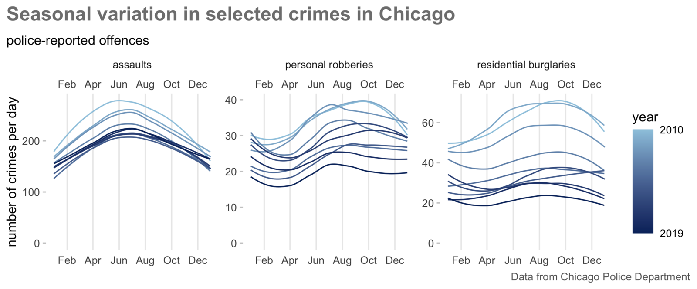
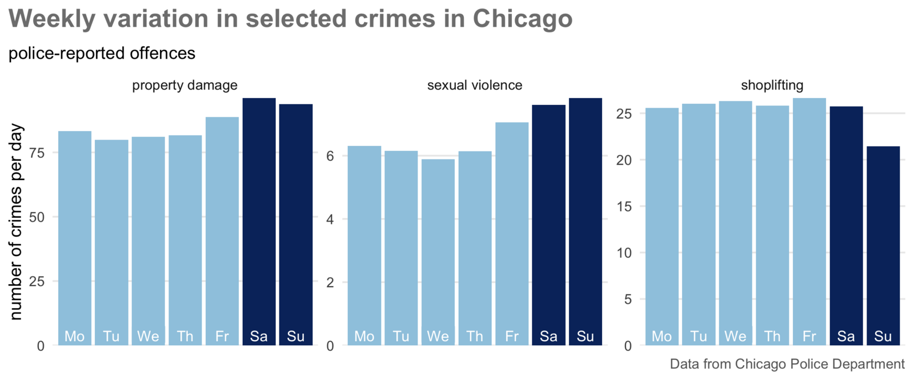
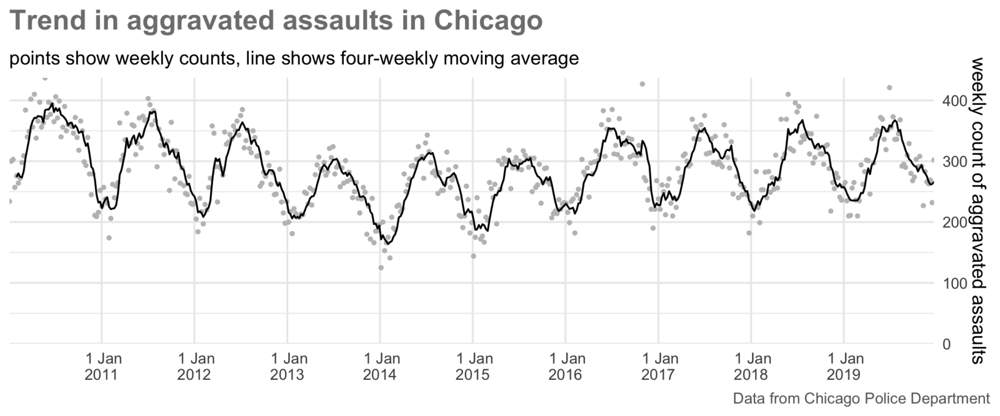
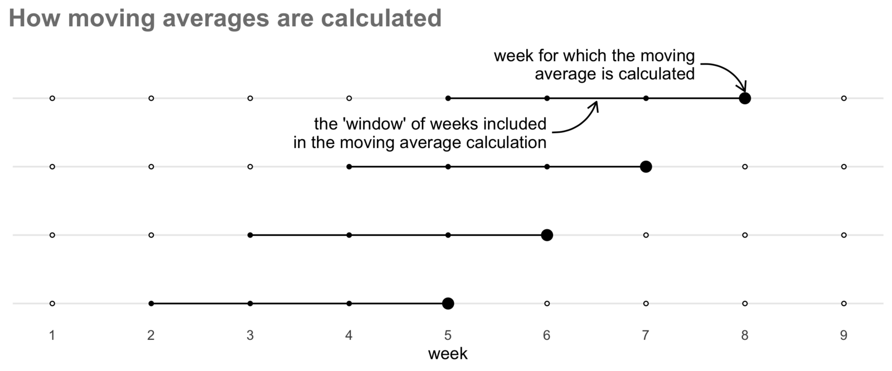

```{r setup, include=FALSE, message=FALSE, warning=FALSE}
library(learnr)
tutorial_options(exercise.timelimit = 120)
knitr::opts_chunk$set(echo = FALSE, fig.align='center')

# Load packages
library(gganimate)
library(ggmap)
library(lubridate)
library(sf)
library(slider)
library(SpatialKDE)
library(tidyverse)

# Copy files
if (!dir.exists("css")) dir.create("css")
walk(
  dir("../css/"), 
  ~ file.copy(str_glue("../css/{.}"), str_glue("css/{.}"), overwrite = TRUE)
)

# Load data
crimes <- read_csv("../../extdata/bronx_shootings.csv") %>% 
  mutate(occur_date = as_date(runif(
    n(), 
    min = as.numeric(today() - days(28 + 7)), 
    max = as.numeric(today())
  )))
thefts <- read_csv("../../extdata/vancouver_thefts.csv.gz") %>% 
  janitor::clean_names() %>% 
  select(year, month_of_year = month, day_of_month = day, hour, minute, x, y) %>% 
  filter(month_of_year == 9)
assaults <- read_csv("../../extdata/chicago_aggravated_assaults.csv.gz")
assault_weekly_counts <- assaults %>% 
  mutate(week_date = floor_date(as_date(date), unit = "week")) %>%
  count(week_date, name = "count") %>%
  slice(2:(n() - 1))
assault_hourly_counts <- assaults %>% 
  mutate(wday = wday(date, label = TRUE), hour = hour(date)) %>%
  count(wday, hour, name = "count") %>% 
  mutate(pseudo_date = make_datetime(year = 2010, hour = hour))
assaults_by_shift <- assaults %>% 
  filter(district %in% c(1, 12, 18)) %>% 
  mutate(shift = case_when(
    between(hour(date), 6, 13) ~ "06:00 to 13:59",
    between(hour(date), 14, 21) ~ "14:00 to 21:59",
    hour(date) >= 22 | hour(date) < 6 ~ "22:00 to 05:59",
    TRUE ~ NA_character_
  )) %>% 
  st_as_sf(coords = c("longitude", "latitude"), crs = 4326) %>% 
  st_transform(26916)
kde_grid <- create_grid_rectangular(assaults_by_shift, cell_size = 250)
kde_layers <- assaults_by_shift %>% 
  select(shift) %>% 
  nest(data = geometry) %>% 
  deframe() %>% 
  map_dfr(kde, band_width = 1000, grid = kde_grid, .id = "shift") %>% 
  st_transform(4326)
base_map <- kde_layers %>% 
  st_bbox() %>% 
  set_names(c("left", "bottom", "right", "top")) %>%
  get_stamenmap(zoom = 13, maptype = "toner-lite")
hour_layers <- read_rds("../../extdata/chicago_hourly_kde.rds")
hour_highest <- hour_layers %>% 
  group_by(hour_name) %>%
  slice_max(order_by = kde_value, n = 10)
clipped_base_map <- hour_highest %>% 
  st_bbox() %>% 
  set_names(c("left", "bottom", "right", "top")) %>%
  get_stamenmap(zoom = 14, maptype = "toner-lite")
```


## Introduction

Understanding how crime varies over time is just as important as understanding 
how it varies between places. Very few places are hotspots of crime all the time 
– business districts might be hotspots of pickpocketing in the daytime but 
deserted at night, while a nearby entertainment district may be quiet in the 
daytime but a violence hotspot at night.

Crime varies over time in lots of ways. For example, there was a long-term drop
in many types of crime in many countries starting in the mid 1990s, e.g.
[residential burglary in England and Wales dropped by 67% between 1993 and 2008](https://crimesciencejournal.biomedcentral.com/articles/10.1186/s40163-016-0051-z)
while the number of 
[homicides in New York City dropped almost 90% from 2,245 in 1990 to 289 in 2018](https://www.brennancenter.org/our-work/analysis-opinion/takeaways-2019-crime-data-major-american-cities).

There are also short-term variations in crime. Many types of crime are more
common at some types of year than others (known as *seasonal variation*). In,
Chicago, for example, assaults, residential burglaries and personal robberies 
all vary throughout the year, with assaults in particular being consistently 
higher in summer than winter.

<p class="full-width-image"></p>

It is also important to understand short-term variation in crime. For example,
both property damage and sexual violence in Chicago peaks at weekends, while 
there are fewer shoplifting offences on Sundays when some shops are closed or
open for shorter hours.

<p class="full-width-image"></p>

Understanding variation in crime over time is important because we can use the
temporal concentration of crime to focus efforts to respond to crime most
effectively. For example, if we wanted to deploy police patrols to a hotspot to
respond to a particular crime problem, those patrols could be very effective if
they were targeted at the times when crimes were most likely to happen or 
completely useless if the officers were deployed at the wrong day or the wrong
time.

In this tutorial we will learn how to incorporate variation over time into our
analysis of where crime happens.


## Handling dates in R

<p class="full-width-image"></p>

At a basic level, computers can store numbers and they can store text. This 
makes storing dates slightly complicated, because dates aren't completely like 
numbers and they aren't completely like text either. Dates aren't like numbers 
because you can't do normal maths with dates (e.g. what date is the 29th of 
January plus one month?) and aren't like text because you can do some maths with 
them (e.g. it is easy to calculate three days from today). Dates are especially 
complicated because they can be written as text in so many different ways. For 
example, 17/01/`r format(Sys.Date(), "%Y")`, 17.01.`r format(Sys.Date(), "%Y")`,
01/17/`r format(Sys.Date(), "%Y")`, `r format(Sys.Date(), "%Y")`-01-17,
17 Jan `r format(Sys.Date(), "%Y")` and Jan 17th `r format(Sys.Date(), "%Y")`
all represent the same date written in different ways.

<a href="https://lubridate.tidyverse.org/" title="lubridate website"></a>

R deals with this problem by storing dates internally as numbers and printing
them (e.g. in the console or in an Rmarkdown document) as text, by default in
the format ``r Sys.Date()``. Fortunately, we don't have to worry about how dates
and times are stored internally in R because we can use the 
[`lubridate` package](https://lubridate.tidyverse.org/) to work with them. 
`lubridate` contains functions for working with dates, including extracting 
parts of a date with functions such as `month()` and converting text to date 
values with functions like `ymd()`.

Because of the special nature of dates, if we want to work with a date variable
(for example to create a chart of crime over time) it is important that it is
stored as a date, not as text or as a number. Many R functions for reading data, 
including `read_csv()`, `read_tsv()` and `read_excel()`, will try to recognise 
dates and times stored in common formats. These will automatically be created as
date variables when the data is loaded. 

If a date variable in a dataset is not recognised as being a date, we can
convert the variable to a date by using the date-parsing functions from
`lubridate`. Which function to use depends on the order in which the components
of the date (day, month and year) appear in the variable. For example, to
convert the text "Saturday 17 January 1981" to a date format we can use the 
`dmy()` function because the **d**ay comes first, the **m**onth next and then 
the **y**ear. Similarly, converting the text "01/17/81" needs the function 
`mdy()`. Note that the `lubridate` date-parsing functions are able convert both 
numeric and text-based months, and to ignore elements that aren't needed, such 
as weekday names.

If a date is stored in multiple columns, e.g. a column for the year, a column 
for the month and a column for the day, we can create a single date column using 
the `make_date()` function to combine them. Similarly, we can create a date-time
column using the `make_datetime()` function.

```{r dates-exercise1, exercise=TRUE}
library(lubridate)

mutate(
  thefts, 
  date = make_date(year = year, month = month_of_year, day = day_of_month)
)
```

Once we have converted dates stored as text to dates stored as dates, R 
understands that they are dates and we can do things like compare them. So while
running `"Sat 17 January 1981" == "01/17/81"` to test if two dates are the same
would give the answer `FALSE` (because the two pieces of text are different),
once we've converted the text to date values R can tell that the two dates are
the same:

```{r dates-exercise2, exercise=TRUE}
# This code returns FALSE because the two pieces of text are different
"Sat 17 January 1981" == "01/17/81"

# This code returns TRUE because the two dates are the same
dmy("Sat 17 January 1981") == mdy("01/17/81")
```


### Working with dates

When analysing dates and times, it is often useful to be able to extract 
date or time portions. We can do this with the `lubridate` functions `year()`, 
`month()`, `wday()` (for day of the week), `mday()` (for day of the month), 
`yday()` (for day of the year), `hour()`, `minute()` and `second()`, each of 
which extracts the relevant portion of a date or time as a number. The `month()` 
and `wday()` functions are slightly different, because they can also return the 
day or month name as text by specifying the argument `label = TRUE`. We can see
this by extracting the different portions of the current date and time, which we 
can retrieve with the `now()` function from `lubridate`.

```{r dates-exercise3, exercise=TRUE}
message("Current year: ", year(now()))
message("Current month (as a number): ", month(now()))
message("Current month (as text): ", month(now(), label = TRUE))
message("Current day of the year: ", yday(now()))
message("Current day of the month: ", mday(now()))
message("Current day of the week (as a number): ", wday(now()))
message("Current day of the week (as text): ", wday(now(), label = TRUE))
message("Current hour of the day: ", hour(now()))
message("Current minute: ", minute(now()))
message("Current second: ", second(now()))
```

It is sometimes useful to be able to add to or subtract from dates. For example,
if you wanted to filter a dataset so that only records from the past 28 days
were included, you would need to work out the date 28 days ago. We can do this
with a group of functions from `lubridate` that store a period of time that we
can then add to or subtract from an existing date. These functions are 
`years()`, `months()`, `weeks()`, `days()`, `hours()`, `minutes()`, and 
`seconds()`. Note that these function names are all plural -- use `month()`
(singular) to extract the month from a date and `months()` (plural) to create a
period of a certain number of months. So to subtract 28 days from today's date
(which we can retrieve with the `today()` function), we would use
`today() - days(28)`.

```{r dates-exercise4, exercise=TRUE}
message(str_glue("Today is {today()} and 28 days ago was {today() - days(28)}"))
```

Adding or subtracting periods from dates can be very useful when combined with
the `filter()` function from the `dplyr()` package. For example, if we had a
dataset of crimes stored in an object called `crimes` and wanted to extract only 
those that occurred in the seven days before a specific date, we could do this:

```{r dates-exercise5, exercise=TRUE}
filter(crimes, occur_date < today() - days(7))
```

```{r period-setup, include=FALSE}
start_date <- today() - days(28 + 7)
end_date <- today() - days(7)

start_date_formatted <- case_when(
  year(start_date) == year(end_date) && month(start_date) == month(end_date) ~ 
    str_squish(format(start_date, "%e")),
  year(start_date) == year(end_date) ~ str_squish(format(start_date, "%e %B")),
  TRUE ~ str_squish(format(start_date, "%e %B %Y"))
)
end_date_formatted <- str_squish(format(end_date, "%e %B %Y"))
```

If we wanted to extract crimes that occurred between two dates, we can use the
`between()` function from `dplyr`, which returns either `TRUE` or `FALSE` 
depending on whether each item in the first argument is between the values given
in the second and third arguments (inclusive). For example, complete the 
following code by replacing the text `[start]` and `[end]` with `ymd()` 
functions to extract only crimes occurring between 
`r start_date_formatted` and `r end_date_formatted`.

```{r dates-exercise6, exercise=TRUE}
filter(crimes, between(occur_date, [start], [end]))
```

```{r dates-exercise6-hint}
# Add the dates to the following code in YYYY-MM-DD format (because you are 
# using the function `ymd()`)
filter(crimes, between(occur_date, ymd(""), ymd("")))
```

When filtering based on dates or times, it is important to understand that R can
store dates in two ways: as a *date* variable or as a *date-time* object (shown 
as `dttm` when we print a tibble). Date variables store only a date with no 
time, while date-time variables always include a time component, even if the 
data doesn't contain any information about time. If we store a variable that 
only has information about the date of an event as a date-time variable, R will 
silently add the time midnight to each date. This is important because if we 
compare a date variable to a date-time variable, R will silently convert the 
dates to date-times with the times set to midnight. If we are trying to filter 
crimes between two times, this might not be what we want. For example, if we 
used the code:

```r
between(offence_date, ymd("2021-01-01"), ymd("2021-01-31"))
```

to extract all the crimes that occurred in January 2021, that would work as we 
expected only if `offence_date` was a date variable. If the `offence_date` 
column instead held dates *and* times, R would filter the data *as if* we had 
specified:

```r
between(offence_date, ymd_hm("2021-01-01 00:00"), ymd_hm("2021-01-31 00:00"))
```

which would exclude any crimes that occurred on 31 January (except those
occurring at exactly midnight). To deal with this problem, we can either check
to make sure the variables we are filtering on are date variables, convert them
to date variables using the `as_date()` function, or assume that they might be 
date-time variables and specify the exact time that we want as the end of our 
range. For example, specifying:

```r
between(offence_date, ymd_hm("2021-01-01 00:00"), ymd_hm("2021-01-31 23:59"))
```

would allow us to select all the crimes occurring in January 2021.


<p class="credits">[Stats Illustrations by Allison Horst](https://github.com/allisonhorst/stats-illustrations) licensed under the [Creative Commons Attribution licence](https://github.com/allisonhorst/stats-illustrations/blob/master/license).</p>


## Showing change over time

One common task in crime analysis is to show how crime changes over time. The
simplest way to do this is to produce a *time-series chart*. For example, we can
see how the frequency of aggravated assaults recorded by police in Chicago has 
changed over time:

<p class="full-width-image"></p>

In this section we will learn how to construct a time-series chart like this. To 
illustrate this process, we will use an object called `assaults` that contains 
records of aggravated assaults in Chicago from 2010 to 2019.

```{r}
assaults %>% 
  head() %>% 
  gt::gt()
```

The first task in charting the frequency of crime is to choose a temporal *unit 
of analysis*. For example, the chart above counts the number of crimes each
*week*. Weeks are often a good choice as units for counting crimes, since all
weeks are the same length and because many human activities have a weekly cycle
(e.g. people do different things at weekends than on weekdays, even though
which days count as weekdays differ across cultures). Months are much less 
useful because they differ in length, so it looks like there are monthly 
variations in the frequency of crime even if the same number of crimes happen
each day. Months are also less useful because they contain different numbers of
each day of the week (e.g. one month might have four Fridays while the next has
five) and crimes are typically concentrated on particular days of the week (more
on that later). Avoid using monthly counts of crime in almost all circumstances.

To count the number of crimes occurring each week we can use the `count()`
function from the `dplyr` package. But before doing that, we have to allocate
each crime to a week so that we can then count those weeks. To do this we use
the `floor_date()` function from the `lubridate` package. This function rounds
dates down to the start of a specified unit of time, in this case a week. By
default, `floor_date()` treats Sunday as the start of the week and so if the
specified unit of time is a week, all dates will be rounded down to the date of
the previous Sunday.

`floor_date()` works on date variables, so if we want to use it on a date-time
variable we should first convert it to a date variable using the `as_date()`
function from `lubridate`.

One complication of counting incidents by week is that our data might not fit
neatly into calendar weeks. For example, if we have data for a particular year
and that year started on a Tuesday, the first weekly count will only have data
for five days and it will look like there were fewer crimes that week in 
comparison to other weeks. The same problem can happen with the last week of
data, too. To deal with this, after counting the crimes by week we will remove
the first and last row of the data using `slice()` (remembering the code 
`(n() - 1)` gives us row number of the second-to-last row in the data because
`n()` returns the number of rows in the data).

```{r change-exercise1, exercise=TRUE}
assault_weekly_counts <- assaults %>% 
  mutate(week_date = floor_date(as_date(date), unit = "week")) %>%
  count(week_date, name = "count") %>%
  slice(2:(n() - 1))

assault_weekly_counts
```

Now we have weekly counts of aggravated assaults, we can plot them on a chart.
The simplest way to do this would be to create a line chart using `ggplot()`
with `geom_line()`.

```{r change-exercise2, exercise=TRUE}
ggplot(assault_weekly_counts, aes(x = week_date, y = count)) +
  geom_line() +
  theme_minimal()
```

This plot is fine, but there are several things that we can do to make it 
better. Most importantly, there seems to be many short-term fluctuations in the
frequency of crime (e.g. from one week to another). While this variation is 
real, we often refer to it as *noise* because it can obscure the *signal* of
longer-term trends (this terminology originally came to statistics -- and 
therefore crime analysis -- from radio engineering and has become common over 
time).

We can reduce the visual impact of this short-term variation on our plot by
adding a line showing a *moving average* (also called a *rolling average* or
*rolling mean*) of the count of crime over time. A moving average is the average
(or mean) of the count of crimes in the current week and a given number of 
adjacent (in this case, previous), weeks.

<p class="full-width-image"></p>

Since moving averages show the average count of crime over several weeks, they 
are less influenced by week-to-week variation. To calculate a moving average we 
have to choose how many weeks to include (known as the *window* of the moving
average). The more weeks we include in the window, the smoother the values will 
appear from week to week and the more short-term variation will be obscured. 
There is a balance to be struck between making longer-term trends clear and 
obscuring genuine short-term variation, so you should experiment with different 
window lengths to ensure you are not over-smoothing.

We can calculate moving averages in R with the `slide_dbl()` function from the 
[`slider` package](https://davisvaughan.github.io/slider/) (so called because 
its functions slide along a series of values). `slide_dbl()` can calculate 
several types of moving averages, so we specify that it should use the `mean()`
function to calculate the average by specifying `.f = mean` (note the lack of
parentheses after `mean`). We use the `.before` argument (note the `.`) to 
specify how many weeks *before the current week* to include in our moving 
average. So if we wanted to calculate a four-week moving average (i.e. the 
current week and the previous three weeks), we would specify `.before = 3`. 
We also specify `.complete = TRUE` to stop `slide_dbl()` from trying to 
calculate averages for the first few weeks in our data, because we don't have 
the necessary data from previous weeks (i.e. before the start of our data) that 
we would need to make these averages accurate. `slide_dbl()` will use `NA` as 
the moving average value for those weeks, so we specify `na.rm = TRUE` to tell
`ggplot()` to ignore these when we plot the data.

Once we've calculated a moving average, we can show this using the line on our
chart and show the individual weekly counts as small light-grey dots to show how 
much short-term variation there is in the data.

```{r change-exercise3, exercise=TRUE, exercise.lines=29}
library(slider)

assault_weekly_counts %>% 
  mutate(moving_avg = slide_dbl(count, mean, .before = 3, .complete = TRUE)) %>% 
  ggplot() +
  geom_point(aes(x = week_date, y = count), colour = "grey75", size = 0.75) +
  geom_line(
    aes(x = week_date, y = moving_avg, colour = "black"), 
    na.rm = TRUE, 
    key_glyph = "timeseries"
  ) +
  scale_x_date(date_breaks = "1 year", date_labels = "%b\n%Y") +
  scale_y_continuous(limits = c(0, NA)) +
  scale_colour_identity(
    labels = c("black" = "four-week moving average"),
    guide = guide_legend()
  ) +
  labs(
    x = NULL,
    y = "weekly count of aggravated assaults",
    colour = NULL
  ) +
  theme_minimal() +
  theme(
    legend.position = "bottom",
    panel.grid.minor.x = element_blank()
  )
```

Experiment with the effect of setting a longer or shorter window for the moving
average by specifying larger or smaller values of the `.before` argument to
`slide_dbl()`. For example, create an eight-week moving average by specifying
`.before = 7`. What happens to the apparent seasonal variation in the number of
assaults if you create an *annual moving average* by specifying `.before = 52`?

You may have noticed that in this code we have also made some changes to the
appearance of the plot to make it easier to read. Specifically, we have:

  * Added a title for the *y* axis and removed the *x* axis and legend titles
    using the `labs()` function.
  * Changed the labels on the *x* axis using `scale_x_date()`. In this case, we
    have used the argument `date_breaks = "1 year"` to specify that we want a
    label at the start of each year and the argument `date_labels = "%b\n%Y"` to
    specify that we want each label to consist of an abbreviated month name 
    (using the code `%b`), a new line (the code `\n` as in a previous tutorial) 
    and a four-digit year (using the code `%Y`). You can find a full list of 
    codes used that can be used to specify different parts of a date and time by 
    typing `?strptime` in the R console.
  * Removed some of the vertical grid lines by setting the `panel.grid.minor.x` 
    argument to `theme()` to equal `element_blank()`.
  * Forced the *y* axis to begin at zero by specifying `limits = c(0, NA)`,
    remembering that `NA` in this context means to use the default value.
  * Specified that we want the black line to be represented in the legend by a
    line that looks like a time series by specifying `key_glyph = "timeseries"`.
    
We have also added a legend to explain what the black line shows. The code
need to do this is slightly awkward, since `ggplot()` would not normally produce
a legend for aesthetics (in this case, the colour of the line) that have only 
one value. To force `ggplot()` to add a legend, we:

  1. Specify the colour of the line (i.e. `colour = "black"`) not as an argument 
     to the function `geom_line()` as we normally would but as one of the 
     aesthetics specified using `aes()`. 
  2. Specify that `ggplot()` should treat the value `colour = "black"` as a 
     literal colour name rather than as a reference to a column in the data
     (which is how the arguments to `aes()` are normally interpreted). To do 
     this we add `scale_colour_identity()` to the `ggplot()` stack, because 
     *identity* is the jargon used in R to say 'keep this value exactly as it 
     is'. 
  3. Within `scale_colour_identity()`, specify a label to correspond to 
     the black line by setting the `labels` argument. 
  4. Specify `guide = guide_legend()` to tell `ggplot()` to add a legend
     corresponding to the black line because aesthetics styled using functions
     in the `scale_*_identity()` family do not produce a legend entry by 
     default.

Doing all this is obviously tedious, but makes for a better chart.


### Showing repeating patterns over time

We have already seen that there is seasonal variation in the number of 
aggravated assaults in Chicago. As is very common for assaults, there are more
offences in the summer and fewer in the winter. We can see this in the 
time-series chart we have already produced, but it's hard to see the detail. For
example, we might want to know how consisent this seasonal variation is across
different years. Is it, for example, consistent enough that the local police
might want to restrict the number of officers who can take holidays in certain
weeks?

To do this we can create a *seasonal chart*. This can be used to show any type
of repeating variation, but is often used to show patterns across a year (hence
the name). To create a seasonal plot we need to add a variable to our data 
specifying which year each weekly count belongs to, which we can do by using the
`year()` function to extract the year from the offence dates. We can do this at 
the same time as we calculate the moving averages. Once we've done that, we can 
specify that we want our chart to have a separate line for each year by setting
`group = year` inside the `aes()` function that controls how the data are shown
on the chart, making each year a different colour using `colour = year`.

```{r change-exercise4, exercise=TRUE, exercise.lines=20}
assault_weekly_counts %>% 
  mutate(
    moving_avg = slide_dbl(count, mean, .before = 3, .complete = TRUE),
    year = year(week_date)
  ) %>% 
  ggplot(aes(x = week_date, y = moving_avg, colour = year, group = year)) +
  geom_line(na.rm = TRUE, key_glyph = "timeseries") +
  scale_x_date(date_breaks = "1 year", date_labels = "%b\n%Y") +
  scale_y_continuous(limits = c(0, NA)) +
  scale_colour_continuous(breaks = c(2010, 2019)) +
  labs(
    x = NULL,
    y = "weekly count of aggravated assaults",
    colour = NULL
  ) +
  theme_minimal() +
  theme(
    panel.grid.minor.x = element_blank()
  )
```

The result might not be what you expected. Although the grouping of the lines by
year has worked (there is a break between the lines at the start of each year),
it's no easier to compare the seasonal patterns across years. Comparing years 
would be much easier if we superimpose the weekly counts for each year on top of 
one another.

To do this, we need to trick `ggplot()` into plotting all the weekly counts as
if they occurred in a single year, so the counts appear in the same locations on
the horizontal axis of the chart, whichever year they occurred in. We can do 
this by creating a pseudo-date value for each weekly count which has the same
month and day of the month as the original date, but a single year across all 
the rows in the data. We will create this pseudo date by extracting the month
and day of the month using `month()` and `mday()`, then creating a new date with
`make_date()`. We will also change the labels on the horizontal axis using the 
date-formatting code `%e\n%b` -- `%e` means the day of the month and `%b` means 
the abbreviated name of the month.

```{r change-exercise5, exercise=TRUE, exercise.lines=24}
assault_weekly_counts %>% 
  mutate(
    moving_avg = slide_dbl(count, mean, .before = 3, .complete = TRUE),
    year = year(week_date),
    # By only specifying the `month` and `day` arguments to `make_date()` we
    # will create a date in 1970, but that doesn't matter because we are not
    # going to show the year on the chart
    pseudo_date = make_date(month = month(week_date), day = mday(week_date))
  ) %>% 
  ggplot(aes(x = pseudo_date, y = moving_avg, colour = year, group = year)) +
  geom_line(na.rm = TRUE, key_glyph = "timeseries") +
  scale_x_date(date_breaks = "1 month", date_labels = "%e\n%b") +
  scale_y_continuous(limits = c(0, NA)) +
  scale_colour_continuous(breaks = c(2010, 2019)) +
  labs(
    x = NULL,
    y = "weekly count of aggravated assaults",
    colour = NULL
  ) +
  theme_minimal() +
  theme(
    panel.grid.minor.x = element_blank()
  )
```

From this chart we can see that assaults consistently peak in July, although in
one year they peaked slightly earlier in late June and in one year slightly 
later in August. At the other end of the year, weekly counts of assaults are 
almost always least frequent in late January and throughout February before
starting to increase quite rapidly in March.

As well as showing seasonal variation, we can use the same technique to 
understand variation over other periods of time. For example, since we know a
lot of human activities follow weekly patterns, we might want to produce a chart
showing the number of crimes in each hour on each day of the week.

To do this, we:

  1. Extract the weekday and hour components of each date using `wday()` and
     `hour()`.
  2. Count the total number of crimes occurring in each hour of each day *across 
     all ten years of the data* using `count()`.
  3. Create a pseudo-date-time using `make_datetime()`.
  4. Create a chart with appropriate labels on the horizontal axis and a 
     suitable qualitative colour scheme to show the days of the week using 
     `scale_colour_brewer()`.

We can do this in a single piece of code.     

```{r change-exercise6, exercise=TRUE, exercise.lines=23}
assault_hourly_counts <- assaults %>% 
  mutate(wday = wday(date, label = TRUE), hour = hour(date)) %>%
  count(wday, hour, name = "count") %>% 
  # By only setting the `hour` argument to `make_datetime()` we will create a
  # date-time on 1 January 1970, but that doesn't matter because we will not 
  # show the date on the chart
  mutate(pseudo_date = make_datetime(year = 2010, hour = hour))

ggplot(
  assault_hourly_counts, 
  aes(x = pseudo_date, y = count, colour = wday, group = wday)
) +
  geom_line(key_glyph = "timeseries") +
  scale_x_datetime(date_breaks = "2 hours", date_labels = "%H:%M") +
  scale_y_continuous(limits = c(0, NA), labels = scales::comma_format()) +
  scale_colour_brewer(type = "qual") +
  labs(
    x = NULL,
    y = "hourly total of aggravated assaults, 2010-2019",
    colour = NULL
  ) +
  theme_minimal()
```

On this chart you can see that there are two distinct temporal patterns of
assaults on different days of the week. Between Mondays and Thursdays, assaults
peak between about 14:00 and 21:00 before reducing to a very-low level at about
05:00. At the weekend, the picture is different: assaults peak between midnight
and 02:00 on both Saturdays and Sundays (i.e. very late on Friday and Saturday
evenings).

This chart probably uses the maximum number of different colours for days of the
week that we could use before some of the colours became too similar to one
another to be distinguishable. But even with this many colours, it might not be
easy for a colour-blind person to translate between the colours of the lines and
the colours in the legend. When you find that there are too many colours on a 
chart, this is a good sign that you should consider using small-multiple charts
instead. Fortunately, we can do this by adding a column to the data specifying
if each day is a weekday or on a weekend, then adding `facet_grid()` to our
`ggplot()` stack. At the same time, we'll change `geom_line()` to `geom_area()`,
which shows the magnitude of the values more effectively. We should also specify 
`position = position_identity()` to stop `geom_area()` from stacking the area
corresponding to each day on top of the previous day, which is the default.

```{r change-exercise7, exercise=TRUE, exercise.lines=19, fig.asp=1}
assault_hourly_counts %>% 
  mutate(weekend = ifelse(wday %in% c("Sat", "Sun"), "Sat–Sun", "Mon–Fri")) %>% 
  ggplot(
  aes(x = pseudo_date, y = count, fill = wday)
) +
  geom_area(position = position_identity(), alpha = 0.5) +
  # Assign the facets to rows so that we can compare the same time on different
  # days more easily (change `rows` to `cols` to see the alternative)
  facet_grid(rows = vars(weekend)) +
  scale_x_datetime(date_breaks = "2 hours", date_labels = "%H:%M") +
  scale_y_continuous(limits = c(0, NA), labels = scales::comma_format()) +
  scale_fill_brewer(type = "qual") +
  labs(
    x = NULL,
    y = "hourly total of aggravated assaults, 2010-2019",
    fill = NULL
  ) +
  theme_minimal()
```

This shows the two distinct patterns (weekdays and weekends) more clearly. We
could also add columns to this chart to show the same patterns in different 
areas, such as police districts or local neighbourhoods.


## How to map change over time

Time-series or seasonal charts are often the best way to show change in the 
frequency of crime over time. But it can also be useful to show maps of the
patterns of crimes at different points in time. We might, for example, want to 
show the density of crime in an area for different periods in time.

Choosing how to divide up time into periods is an important step in this 
process, because in doing so we are converting a continuous variable (time) into
a number of categories (periods of time). Whenever we convert an continuous
variable to a categorical one we inevitably lose information. For example, if we
decided to categorise the maximum temperature every day as being either 'hot' or 
'cold', we would lose a lot of information about whether a particular day was
moderately hot, very hot, etc. The same is true of time, since by splitting time
into periods (hours, days, weeks, etc.) we lose information about variations
within each period. This is inevitable since we can't produce infinite maps 
showing all the infinite moments in time, but it's the reason why choosing 
periods carefully is important.

When choosing a period over which to count crime, it is important not to just 
use default periods like the day from 00:00 to 23:59 just because that is the
standard definition of a day. As we saw in the previous section, the peaks of
many types of crime like assaults cross over the boundaries between days because
the peak frequency is late at night. For this reason it may be better to, for
example, define a day as a period from 05:00 to 04:59 and count the number of
crimes within each day according to that definition.

Sometimes, it will be easy to choose periods because they will be dictated by
the purpose for which you're creating the map. In this section we will create
separate maps showing the density of aggravated assaults in a part of Chicago 
for each of the standard Chicago Police shifts of 06:00 to 13:59, 14:00 to 21:59 
and 22:00 to 05:59 (bearing in mind that the actual hours officers work may 
differ slightly).

To do this, we will estimate the density of assaults separately for each shift
period, the combine the three density layers and plot them on small-multiple
maps. First, we create a new object containing data for the Chicago Police
districts we are interested in with a column showing which police shift each
assault occurred in, which we can construct using the `case_when()` function 
from `dplyr`. `case_when()` allows us to specify any number of tests that we can
apply in-order to our data and when a test is passed the function assigns the
corresponding label to that row (the label is separated from the test by a tilde
character `~`). `case_when()` is like `recode()`, but for when we need to test 
for more-complicated things than just whether a variable has a particular value. 
We will set the last test to just have the value `TRUE`, so that any rows that 
haven't passed any other previous tests still get a label. In this case, that
final value will be `NA` (in fact, `NA_character_` because `case_when()` only
accepts labels that are characters) to catch any rows that have missing values 
of `date`.

```{r map-exercise1, exercise=TRUE}
assaults_by_shift <- assaults %>% 
  filter(district %in% c(1, 18)) %>% 
  mutate(shift = case_when(
    between(hour(date), 6, 13) ~ "06:00 to 13:59",
    between(hour(date), 14, 21) ~ "14:00 to 21:59",
    hour(date) >= 22 | hour(date) < 6 ~ "22:00 to 05:59",
    TRUE ~ NA_character_
  )) %>% 
  # Convert the data to an SF object
  st_as_sf(coords = c("longitude", "latitude"), crs = 4326) %>% 
  # Transform it to a co-ordinate reference system based on metres
  st_transform(26916)

assaults_by_shift
```

The next step is to produce a kernel density (KDE) layer for assaults occurring
in each shift. In a previous tutorial we learned how to do this using the 
`SpatialKDE` package. We could run the `kde()` function from that package three
times to create the KDE layers for each shift, but this is a good situation in
which to use the `map()` family of functions from the `purrr` library to run a
piece of code repeatedly for several pieces of data. In this case we will use
`map_dfr()` because it processes every part of our dataset by applying a 
function (in this case `kde()`) to each part and then binds the results together
into a single SF object.

To prepare the data to be used by `map_dfr()` we first *nest* the data, i.e. we
split the data up into chunks according to which shift the crime occurred in.
Counter-intuitively, we tell `nest()` which columns to use to split the data up
by specifying all the *other* columns in the dataset (i.e. those we want to be
nested inside chunks). To make this easier, we first remove all the columns we
don't need using `select()` and then we can just specify that we want the column
`geometry` (which holds the locations of the crimes in an SF object) to be 
nested into chunks in a column called `data`. We then use `deframe()` to convert
our nested dataset to a list of tibbles, each with a name. The `map()` family of
functions can be a bit tricky to use, but they are very powerful for managing
large datasets and doing complicated data processing, so it's useful to have
some familiarity with them.

```{r map-exercise2, exercise=TRUE, exercise.lines=21}
library(SpatialKDE)

# Create a grid to use in calculating the KDE layers
kde_grid <- create_grid_rectangular(assaults_by_shift, cell_size = 250)

kde_layers <- assaults_by_shift %>% 
  # Remove all the columns except `shift` (and `geometry`, which is kept 
  # automatically for SF objects)
  select(shift) %>% 
  # Group the `geometry` column of the data into three datasets, one for each 
  # shift
  nest(data = geometry) %>% 
  # Convert the data from a tibble to a list with names, since we can convert 
  # those names to a column in our final KDE dataset using the `.id` argument to
  # `map_dfr()`
  deframe() %>% 
  map_dfr(kde, band_width = 1000, grid = kde_grid, .id = "shift") %>% 
  st_transform(4326)
  
kde_layers
```

Now we have a KDE layer for each shift, we can download a base map as in 
previous tutorials and then create three maps for the three shifts by adding 
`facet_wrap()` to a `ggplot()` stack.

```{r map-exercise3, exercise=TRUE, exercise.lines=30, fig.asp=1, message=FALSE}
library(ggmap)

base_map <- kde_layers %>% 
  st_bbox() %>% 
  set_names(c("left", "bottom", "right", "top")) %>%
  get_stamenmap(zoom = 13, maptype = "toner-lite")

ggmap(base_map) +
  geom_sf(
    aes(fill = kde_value), 
    data = kde_layers, 
    inherit.aes = FALSE, 
    alpha = 0.75, 
    colour = NA
  ) +
  facet_wrap(vars(shift)) +
  scale_fill_distiller(
    breaks = range(pull(kde_layers, kde_value)),
    labels = c("lower", "higher"),
    direction = 1
  ) +
  labs(
    fill = "density of aggravated assaults"
  ) +
  theme_void() +
  theme(
    legend.position = "bottom",
    legend.title.align = 1
  )
```

On this map we can see that some places have a relatively high density of 
assaults throughout all three shifts, but others only have a high density at
certain times. We can perhaps make this clearer by only showing the grid cells
with the highest estimated density of assaults during each shift. We can do this
using the `slice_max()` function from `dplyr`, which allows us to extract the
rows in a dataset with the highest values of a particular variable. In this case
we will use `slice_max()` together with `group_by()` to get the rows with the
highest values within each shift.

```{r map-exercise4, exercise=TRUE, fig.asp=1}
kde_highest <- kde_layers %>% 
  group_by(shift) %>% 
  slice_max(order_by = kde_value, n = 10)

ggmap(base_map) +
  geom_sf(
    data = kde_highest, 
    inherit.aes = FALSE, 
    alpha = 0.75, 
    colour = NA,
    fill = "red2"
  ) +
  facet_wrap(vars(shift)) +
  theme_void()
```

This map makes it very clear that the grid cells with the highest densities of
aggravated assaults are very similar in the daytime and evening shifts, in both
places being concentrated in the downtown area known as The Loop. For the 
overnight shift, however, the cells with the highest densities are on the other
side of the Chicago River in the River North neighbourhood. A map like this 
might be particularly useful if the resources available to respond to a crime 
problem were very limited and so could only be deployed in the places where the
problem was worst -- this is often the case because crime-prevention resources
*are* often very limited.


## Making animated maps

The small-multiple map we have produced of aggravated-assault hotspots in
Chicago is useful, especially for policing because it uses periods based on 
police shifts. But aggregating crimes into only three temporal periods 
inevitably throws away a lot of information about when crime happens. For 
example, at what time does the area of highest assault density move across the
river from The Loop to River North?

We could produce a series of small-multiple maps showing shorter periods 
(meaning more small multiples). For example, we could show one small-multiple
map for each hour of the day. However, this would make each map very small and
it would be hard to see the details of locations on each map.

One alternative is to produce an animated map with each frame in the animation
representing the map for each hour. We can do this using the 
[`gganimate` package](https://gganimate.com/).

The first step in producing an animated map is to create a KDE layer for each
hour of the day. The code for this is the same as for the code we have already
used to produce the KDE layers for each shift, except that we create a variable
for hour of the day rather than police shift. Because an animated map of hours 
of the day needs 24 KDE layers, in this case it is particularly useful to use
`map_dfr()` to avoid having to create 24 different objects and then binding them
together.

```{r animated-exercise1, exercise=TRUE, exercise.lines=27}
library(gganimate)

assaults_by_hour <- assaults %>% 
  filter(district %in% c(1, 18)) %>% 
  mutate(
    hour_name = str_pad(hour(date), width = 2, pad = "0"),
    hour_name = str_glue("{hour_name}:00 to {hour_name}:59")
  ) %>% 
  st_as_sf(coords = c("longitude", "latitude"), crs = 4326) %>% 
  st_transform(26916)

hour_layers <- assaults_by_hour %>% 
  # Remove all but the column we need
  select(hour_name) %>% 
  # Split the dataset by hour
  nest(data = geometry) %>% 
  # Convert the dataset to a named list
  deframe() %>% 
  # Run the function `kde()` for each hour
  map_dfr(kde, band_width = 1000, grid = kde_grid, .id = "hour_name") %>% 
  st_transform(4326)

# Extract only the 10 cells with the highest density in each hour
hour_highest <- hour_layers %>% 
  group_by(hour_name) %>%
  slice_max(order_by = kde_value, n = 10)
```

It is possible that this code will time out and give an error saying 
`Your code ran longer than the permitted timelimit for this exercise.` -- if 
that happens then just continue with the tutorial as normal.

We can now use the `hour_layers` object as the basis for a new base map that
only includes the areas of the highest density (so they appear larger on the
animated map).

```{r animated-exercise2, exercise=TRUE}
clipped_base_map <- hour_highest %>% 
  st_bbox() %>% 
  set_names(c("left", "bottom", "right", "top")) %>%
  get_stamenmap(zoom = 14, maptype = "toner-lite")
```

To create an animated map we use the `transition_states()` function from the
`gganimate` package. `transition_states()` works in a similar way to 
`facet_wrap()`, in that when added to a `ggplot()` or `ggmap()` stack it splits
 the chart or map up into a separate map for each value of one of the variables
 in the data (in this case, the hour of the day). The only difference is that
 while `facet_wrap()` arranges those separate maps next to one another,
 `transition_states()` arranges them into an animation.

```{r animated-exercise3, exercise=TRUE, exercise.lines=16, fig.asp=1}
ggmap(clipped_base_map) +
  geom_sf(
    data = hour_highest, 
    inherit.aes = FALSE, 
    alpha = 0.75, 
    colour = NA,
    fill = "red2"
  ) +
  transition_states(states = hour_name) +
  labs(
    title = "Aggravated assaults in downtown Chicago, 2010-2019",
    subtitle = "Areas with highest density of aggravated assaults:\n{closest_state}",
    caption = "Data from Chicago Police"
  ) +
  theme_void()
```

This code may take longer to run than is allowed for code inside an interactive 
tutorial and may produce the error 
`Your code ran longer than the permitted timelimit for this exercise`. If that 
happens, you may want to 
[download the Chicago assaults data](https://github.com/mpjashby/crimemapping/raw/main/inst/extdata/chicago_aggravated_assaults.csv.gz) 
and create an animated map in an R script of your own using the code in the 
chunks above. This code should produce a map looking like this:

<p class="centered-image"></p>

There is one other function of `gganimate` we have used in the code used to make
this map. Yoy might have noticed that in the map `subtitle` is the code 
`{closest_state}`. This is a special code that `gganimate` will replace with the
current value of the variable in the data that is used to control which data 
appears in each frame of the animation. So for this map, `{closest_state}` will
be replaced in the animation with the value of the `hour` variable in the data
for each frame in the animation.

This animated map is very sensitive to the number of high-density grid cells we
choose to extract (in the map above, 10 cells for each hour) -- it might look
quite different if we had chosen a different number. To show the density of 
crime in all of downtown Chicago, we can combine the base map and KDE layers we 
have already created to produce another animated map.

```{r animated-exercise4, exercise=TRUE, exercise.lines=22}
ggmap(base_map) +
  geom_sf(
    aes(fill = kde_value), 
    data = hour_layers, 
    inherit.aes = FALSE, 
    alpha = 0.75, 
    colour = NA
  ) +
  transition_states(states = hour_name) +
  scale_fill_distiller(
    breaks = range(pull(hour_layers, kde_value)),
    labels = c("lower", "higher"),
    direction = 1
  ) +
  labs(
    title = "Aggravated assaults in downtown Chicago, 2010-2019",
    subtitle = "Density of aggravated assaults: {closest_state}",
    caption = "Data from Chicago Police",
    fill = "density of\naggravated\nassaults"
  ) +
  theme_void()
```

This code typically takes a minute or so to finish running because it has to
generate 24 maps and then stitch them together. It is unlikely that the code
will finish running before the maximum time that a chunk of code in an R 
tutorial is allowed to run for before automatically stopping. If you were to
run this code in RStudio, the map it would produce would look like this:

<p class="centered-image"></p>

We can save an animated map to a file using the `animate()` and `anim_save()` 
functions. `animate()` controls the type of file the animation will be saved in
(by default, an animated GIF), the height and width of the plot and so on.
`anim_save()` then saves the animation in a file. For example, if we stored the 
map created above in an object called `chicago_downtown_kde_map`, we could save 
it to an animated GIF file.

```r
anim_save(
  filename = "chicago_downtown_agg_assaults.gif", 
  animation = animate(
    plot = chicago_downtown_kde_map,
    height = 800, 
    width = 800, 
    units = "px"
  )
)
```


## In summary

In this tutorial we have learned how to incorporate change over time into our 
analysis of where crime happens. This is important because the distribution of
crime across different places often varies at different times. 

You can learn more about:

  * using the different functions in the `lubridate` package to 
    [Do more with dates and times in R](https://lubridate.tidyverse.org/articles/lubridate.html) and
  * animating different types of map and chart in different ways in
    [Getting Started with `gganimate`](https://gganimate.com/articles/gganimate.html).

